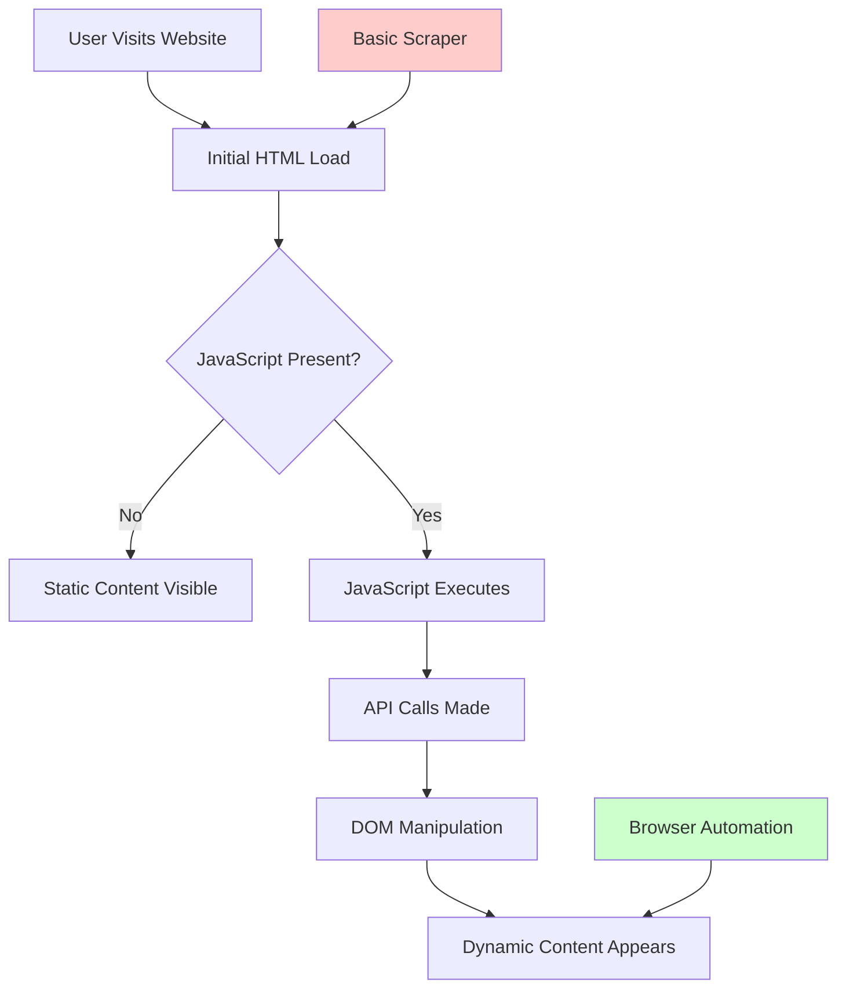
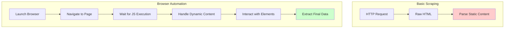
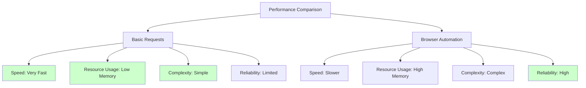

Picture this: you've crafted what seems like the perfect scraping script using Python's requests library. Your code is clean, fast, and efficient. You fire it up, expecting to harvest data from your target website, but instead of the rich content you saw in your browser, you're greeted with a mostly empty HTML skeleton. Sound familiar?

This scenario plays out countless times for web scrapers who encounter the harsh reality of modern web development. Today's websites aren't the static HTML pages of the early internet—they're dynamic, JavaScript-heavy applications that build content on the fly. When your simple HTTP request hits these sites, you're essentially asking for a recipe card when you really need the finished meal.

## The Evolution of Web Content Loading

Modern websites have fundamentally changed how they deliver content to users. Understanding this shift is crucial for determining when browser automation becomes necessary.



Traditional scrapers using libraries like `requests` stop at the initial HTML load. They receive whatever the server sends in the first response, which often contains little more than JavaScript loading scripts and empty containers. Browser automation, however, waits for the entire page lifecycle to complete, including JavaScript execution and dynamic content generation.

## Identifying When You Need Browser Automation

Not every scraping task requires the overhead of browser automation. Here are the telltale signs that your scraper needs to evolve beyond basic HTTP requests:

### JavaScript-Rendered Content

The most obvious indicator is when content appears in your browser but not in your scraper's output. Try disabling JavaScript in your browser—if the content disappears, you'll need browser automation.

```python
# This won't work for JavaScript-rendered content
import requests
from bs4 import BeautifulSoup

response = requests.get('https://spa-example.com')
soup = BeautifulSoup(response.content, 'html.parser')
# Results in empty or minimal content
```

### Single Page Applications (SPAs)

React, Vue, Angular, and other modern frameworks create SPAs that load a shell and then populate content dynamically. These applications make extensive use of AJAX calls and client-side routing.

### Authentication Flows

Complex login processes involving multi-factor authentication, CAPTCHAs, or OAuth flows often require user-like interactions that basic scrapers can't handle.

### User Interaction Requirements

Some content only appears after specific user actions—clicking buttons, scrolling to trigger infinite scroll, hovering over elements, or filling out forms.

## The Browser Automation Advantage

Browser automation tools control real web browsers programmatically, giving you access to the full rendering engine that processes JavaScript, handles cookies, manages sessions, and executes all the complex behaviors modern websites expect.



## Popular Browser Automation Tools

### Selenium: The Pioneer

Selenium has been the go-to choice for browser automation for over a decade. It supports multiple browsers and programming languages, making it versatile but sometimes verbose.

```python
from selenium import webdriver
from selenium.webdriver.common.by import By
from selenium.webdriver.support.ui import WebDriverWait
from selenium.webdriver.support import expected_conditions as EC

driver = webdriver.Chrome()
driver.get("https://dynamic-content-site.com")

# Wait for dynamic content to load
wait = WebDriverWait(driver, 10)
element = wait.until(EC.presence_of_element_located((By.CLASS_NAME, "dynamic-content")))

data = element.text
driver.quit()
```

### Playwright: The Modern Alternative

Microsoft's Playwright offers faster execution, better reliability, and more modern APIs compared to Selenium. It handles multiple browser contexts efficiently and provides excellent debugging capabilities.

```python
from playwright.sync_api import sync_playwright

with sync_playwright() as p:
    browser = p.chromium.launch()
    page = browser.new_page()
    page.goto("https://dynamic-content-site.com")
    
    # Wait for network idle to ensure all content is loaded
    page.wait_for_load_state("networkidle")
    
    content = page.locator(".dynamic-content").text_content()
    browser.close()
```

### Puppeteer: JavaScript Browser Control

For Node.js developers, Puppeteer provides direct control over Chrome or Chromium browsers with a JavaScript API that feels natural for web developers.

```javascript
const puppeteer = require('puppeteer');

(async () => {
    const browser = await puppeteer.launch();
    const page = await browser.newPage();
    await page.goto('https://dynamic-content-site.com');
    
    // Wait for specific selector to appear
    await page.waitForSelector('.dynamic-content');
    
    const content = await page.evaluate(() => {
        return document.querySelector('.dynamic-content').textContent;
    });
    
    await browser.close();
})();
```

## Performance Considerations and Trade-offs

Browser automation comes with significant overhead compared to basic HTTP requests. Understanding these trade-offs helps you make informed decisions about when to use each approach.



### Speed Comparison

A basic requests-based scraper might process hundreds of pages per minute, while browser automation typically handles dozens. However, browser automation succeeds where basic requests fail entirely, making the comparison somewhat moot for JavaScript-heavy sites.

### Resource Management

Browser instances consume significant memory and CPU resources. Proper resource management becomes crucial when scaling browser automation:

```python
# Good practice: Reuse browser instances
from playwright.sync_api import sync_playwright

with sync_playwright() as p:
    browser = p.chromium.launch()
    
    # Process multiple pages with the same browser
    for url in url_list:
        page = browser.new_page()
        page.goto(url)
        # Extract data
        page.close()  # Close individual pages, not the browser
    
    browser.close()  # Close browser when completely done
```

## Hybrid Approaches: Best of Both Worlds

Smart scrapers often combine both approaches, using basic HTTP requests where possible and falling back to browser automation only when necessary.

```python
import requests
from playwright.sync_api import sync_playwright

def smart_scraper(url):
    # Try basic request first
    response = requests.get(url)
    if is_content_sufficient(response.text):
        return extract_from_html(response.text)
    
    # Fall back to browser automation
    with sync_playwright() as p:
        browser = p.chromium.launch()
        page = browser.new_page()
        page.goto(url)
        page.wait_for_load_state("networkidle")
        content = page.content()
        browser.close()
        return extract_from_html(content)

def is_content_sufficient(html):
    # Custom logic to determine if static HTML contains needed data
    return len(html) > 10000 and "loading..." not in html.lower()
```

## Handling Common Browser Automation Challenges

### Managing Timeouts and Waits

One of the biggest challenges in browser automation is knowing when content has fully loaded. Different waiting strategies serve different scenarios:

```python
# Wait for specific element
page.wait_for_selector(".product-list")

# Wait for network activity to settle
page.wait_for_load_state("networkidle")

# Wait for JavaScript condition
page.wait_for_function("window.jQuery && window.jQuery.active == 0")

# Custom wait with polling
def wait_for_data():
    return page.locator(".data-table tr").count() > 10

page.wait_for_function(wait_for_data)
```

### Memory Leaks and Browser Crashes

Long-running browser automation scripts must handle browser crashes gracefully and prevent memory leaks:

```python
def robust_browser_session():
    max_pages_per_browser = 50
    pages_processed = 0
    
    with sync_playwright() as p:
        browser = p.chromium.launch()
        
        try:
            for url in urls:
                if pages_processed >= max_pages_per_browser:
                    browser.close()
                    browser = p.chromium.launch()
                    pages_processed = 0
                
                page = browser.new_page()
                page.goto(url, timeout=30000)
                # Process page
                page.close()
                pages_processed += 1
                
        finally:
            browser.close()
```

## Future-Proofing Your Scraping Strategy

As websites continue to evolve, the trend toward JavaScript-heavy, dynamic content shows no signs of slowing. Modern web development practices like server-side rendering (SSR) and static site generation (SSG) might seem like they're moving back toward scrapable content, but they often still rely on client-side hydration and dynamic features.

The rise of WebAssembly, progressive web apps, and edge computing is making web applications even more sophisticated. Browser automation tools are evolving too, with improvements in speed, stealth capabilities, and resource efficiency.

Consider browser automation not as a last resort but as a fundamental skill in modern web scraping. The overhead it introduces is often justified by the reliability and completeness of data extraction it provides.

The next time you encounter a website that returns empty divs to your basic scraper, remember that you're not hitting a roadblock—you're discovering an opportunity to level up your scraping toolkit. What JavaScript-heavy challenge will you tackle first with browser automation?