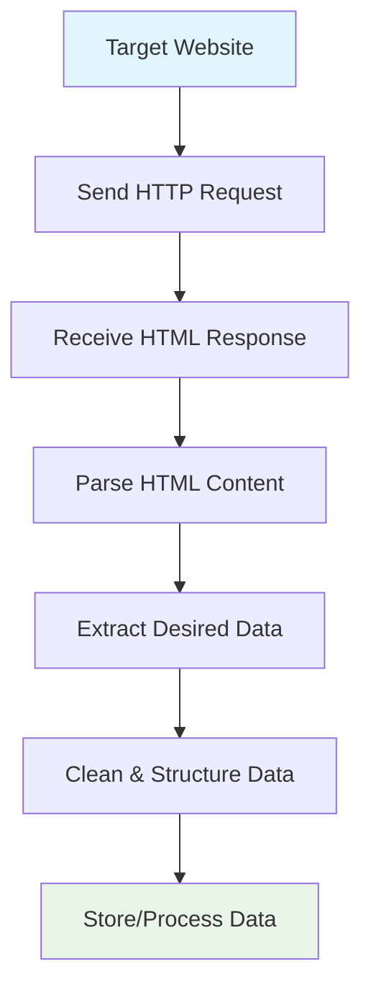
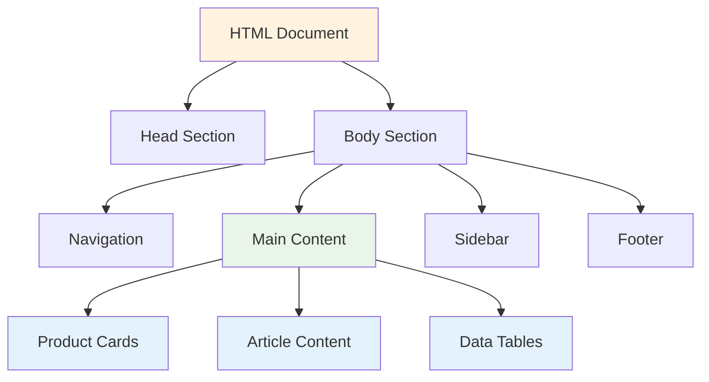
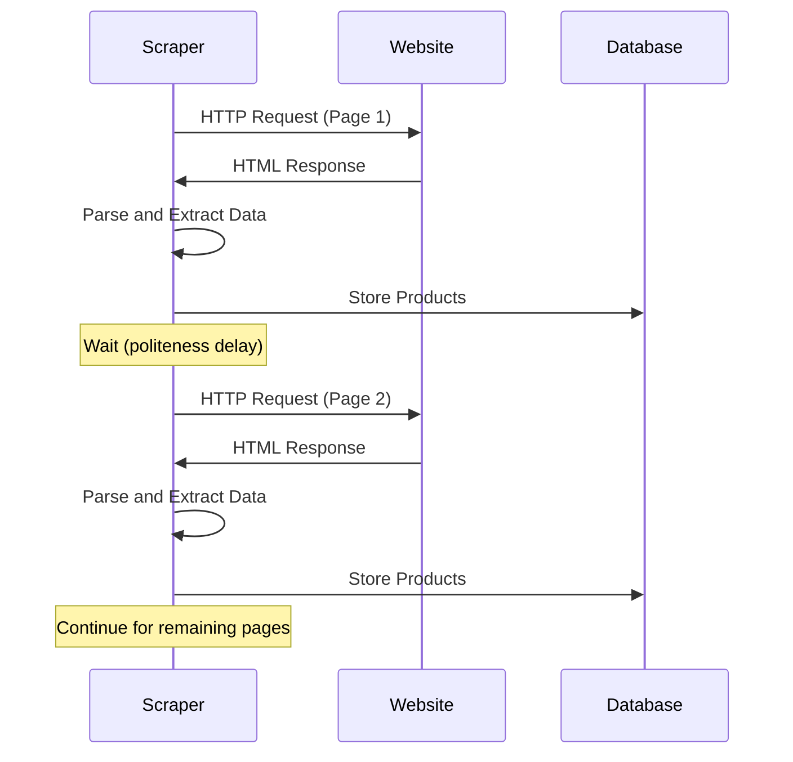

Web scraping has become an essential skill in our data-driven world. Whether you're a business analyst gathering competitive intelligence, a researcher collecting data for analysis, or a developer building applications that need real-time information, understanding web scraping opens up a universe of possibilities.

At its core, web scraping is the automated process of extracting data from websites. Think of it as teaching a computer to browse the web like a human would, but at lightning speed and with perfect accuracy. Instead of manually copying and pasting information from web pages, web scraping allows you to programmatically retrieve structured data from any publicly accessible website.

## The Anatomy of Web Scraping

Web scraping operates on a simple principle: websites are built using HTML, CSS, and JavaScript, and this code contains the data you see in your browser. By understanding how to parse and navigate this code, we can extract specific pieces of information systematically.



The process typically involves several key steps. First, your scraping program sends an HTTP request to the target website, mimicking what your browser does when you visit a page. The server responds with HTML content, which your program then parses to locate and extract the specific data you need. Finally, this raw data is cleaned, structured, and stored in a format suitable for your intended use.

## Why Web Scraping Matters

The applications for web scraping are virtually limitless. E-commerce businesses use it to monitor competitor pricing and track market trends. News organizations aggregate content from multiple sources to provide comprehensive coverage. Researchers collect social media data to analyze public sentiment. Real estate platforms gather property listings from various sources to offer comprehensive search capabilities.

Consider the challenge of monitoring prices across dozens of online retailers for your e-commerce business. Manually checking each site daily would be impossible, but web scraping can automate this process, providing real-time competitive intelligence that drives strategic decisions.

## Essential Tools and Technologies

The web scraping ecosystem offers numerous tools, each with its strengths and ideal use cases. Python remains the most popular language for web scraping due to its simplicity and extensive library ecosystem.

### Basic HTTP Requests

The foundation of web scraping lies in making HTTP requests. Python's `requests` library provides a simple interface for this:

```python
import requests
from bs4 import BeautifulSoup

# Send a GET request to the target URL
response = requests.get('https://example.com/products')

# Check if the request was successful
if response.status_code == 200:
    # Parse the HTML content
    soup = BeautifulSoup(response.content, 'html.parser')
    
    # Extract product titles
    product_titles = soup.find_all('h2', class_='product-title')
    
    for title in product_titles:
        print(title.get_text().strip())
```

This approach works well for static websites where content is directly embedded in the HTML. However, modern web applications often load content dynamically using JavaScript, requiring more sophisticated tools.

### Browser Automation

When dealing with JavaScript-heavy sites, browser automation tools become necessary. These tools control actual browser instances, allowing your scraper to interact with dynamic content:

```python
from playwright.sync_api import sync_playwright

def scrape_dynamic_content():
    with sync_playwright() as p:
        # Launch a browser
        browser = p.chromium.launch(headless=True)
        page = browser.new_page()
        
        # Navigate to the target page
        page.goto('https://example.com/dynamic-products')
        
        # Wait for dynamic content to load
        page.wait_for_selector('.product-card')
        
        # Extract product information
        products = page.query_selector_all('.product-card')
        
        for product in products:
            title = product.query_selector('h3').inner_text()
            price = product.query_selector('.price').inner_text()
            print(f"{title}: {price}")
        
        browser.close()

scrape_dynamic_content()
```

## Understanding Website Structure

Successful web scraping requires understanding how websites are structured. Modern websites follow predictable patterns that make data extraction more systematic.



Most websites organize content using semantic HTML elements and CSS classes. Product listings might use consistent class names like `product-card` or `item-container`. Understanding these patterns allows you to write more robust scrapers that can adapt to minor layout changes.

## Handling Common Challenges

Web scraping isn't always straightforward. Websites implement various measures to prevent automated access, and content can be structured in complex ways.

### Rate Limiting and Politeness

Responsible web scraping involves respecting the target website's resources. Sending hundreds of requests per second can overwhelm servers and potentially violate terms of service:

```python
import time
import random

def polite_scraper(urls):
    for url in urls:
        # Add random delay between requests
        delay = random.uniform(1, 3)
        time.sleep(delay)
        
        response = requests.get(url)
        # Process response...
        
        print(f"Processed {url} (waited {delay:.2f}s)")
```

### User-Agent Rotation

Many websites block requests that don't include proper browser headers:

```python
import random

user_agents = [
    'Mozilla/5.0 (Windows NT 10.0; Win64; x64) AppleWebKit/537.36',
    'Mozilla/5.0 (Macintosh; Intel Mac OS X 10_15_7) AppleWebKit/537.36',
    'Mozilla/5.0 (X11; Linux x86_64) AppleWebKit/537.36'
]

def get_with_random_ua(url):
    headers = {
        'User-Agent': random.choice(user_agents),
        'Accept': 'text/html,application/xhtml+xml,application/xml;q=0.9,*/*;q=0.8',
        'Accept-Language': 'en-US,en;q=0.5',
        'Accept-Encoding': 'gzip, deflate',
        'Connection': 'keep-alive',
    }
    
    return requests.get(url, headers=headers)
```

## Data Quality and Validation

Raw scraped data often requires cleaning and validation before it's useful. Websites may include extra whitespace, inconsistent formatting, or placeholder content:

```python
import re

def clean_price(price_text):
    # Remove currency symbols and extra whitespace
    cleaned = re.sub(r'[^\d.,]', '', price_text.strip())
    
    # Convert to float
    try:
        return float(cleaned.replace(',', ''))
    except ValueError:
        return None

def validate_product_data(product):
    # Ensure required fields are present and valid
    required_fields = ['name', 'price', 'url']
    
    for field in required_fields:
        if not product.get(field) or product[field].strip() == '':
            return False
    
    # Validate price is positive
    if product.get('price', 0) <= 0:
        return False
    
    return True
```

## Scaling Your Scraping Operations

As your scraping needs grow, you'll encounter new challenges around efficiency and reliability. Single-threaded scrapers work fine for small projects, but larger operations require concurrent processing:

```python
import concurrent.futures
import requests
from urllib.parse import urljoin

def scrape_single_page(url):
    try:
        response = requests.get(url, timeout=10)
        # Process the page...
        return f"Successfully scraped {url}"
    except Exception as e:
        return f"Failed to scrape {url}: {str(e)}"

def scrape_multiple_pages(base_url, page_count):
    urls = [urljoin(base_url, f"?page={i}") for i in range(1, page_count + 1)]
    
    with concurrent.futures.ThreadPoolExecutor(max_workers=5) as executor:
        results = list(executor.map(scrape_single_page, urls))
    
    return results
```

## Legal and Ethical Considerations

Web scraping operates in a complex legal landscape. While scraping publicly available data is generally acceptable, you must respect robots.txt files, terms of service, and applicable laws. The key principles include obtaining data only from public sources, not overwhelming target servers with excessive requests, and respecting intellectual property rights.

Always check a website's robots.txt file (usually found at domain.com/robots.txt) to understand any scraping restrictions the site owner has specified. This file indicates which parts of the site should not be accessed by automated tools.

## Building Your First Scraper

Let's put these concepts together in a practical example that scrapes product information from an e-commerce site:

```python
import requests
from bs4 import BeautifulSoup
import csv
import time

class ProductScraper:
    def __init__(self, base_url):
        self.base_url = base_url
        self.session = requests.Session()
        self.session.headers.update({
            'User-Agent': 'Mozilla/5.0 (Windows NT 10.0; Win64; x64) AppleWebKit/537.36'
        })
    
    def scrape_products(self, max_pages=5):
        all_products = []
        
        for page in range(1, max_pages + 1):
            print(f"Scraping page {page}...")
            products = self.scrape_page(page)
            all_products.extend(products)
            
            # Be polite - wait between requests
            time.sleep(2)
        
        return all_products
    
    def scrape_page(self, page_num):
        url = f"{self.base_url}?page={page_num}"
        
        try:
            response = self.session.get(url)
            response.raise_for_status()
            
            soup = BeautifulSoup(response.content, 'html.parser')
            product_cards = soup.find_all('div', class_='product-card')
            
            products = []
            for card in product_cards:
                product = self.extract_product_info(card)
                if product:
                    products.append(product)
            
            return products
            
        except requests.RequestException as e:
            print(f"Error scraping page {page_num}: {e}")
            return []
    
    def extract_product_info(self, card):
        try:
            name = card.find('h3', class_='product-name').get_text().strip()
            price_text = card.find('span', class_='price').get_text().strip()
            price = float(price_text.replace('$', '').replace(',', ''))
            
            return {
                'name': name,
                'price': price,
                'scraped_at': time.strftime('%Y-%m-%d %H:%M:%S')
            }
        except (AttributeError, ValueError):
            return None

# Usage
scraper = ProductScraper('https://example-store.com/products')
products = scraper.scrape_products(max_pages=3)

# Save to CSV
with open('products.csv', 'w', newline='', encoding='utf-8') as csvfile:
    if products:
        fieldnames = products[0].keys()
        writer = csv.DictWriter(csvfile, fieldnames=fieldnames)
        writer.writeheader()
        writer.writerows(products)
```



Web scraping transforms the vast expanse of web data into actionable insights for your projects. Whether you're tracking market trends, gathering research data, or building innovative applications, these foundational concepts provide the framework for extracting value from the digital world.

Ready to dive deeper into the world of automated data extraction? What specific website or data challenge are you hoping to tackle with web scraping?