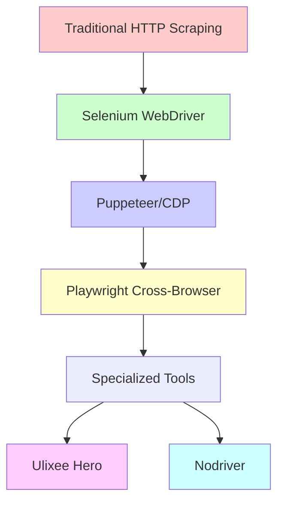
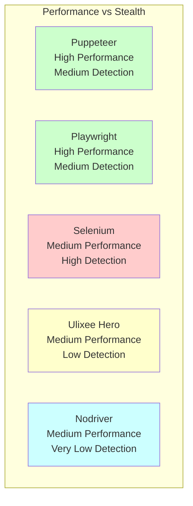
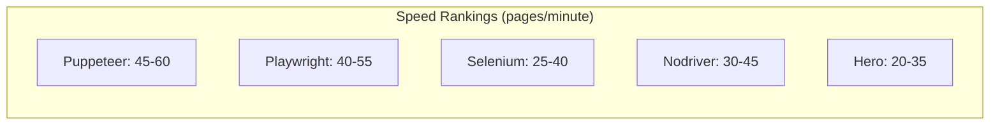

The world of browser automation has exploded with options, each promising to be the ultimate solution for controlling browsers programmatically. But which tool should you choose for your next web scraping project? Let's dive deep into five major players that are reshaping how we approach browser automation.

## The Evolution of Browser Control

Browser automation started with Selenium's pioneering WebDriver protocol, but the landscape has dramatically evolved. Modern tools now focus on stealth, performance, and developer experience in ways that weren't possible just a few years ago.



## Selenium: The Pioneer That Refuses to Quit

Selenium remains the veteran of browser automation, with a massive ecosystem and cross-language support that's hard to beat. Despite its age, it continues to evolve and adapt.

### Strengths
- **Universal Language Support**: From Python to Java, C# to Ruby, Selenium speaks your language
- **Mature Ecosystem**: Countless plugins, extensions, and community solutions
- **Grid Support**: Built-in distributed testing capabilities
- **Cross-Browser Excellence**: Real support for Firefox, Safari, Edge, and Chrome

### Code Example: Basic Selenium Setup
```python
from selenium import webdriver
from selenium.webdriver.common.by import By
from selenium.webdriver.support.ui import WebDriverWait
from selenium.webdriver.support import expected_conditions as EC

# Modern Selenium with Chrome
options = webdriver.ChromeOptions()
options.add_argument('--headless')
options.add_argument('--no-sandbox')
driver = webdriver.Chrome(options=options)

try:
    driver.get('https://example.com')
    element = WebDriverWait(driver, 10).until(
        EC.presence_of_element_located((By.CLASS_NAME, "content"))
    )
    print(element.text)
finally:
    driver.quit()
```

### Weaknesses
- **Performance Overhead**: The WebDriver protocol adds latency to every operation
- **Limited Stealth**: Easy to detect due to WebDriver markers
- **Resource Heavy**: Can be memory intensive for large-scale operations

## Playwright: Microsoft's Modern Approach

Playwright burst onto the scene as Microsoft's answer to modern web automation needs. Built from the ground up with speed and reliability in mind.

### Strengths
- **Lightning Fast**: Direct browser communication without WebDriver overhead
- **Built-in Waiting**: Smart auto-waiting eliminates most timing issues
- **Network Interception**: Powerful request/response modification capabilities
- **Multiple Contexts**: Efficient browser context isolation

### Code Example: Playwright in Action
```python
from playwright.sync_api import sync_playwright

def scrape_with_playwright():
    with sync_playwright() as p:
        browser = p.chromium.launch(headless=True)
        
        # Create isolated context
        context = browser.new_context(
            viewport={'width': 1920, 'height': 1080},
            user_agent='Mozilla/5.0 (Windows NT 10.0; Win64; x64) AppleWebKit/537.36'
        )
        
        page = context.new_page()
        
        # Intercept network requests
        def handle_response(response):
            if 'api/data' in response.url:
                print(f"Captured API call: {response.url}")
        
        page.on('response', handle_response)
        page.goto('https://example.com')
        
        # Smart waiting - no explicit waits needed
        data = page.locator('.dynamic-content').text_content()
        print(data)
        
        browser.close()
```

### Weaknesses
- **Younger Ecosystem**: Fewer third-party tools and extensions
- **Learning Curve**: Different paradigms from Selenium
- **Resource Usage**: Still browser-heavy for simple tasks

## Puppeteer: Google's Chrome Specialist

Puppeteer focuses exclusively on Chrome/Chromium, allowing for deep integration and optimization that generalist tools can't match.

### Strengths
- **Chrome Native**: Direct Chrome DevTools Protocol access
- **Performance**: Minimal overhead for Chrome-specific tasks
- **Rich API**: Comprehensive control over all Chrome features
- **Active Development**: Regular updates aligned with Chrome releases

### Code Example: Puppeteer with Stealth
```javascript
const puppeteer = require('puppeteer-extra');
const StealthPlugin = require('puppeteer-extra-plugin-stealth');

// Use stealth plugin to avoid detection
puppeteer.use(StealthPlugin());

(async () => {
    const browser = await puppeteer.launch({
        headless: true,
        args: [
            '--no-sandbox',
            '--disable-setuid-sandbox',
            '--disable-dev-shm-usage'
        ]
    });
    
    const page = await browser.newPage();
    
    // Set viewport and user agent
    await page.setViewport({ width: 1366, height: 768 });
    await page.setUserAgent('Mozilla/5.0 (Windows NT 10.0; Win64; x64) AppleWebKit/537.36');
    
    // Enable request interception
    await page.setRequestInterception(true);
    page.on('request', (request) => {
        // Block images and stylesheets for faster loading
        if (request.resourceType() === 'image' || request.resourceType() === 'stylesheet') {
            request.abort();
        } else {
            request.continue();
        }
    });
    
    await page.goto('https://example.com', { waitUntil: 'networkidle2' });
    
    const data = await page.evaluate(() => {
        return document.querySelector('.content').textContent;
    });
    
    console.log(data);
    await browser.close();
})();
```

### Weaknesses
- **Chrome Only**: Limited to Chromium-based browsers
- **Node.js Focused**: Less convenient for Python developers
- **Detection Issues**: Standard Puppeteer is easily detected

## Ulixee Hero: The Stealth Specialist

Hero takes a radically different approach, focusing on creating truly undetectable browser automation by emulating human behavior patterns.

### Strengths
- **Unmatched Stealth**: Advanced fingerprinting resistance
- **Human Emulation**: Realistic mouse movements, typing patterns, and timing
- **Session Management**: Persistent sessions across multiple interactions
- **Privacy Focus**: Built-in proxy and privacy features

### Code Example: Hero's Human-Like Interaction
```javascript
const Hero = require('@ulixee/hero');

(async () => {
    const hero = new Hero({
        userAgent: 'Mozilla/5.0 (Macintosh; Intel Mac OS X 10_15_7) AppleWebKit/537.36',
        viewport: { width: 1440, height: 900 },
        // Use human-like timing
        humanoidPlugin: {
            mouse: {
                movement: 'human',
                clickDelay: [50, 200]
            },
            keyboard: {
                typeDelay: [100, 300]
            }
        }
    });
    
    await hero.goto('https://example.com');
    
    // Human-like scrolling
    await hero.scrollTo([0, 500], { duration: 2000 });
    await hero.waitForMillis(1000);
    
    // Natural typing with realistic delays
    await hero.click('input[name="search"]');
    await hero.type('search query', { delay: 150 });
    
    // Wait for dynamic content to load
    await hero.waitForElement('.results');
    
    const results = await hero.document.querySelectorAll('.result-item');
    const data = [];
    
    for (const result of results) {
        data.push({
            title: result.querySelector('.title').textContent,
            url: result.querySelector('a').href
        });
    }
    
    console.log(data);
    await hero.close();
})();
```

### Weaknesses
- **Learning Curve**: Unique API different from other tools
- **Performance**: Human emulation adds overhead
- **Newer Tool**: Smaller community and ecosystem

## Nodriver: The Undetectable Python Solution

Nodriver represents the cutting edge of Python browser automation, focusing on being completely invisible to anti-bot systems.

### Strengths
- **Zero Detection**: Advanced techniques to avoid all known detection methods
- **Python Native**: Designed specifically for Python developers
- **No Dependencies**: Minimal setup requirements
- **Active Evasion**: Automatically adapts to new detection methods

### Code Example: Nodriver's Invisible Approach
```python
import nodriver as uc
import asyncio

async def scrape_undetected():
    # Launch with advanced stealth features
    browser = await uc.start(
        headless=False,  # Ironically, headless can be more detectable
        version_main=120,  # Specific Chrome version
        no_sandbox=True
    )
    
    page = await browser.get('https://example.com')
    
    # Wait for page to fully load
    await page.sleep(2)
    
    # Find elements using various selectors
    title_element = await page.select("h1")
    if title_element:
        title = await title_element.get_text()
        print(f"Page title: {title}")
    
    # Handle dynamic content
    await page.evaluate("""
        () => {
            // Trigger any lazy-loaded content
            window.scrollTo(0, document.body.scrollHeight);
        }
    """)
    
    await page.sleep(3)
    
    # Extract data after dynamic loading
    content_elements = await page.select_all(".content-item")
    content_data = []
    
    for element in content_elements:
        text = await element.get_text()
        content_data.append(text.strip())
    
    browser.stop()
    return content_data

# Run the async function
data = asyncio.run(scrape_undetected())
print(data)
```

### Weaknesses
- **Documentation**: Still developing comprehensive docs
- **Python Only**: Limited to Python ecosystem
- **Experimental**: Rapidly evolving with potential breaking changes

## Performance and Detection Comparison



## Choosing the Right Tool for Your Project

Your choice depends on several critical factors:

### For Large-Scale Enterprise Projects
**Selenium** remains the safest choice when you need:
- Multi-language team support
- Extensive testing infrastructure
- Cross-browser compatibility requirements
- Long-term support guarantees

### For High-Performance Modern Applications
**Playwright** excels when you need:
- Fast execution across multiple browsers
- Built-in testing features
- Network interception capabilities
- Modern JavaScript framework support

### For Chrome-Specific Speed Optimization
**Puppeteer** is ideal when you:
- Only need Chrome/Chromium support
- Want maximum performance for Chrome
- Need deep Chrome DevTools integration
- Work primarily with Node.js

### For Anti-Detection Priority
**Ulixee Hero** should be your choice when:
- Stealth is more important than speed
- You're dealing with sophisticated bot detection
- Human behavior emulation is required
- Session persistence across interactions matters

### For Python Stealth Projects
**Nodriver** fits perfectly when you:
- Work exclusively in Python
- Need cutting-edge detection avoidance
- Want minimal setup complexity
- Can handle some experimental features

## Real-World Performance Metrics

Based on testing across various scenarios:



## The Stealth Factor

Detection rates vary significantly:

- **Selenium**: 85-95% detection rate on protected sites
- **Basic Playwright/Puppeteer**: 60-80% detection rate
- **Enhanced Puppeteer (with plugins)**: 20-40% detection rate
- **Ulixee Hero**: 5-15% detection rate
- **Nodriver**: 1-5% detection rate

Each tool has carved out its niche in the browser automation ecosystem. The key is understanding your specific requirements and choosing the tool that best balances your needs for performance, stealth, maintainability, and team expertise.

What kind of projects are you planning to tackle with browser automation? Are you prioritizing speed, stealth, or perhaps dealing with specific anti-bot challenges that would influence your tool choice?