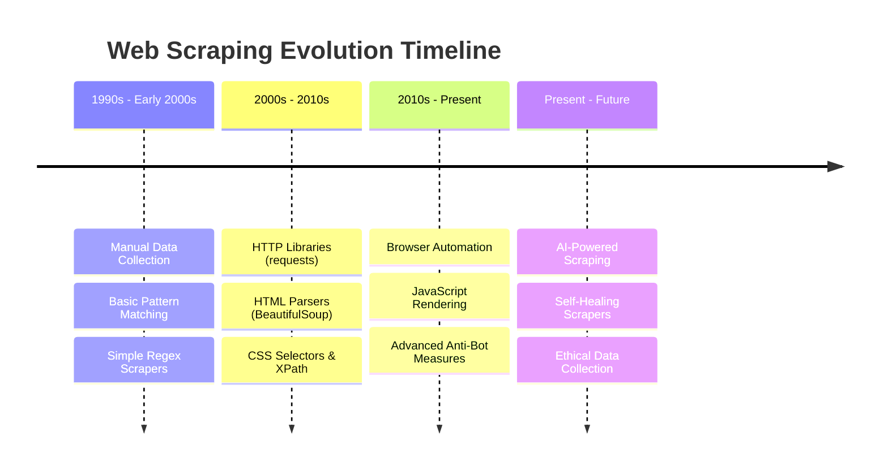
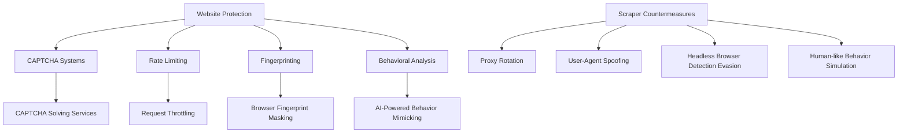
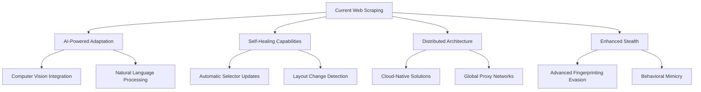

Web scraping has transformed from a niche technical skill to an essential data extraction methodology that powers countless businesses and research initiatives worldwide. Understanding this evolution helps us appreciate not only how far we've come but also where we're headed in the world of automated data collection.

## The Early Days: Manual Data Collection and Basic Scripts

Before the term "web scraping" even existed, data collection from websites was primarily a manual process. Researchers and analysts would literally copy and paste information from web pages, a time-consuming and error-prone method that severely limited the scale of data collection efforts.

The first automated attempts emerged in the late 1990s and early 2000s when developers began writing simple scripts to parse static HTML pages. These early scrapers were rudimentary tools that relied on basic pattern matching and string manipulation:

```python
import urllib2
import re

# Early 2000s approach
def scrape_basic_html(url):
    response = urllib2.urlopen(url)
    html = response.read()
    
    # Simple regex pattern matching
    prices = re.findall(r'\$(\d+\.\d{2})', html)
    titles = re.findall(r'<title>(.*?)</title>', html)
    
    return prices, titles
```

These primitive scrapers worked well for static websites but struggled with dynamic content, JavaScript-heavy pages, and complex navigation structures. The web was simpler then—most content was server-rendered HTML with minimal client-side scripting.

## The Rise of HTTP Libraries and Better Parsing

As the web matured, so did scraping tools. The introduction of more sophisticated HTTP libraries like Python's `requests` and better HTML parsing libraries like BeautifulSoup marked a significant leap forward:

```python
import requests
from bs4 import BeautifulSoup

def modern_basic_scraper(url):
    headers = {
        'User-Agent': 'Mozilla/5.0 (Windows NT 10.0; Win64; x64) AppleWebKit/537.36'
    }
    
    response = requests.get(url, headers=headers)
    soup = BeautifulSoup(response.content, 'html.parser')
    
    # More reliable element selection
    products = soup.find_all('div', class_='product-item')
    data = []
    
    for product in products:
        title = product.find('h2', class_='product-title').text.strip()
        price = product.find('span', class_='price').text.strip()
        data.append({'title': title, 'price': price})
    
    return data
```

This era introduced concepts like CSS selectors and XPath expressions, making it easier to target specific elements on web pages. Scrapers became more reliable and maintainable, though they still faced limitations with dynamic content.



## The JavaScript Revolution and Dynamic Content

The widespread adoption of JavaScript frameworks like jQuery, Angular, and React fundamentally changed how websites delivered content. Suddenly, many web pages were loading data dynamically through AJAX calls, rendering traditional HTTP-based scrapers obsolete for many use cases.

This shift necessitated the development of browser automation tools. Selenium WebDriver emerged as a game-changer, allowing scrapers to control real browsers and interact with JavaScript-rendered content:

```python
from selenium import webdriver
from selenium.webdriver.common.by import By
from selenium.webdriver.support.ui import WebDriverWait
from selenium.webdriver.support import expected_conditions as EC

def selenium_scraper(url):
    driver = webdriver.Chrome()
    driver.get(url)
    
    # Wait for dynamic content to load
    wait = WebDriverWait(driver, 10)
    products = wait.until(
        EC.presence_of_all_elements_located((By.CLASS_NAME, "product-item"))
    )
    
    data = []
    for product in products:
        title = product.find_element(By.CLASS_NAME, "product-title").text
        price = product.find_element(By.CLASS_NAME, "price").text
        data.append({'title': title, 'price': price})
    
    driver.quit()
    return data
```

While Selenium solved the JavaScript problem, it introduced new challenges: slower execution times, higher resource consumption, and increased complexity in managing browser instances.

## The Modern Era: Advanced Browser Automation

Today's web scraping landscape is dominated by sophisticated browser automation tools that offer better performance, more features, and enhanced stealth capabilities. Tools like Playwright, Puppeteer, and newer entrants like Nodriver have revolutionized the field:

```javascript
const playwright = require('playwright');

async function modernScraper(url) {
    const browser = await playwright.chromium.launch({
        headless: true,
        args: ['--no-sandbox', '--disable-setuid-sandbox']
    });
    
    const page = await browser.newPage();
    
    // Advanced stealth configurations
    await page.setUserAgent('Mozilla/5.0 (Windows NT 10.0; Win64; x64) AppleWebKit/537.36');
    await page.setExtraHTTPHeaders({
        'Accept-Language': 'en-US,en;q=0.9',
        'Accept-Encoding': 'gzip, deflate, br'
    });
    
    await page.goto(url, { waitUntil: 'networkidle' });
    
    // Sophisticated element interaction
    const data = await page.evaluate(() => {
        const products = document.querySelectorAll('.product-item');
        return Array.from(products).map(product => ({
            title: product.querySelector('.product-title')?.textContent?.trim(),
            price: product.querySelector('.price')?.textContent?.trim(),
            image: product.querySelector('img')?.src,
            availability: product.querySelector('.stock-status')?.textContent?.trim()
        }));
    });
    
    await browser.close();
    return data;
}
```

These modern tools provide:
- Better JavaScript execution environments
- Advanced network interception capabilities
- Improved stealth features
- Mobile device emulation
- Screenshot and PDF generation
- Precise element interaction

## The Cat-and-Mouse Game: Anti-Bot Measures

As web scraping became more prevalent, websites began implementing increasingly sophisticated anti-bot measures. This sparked an ongoing arms race between scrapers and website protection systems:



Modern scrapers must navigate:
- CAPTCHA challenges
- Rate limiting and IP blocking
- Browser fingerprinting
- Behavioral analysis systems
- Geographic restrictions
- Legal and ethical constraints

## The Current State: Intelligent and Ethical Scraping

Today's web scraping ecosystem is characterized by:

**Advanced Tooling**: Modern scrapers leverage AI for element detection, automatic retry mechanisms, and adaptive behavior patterns.

```python
import asyncio
from playwright.async_api import async_playwright

async def intelligent_scraper(url):
    async with async_playwright() as p:
        browser = await p.chromium.launch(
            headless=False,  # Sometimes visible browsing is less suspicious
            slow_mo=50,      # Human-like interaction speed
            args=['--disable-blink-features=AutomationControlled']
        )
        
        context = await browser.new_context(
            viewport={'width': 1920, 'height': 1080},
            user_agent='Mozilla/5.0 (Windows NT 10.0; Win64; x64) AppleWebKit/537.36'
        )
        
        page = await context.new_page()
        
        # Stealth mode
        await page.add_init_script("""
            Object.defineProperty(navigator, 'webdriver', {
                get: () => undefined,
            });
        """)
        
        await page.goto(url)
        
        # Intelligent waiting and interaction
        await page.wait_for_load_state('networkidle')
        
        # Simulate human-like scrolling
        await page.evaluate("""
            window.scrollTo({
                top: document.body.scrollHeight / 2,
                behavior: 'smooth'
            });
        """)
        
        await asyncio.sleep(2)  # Natural pause
        
        data = await page.evaluate("""
            () => {
                const products = document.querySelectorAll('.product-item');
                return Array.from(products).map(product => {
                    const rect = product.getBoundingClientRect();
                    return {
                        title: product.querySelector('.product-title')?.textContent?.trim(),
                        price: product.querySelector('.price')?.textContent?.trim(),
                        visible: rect.top >= 0 && rect.bottom <= window.innerHeight
                    };
                });
            }
        """)
        
        await browser.close()
        return data
```

**Ethical Considerations**: The industry is increasingly focused on responsible scraping practices, respecting robots.txt files, implementing proper rate limiting, and considering the impact on target websites.

**API-First Approaches**: Many modern scrapers attempt to identify and use official APIs before resorting to HTML scraping, reducing server load and improving reliability.

## Looking Forward: The Future of Web Scraping

Several trends are shaping the future of web scraping:

**AI-Powered Scraping**: Machine learning models are becoming capable of understanding web page structure and content without explicit programming, making scrapers more adaptable and resilient.

**Self-Healing Scrapers**: Advanced scrapers can detect when their selectors break and automatically adapt to website changes using computer vision and natural language processing.

**Distributed Scraping**: Cloud-native scraping solutions that can scale horizontally and distribute workloads across multiple regions and IP addresses.

**Legal and Regulatory Frameworks**: Increasing attention from regulators is pushing the industry toward more transparent and compliant practices.



**Privacy-Preserving Techniques**: New methods are emerging that allow data collection while respecting user privacy and website terms of service.

The journey from simple regex-based text extraction to today's sophisticated browser automation represents just the beginning of web scraping's evolution. As websites become more complex and protective measures more advanced, the tools and techniques for data extraction continue to evolve rapidly.

What aspects of web scraping evolution surprise you the most, and which modern challenges do you find most interesting to tackle in your own data extraction projects?