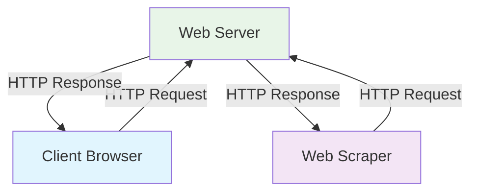
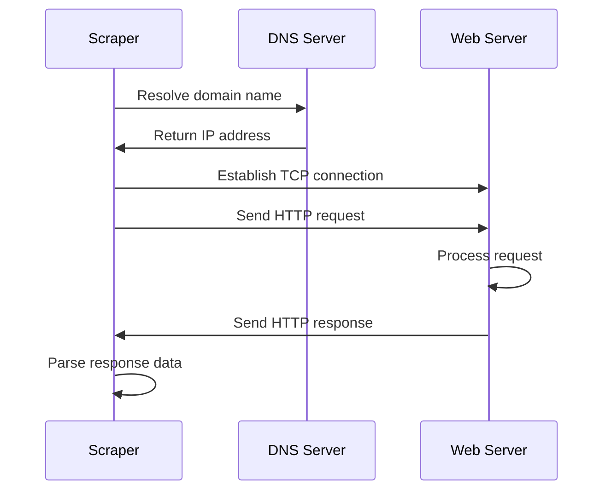
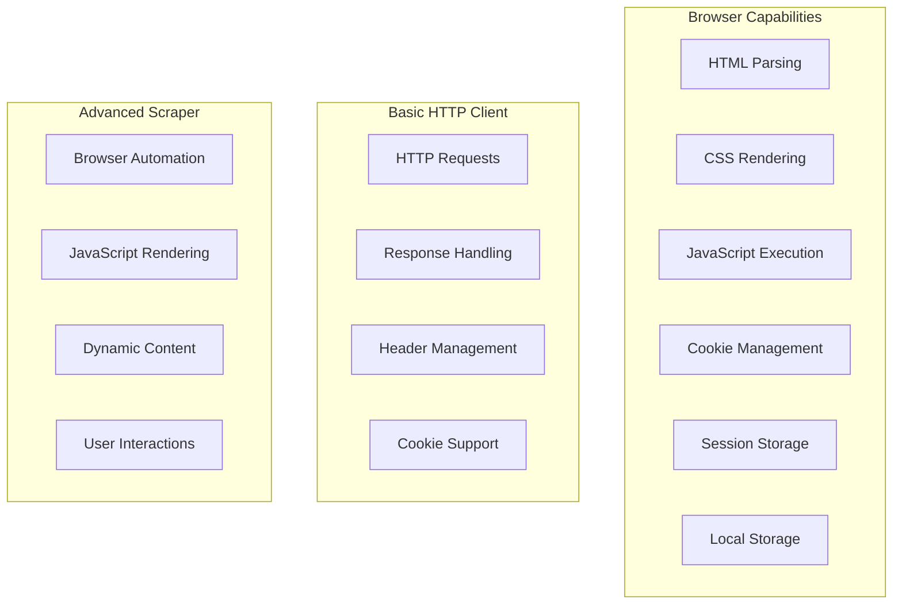

Every web scraping operation begins with understanding a fundamental concept that governs how the internet works: the client-server architecture. Whether you're extracting product data from an e-commerce site or gathering news articles from multiple sources, you're essentially mimicking the same communication pattern that happens billions of times every day across the web.

When you open your browser and navigate to any website, you're participating in a well-orchestrated dance between two key players: the client (your browser) and the server (the computer hosting the website). This dance follows specific rules, protocols, and patterns that we can leverage to build effective web scraping systems.

## The Client-Server Model Explained

At its core, the client-server model is a distributed computing architecture where tasks are divided between service providers (servers) and service requesters (clients). In web scraping, we position ourselves as clients, making requests to servers just like a web browser would.



The beauty of this model lies in its simplicity and standardization. Servers don't need to know whether they're responding to a human using Chrome or a Python script using the requests library. They simply process incoming requests and send back responses according to established protocols.

## HTTP: The Language of the Web

Hypertext Transfer Protocol (HTTP) serves as the communication protocol between clients and servers. Every web scraping operation relies on HTTP methods to interact with web servers. The most common methods you'll encounter are:

**GET**: Retrieves data from the server. This is what happens when you visit a webpage or when your scraper requests HTML content.

```python
import requests

# Simple GET request - the foundation of web scraping
response = requests.get('https://example.com/api/products')
print(response.status_code)  # 200 for success
print(response.text)  # The actual content
```

**POST**: Sends data to the server. Useful when scraping sites that require form submissions or API interactions.

```python
# POST request with data - common in scraping scenarios
data = {
    'username': 'user@example.com',
    'password': 'securepass123'
}
response = requests.post('https://example.com/login', data=data)
```

**Headers**: These carry metadata about the request and response, including content type, authentication tokens, and browser information.

```python
headers = {
    'User-Agent': 'Mozilla/5.0 (Windows NT 10.0; Win64; x64) AppleWebKit/537.36',
    'Accept': 'text/html,application/xhtml+xml,application/xml;q=0.9,*/*;q=0.8',
    'Accept-Language': 'en-US,en;q=0.5',
    'Accept-Encoding': 'gzip, deflate'
}

response = requests.get('https://example.com', headers=headers)
```

## Request-Response Cycle Deep Dive

Understanding the complete request-response cycle is crucial for effective web scraping. Let's break down what happens from the moment your scraper initiates a request until it receives the data.



**Domain Resolution**: Your scraper first needs to convert the human-readable domain name into an IP address that computers can understand.

**Connection Establishment**: A TCP connection is established between your scraper and the target server.

**Request Transmission**: Your HTTP request, complete with headers and any payload data, travels to the server.

**Server Processing**: The server processes your request, potentially querying databases, running business logic, or generating dynamic content.

**Response Generation**: The server constructs an HTTP response containing the requested data, status codes, and response headers.

**Data Reception**: Your scraper receives the response and can begin parsing the content.

## Status Codes: The Server's Communication System

HTTP status codes are the server's way of communicating the outcome of your request. Understanding these codes is essential for building robust scrapers that can handle various scenarios gracefully.

```python
import requests
from time import sleep

def robust_scraper(url, max_retries=3):
    for attempt in range(max_retries):
        try:
            response = requests.get(url, timeout=10)
            
            if response.status_code == 200:
                return response.text
            elif response.status_code == 429:  # Rate limited
                print(f"Rate limited. Waiting before retry {attempt + 1}")
                sleep(2 ** attempt)  # Exponential backoff
            elif response.status_code == 404:
                print("Page not found")
                return None
            elif response.status_code >= 500:  # Server error
                print(f"Server error: {response.status_code}")
                sleep(1)
            else:
                print(f"Unexpected status: {response.status_code}")
                
        except requests.RequestException as e:
            print(f"Request failed: {e}")
            sleep(1)
    
    return None
```

Common status codes and their implications for web scraping:

- **200**: Success - proceed with data extraction
- **301/302**: Redirect - follow the new location
- **403**: Forbidden - might need different headers or authentication
- **404**: Not found - handle gracefully in your scraper
- **429**: Too many requests - implement rate limiting
- **500+**: Server errors - retry with backoff strategy

## Sessions and State Management

Many websites maintain state across multiple requests using sessions and cookies. Understanding how to manage these is crucial for scraping sites that require authentication or maintain user preferences.

```python
import requests

# Using sessions for stateful scraping
session = requests.Session()

# Login request that sets session cookies
login_data = {
    'username': 'your_username',
    'password': 'your_password'
}
session.post('https://example.com/login', data=login_data)

# Subsequent requests automatically include session cookies
profile_page = session.get('https://example.com/profile')
dashboard_data = session.get('https://example.com/dashboard')

# Session cookies persist across all requests in this session
user_orders = session.get('https://example.com/orders')
```

Sessions enable you to:
- Maintain authentication across multiple requests
- Store server-side preferences and settings
- Access user-specific content
- Navigate multi-step processes

## Connection Persistence and Performance

Modern web scrapers can benefit significantly from understanding connection persistence. HTTP/1.1 introduced persistent connections, allowing multiple requests to reuse the same TCP connection, reducing overhead and improving performance.

```python
import requests
from urllib3.util.retry import Retry
from requests.adapters import HTTPAdapter

# Configure session with connection pooling and retries
session = requests.Session()

# Retry strategy for robust scraping
retry_strategy = Retry(
    total=3,
    status_forcelist=[429, 500, 502, 503, 504],
    method_whitelist=["HEAD", "GET", "OPTIONS"],
    backoff_factor=1
)

adapter = HTTPAdapter(
    pool_connections=10,  # Number of connection pools
    pool_maxsize=20,      # Connections per pool
    max_retries=retry_strategy
)

session.mount("http://", adapter)
session.mount("https://", adapter)

# These requests will reuse connections when possible
urls = [
    'https://example.com/page1',
    'https://example.com/page2',
    'https://example.com/page3'
]

for url in urls:
    response = session.get(url)
    # Process response data
    print(f"Status: {response.status_code}, Length: {len(response.content)}")
```

## Browser vs. Scraper: Bridging the Gap

While browsers and scrapers both act as HTTP clients, browsers do much more than simple request-response cycles. They execute JavaScript, handle redirects, manage cookies, and maintain complex state. Understanding these differences helps you choose the right tool for your scraping needs.



Simple HTTP clients like the requests library excel at:
- Fast, lightweight operations
- API interactions
- Static content extraction
- High-volume data collection

Browser automation tools (Selenium, Playwright, Puppeteer) are necessary when:
- Content is generated dynamically with JavaScript
- User interactions are required (clicks, form submissions)
- Complex authentication flows need simulation
- You need to handle complex client-side logic

## Network Protocols and Security

Modern web applications increasingly rely on HTTPS, adding a security layer through TLS/SSL encryption. Your scrapers need to handle these secure connections properly while being aware of potential certificate issues.

```python
import requests
import urllib3

# Disable SSL warnings for development (not recommended for production)
urllib3.disable_warnings(urllib3.exceptions.InsecureRequestWarning)

# Different approaches to SSL handling
try:
    # Standard HTTPS request
    response = requests.get('https://secure-site.com')
except requests.exceptions.SSLError:
    # Handle SSL certificate issues
    print("SSL certificate verification failed")
    
    # Option 1: Disable verification (use cautiously)
    response = requests.get('https://secure-site.com', verify=False)
    
    # Option 2: Provide custom certificate bundle
    response = requests.get('https://secure-site.com', verify='/path/to/certificate.pem')
```

## Practical Implementation Strategies

When building scrapers based on the client-server model, consider these implementation patterns:

**Rate Limiting and Politeness**:
```python
import time
from datetime import datetime, timedelta

class PoliteSession:
    def __init__(self, delay=1.0):
        self.session = requests.Session()
        self.delay = delay
        self.last_request_time = None
    
    def get(self, url, **kwargs):
        if self.last_request_time:
            elapsed = datetime.now() - self.last_request_time
            if elapsed < timedelta(seconds=self.delay):
                sleep_time = self.delay - elapsed.total_seconds()
                time.sleep(sleep_time)
        
        self.last_request_time = datetime.now()
        return self.session.get(url, **kwargs)

# Usage
polite_scraper = PoliteSession(delay=1.5)
response = polite_scraper.get('https://example.com')
```

**Error Handling and Resilience**:
```python
def resilient_request(url, max_attempts=3, timeout=10):
    for attempt in range(max_attempts):
        try:
            response = requests.get(
                url, 
                timeout=timeout,
                headers={'User-Agent': 'ResponsibleBot/1.0'}
            )
            
            if response.status_code == 200:
                return response
            elif response.status_code == 429:
                # Rate limited - exponential backoff
                wait_time = 2 ** attempt
                print(f"Rate limited. Waiting {wait_time} seconds...")
                time.sleep(wait_time)
            else:
                print(f"HTTP {response.status_code} for {url}")
                
        except requests.exceptions.Timeout:
            print(f"Timeout on attempt {attempt + 1}")
        except requests.exceptions.ConnectionError:
            print(f"Connection error on attempt {attempt + 1}")
            time.sleep(2 ** attempt)
    
    return None
```

The client-server architecture forms the bedrock upon which all web scraping operations are built. Whether you're making simple HTTP requests or orchestrating complex browser automation scenarios, you're always working within this fundamental framework. The key to successful scraping lies in understanding not just how to make requests, but how to make them efficiently, responsibly, and robustly.

As you develop your scraping skills, remember that every website you interact with has been designed with human users in mind, not bots. Your challenge is to bridge that gap while respecting the server's resources and the site owner's intentions.

What's the most challenging client-server interaction you've encountered in your web scraping journey, and how did understanding the underlying protocols help you overcome it?