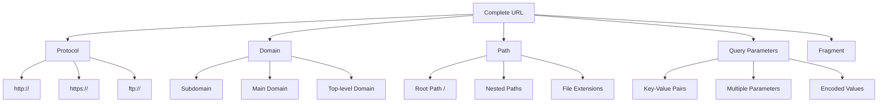
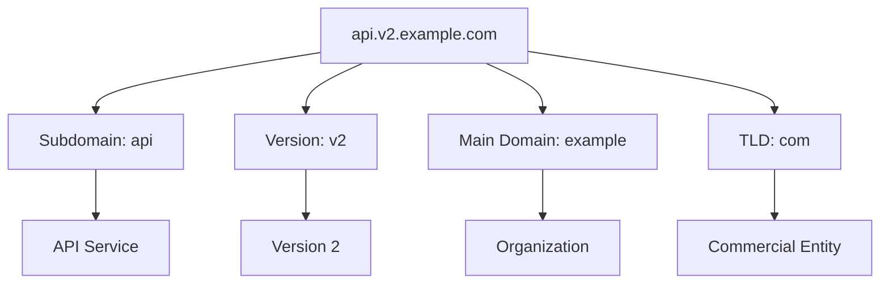
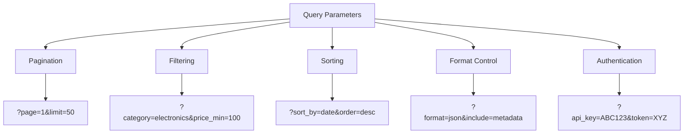

Every web scraping journey begins with a URL. These seemingly simple strings of text are actually complex blueprints that tell your scraper exactly where to go and how to get there. Understanding URL anatomy isn't just academic knowledge—it's the foundation that separates successful scrapers from those who struggle with broken endpoints and missed data.

When I first started scraping, I treated URLs like magic incantations. Copy, paste, run script, hope for the best. But URLs aren't magic—they're structured, predictable, and incredibly informative once you know how to read them. Each component serves a specific purpose and reveals crucial information about the target system.



## The Protocol: Your Gateway Protocol

The protocol section—that `https://` or `http://` at the beginning—might seem trivial, but it's your first clue about the target system's security posture and capabilities. HTTPS sites encrypt data transmission, which affects how you handle cookies, sessions, and certificate verification in your scraping code.

```python
import requests

# This might fail without proper SSL handling
response = requests.get('https://example.com/data')

# Better approach with SSL verification control
response = requests.get('https://example.com/data', verify=True)

# For development/testing only - never in production
response = requests.get('https://example.com/data', verify=False)
```

Some sites serve different content based on protocol. I've encountered APIs that return different data structures when accessed via HTTP versus HTTPS, particularly in development environments where security configurations differ.

## Domain Decomposition: Reading the Address

The domain section contains multiple layers of information. Subdomains often indicate different services or API versions, while the main domain and TLD can reveal geographic targeting or organizational structure.



Consider this real-world example:

```javascript
const endpoints = {
    'api.github.com': 'Main API',
    'api-v3.github.com': 'Version 3 API',
    'raw.githubusercontent.com': 'Raw content delivery',
    'gist.github.com': 'Gist service'
};

// Different subdomains require different handling
async function scrapeGitHub(subdomain, path) {
    const baseUrl = `https://${subdomain}`;
    
    // API endpoints need authentication
    if (subdomain.includes('api')) {
        return fetch(`${baseUrl}${path}`, {
            headers: { 'Authorization': 'token YOUR_TOKEN' }
        });
    }
    
    // Raw content needs different parsing
    if (subdomain === 'raw.githubusercontent.com') {
        return fetch(`${baseUrl}${path}`, {
            headers: { 'Accept': 'text/plain' }
        });
    }
}
```

## Path Patterns: Navigating the Structure

URL paths reveal application architecture and routing patterns. RESTful APIs follow predictable patterns, while traditional web applications might use various routing schemes.

```python
import re
from urllib.parse import urlparse

def analyze_path_pattern(url):
    parsed = urlparse(url)
    path = parsed.path
    
    patterns = {
        'api_resource': re.match(r'/api/v?\d*/(\w+)/(\d+)/?', path),
        'nested_resource': re.match(r'/(\w+)/(\d+)/(\w+)/?', path),
        'file_download': re.match(r'.*\.(pdf|csv|json|xml)$', path),
        'pagination': 'page' in parsed.query
    }
    
    return {k: v for k, v in patterns.items() if v}

# Example usage
urls = [
    'https://api.example.com/v1/users/123',
    'https://site.com/products/456/reviews',
    'https://data.site.com/export.csv',
    'https://site.com/search?page=5'
]

for url in urls:
    print(f"{url}: {analyze_path_pattern(url)}")
```

Path analysis helps predict other endpoints. If `/api/v1/users/123` returns user data, you might find `/api/v1/users` returns a user list, or `/api/v1/posts/123` follows similar patterns.

## Query Parameters: The Data Goldmine

Query parameters are where URLs become truly powerful for scrapers. They control filtering, sorting, pagination, and data format—essentially everything you need to customize your data extraction.



Here's how to systematically explore parameter spaces:

```python
from urllib.parse import urlencode, parse_qs, urlparse
import itertools

class ParameterExplorer:
    def __init__(self, base_url):
        self.base_url = base_url
        
    def build_url(self, params):
        return f"{self.base_url}?{urlencode(params)}"
    
    def explore_pagination(self, max_pages=10):
        """Test different pagination parameters"""
        pagination_patterns = [
            {'page': 1, 'limit': 50},
            {'offset': 0, 'count': 25},
            {'start': 0, 'end': 100},
            {'p': 1, 'per_page': 20}
        ]
        
        for pattern in pagination_patterns:
            for page in range(1, max_pages + 1):
                params = pattern.copy()
                if 'page' in params:
                    params['page'] = page
                elif 'offset' in params:
                    params['offset'] = (page - 1) * params['count']
                
                yield self.build_url(params)
    
    def explore_formats(self):
        """Test different output formats"""
        formats = ['json', 'xml', 'csv', 'html']
        format_params = ['format', 'output', 'type', 'ext']
        
        for fmt, param in itertools.product(formats, format_params):
            yield self.build_url({param: fmt})

# Usage example
explorer = ParameterExplorer('https://api.example.com/data')

# Test pagination
for url in list(explorer.explore_pagination(3)):
    print(f"Testing: {url}")
    # Make request and analyze response
```

## Fragment Identifiers: The Hidden Navigation

Fragments (the `#section` part) don't get sent to servers in HTTP requests, but they're crucial for single-page applications and JavaScript-heavy sites. Modern scrapers need to handle these properly.

```javascript
// Using Playwright to handle fragment navigation
const { chromium } = require('playwright');

async function scrapeWithFragment(url, fragment) {
    const browser = await chromium.launch();
    const page = await browser.newPage();
    
    // Navigate to base URL first
    await page.goto(url);
    
    // Wait for JavaScript to load
    await page.waitForLoadState('networkidle');
    
    // Navigate to fragment
    if (fragment) {
        await page.evaluate((frag) => {
            window.location.hash = frag;
        }, fragment);
        
        // Wait for fragment content to load
        await page.waitForTimeout(1000);
    }
    
    const content = await page.content();
    await browser.close();
    
    return content;
}

// Usage
scrapeWithFragment('https://spa-app.com/dashboard', 'reports')
    .then(html => console.log('Scraped fragment content'));
```

## URL Encoding and Special Characters

URLs can't contain certain characters directly. Understanding encoding helps you construct valid requests and decode extracted data properly.

```python
from urllib.parse import quote, unquote, quote_plus

def safe_url_construction(base_url, search_term, filters):
    """Properly encode URL components"""
    
    # Different encoding for different contexts
    encoded_search = quote_plus(search_term)  # Spaces become +
    encoded_filter = quote(filters)  # Spaces become %20
    
    url = f"{base_url}?q={encoded_search}&filter={encoded_filter}"
    
    return url

# Example with problematic characters
search_terms = [
    "Python & JavaScript",
    "Price: $100-$500",
    "Data #analysis",
    "UTF-8: café naïve"
]

for term in search_terms:
    safe_url = safe_url_construction('https://search.com', term, 'active')
    print(f"Original: {term}")
    print(f"Safe URL: {safe_url}")
    print(f"Decoded: {unquote(safe_url)}\n")
```

## Dynamic URL Generation

Many modern applications generate URLs dynamically. Recognizing these patterns helps you predict URL structures and build comprehensive scrapers.

```ruby
class URLPatternAnalyzer
  def initialize
    @patterns = []
  end
  
  def analyze_batch(urls)
    urls.each { |url| extract_pattern(url) }
    identify_common_patterns
  end
  
  private
  
  def extract_pattern(url)
    # Extract numeric IDs
    numeric_ids = url.scan(/\/(\d+)(?:\/|$|\?)/)
    
    # Extract date patterns
    date_patterns = url.scan(/(\d{4}[-\/]\d{2}[-\/]\d{2})/)
    
    # Extract parameter patterns
    params = URI.parse(url).query
    param_keys = params ? CGI.parse(params).keys : []
    
    @patterns << {
      url: url,
      numeric_ids: numeric_ids.flatten,
      dates: date_patterns.flatten,
      param_keys: param_keys
    }
  end
  
  def identify_common_patterns
    common_params = @patterns
      .flat_map { |p| p[:param_keys] }
      .tally
      .sort_by { |k, v| -v }
      .first(10)
    
    puts "Most common parameters: #{common_params}"
  end
end

# Usage
analyzer = URLPatternAnalyzer.new
sample_urls = [
  'https://shop.com/products/12345?category=electronics&sort=price',
  'https://shop.com/products/67890?category=books&sort=rating',
  'https://shop.com/orders/2024-03-15?status=completed'
]

analyzer.analyze_batch(sample_urls)
```

## Security Implications in URL Structure

URLs reveal security information that affects scraping strategies. Authentication methods, rate limiting hints, and access control patterns are often visible in URL structures.

```python
import hashlib
import time
from urllib.parse import urlencode

class SecureURLBuilder:
    def __init__(self, api_key, secret):
        self.api_key = api_key
        self.secret = secret
    
    def build_signed_url(self, endpoint, params):
        """Build URL with signature for APIs requiring request signing"""
        
        # Add timestamp and API key
        params.update({
            'api_key': self.api_key,
            'timestamp': int(time.time())
        })
        
        # Create signature
        param_string = urlencode(sorted(params.items()))
        signature_data = f"{endpoint}?{param_string}"
        signature = hashlib.sha256(
            f"{signature_data}{self.secret}".encode()
        ).hexdigest()
        
        params['signature'] = signature
        
        return f"{endpoint}?{urlencode(params)}"
    
    def extract_rate_limit_info(self, url):
        """Guess rate limiting from URL patterns"""
        
        rate_limit_indicators = [
            'api_key' in url,  # Key-based limiting
            'per_page' in url or 'limit' in url,  # Pagination limits
            '/v1/' in url or '/v2/' in url,  # Versioned APIs often have limits
        ]
        
        return any(rate_limit_indicators)

# Usage
builder = SecureURLBuilder('your_api_key', 'your_secret')
signed_url = builder.build_signed_url(
    'https://api.service.com/data',
    {'category': 'electronics', 'limit': 100}
)
```

Understanding URLs transforms you from someone who copies and pastes endpoints into someone who can predict, construct, and navigate entire API ecosystems. Every URL tells a story about the system behind it, the data it protects, and the patterns you can exploit for comprehensive extraction.

The next time you encounter a new scraping target, spend time dissecting its URLs. Look for patterns, test parameter combinations, and map the routing structure. This upfront analysis will save you countless hours of trial and error later.

What's the most complex URL structure you've encountered in your scraping projects, and how did you reverse-engineer its pattern to scale your extraction?