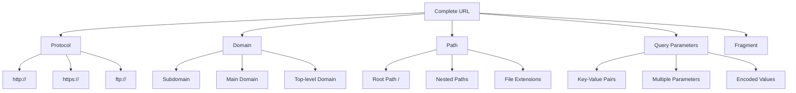
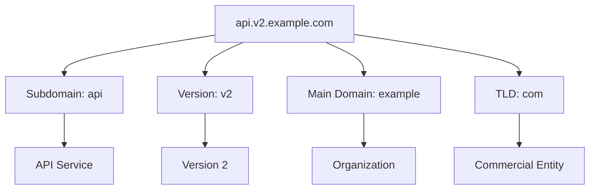
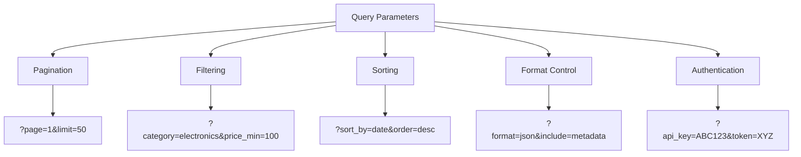

Every web scraping journey begins with a URL. These seemingly simple strings of text are actually complex blueprints that tell your scraper exactly where to go and how to get there. Understanding URL anatomy isn't just academic knowledge—it's the foundation that separates successful scrapers from those who struggle with broken endpoints and missed data.

When I first started scraping, I treated URLs like magic incantations. Copy, paste, run script, hope for the best. But URLs aren't magic—they're structured, predictable, and incredibly informative once you know how to read them. Each component serves a specific purpose and reveals crucial information about the target system.


```mermaid
graph TD
    A[Complete URL] --> B[Protocol]
    A --> C[Domain]
    A --> D[Path]
    A --> E[Query Parameters]
    A --> F[Fragment]
    
    B --> B1[http://]
    B --> B2[https://]
    B --> B3[ftp://]
    
    C --> C1[Subdomain]
    C --> C2[Main Domain]
    C --> C3[Top-level Domain]
    
    D --> D1[Root Path /]
    D --> D2[Nested Paths]
    D --> D3[File Extensions]
    
    E --> E1[Key-Value Pairs]
    E --> E2[Multiple Parameters]
    E --> E3[Encoded Values]
```

## The Protocol: Your Gateway Protocol

The protocol section—that `https://` or `http://` at the beginning—might seem trivial, but it's your first clue about the target system's security posture and capabilities. HTTPS sites encrypt data transmission, which affects how you handle cookies, sessions, and certificate verification in your scraping code.

```python
import requests

# This might fail without proper SSL handling
response = requests.get('https://example.com/data')

# Better approach with SSL verification control
response = requests.get('https://example.com/data', verify=True)

# For development/testing only - never in production
response = requests.get('https://example.com/data', verify=False)
```

Some sites serve different content based on protocol. I've encountered APIs that return different data structures when accessed via HTTP versus HTTPS, particularly in development environments where security configurations differ. The tool you use to make these requests matters too — our [Python Requests vs. Selenium comparison](/posts/python-requests-vs-selenium-speed-performance-comparison/) explains when a simple HTTP client is enough and when you need a full browser.

## Domain Decomposition: Reading the Address

The domain section contains multiple layers of information. Subdomains often indicate different services or API versions, while the main domain and TLD can reveal geographic targeting or organizational structure.


```mermaid
graph TD
    A[api.v2.example.com]

    A --> B[Subdomain: api]
    A --> C[Version: v2]
    A --> D[Main Domain: example]
    A --> E[TLD: com]

    B --> B1[API Service]
    C --> C1[Version 2]
    D --> D1[Organization]
    E --> E1[Commercial Entity]
```

Consider this real-world example:

```javascript
const endpoints = {
    'api.github.com': 'Main API',
    'api-v3.github.com': 'Version 3 API',
    'raw.githubusercontent.com': 'Raw content delivery',
    'gist.github.com': 'Gist service'
};

// Different subdomains require different handling
async function scrapeGitHub(subdomain, path) {
    const baseUrl = `https://${subdomain}`;
    
    // API endpoints need authentication
    if (subdomain.includes('api')) {
        return fetch(`${baseUrl}${path}`, {
            headers: { 'Authorization': 'token YOUR_TOKEN' }
        });
    }
    
    // Raw content needs different parsing
    if (subdomain === 'raw.githubusercontent.com') {
        return fetch(`${baseUrl}${path}`, {
            headers: { 'Accept': 'text/plain' }
        });
    }
}
```

## Path Patterns: Navigating the Structure

URL paths reveal application architecture and routing patterns. RESTful APIs follow predictable patterns, while traditional web applications might use various routing schemes.

```python
import re
from urllib.parse import urlparse

def analyze_path_pattern(url):
    parsed = urlparse(url)
    path = parsed.path
    
    patterns = {
        'api_resource': re.match(r'/api/v?\d*/(\w+)/(\d+)/?', path),
        'nested_resource': re.match(r'/(\w+)/(\d+)/(\w+)/?', path),
        'file_download': re.match(r'.*\.(pdf|csv|json|xml)$', path),
        'pagination': 'page' in parsed.query
    }
    
    return {k: v for k, v in patterns.items() if v}

# Example usage
urls = [
    'https://api.example.com/v1/users/123',
    'https://site.com/products/456/reviews',
    'https://data.site.com/export.csv',
    'https://site.com/search?page=5'
]

for url in urls:
    print(f"{url}: {analyze_path_pattern(url)}")
```

Path analysis helps predict other endpoints. If `/api/v1/users/123` returns user data, you might find `/api/v1/users` returns a user list, or `/api/v1/posts/123` follows similar patterns.

## Query Parameters: The Data Goldmine

Query parameters are where URLs become truly powerful for scrapers. They control filtering, sorting, pagination, and data format—essentially everything you need to customize your data extraction.


```mermaid
graph TB
    A[Query Parameters] --> B[Pagination]
    A --> C[Filtering]
    A --> D[Sorting]
    A --> E[Format Control]
    A --> F[Authentication]
    
    B --> B1["?page=1&limit=50"]
    C --> C1["?category=electronics&price_min=100"]
    D --> D1["?sort_by=date&order=desc"]
    E --> E1["?format=json&include=metadata"]
    F --> F1["?api_key=ABC123&token=XYZ"]
```

Here's how to systematically explore parameter spaces:

```python
from urllib.parse import urlencode

base_url = "https://api.example.com/data"

# Common pagination patterns to test against an unknown API
pagination_patterns = [
    {'page': 1, 'limit': 50},
    {'offset': 0, 'count': 25},
    {'p': 1, 'per_page': 20},
]

for pattern in pagination_patterns:
    url = f"{base_url}?{urlencode(pattern)}"
    print(f"Testing: {url}")
    # Make request and check if the response contains paginated data
```

You can also probe output format by trying `?format=json`, `?output=xml`, and similar variations -- many APIs support multiple formats through query parameters.


<figure>
  
  <figcaption>Web scraping is the bridge between the visible web and usable data. <span class="img-credit">Photo by Google DeepMind / <a href="https://www.pexels.com" target="_blank" rel="noopener noreferrer">Pexels</a></span></figcaption>
</figure>

## Fragment Identifiers: The Hidden Navigation

Fragments (the `#section` part) don't get sent to servers in HTTP requests, but they're crucial for single-page applications and JavaScript-heavy sites. Modern scrapers need to handle these properly.

```javascript
// Using Playwright to handle fragment navigation
const { chromium } = require('playwright');

async function scrapeWithFragment(url, fragment) {
    const browser = await chromium.launch();
    const page = await browser.newPage();
    
    // Navigate to base URL first
    await page.goto(url);
    
    // Wait for JavaScript to load
    await page.waitForLoadState('networkidle');
    
    // Navigate to fragment
    if (fragment) {
        await page.evaluate((frag) => {
            window.location.hash = frag;
        }, fragment);
        
        // Wait for fragment content to load
        await page.waitForTimeout(1000);
    }
    
    const content = await page.content();
    await browser.close();
    
    return content;
}

// Usage
scrapeWithFragment('https://spa-app.com/dashboard', 'reports')
    .then(html => console.log('Scraped fragment content'));
```

## URL Encoding and Special Characters

URLs can't contain certain characters directly. Understanding encoding helps you construct valid requests and decode extracted data properly.

```python
from urllib.parse import quote, quote_plus

# quote_plus encodes spaces as + (for query values)
# quote encodes spaces as %20 (for path segments)
search = quote_plus("Python & JavaScript")  # "Python+%26+JavaScript"
path = quote("café naïve")                  # "caf%C3%A9+na%C3%AFve"

url = f"https://search.com?q={search}&filter={quote('active')}"
```

## Dynamic URL Generation

Many modern applications generate URLs dynamically. Recognizing these patterns helps you predict URL structures and build comprehensive scrapers.

When analyzing URLs at scale, look for numeric IDs (`/\d+/`), date patterns (`/\d{4}-\d{2}-\d{2}/`), and common query parameter names across your sample. Tallying the most frequent parameter keys across a batch of URLs quickly reveals the site's routing conventions.

## Security Implications in URL Structure

URLs reveal security information that affects scraping strategies. Authentication methods, rate limiting hints, and access control patterns are often visible in URL structures.

```python
import hashlib, time
from urllib.parse import urlencode

def build_signed_url(endpoint, params, api_key, secret):
    """Build URL with signature for APIs requiring request signing."""
    params.update({'api_key': api_key, 'timestamp': int(time.time())})
    param_string = urlencode(sorted(params.items()))
    signature = hashlib.sha256(
        f"{endpoint}?{param_string}{secret}".encode()
    ).hexdigest()
    params['signature'] = signature
    return f"{endpoint}?{urlencode(params)}"
```

URL patterns also reveal rate limiting hints: the presence of `api_key`, `per_page`, `limit`, or versioned paths like `/v1/` all suggest the API enforces request quotas.

Understanding URLs transforms you from someone who copies and pastes endpoints into someone who can predict, construct, and navigate entire API ecosystems. Every URL tells a story about the system behind it, the data it protects, and the patterns you can exploit for comprehensive extraction.

The next time you encounter a new scraping target, spend time dissecting its URLs. Look for patterns, test parameter combinations, and map the routing structure. This upfront analysis will save you countless hours of trial and error later. And before you start crawling, it is worth checking whether the site's [robots.txt carries any legal weight](/posts/is-robots-txt-legally-binding-scraping-law-explained/) for your use case.

What's the most complex URL structure you've encountered in your scraping projects, and how did you reverse-engineer its pattern to scale your extraction?
