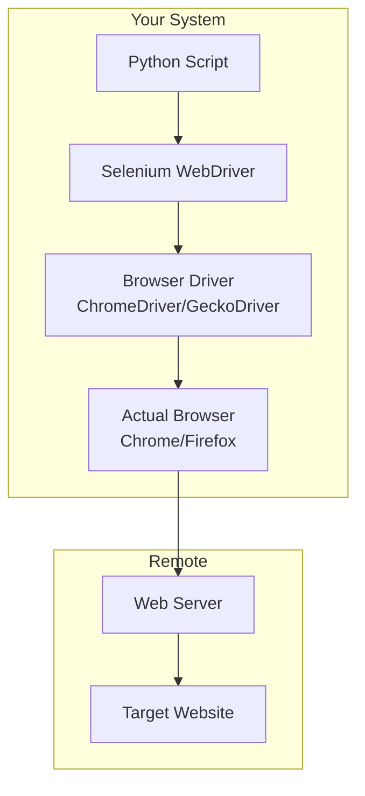
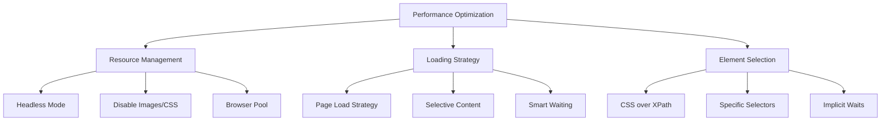

Browser automation fundamentally changes how we approach web scraping. While basic HTTP requests work perfectly for static content, today's web is dominated by JavaScript-heavy applications that render content dynamically. Selenium WebDriver stands as the pioneer in this space, offering a robust framework that has been battle-tested across millions of automation projects worldwide.

Selenium doesn't just simulate web browsing—it controls actual browser instances, giving you access to the same rendering engine, JavaScript execution environment, and security context that regular users experience. This makes it invaluable for scraping modern web applications that rely heavily on client-side rendering.

## Understanding Selenium's Architecture

Before diving into code, it's crucial to understand how Selenium operates. Unlike traditional scraping libraries that make direct HTTP requests, Selenium follows a client-server architecture where your Python script communicates with a WebDriver executable, which in turn controls the actual browser.



This architecture provides several advantages: your scripts can interact with JavaScript-rendered content, handle complex user flows like authentication, and access the same cookies and session data that regular browsers use.

## Setting Up Your Environment

The first step involves installing Selenium and the appropriate browser drivers. Python's package manager makes this straightforward:

```bash
pip install selenium webdriver-manager
```

The `webdriver-manager` package automatically downloads and manages browser drivers, eliminating the common headache of manually maintaining driver versions that match your browser installations.

Here's your first complete Selenium script:

```python
from selenium import webdriver
from selenium.webdriver.chrome.service import Service
from selenium.webdriver.chrome.options import Options
from webdriver_manager.chrome import ChromeDriverManager
import time

# Configure Chrome options
chrome_options = Options()
chrome_options.add_argument("--no-sandbox")
chrome_options.add_argument("--disable-dev-shm-usage")

# Initialize the driver
service = Service(ChromeDriverManager().install())
driver = webdriver.Chrome(service=service, options=chrome_options)

try:
    # Navigate to a website
    driver.get("https://quotes.toscrape.com/")
    
    # Wait for page to load
    time.sleep(2)
    
    # Print the page title
    print(f"Page title: {driver.title}")
    
    # Find and print all quote texts
    quotes = driver.find_elements("css selector", "span.text")
    for i, quote in enumerate(quotes, 1):
        print(f"Quote {i}: {quote.text}")
        
finally:
    driver.quit()
```

This script demonstrates the fundamental Selenium workflow: initialize a driver, navigate to a page, interact with elements, and clean up resources.

## Element Location Strategies

Selenium offers multiple strategies for finding elements on web pages. Each has specific use cases and performance characteristics:

```python
from selenium.webdriver.common.by import By

# Different ways to locate elements
driver.find_element(By.ID, "element-id")
driver.find_element(By.CLASS_NAME, "class-name")
driver.find_element(By.TAG_NAME, "div")
driver.find_element(By.CSS_SELECTOR, ".class > div")
driver.find_element(By.XPATH, "//div[@class='example']")
driver.find_element(By.LINK_TEXT, "Click here")
driver.find_element(By.PARTIAL_LINK_TEXT, "Click")
```

CSS selectors and XPath expressions provide the most flexibility. CSS selectors are generally faster and more readable, while XPath offers advanced features like text content matching and complex traversal patterns.

## Handling Dynamic Content

Modern websites often load content asynchronously. Simple `time.sleep()` calls are unreliable and inefficient. Selenium's WebDriverWait provides intelligent waiting mechanisms:

```python
from selenium.webdriver.support.ui import WebDriverWait
from selenium.webdriver.support import expected_conditions as EC
from selenium.webdriver.common.by import By

def scrape_dynamic_content():
    driver = webdriver.Chrome(service=Service(ChromeDriverManager().install()))
    wait = WebDriverWait(driver, 10)
    
    try:
        driver.get("https://example.com/dynamic-content")
        
        # Wait for specific element to be present
        element = wait.until(
            EC.presence_of_element_located((By.CLASS_NAME, "dynamic-content"))
        )
        
        # Wait for element to be clickable
        button = wait.until(
            EC.element_to_be_clickable((By.ID, "load-more"))
        )
        button.click()
        
        # Wait for text to appear
        wait.until(
            EC.text_to_be_present_in_element((By.ID, "status"), "Loaded")
        )
        
    finally:
        driver.quit()
```

## User Interaction Simulation

Selenium excels at simulating complex user interactions. Here's how to handle forms, clicks, and keyboard input:

```python
from selenium.webdriver.common.keys import Keys
from selenium.webdriver.common.action_chains import ActionChains

def simulate_user_interactions():
    driver = webdriver.Chrome(service=Service(ChromeDriverManager().install()))
    
    try:
        driver.get("https://example.com/login")
        
        # Form filling
        username_field = driver.find_element(By.NAME, "username")
        password_field = driver.find_element(By.NAME, "password")
        
        username_field.send_keys("your_username")
        password_field.send_keys("your_password")
        password_field.send_keys(Keys.RETURN)
        
        # Advanced interactions with ActionChains
        element = driver.find_element(By.ID, "draggable")
        actions = ActionChains(driver)
        
        # Hover over element
        actions.move_to_element(element).perform()
        
        # Right-click context menu
        actions.context_click(element).perform()
        
        # Drag and drop
        target = driver.find_element(By.ID, "droppable")
        actions.drag_and_drop(element, target).perform()
        
    finally:
        driver.quit()
```

## Browser Configuration and Options

Different browsers offer various configuration options. Chrome provides extensive customization capabilities:

```python
def configure_chrome_driver():
    chrome_options = Options()
    
    # Run in headless mode (no GUI)
    chrome_options.add_argument("--headless")
    
    # Set window size
    chrome_options.add_argument("--window-size=1920,1080")
    
    # Disable images for faster loading
    prefs = {"profile.managed_default_content_settings.images": 2}
    chrome_options.add_experimental_option("prefs", prefs)
    
    # Disable extensions
    chrome_options.add_argument("--disable-extensions")
    
    # Set user agent
    chrome_options.add_argument("--user-agent=Mozilla/5.0 (Windows NT 10.0; Win64; x64) AppleWebKit/537.36")
    
    # Disable logging
    chrome_options.add_argument("--log-level=3")
    
    return webdriver.Chrome(
        service=Service(ChromeDriverManager().install()),
        options=chrome_options
    )
```

## Error Handling and Best Practices

Robust Selenium scripts require proper error handling and resource management:

```python
from selenium.common.exceptions import (
    TimeoutException, 
    NoSuchElementException,
    WebDriverException
)

class SeleniumScraper:
    def __init__(self):
        self.driver = None
        self.setup_driver()
    
    def setup_driver(self):
        chrome_options = Options()
        chrome_options.add_argument("--headless")
        chrome_options.add_argument("--no-sandbox")
        
        try:
            service = Service(ChromeDriverManager().install())
            self.driver = webdriver.Chrome(service=service, options=chrome_options)
            self.driver.implicitly_wait(10)
        except WebDriverException as e:
            print(f"Failed to initialize driver: {e}")
            raise
    
    def scrape_with_error_handling(self, url):
        try:
            self.driver.get(url)
            
            # Multiple fallback selectors
            selectors = [".primary-content", "#main-content", ".content"]
            content = None
            
            for selector in selectors:
                try:
                    content = self.driver.find_element(By.CSS_SELECTOR, selector)
                    break
                except NoSuchElementException:
                    continue
            
            if not content:
                raise NoSuchElementException("No content found with any selector")
                
            return content.text
            
        except TimeoutException:
            print("Page load timeout")
            return None
        except Exception as e:
            print(f"Scraping error: {e}")
            return None
    
    def cleanup(self):
        if self.driver:
            self.driver.quit()
```

## Working with Multiple Browser Types

Selenium supports various browsers, each with unique characteristics:

```python
def get_firefox_driver():
    from selenium.webdriver.firefox.service import Service as FirefoxService
    from selenium.webdriver.firefox.options import Options as FirefoxOptions
    from webdriver_manager.firefox import GeckoDriverManager
    
    firefox_options = FirefoxOptions()
    firefox_options.add_argument("--headless")
    
    service = FirefoxService(GeckoDriverManager().install())
    return webdriver.Firefox(service=service, options=firefox_options)

def get_edge_driver():
    from selenium.webdriver.edge.service import Service as EdgeService
    from selenium.webdriver.edge.options import Options as EdgeOptions
    from webdriver_manager.microsoft import EdgeChromiumDriverManager
    
    edge_options = EdgeOptions()
    edge_options.add_argument("--headless")
    
    service = EdgeService(EdgeChromiumDriverManager().install())
    return webdriver.Edge(service=service, options=edge_options)
```

## Performance Considerations

Browser automation is resource-intensive compared to simple HTTP requests. Here's how to optimize performance:



```python
def optimize_selenium_performance():
    chrome_options = Options()
    
    # Essential performance options
    chrome_options.add_argument("--headless")
    chrome_options.add_argument("--disable-gpu")
    chrome_options.add_argument("--no-sandbox")
    chrome_options.add_argument("--disable-dev-shm-usage")
    
    # Disable unnecessary features
    chrome_options.add_argument("--disable-extensions")
    chrome_options.add_argument("--disable-plugins")
    chrome_options.add_argument("--disable-java")
    
    # Set page load strategy
    chrome_options.page_load_strategy = 'eager'  # Don't wait for all resources
    
    # Memory optimization
    chrome_options.add_argument("--memory-pressure-off")
    chrome_options.add_argument("--max_old_space_size=4096")
    
    return webdriver.Chrome(
        service=Service(ChromeDriverManager().install()),
        options=chrome_options
    )
```

## Practical Example: Scraping a Real Website

Let's put everything together with a practical example that scrapes product information:

```python
import json
from selenium import webdriver
from selenium.webdriver.common.by import By
from selenium.webdriver.support.ui import WebDriverWait
from selenium.webdriver.support import expected_conditions as EC
from selenium.webdriver.chrome.options import Options
from webdriver_manager.chrome import ChromeDriverManager

class ProductScraper:
    def __init__(self):
        self.setup_driver()
    
    def setup_driver(self):
        options = Options()
        options.add_argument("--headless")
        options.add_argument("--no-sandbox")
        
        self.driver = webdriver.Chrome(
            service=Service(ChromeDriverManager().install()),
            options=options
        )
        self.wait = WebDriverWait(self.driver, 10)
    
    def scrape_products(self, url):
        products = []
        
        try:
            self.driver.get(url)
            
            # Wait for product grid to load
            self.wait.until(
                EC.presence_of_element_located((By.CLASS_NAME, "product-item"))
            )
            
            product_elements = self.driver.find_elements(By.CLASS_NAME, "product-item")
            
            for element in product_elements:
                try:
                    product = {
                        'name': element.find_element(By.CLASS_NAME, "product-name").text,
                        'price': element.find_element(By.CLASS_NAME, "price").text,
                        'rating': len(element.find_elements(By.CSS_SELECTOR, ".rating .star.filled")),
                        'availability': element.find_element(By.CLASS_NAME, "availability").text
                    }
                    products.append(product)
                except Exception as e:
                    print(f"Error scraping product: {e}")
                    continue
            
            return products
            
        except Exception as e:
            print(f"Scraping failed: {e}")
            return []
    
    def save_products(self, products, filename):
        with open(filename, 'w') as f:
            json.dump(products, f, indent=2)
    
    def cleanup(self):
        self.driver.quit()

# Usage
scraper = ProductScraper()
products = scraper.scrape_products("https://example-store.com/products")
scraper.save_products(products, "products.json")
scraper.cleanup()
```

Selenium WebDriver opens the door to scraping the modern web's most complex applications. While it requires more resources than simple HTTP requests, the ability to execute JavaScript, handle dynamic content, and simulate real user interactions makes it indispensable for serious web scraping projects.

The key to mastering Selenium lies in understanding when to use it—not every scraping task requires a full browser. But when dealing with SPAs, authentication flows, or JavaScript-heavy sites, Selenium becomes your most powerful ally.

What type of dynamic website are you planning to tackle with Selenium? Share your challenging scraping scenarios in the comments, and let's explore how browser automation can solve your specific data extraction puzzles.