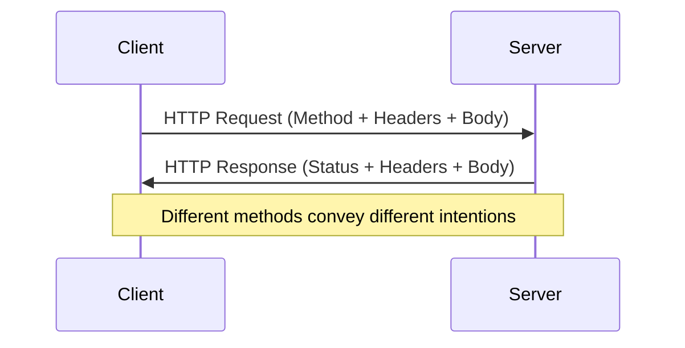
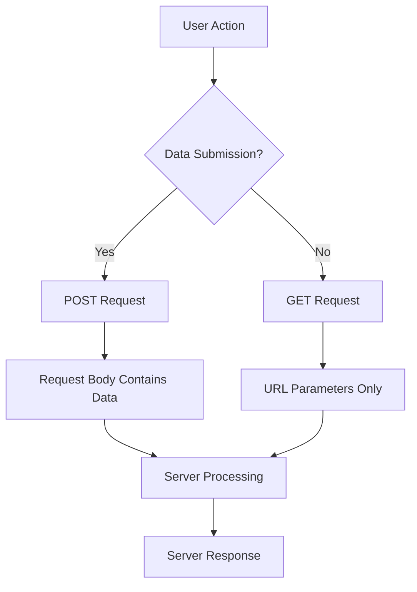
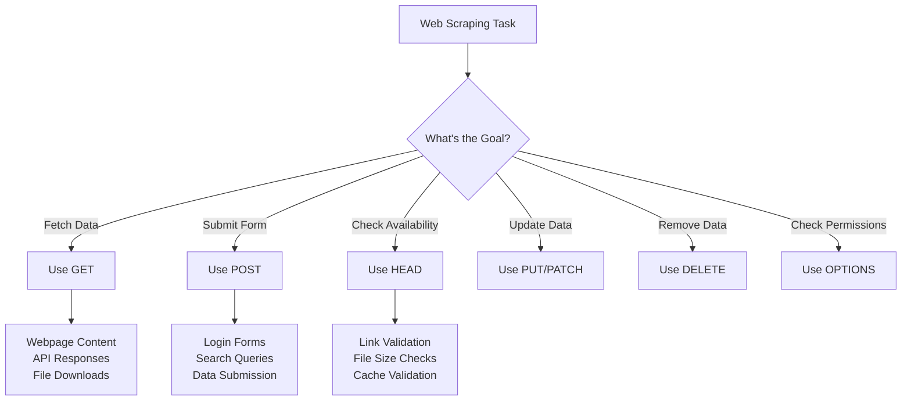

When you click a link, submit a form, or upload a file on a website, you're actually speaking a specific language that browsers and servers understand perfectly. This language consists of HTTP methods - standardized verbs that tell a web server exactly what action you want to perform. As a web scraper, understanding these methods is like learning the grammar of web communication.

Think of HTTP methods as different types of conversations you can have with a website. Just as you might ask a question differently than you'd make a statement, different web interactions require different HTTP methods. Each method carries specific meaning and expectations, and using the wrong one can lead to unexpected results or blocked requests.

## The Foundation: Understanding HTTP Communication

HTTP (Hypertext Transfer Protocol) operates on a simple request-response model. Your browser or scraping script acts as a client, sending requests to servers, which then respond with the requested data or confirmation of an action. The HTTP method is the first thing that tells the server what kind of interaction you're initiating.



Every HTTP request starts with a method, followed by the resource path, HTTP version, headers, and sometimes a body containing data. The method immediately signals to the server whether you're trying to retrieve information, submit data, update existing resources, or perform other operations.

## GET: The Information Gatherer

GET is the most common HTTP method you'll encounter in web scraping. It's designed for retrieving data without causing any changes on the server. When you visit a webpage, your browser typically sends a GET request to fetch the HTML, CSS, JavaScript, and images needed to display the page.

```python
import requests

# Simple GET request
response = requests.get('https://httpbin.org/get')
print(response.json())

# GET with parameters
params = {
    'page': 2,
    'limit': 50,
    'category': 'electronics'
}
response = requests.get('https://api.example.com/products', params=params)
```

GET requests append parameters to the URL as query strings, making them visible in browser history and server logs. This transparency is perfect for bookmarkable pages and cacheable resources, but it also means sensitive information shouldn't be sent via GET.

For web scrapers, GET requests are your primary tool for fetching webpage content, API data, and downloadable files. However, modern websites often implement anti-bot measures that specifically target repetitive GET requests, so you'll need to vary your approach with proper headers, delays, and rotation strategies.

## POST: The Data Submitter

POST requests are designed for sending data to servers, typically causing changes or triggering actions. Unlike GET requests, POST data travels in the request body rather than the URL, allowing for larger amounts of information and better security for sensitive data.

```python
import requests
import json

# Form data POST
form_data = {
    'username': 'testuser',
    'password': 'secretpass',
    'remember_me': 'true'
}
response = requests.post('https://example.com/login', data=form_data)

# JSON POST
json_data = {
    'name': 'New Product',
    'price': 29.99,
    'category_id': 5
}
response = requests.post('https://api.example.com/products', 
                        json=json_data,
                        headers={'Content-Type': 'application/json'})
```

In web scraping scenarios, you'll use POST requests when interacting with forms, submitting search queries, or working with APIs that require data submission. Many websites use POST for search functionality, pagination, or filtering operations, so your scraper needs to handle these interactions properly.



## PUT: The Complete Updater

PUT requests are designed for creating or completely replacing resources on the server. In RESTful APIs, PUT is idempotent, meaning multiple identical PUT requests should have the same effect as a single request.

```python
import requests

# Update entire user profile
user_data = {
    'id': 123,
    'name': 'John Doe',
    'email': 'john@example.com',
    'age': 30,
    'city': 'New York'
}
response = requests.put('https://api.example.com/users/123', json=user_data)
```

While less common in traditional web scraping, PUT becomes important when you're working with APIs that allow data modification or when building scrapers that also update remote systems with collected data.

## PATCH: The Selective Modifier

PATCH requests allow partial updates to resources, sending only the fields that need to change rather than the complete resource. This method is more bandwidth-efficient than PUT for small updates.

```python
import requests

# Update only specific fields
patch_data = {
    'status': 'active',
    'last_login': '2025-04-30T21:32:00Z'
}
response = requests.patch('https://api.example.com/users/123', json=patch_data)
```

## DELETE: The Remover

DELETE requests instruct the server to remove the specified resource. Like other modification methods, DELETE operations often require authentication and proper permissions.

```python
import requests

# Delete a specific resource
response = requests.delete('https://api.example.com/users/123')

# Delete with confirmation
headers = {'Authorization': 'Bearer your-token-here'}
response = requests.delete('https://api.example.com/posts/456', headers=headers)
```

## HEAD: The Metadata Checker

HEAD requests work exactly like GET requests but return only the response headers without the body content. This method is perfect for checking resource availability, getting file sizes, or validating cached content without downloading the entire resource.

```python
import requests

# Check if resource exists and get metadata
response = requests.head('https://example.com/large-file.zip')
print(f"Status: {response.status_code}")
print(f"Content-Length: {response.headers.get('Content-Length')}")
print(f"Last-Modified: {response.headers.get('Last-Modified')}")
```

HEAD requests are invaluable for scrapers that need to monitor changes, validate links, or optimize download operations by checking file sizes before committing to full downloads.

## OPTIONS: The Capability Explorer

OPTIONS requests ask the server what methods are allowed for a specific resource. This method is crucial for understanding CORS (Cross-Origin Resource Sharing) policies and API capabilities.

```python
import requests

response = requests.options('https://api.example.com/users')
allowed_methods = response.headers.get('Allow', '').split(', ')
print(f"Allowed methods: {allowed_methods}")
```

## Method Selection in Web Scraping Context



## Practical Implementation Strategies

When building robust web scrapers, understanding HTTP methods helps you interact with websites more naturally and avoid detection. Here's how different methods fit into common scraping scenarios:

**E-commerce Product Scraping:**
```python
import requests
from urllib.parse import urljoin

class ProductScraper:
    def __init__(self, base_url):
        self.base_url = base_url
        self.session = requests.Session()
    
    def search_products(self, query, filters=None):
        # Some sites use GET for search
        params = {'q': query}
        if filters:
            params.update(filters)
        return self.session.get(urljoin(self.base_url, '/search'), params=params)
    
    def advanced_search(self, search_data):
        # Complex searches often use POST
        return self.session.post(urljoin(self.base_url, '/search'), 
                                data=search_data)
    
    def check_product_availability(self, product_url):
        # Use HEAD to check without downloading full page
        return self.session.head(product_url)
```

**API Integration:**
```python
import requests

class APIClient:
    def __init__(self, api_base, auth_token):
        self.base_url = api_base
        self.session = requests.Session()
        self.session.headers.update({'Authorization': f'Bearer {auth_token}'})
    
    def get_data(self, endpoint, params=None):
        return self.session.get(f"{self.base_url}/{endpoint}", params=params)
    
    def create_record(self, endpoint, data):
        return self.session.post(f"{self.base_url}/{endpoint}", json=data)
    
    def update_record(self, endpoint, record_id, data):
        return self.session.put(f"{self.base_url}/{endpoint}/{record_id}", json=data)
    
    def partial_update(self, endpoint, record_id, changes):
        return self.session.patch(f"{self.base_url}/{endpoint}/{record_id}", json=changes)
```

## Method-Specific Anti-Bot Considerations

Different HTTP methods trigger different server-side behaviors and monitoring systems. Some websites implement stricter rate limiting on POST requests since they typically involve state changes. Others might flag unusual patterns like excessive HEAD requests as potential reconnaissance behavior.

Understanding these patterns helps you design scrapers that blend in with normal user behavior. For instance, a typical user session might involve several GET requests to browse pages, occasional POST requests for searches or form submissions, and very few PUT, DELETE, or PATCH requests.

## Browser Automation and HTTP Methods

When using tools like Playwright or Selenium, the browser handles HTTP method selection automatically based on user interactions. However, you can still intercept and modify these requests:

```python
from playwright.sync_api import sync_playwright

def intercept_requests(page):
    def handle_request(request):
        print(f"Method: {request.method}")
        print(f"URL: {request.url}")
        if request.method == "POST":
            print(f"POST Data: {request.post_data}")
    
    page.on("request", handle_request)

with sync_playwright() as p:
    browser = p.chromium.launch()
    page = browser.new_page()
    intercept_requests(page)
    page.goto("https://example.com")
    # User interactions will trigger various HTTP methods
```

The beauty of HTTP methods lies in their simplicity and universality. Every website, API, and web service speaks this same language, making it the foundation of all web communication. As you build more sophisticated scrapers, you'll find that understanding these methods isn't just about making requests work - it's about making them work efficiently, reliably, and indistinguishably from human behavior.

What's the most interesting HTTP method behavior you've encountered while scraping, and how did it change your approach to that particular site?