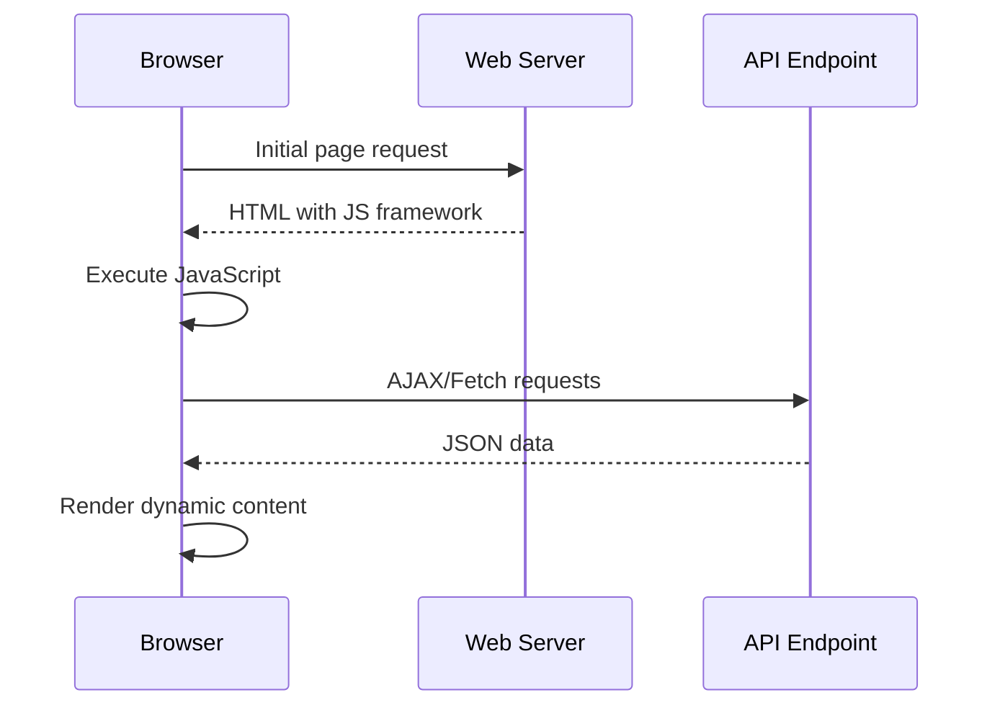
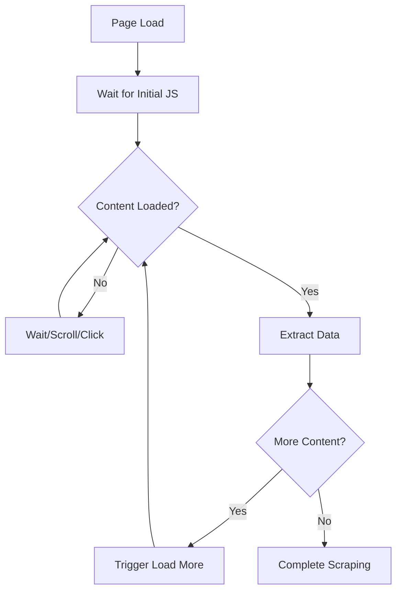
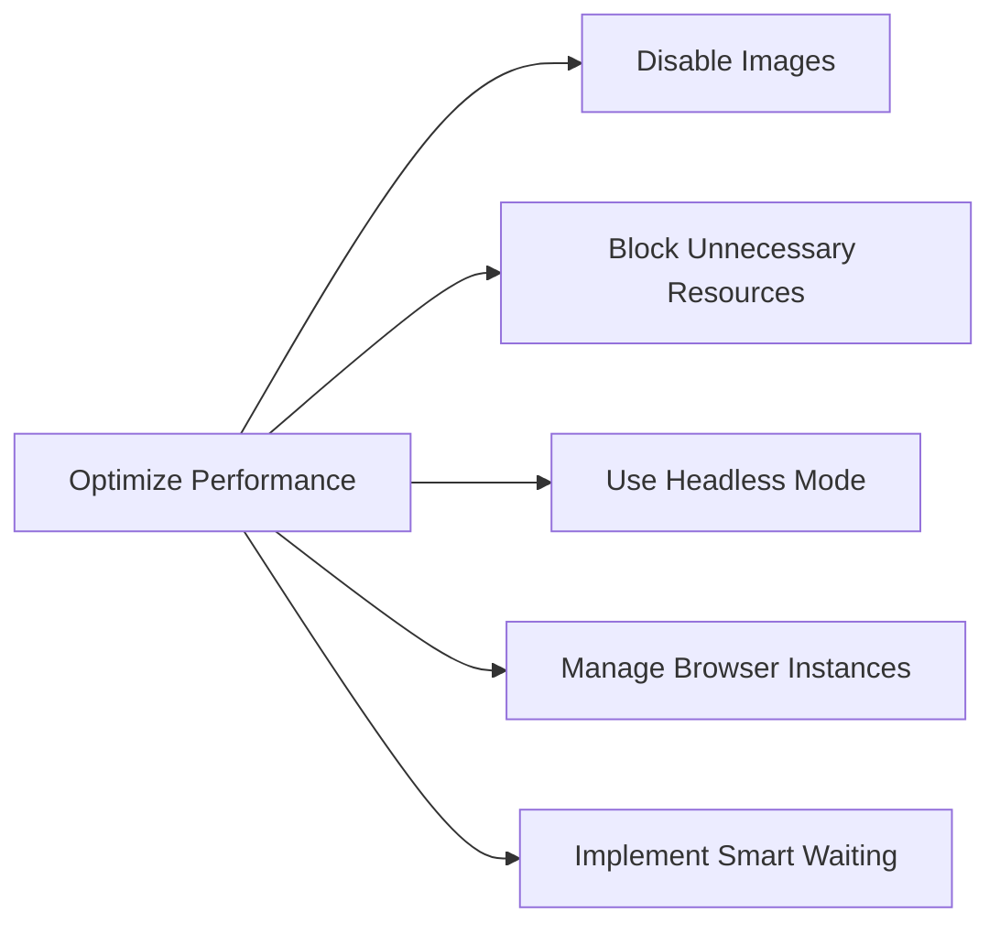

The web has evolved dramatically from static HTML pages to dynamic, interactive applications powered by JavaScript. Today's websites load content asynchronously, manipulate the DOM after initial page load, and create complex user experiences that traditional HTTP-based scraping simply cannot handle. This is where browser automation becomes not just useful, but essential.

When you encounter a website where content appears only after JavaScript execution, where data loads through AJAX calls, or where elements change based on user interactions, you're dealing with the reality of modern web development. Browser automation tools give you the power to handle these scenarios by controlling real browsers that execute JavaScript just like a human user's browser would.

## Understanding JavaScript-Heavy Websites

Modern web applications rely heavily on JavaScript frameworks like React, Vue.js, and Angular. These frameworks often render content client-side, meaning the initial HTML response contains minimal content, and the actual data appears only after JavaScript execution.



Consider this common scenario: you visit an e-commerce product listing page, and initially see loading spinners. Seconds later, product cards populate the page with images, prices, and descriptions. Traditional scraping would only capture those loading spinners, missing the actual product data entirely.

## The Limitations of Traditional Scraping

Traditional web scraping using libraries like `requests` in Python or `fetch` in JavaScript can only retrieve the initial HTML response from the server. Here's what happens when you try to scrape a JavaScript-heavy site:

```python
import requests
from bs4 import BeautifulSoup

# This approach fails with dynamic content
response = requests.get('https://example-spa.com/products')
soup = BeautifulSoup(response.content, 'html.parser')

# You'll likely find empty containers or loading messages
products = soup.find_all('.product-card')
print(f"Found {len(products)} products")  # Often returns 0
```

The HTML you receive might look like this:

```html
<div id="root">
  <div class="loading-spinner">Loading products...</div>
</div>
<script src="app.bundle.js"></script>
```

The actual product data exists in JavaScript variables or gets loaded via AJAX calls after the page renders, making it invisible to traditional scraping methods.

## Browser Automation to the Rescue

Browser automation tools solve this problem by providing programmatic control over real browsers. They can wait for JavaScript execution, handle AJAX requests, and interact with the fully rendered page. Let's explore how different tools tackle JavaScript-heavy sites.

### Playwright: The Modern Champion

Playwright excels at handling dynamic content with its robust waiting mechanisms and JavaScript execution capabilities:

```python
from playwright.sync_api import sync_playwright
import time

def scrape_dynamic_content():
    with sync_playwright() as p:
        # Launch browser
        browser = p.chromium.launch(headless=False)
        page = browser.new_page()
        
        # Navigate to the page
        page.goto('https://example-spa.com/products')
        
        # Wait for the dynamic content to load
        page.wait_for_selector('.product-card', timeout=10000)
        
        # Or wait for network to be idle
        page.wait_for_load_state('networkidle')
        
        # Now extract the data
        products = page.query_selector_all('.product-card')
        
        for product in products:
            title = product.query_selector('.product-title').inner_text()
            price = product.query_selector('.product-price').inner_text()
            print(f"Product: {title} - Price: {price}")
        
        browser.close()

scrape_dynamic_content()
```

### Selenium: The Veteran Approach

Selenium, while older, remains powerful for JavaScript handling:

```python
from selenium import webdriver
from selenium.webdriver.common.by import By
from selenium.webdriver.support.ui import WebDriverWait
from selenium.webdriver.support import expected_conditions as EC

def selenium_dynamic_scraping():
    driver = webdriver.Chrome()
    
    try:
        driver.get('https://example-spa.com/products')
        
        # Wait for elements to be present
        wait = WebDriverWait(driver, 10)
        products = wait.until(
            EC.presence_of_all_elements_located((By.CLASS_NAME, 'product-card'))
        )
        
        for product in products:
            title = product.find_element(By.CLASS_NAME, 'product-title').text
            price = product.find_element(By.CLASS_NAME, 'product-price').text
            print(f"Product: {title} - Price: {price}")
            
    finally:
        driver.quit()

selenium_dynamic_scraping()
```

## Advanced JavaScript Interaction Patterns

Modern websites often require more than just waiting for content to load. You might need to trigger JavaScript events, scroll to load more content, or interact with complex UI components.



### Infinite Scroll Handling

Many modern sites use infinite scroll patterns. Here's how to handle them:

```python
def scrape_infinite_scroll(page):
    page.goto('https://example.com/infinite-scroll')
    
    last_height = page.evaluate("document.body.scrollHeight")
    
    while True:
        # Scroll to bottom
        page.evaluate("window.scrollTo(0, document.body.scrollHeight)")
        
        # Wait for new content
        page.wait_for_timeout(2000)
        
        # Calculate new height
        new_height = page.evaluate("document.body.scrollHeight")
        
        if new_height == last_height:
            break  # No more content to load
            
        last_height = new_height
    
    # Now scrape all loaded content
    items = page.query_selector_all('.scroll-item')
    return [item.inner_text() for item in items]
```

### AJAX Request Interception

Sometimes you want to capture the data directly from AJAX requests rather than scraping the rendered DOM:

```python
def intercept_ajax_requests():
    with sync_playwright() as p:
        browser = p.chromium.launch()
        page = browser.new_page()
        
        # Store intercepted data
        api_responses = []
        
        def handle_response(response):
            if '/api/products' in response.url:
                api_responses.append(response.json())
        
        page.on('response', handle_response)
        
        # Navigate and trigger AJAX calls
        page.goto('https://example.com/products')
        page.wait_for_load_state('networkidle')
        
        # Process intercepted JSON data directly
        for response_data in api_responses:
            for product in response_data.get('products', []):
                print(f"Direct API data: {product['name']} - ${product['price']}")
        
        browser.close()
```

## Handling Complex JavaScript Frameworks

Different JavaScript frameworks present unique challenges and opportunities for scraping.

### Single Page Applications (SPAs)

SPAs often manage routing client-side, making navigation tricky:

```python
def navigate_spa_routes():
    with sync_playwright() as p:
        browser = p.chromium.launch()
        page = browser.new_page()
        
        # Initial load
        page.goto('https://spa-example.com')
        
        # Navigate using JavaScript routing
        page.click('a[href="/products"]')
        page.wait_for_url('**/products')
        
        # Wait for route-specific content
        page.wait_for_selector('[data-testid="product-list"]')
        
        # Extract data
        products = page.query_selector_all('.product')
        print(f"Found {len(products)} products")
        
        browser.close()
```

### React Component Interaction

React applications often require specific interaction patterns:

```javascript
// Execute JavaScript in the browser context
await page.evaluate(() => {
    // Trigger React component methods
    const component = document.querySelector('[data-react-component="ProductList"]');
    if (component && component._reactInternalInstance) {
        // Interact with React component directly
        component._reactInternalInstance.loadMoreProducts();
    }
});
```

## Performance Optimization for JavaScript-Heavy Sites

Browser automation can be resource-intensive. Here are strategies to optimize performance:



### Resource Blocking

```python
def optimized_scraping():
    with sync_playwright() as p:
        browser = p.chromium.launch(headless=True)
        context = browser.new_context()
        
        # Block unnecessary resources
        context.route("**/*.{png,jpg,jpeg,gif,svg,css}", lambda route: route.abort())
        
        page = context.new_page()
        
        # Disable JavaScript if not needed for specific requests
        # context.add_init_script("delete window.Image;")
        
        page.goto('https://example.com/products')
        
        # Your scraping logic here
        
        browser.close()
```

### Smart Waiting Strategies

Instead of using fixed timeouts, implement intelligent waiting:

```python
def smart_wait_for_content(page, selector, max_attempts=10):
    attempts = 0
    while attempts < max_attempts:
        try:
            element = page.wait_for_selector(selector, timeout=1000)
            if element and element.is_visible():
                return element
        except:
            pass
        
        attempts += 1
        # Check if page is still loading
        if page.evaluate("document.readyState") == "complete":
            break
    
    return None
```

## Debugging JavaScript Interactions

When things go wrong with JavaScript-heavy sites, debugging becomes crucial:

```python
def debug_javascript_execution(page):
    # Enable console logging
    page.on("console", lambda msg: print(f"Console: {msg.text}"))
    
    # Capture page errors
    page.on("pageerror", lambda error: print(f"Page error: {error}"))
    
    # Monitor network failures
    page.on("requestfailed", lambda request: 
        print(f"Failed request: {request.url} - {request.failure}"))
    
    # Take screenshots at key points
    page.screenshot(path="debug-before-interaction.png")
    
    # Your scraping logic here
    
    page.screenshot(path="debug-after-interaction.png")
```

## Real-World Example: E-commerce Product Scraping

Let's put it all together with a comprehensive example that handles a modern e-commerce site with dynamic loading, filtering, and pagination:

```python
class DynamicEcommerceScraper:
    def __init__(self):
        self.playwright = sync_playwright().start()
        self.browser = self.playwright.chromium.launch(headless=True)
        self.context = self.browser.new_context()
        
    def scrape_products(self, url, category=None, max_pages=5):
        page = self.context.new_page()
        products = []
        
        try:
            page.goto(url)
            
            # Apply category filter if specified
            if category:
                page.select_option('select[name="category"]', category)
                page.wait_for_load_state('networkidle')
            
            current_page = 1
            
            while current_page <= max_pages:
                # Wait for products to load
                page.wait_for_selector('.product-card', timeout=10000)
                
                # Extract products from current page
                page_products = self.extract_products(page)
                products.extend(page_products)
                
                # Try to go to next page
                next_button = page.query_selector('button[aria-label="Next page"]')
                if next_button and next_button.is_enabled():
                    next_button.click()
                    page.wait_for_load_state('networkidle')
                    current_page += 1
                else:
                    break
            
        finally:
            page.close()
        
        return products
    
    def extract_products(self, page):
        products = []
        product_elements = page.query_selector_all('.product-card')
        
        for element in product_elements:
            try:
                product = {
                    'title': element.query_selector('.product-title').inner_text(),
                    'price': element.query_selector('.product-price').inner_text(),
                    'rating': element.query_selector('.product-rating').get_attribute('data-rating'),
                    'availability': element.query_selector('.stock-status').inner_text(),
                    'image_url': element.query_selector('.product-image img').get_attribute('src')
                }
                products.append(product)
            except AttributeError:
                continue  # Skip malformed products
        
        return products
    
    def close(self):
        self.browser.close()
        self.playwright.stop()

# Usage
scraper = DynamicEcommerceScraper()
products = scraper.scrape_products('https://example-store.com/products', category='electronics')
print(f"Scraped {len(products)} products")
scraper.close()
```

Browser automation has fundamentally transformed how we approach data extraction from modern websites. The ability to execute JavaScript, wait for dynamic content, and interact with complex user interfaces opens up possibilities that traditional scraping methods simply cannot achieve.

The key to success lies in understanding not just how to use these tools, but when and why to use them. While browser automation provides powerful capabilities, it also comes with performance trade-offs that require careful consideration and optimization.

What's the most challenging JavaScript-heavy website you've encountered, and how would you approach scraping it with these browser automation techniques?