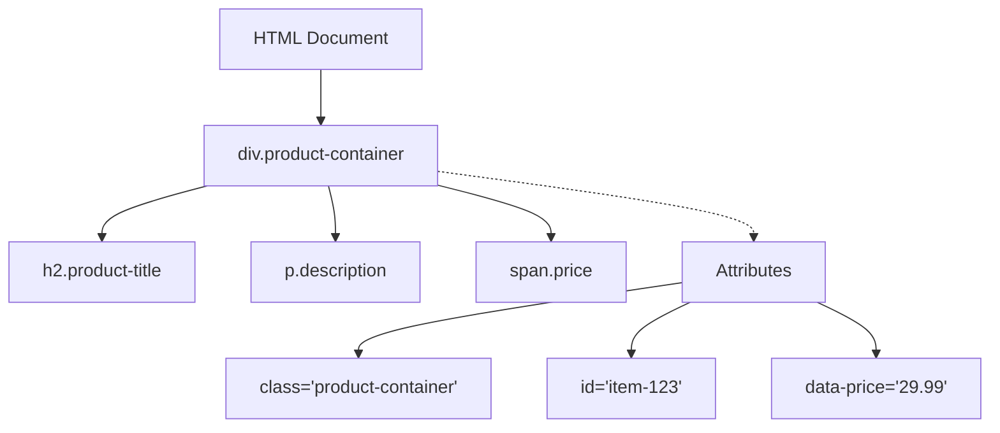
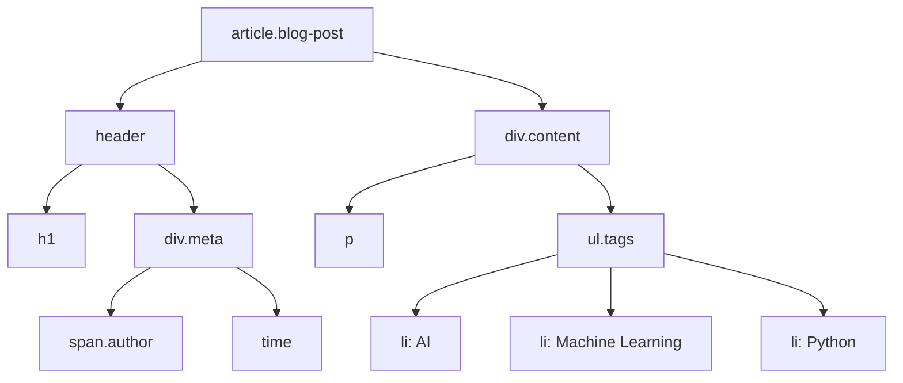
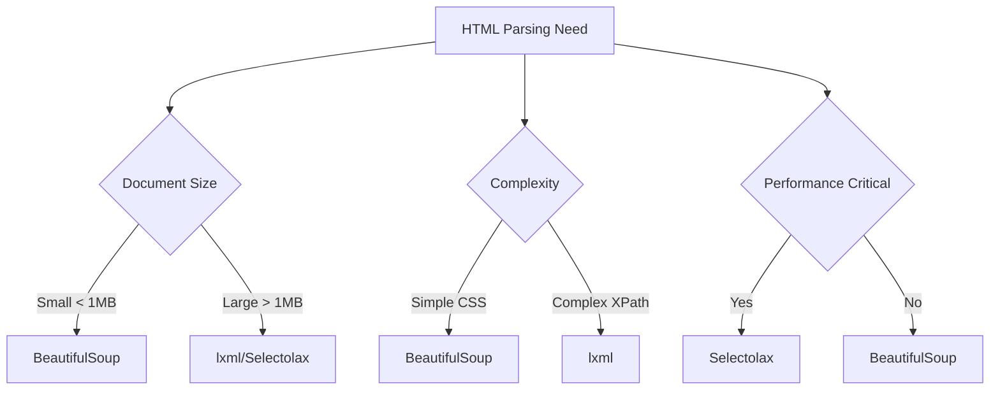

When you first dive into web scraping, HTML can feel like a foreign language filled with cryptic symbols and nested structures. But here's the truth: mastering HTML fundamentals is your gateway to becoming an efficient scraper. Every piece of data you want to extract lives within HTML elements, and understanding how to navigate this markup language will determine whether you spend minutes or hours trying to grab that elusive piece of information.

Think of HTML as the skeleton of every webpage you encounter. Just like a building's blueprint shows you where each room is located, HTML tags tell you exactly where each piece of content sits on a page. The difference between a frustrated beginner and a confident scraper often comes down to how well they can read this blueprint.

## The DNA of HTML: Elements, Tags, and Attributes

HTML operates on a simple yet powerful concept: everything is contained within tags. These tags act as containers that hold content and provide meaning to that content. When you see `<h1>Welcome to My Site</h1>`, you're looking at an opening tag, content, and a closing tag working together to create a complete element.

```html
<div class="product-container" id="item-123" data-price="29.99">
    <h2 class="product-title">Wireless Headphones</h2>
    <p class="description">Premium sound quality with noise cancellation</p>
    <span class="price">$29.99</span>
</div>
```

This simple structure contains goldmines of information. The `div` acts as a container, while attributes like `class`, `id`, and `data-price` provide multiple ways to target this exact element. When scraping, you might target the class `product-title` to grab all product names, or use the `data-price` attribute to extract pricing information directly.



## The Hierarchy Game: Understanding DOM Structure

The Document Object Model (DOM) represents HTML as a tree structure where every element has a parent, and many elements have children. This hierarchical relationship is crucial for scrapers because it determines how you navigate from one piece of data to another.

```html
<article class="blog-post">
    <header>
        <h1>How to Train Your AI Model</h1>
        <div class="meta">
            <span class="author">Jane Smith</span>
            <time datetime="2025-05-01">May 1, 2025</time>
        </div>
    </header>
    <div class="content">
        <p>Machine learning has revolutionized...</p>
        <ul class="tags">
            <li>AI</li>
            <li>Machine Learning</li>
            <li>Python</li>
        </ul>
    </div>
</article>
```

In this structure, the `article` element is the parent of `header` and `div.content`. The `header` contains `h1` and `div.meta` as its children. Understanding these relationships helps you write more precise selectors and navigate complex page structures.



## CSS Selectors: Your Navigation Compass

CSS selectors provide an intuitive way to target HTML elements. They're often the first tool scrapers reach for because they mirror how web developers style pages. Let's explore the most powerful selector patterns for scraping.

**Basic Selectors:**
- `h1` - Targets all h1 elements
- `.product-title` - Targets elements with class "product-title"
- `#main-content` - Targets element with id "main-content"

**Combination Selectors:**
```python
# Using BeautifulSoup with CSS selectors
from bs4 import BeautifulSoup

html = """
<div class="product-grid">
    <div class="product" data-category="electronics">
        <h3>Laptop</h3>
        <span class="price">$999</span>
    </div>
    <div class="product" data-category="books">
        <h3>Python Guide</h3>
        <span class="price">$29</span>
    </div>
</div>
"""

soup = BeautifulSoup(html, 'html.parser')

# Target specific combinations
electronics = soup.select('.product[data-category="electronics"] h3')
all_prices = soup.select('.product .price')
first_product = soup.select_one('.product:first-child h3')

print([item.text for item in electronics])  # ['Laptop']
print([price.text for price in all_prices])  # ['$999', '$29']
print(first_product.text if first_product else None)  # 'Laptop'
```

**Advanced Selector Patterns:**
- `.parent > .direct-child` - Direct child selector
- `.ancestor .descendant` - Any descendant selector  
- `input[type="email"]` - Attribute selector
- `li:nth-child(2)` - Positional selector
- `p:contains("keyword")` - Content-based selector (in some libraries)

## XPath: The Power Tool for Complex Navigation

When CSS selectors hit their limits, XPath steps in as the Swiss Army knife of HTML navigation. XPath uses path-like syntax similar to file system navigation, but with much more power for complex queries.

```python
from lxml import html

html_content = """
<table class="data-table">
    <tr>
        <th>Name</th>
        <th>Role</th>
        <th>Salary</th>
    </tr>
    <tr>
        <td>Alice Johnson</td>
        <td>Developer</td>
        <td>$75,000</td>
    </tr>
    <tr>
        <td>Bob Smith</td>
        <td>Designer</td>
        <td>$65,000</td>
    </tr>
</table>
"""

tree = html.fromstring(html_content)

# XPath examples
all_names = tree.xpath('//td[1]/text()')  # First column (names)
developer_salary = tree.xpath('//tr[td[2]="Developer"]/td[3]/text()')
all_salaries = tree.xpath('//tr[position()>1]/td[3]/text()')

print("Names:", all_names)  # ['Alice Johnson', 'Bob Smith']
print("Developer salary:", developer_salary)  # ['$75,000']
print("All salaries:", all_salaries)  # ['$75,000', '$65,000']
```

**Essential XPath Patterns:**
- `//div` - All div elements anywhere
- `/html/body/div` - Absolute path from root
- `//div[@class="container"]` - Elements with specific attribute
- `//div[contains(@class, "product")]` - Partial attribute matching
- `//span[text()="Total"]` - Elements with exact text
- `//div[contains(text(), "Sale")]` - Elements containing text
- `//tr[position()>1]` - Skip header row
- `//div[@class="item"]/following-sibling::div` - Next sibling elements

```mermaid
flowchart TD
    A[XPath Query]
    A --> B{Element Type}

    B -->|Tag| C[//div]
    B -->|Class| D[//div[@class='item']]
    B -->|Text| E[//span[text()='Total']]
    B -->|Position| F[//tr[position()>1]]

    G[Navigation]
    G --> H[Child: /child]
    G --> I[Descendant: //descendant]
    G --> J[Following: /following-sibling]
    G --> K[Parent: /parent::*]
```

## Common HTML Patterns and Anti-Patterns

Real-world websites often follow predictable patterns that you can exploit for efficient scraping. Recognizing these patterns helps you write more robust scrapers that work across similar sites.

**List Patterns:**
```html
<!-- Pattern: Repeated items in containers -->
<div class="search-results">
    <div class="result-item">
        <h3 class="title">Result 1</h3>
        <p class="snippet">Description...</p>
    </div>
    <div class="result-item">
        <h3 class="title">Result 2</h3>
        <p class="snippet">Description...</p>
    </div>
</div>
```

**Table Patterns:**
```html
<!-- Pattern: Structured data in rows -->
<table class="financial-data">
    <thead>
        <tr><th>Quarter</th><th>Revenue</th><th>Growth</th></tr>
    </thead>
    <tbody>
        <tr><td>Q1 2025</td><td>$2.1M</td><td>+15%</td></tr>
        <tr><td>Q2 2025</td><td>$2.4M</td><td>+12%</td></tr>
    </tbody>
</table>
```

**Card/Grid Patterns:**
```html
<!-- Pattern: Product or content cards -->
<div class="product-grid">
    <article class="product-card">
        
        <h4>Product Name</h4>
        <span class="price">$99</span>
        <button class="add-to-cart" data-id="123">Add to Cart</button>
    </article>
</div>
```

## Handling Dynamic Content and Modern Challenges

Modern websites increasingly use JavaScript to load content dynamically, creating challenges for traditional HTML parsing. Understanding how to identify and work with these patterns is essential for contemporary scraping.

```python
# Example: Detecting placeholder content
from bs4 import BeautifulSoup
import requests

def check_for_dynamic_content(soup):
    # Common indicators of dynamic content
    indicators = [
        soup.find(attrs={'class': lambda x: x and 'loading' in x.lower()}),
        soup.find(attrs={'class': lambda x: x and 'skeleton' in x.lower()}),
        soup.find('div', {'data-react-component': True}),
        soup.find('script', string=lambda x: x and 'window.__INITIAL_STATE__' in x)
    ]
    
    return any(indicators)

# Check for JSON data in script tags
def extract_json_data(soup):
    scripts = soup.find_all('script', type='application/json')
    json_data = []
    
    for script in scripts:
        try:
            import json
            data = json.loads(script.string)
            json_data.append(data)
        except json.JSONDecodeError:
            continue
            
    return json_data
```

**Common Dynamic Content Patterns:**
- Loading spinners with class names like `loading`, `spinner`, `skeleton`
- Empty containers with `data-` attributes that get populated by JavaScript
- Script tags containing JSON data for hydration
- React/Vue component mount points

## Practical Scraping Strategies

Armed with HTML knowledge, you can develop systematic approaches to tackle any scraping target. Here's a methodology that works across different site types:

```python
def analyze_page_structure(url):
    """
    Systematic approach to understanding a page's HTML structure
    """
    from requests import get
    from bs4 import BeautifulSoup
    
    response = get(url)
    soup = BeautifulSoup(response.content, 'html.parser')
    
    # Step 1: Identify the main content container
    main_containers = soup.find_all(['main', 'article', 'section'])
    content_divs = soup.find_all('div', class_=lambda x: x and any(
        keyword in x.lower() for keyword in ['content', 'main', 'body', 'wrapper']
    ))
    
    # Step 2: Look for repeated patterns
    all_classes = []
    for element in soup.find_all(class_=True):
        all_classes.extend(element.get('class'))
    
    from collections import Counter
    common_classes = Counter(all_classes).most_common(10)
    
    # Step 3: Identify data-rich elements
    data_elements = soup.find_all(attrs={'data-': True})
    
    return {
        'main_containers': len(main_containers),
        'content_areas': len(content_divs),
        'common_classes': common_classes,
        'data_attributes': len(data_elements)
    }
```

## Tools and Libraries for HTML Parsing

Different scraping scenarios call for different parsing tools. Here's when to use each major option:

**BeautifulSoup** - Best for beginners and simple parsing:
```python
from bs4 import BeautifulSoup

# Flexible and forgiving parser
soup = BeautifulSoup(html_content, 'html.parser')
titles = soup.find_all('h2', class_='title')
```

**lxml** - Best for performance and XPath support:
```python
from lxml import html, etree

# Fast and powerful
tree = html.fromstring(html_content)
prices = tree.xpath('//span[@class="price"]/text()')
```

**Selectolax** - Best for speed with large documents:
```python
from selectolax.parser import HTMLParser

# Extremely fast for simple selections
tree = HTMLParser(html_content)
products = tree.css('.product-item')
```

The key is matching your tool choice to your specific needs. For learning and prototyping, BeautifulSoup's readable syntax wins. For production scrapers processing thousands of pages, lxml or selectolax provide the speed you need.



Understanding HTML isn't just about memorizing tag names and attributes—it's about developing an intuition for how content is structured and how to efficiently extract what you need. The patterns you learn from one site often apply to hundreds of others, making each scraping project faster than the last.

What's the most complex HTML structure you've encountered in your scraping adventures, and how did you approach breaking it down into manageable pieces?