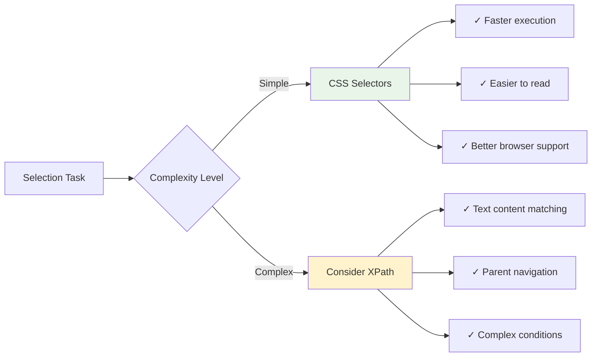

When you're staring at a webpage trying to extract specific data, CSS selectors are your precision instruments. Think of them as surgical tools that can pinpoint exactly the element you need from thousands of HTML elements. Whether you're scraping product prices, extracting article titles, or gathering user comments, mastering CSS selectors will transform your web scraping efficiency.

CSS selectors aren't just for styling websites – they're incredibly powerful for data extraction. Every modern web scraping library supports them, making this knowledge transferable across different tools and programming languages.

## The Building Blocks of Selection

CSS selectors follow a hierarchy-based approach, much like how you'd give directions to find something in a building. You can be as general as "the building" or as specific as "room 204 on the second floor."

Let's start with the most basic selectors:

**Element Selectors** target HTML tags directly:
```css
div        /* All div elements */
p          /* All paragraph elements */
span       /* All span elements */
```

**Class Selectors** use the dot notation:
```css
.product-title     /* Elements with class="product-title" */
.btn-primary       /* Elements with class="btn-primary" */
```

**ID Selectors** use the hash symbol:
```css
#main-content      /* Element with id="main-content" */
#search-box        /* Element with id="search-box" */
```

Here's how these look in practice with Python and BeautifulSoup:

```python
from bs4 import BeautifulSoup
import requests

# Sample HTML structure
html = """
<div class="container">
    <h1 id="main-title">Product Gallery</h1>
    <div class="product-card">
        <h3 class="product-name">Wireless Headphones</h3>
        <span class="price">$99.99</span>
    </div>
    <div class="product-card">
        <h3 class="product-name">Bluetooth Speaker</h3>
        <span class="price">$49.99</span>
    </div>
</div>
"""

soup = BeautifulSoup(html, 'html.parser')

# Extract all product names
product_names = soup.select('.product-name')
for name in product_names:
    print(name.get_text())

# Extract the main title
main_title = soup.select('#main-title')[0].get_text()
print(main_title)

# Extract all prices
prices = soup.select('.price')
for price in prices:
    print(price.get_text())
```

## Advanced Selection Strategies

The real power of CSS selectors emerges when you combine them. This is where precision meets flexibility.

**Descendant Selectors** help you navigate parent-child relationships:
```css
.container .product-name    /* product-name inside container */
div p                       /* paragraphs inside divs */
```

**Child Selectors** are more restrictive, targeting direct children only:
```css
.product-card > .price     /* price that's a direct child of product-card */
ul > li                    /* list items that are direct children of ul */
```

**Attribute Selectors** unlock powerful targeting based on element attributes:
```css
[data-price]               /* Elements with data-price attribute */
[href^="https://"]         /* Links starting with https:// */
[src$=".jpg"]             /* Images ending with .jpg */
[class*="product"]        /* Elements with 'product' anywhere in class */
```

Here's a practical example scraping e-commerce data:

```python
# Advanced selector example for product scraping
html_ecommerce = """
<div class="products-grid">
    <article class="product-item" data-category="electronics">
        
        <h3 class="title">Premium Headphones</h3>
        <div class="pricing">
            <span class="current-price">$79.99</span>
            <span class="old-price">$99.99</span>
        </div>
        <a href="/product/123" class="btn-buy">Buy Now</a>
    </article>
    <article class="product-item" data-category="books">
        
        <h3 class="title">Python Web Scraping Guide</h3>
        <div class="pricing">
            <span class="current-price">$29.99</span>
        </div>
        <a href="/product/456" class="btn-buy">Buy Now</a>
    </article>
</div>
"""

soup = BeautifulSoup(html_ecommerce, 'html.parser')

# Extract electronics products only
electronics = soup.select('[data-category="electronics"] .title')
for item in electronics:
    print(f"Electronics: {item.get_text()}")

# Get products with discounts (having old-price)
discounted_products = soup.select('.product-item:has(.old-price) .title')
for product in discounted_products:
    print(f"On Sale: {product.get_text()}")

# Extract all current prices with their corresponding titles
for product in soup.select('.product-item'):
    title = product.select_one('.title').get_text()
    price = product.select_one('.current-price').get_text()
    print(f"{title}: {price}")
```

## Pseudo-Selectors for Complex Targeting

Pseudo-selectors add another layer of precision, allowing you to target elements based on their position, state, or content.

**Positional Pseudo-selectors:**
```css
:first-child          /* First child element */
:last-child           /* Last child element */
:nth-child(2)         /* Second child element */
:nth-child(odd)       /* Odd-numbered children */
:nth-child(3n+1)      /* Every third element starting from 1st */
```

**Content-based Pseudo-selectors:**
```css
:empty                /* Empty elements */
:not(.excluded)       /* Elements without 'excluded' class */
:contains("text")     /* Elements containing specific text */
```

```mermaid
graph TD
    A[HTML Document] --> B[.container]
    B --> C[.product-item:first-child]
    B --> D[.product-item:nth-child(2)]
    B --> E[.product-item:last-child]
    
    C --> C1[.title]
    C --> C2[.price]
    C --> C3[.btn-buy]
    
    D --> D1[.title]
    D --> D2[.price]
    D --> D3[.btn-buy]
    
    E --> E1[.title]
    E --> E2[.price]
    E --> E3[.btn-buy]
    
    style C fill:#e1f5fe
    style D fill:#f3e5f5
    style E fill:#e8f5e8
```

Here's how to leverage these for complex data extraction:

```python
# Scraping table data with positional selectors
table_html = """
<table class="data-table">
    <tr>
        <th>Product</th>
        <th>Price</th>
        <th>Stock</th>
    </tr>
    <tr>
        <td>Laptop</td>
        <td>$999</td>
        <td>5</td>
    </tr>
    <tr>
        <td>Mouse</td>
        <td>$25</td>
        <td>0</td>
    </tr>
    <tr>
        <td>Keyboard</td>
        <td>$75</td>
        <td>12</td>
    </tr>
</table>
"""

soup = BeautifulSoup(table_html, 'html.parser')

# Skip header row and extract data
data_rows = soup.select('tr:not(:first-child)')
for row in data_rows:
    cells = row.select('td')
    product = cells[0].get_text()
    price = cells[1].get_text()
    stock = int(cells[2].get_text())
    
    # Only show in-stock items
    if stock > 0:
        print(f"{product}: {price} ({stock} in stock)")

# Get the last product in the table
last_product = soup.select('tr:last-child td:first-child')[0].get_text()
print(f"Last product: {last_product}")
```

## Combining Selectors for Maximum Precision

The true art of CSS selectors lies in combining different strategies to create highly specific targeting rules.

```python
# Complex selector combinations
complex_html = """
<div class="content">
    <article class="blog-post published" data-category="tutorial">
        <header>
            <h2 class="post-title">Getting Started with Web Scraping</h2>
            <div class="meta">
                <span class="author">John Doe</span>
                <time class="date">2025-05-01</time>
            </div>
        </header>
        <div class="post-content">
            <p>This is the first paragraph...</p>
            <p>This is the second paragraph...</p>
        </div>
        <footer>
            <div class="tags">
                <span class="tag">python</span>
                <span class="tag">scraping</span>
            </div>
        </footer>
    </article>
</div>
"""

soup = BeautifulSoup(complex_html, 'html.parser')

# Multiple criteria selection
published_tutorials = soup.select('article.published[data-category="tutorial"]')
for post in published_tutorials:
    title = post.select_one('header .post-title').get_text()
    author = post.select_one('.meta .author').get_text()
    tags = [tag.get_text() for tag in post.select('footer .tag')]
    
    print(f"Title: {title}")
    print(f"Author: {author}")
    print(f"Tags: {', '.join(tags)}")
```

## Performance Considerations and Best Practices

When working with CSS selectors in web scraping, efficiency matters. Here are optimization strategies:

**Specific over General:** Use the most specific selector possible to minimize DOM traversal.

```python
# Less efficient
titles = soup.select('div div div .title')

# More efficient
titles = soup.select('.product-grid .product-item .title')
```

**Cache Complex Selections:** If you're using the same complex selector multiple times, cache the results.

```python
# Cache frequently used selections
product_containers = soup.select('.product-item')
for container in product_containers:
    title = container.select_one('.title').get_text()
    price = container.select_one('.price').get_text()
    # Process each item
```

## CSS Selectors vs XPath: When to Use What

While CSS selectors are intuitive and widely supported, XPath offers more power for complex document traversal.



Use CSS selectors when:
- Targeting elements by class, ID, or simple attributes
- Working with modern web scraping libraries
- Prioritizing readability and maintainability
- Processing simple to moderately complex document structures

Consider XPath when:
- You need to select based on text content
- Navigating from child to parent elements
- Implementing complex conditional logic
- Working with XML documents

## Debugging Your Selectors

Browser developer tools are invaluable for testing and refining your CSS selectors:

1. **Chrome DevTools:** Use `Ctrl+Shift+C` to inspect elements, then test selectors in the Console with `document.querySelectorAll('your-selector')`

2. **Selector Validation:** Before implementing in your scraper, validate selectors in the browser console:

```javascript
// Test in browser console
document.querySelectorAll('.product-item .price').length
// Returns count of matching elements
```

3. **Dynamic Content Considerations:** Remember that CSS selectors work on the static DOM. For JavaScript-generated content, ensure your scraper waits for content to load:

```python
from selenium import webdriver
from selenium.webdriver.common.by import By
from selenium.webdriver.support.ui import WebDriverWait
from selenium.webdriver.support import expected_conditions as EC

driver = webdriver.Chrome()
driver.get('https://example.com')

# Wait for specific elements to load
wait = WebDriverWait(driver, 10)
products = wait.until(EC.presence_of_all_elements_located((By.CSS_SELECTOR, '.product-item')))
```

## Real-World Selector Patterns

Different websites use common patterns. Here are selector strategies for typical scenarios:

**E-commerce Sites:**
```python
# Common e-commerce selectors
prices = soup.select('[class*="price"]:not([class*="old"]):not([class*="original"])')
product_names = soup.select('h1, h2, h3, [class*="title"], [class*="name"]')
ratings = soup.select('[class*="rating"], [class*="star"]')
```

**News Sites:**
```python
# News content selectors
headlines = soup.select('h1, h2, [class*="headline"], [class*="title"]')
article_bodies = soup.select('article, [class*="content"], [class*="body"]')
publish_dates = soup.select('time, [class*="date"], [class*="published"]')
```

**Social Media:**
```python
# Social media post selectors
posts = soup.select('[data-testid*="post"], [class*="post"], article')
usernames = soup.select('[class*="username"], [class*="user"], [data-testid*="user"]')
content = soup.select('[class*="content"], [class*="text"], p')
```

CSS selectors are the foundation of precise data extraction. They bridge the gap between the chaos of HTML documents and the structured data you need. As you develop your scraping skills, you'll find that well-crafted selectors can make the difference between a fragile scraper that breaks with minor site changes and a robust extraction system that adapts gracefully.

The key is practice and understanding the document structure you're working with. Each website has its patterns, and recognizing these patterns will make you more effective at crafting the perfect selector.

What's the most complex CSS selector challenge you've encountered in your scraping projects? Have you found patterns that consistently work across different types of websites?