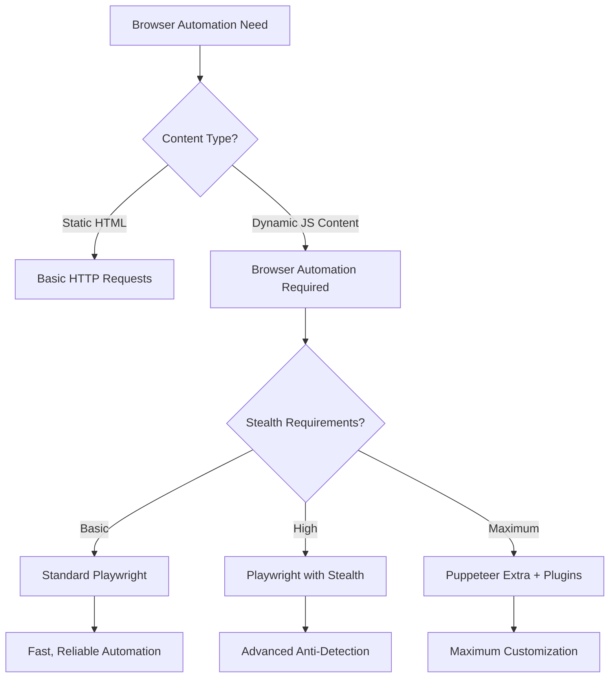
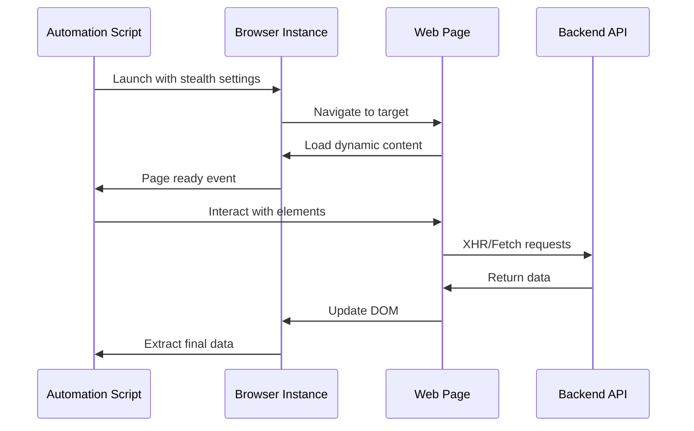
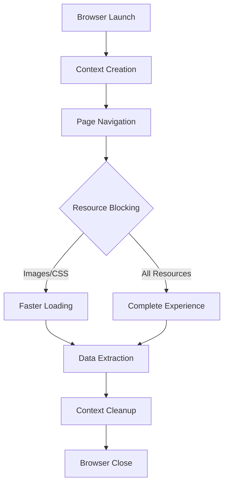

When basic HTTP requests aren't enough to handle modern web applications, browser automation tools like Playwright and Puppeteer become essential. While standard Puppeteer offers excellent browser control capabilities, Puppeteer Extra takes it several steps further with its plugin ecosystem. Meanwhile, Playwright has emerged as a serious competitor with built-in features that rival many third-party plugins.

Both tools excel at handling dynamic content, JavaScript-heavy applications, and complex user interactions. However, choosing between them—and understanding when to use Puppeteer Extra over standard Puppeteer—can significantly impact your scraping success rate and detection avoidance.

## Understanding the Modern Browser Automation Landscape

Browser automation has evolved from simple page navigation tools to sophisticated frameworks capable of handling the most complex web applications. The key distinction lies in their approach to browser control and the ecosystems they've built around extensibility.



Playwright brings enterprise-grade reliability with built-in features that previously required third-party plugins. Its cross-browser support includes Chromium, Firefox, and WebKit, making it ideal for testing and scraping across different browser engines.

Puppeteer Extra, on the other hand, extends Puppeteer's capabilities through a rich plugin ecosystem. The `puppeteer-extra-plugin-stealth` alone provides over a dozen evasion techniques, while `puppeteer-extra-plugin-adblocker` can speed up page loads by blocking unwanted content.

## Setting Up Advanced Browser Control

Getting started with either framework requires understanding their unique setup processes and capabilities.

### Playwright Configuration

Playwright's strength lies in its comprehensive built-in features and excellent documentation:

```javascript
const { chromium, firefox, webkit } = require('playwright');

// Advanced browser context with custom settings
const browser = await chromium.launch({
  headless: false,
  args: [
    '--no-sandbox',
    '--disable-blink-features=AutomationControlled',
    '--disable-dev-shm-usage'
  ]
});

const context = await browser.newContext({
  userAgent: 'Mozilla/5.0 (Windows NT 10.0; Win64; x64) AppleWebKit/537.36',
  viewport: { width: 1920, height: 1080 },
  locale: 'en-US',
  permissions: ['geolocation'],
  geolocation: { longitude: -74.006, latitude: 40.7128 }
});

const page = await context.newPage();
```

Playwright's context isolation means each browser context operates independently, sharing no cookies, storage, or cache. This isolation is perfect for running multiple scraping sessions simultaneously.

### Puppeteer Extra Setup

Puppeteer Extra's plugin architecture allows you to compose exactly the functionality you need:

```javascript
const puppeteer = require('puppeteer-extra');
const StealthPlugin = require('puppeteer-extra-plugin-stealth');
const AdblockerPlugin = require('puppeteer-extra-plugin-adblocker');
const UserAgentOverride = require('puppeteer-extra-plugin-user-agent-override');

// Add stealth plugin with custom evasions
puppeteer.use(
  StealthPlugin({
    enabledEvasions: new Set([
      'chrome.app',
      'chrome.csi',
      'chrome.loadTimes',
      'chrome.runtime',
      'defaultArgs',
      'iframe.contentWindow',
      'media.codecs',
      'navigator.hardwareConcurrency',
      'navigator.languages',
      'navigator.permissions',
      'navigator.plugins',
      'navigator.webdriver',
      'sourceurl',
      'user-agent-override',
      'webgl.vendor',
      'window.outerdimensions'
    ])
  })
);

// Add adblocker for faster page loads
puppeteer.use(AdblockerPlugin({ blockTrackers: true }));

// Rotate user agents
puppeteer.use(UserAgentOverride({
  userAgent: 'Mozilla/5.0 (Macintosh; Intel Mac OS X 10_15_7) AppleWebKit/537.36'
}));

const browser = await puppeteer.launch({
  headless: false,
  devtools: false
});
```

## Handling Complex Interactions

Modern web applications often require sophisticated interaction patterns that go beyond simple page navigation.



### Advanced Element Interaction

Both frameworks excel at handling complex element interactions, but their approaches differ:

```javascript
// Playwright approach - built-in waiting and retry logic
await page.locator('button[data-testid="load-more"]').click();
await page.waitForLoadState('networkidle');

// Handle shadow DOM elements
const shadowHost = await page.locator('#shadow-host');
const shadowContent = await shadowHost.evaluate(el => el.shadowRoot.querySelector('.content'));

// Puppeteer Extra approach - more granular control
await page.waitForSelector('button[data-testid="load-more"]', { 
  visible: true,
  timeout: 10000 
});

await page.evaluate(() => {
  document.querySelector('button[data-testid="load-more"]').click();
});

// Wait for network activity to settle
await page.waitForTimeout(2000);
await page.waitForFunction(() => {
  return document.querySelectorAll('.item').length > 10;
});
```

### Managing Asynchronous Content

Modern web applications heavily rely on asynchronous content loading. Both frameworks provide mechanisms to handle this, but with different philosophies:

```javascript
// Playwright - declarative waiting
await page.goto('https://example.com/dynamic-content');
await page.locator('.dynamic-content').waitFor({ state: 'visible' });

// Wait for specific network responses
const responsePromise = page.waitForResponse(resp => 
  resp.url().includes('/api/data') && resp.status() === 200
);
await page.click('#load-data');
const response = await responsePromise;
const data = await response.json();

// Puppeteer Extra - imperative control
await page.goto('https://example.com/dynamic-content');
await page.waitForSelector('.dynamic-content', { visible: true });

// Intercept and modify requests
await page.setRequestInterception(true);
page.on('request', (req) => {
  if (req.url().includes('/api/data')) {
    req.respond({
      status: 200,
      contentType: 'application/json',
      body: JSON.stringify({ modified: true })
    });
  } else {
    req.continue();
  }
});
```

## Anti-Detection Strategies

The cat-and-mouse game between scrapers and anti-bot systems requires sophisticated evasion techniques.

### Playwright's Built-in Stealth

Playwright includes many anti-detection features out of the box:

```javascript
const context = await browser.newContext({
  userAgent: 'Mozilla/5.0 (Windows NT 10.0; Win64; x64) AppleWebKit/537.36',
  extraHTTPHeaders: {
    'Accept-Language': 'en-US,en;q=0.9',
    'Accept-Encoding': 'gzip, deflate, br',
    'Accept': 'text/html,application/xhtml+xml,application/xml;q=0.9,*/*;q=0.8'
  }
});

// Remove automation indicators
await context.addInitScript(() => {
  Object.defineProperty(navigator, 'webdriver', { get: () => undefined });
  window.chrome = { runtime: {} };
});
```

### Puppeteer Extra's Advanced Evasions

The stealth plugin provides comprehensive evasion capabilities:

```javascript
// Custom evasion for specific detection methods
puppeteer.use(
  StealthPlugin({
    enabledEvasions: new Set([
      'navigator.webdriver',
      'chrome.runtime',
      'window.outerdimensions'
    ])
  })
);

// Additional manual evasions
const page = await browser.newPage();
await page.evaluateOnNewDocument(() => {
  // Override the plugins array
  Object.defineProperty(navigator, 'plugins', {
    get: () => [1, 2, 3, 4, 5]
  });
  
  // Add WebGL fingerprint randomization
  const getParameter = WebGLRenderingContext.prototype.getParameter;
  WebGLRenderingContext.prototype.getParameter = function(parameter) {
    if (parameter === 37445) {
      return 'Intel Inc.';
    }
    if (parameter === 37446) {
      return 'Intel Iris OpenGL Engine';
    }
    return getParameter.apply(this, arguments);
  };
});
```

## Performance Optimization and Resource Management

Efficient browser automation requires careful resource management and performance optimization.



### Resource Blocking and Performance

```javascript
// Playwright resource blocking
await context.route('**/*.{png,jpg,jpeg,gif,css}', route => route.abort());

// Puppeteer Extra with adblocker plugin
puppeteer.use(AdblockerPlugin({
  blockTrackers: true,
  blockTrackersAndAnnoyances: true,
  useCache: true
}));

// Manual resource blocking in Puppeteer
await page.setRequestInterception(true);
page.on('request', (req) => {
  const resourceType = req.resourceType();
  if (['image', 'stylesheet', 'font'].includes(resourceType)) {
    req.abort();
  } else {
    req.continue();
  }
});
```

### Memory Management

```javascript
// Playwright context cleanup
for (let i = 0; i < 100; i++) {
  const context = await browser.newContext();
  const page = await context.newPage();
  // ... scraping logic
  await context.close(); // Important: clean up contexts
}

// Puppeteer page recycling
const pages = [];
for (let i = 0; i < 5; i++) {
  pages.push(await browser.newPage());
}

// Rotate through pages instead of creating new ones
let currentPageIndex = 0;
for (const url of urls) {
  const page = pages[currentPageIndex % pages.length];
  await page.goto(url);
  // ... scraping logic
  currentPageIndex++;
}
```

## Real-World Implementation Patterns

Practical browser automation often involves combining multiple techniques for robust data extraction.

```javascript
class AdvancedScraper {
  constructor() {
    this.browser = null;
    this.contexts = [];
  }

  async initialize(framework = 'playwright') {
    if (framework === 'playwright') {
      const { chromium } = require('playwright');
      this.browser = await chromium.launch({
        headless: process.env.NODE_ENV === 'production',
        args: ['--no-sandbox', '--disable-setuid-sandbox']
      });
    } else {
      const puppeteer = require('puppeteer-extra');
      puppeteer.use(require('puppeteer-extra-plugin-stealth')());
      this.browser = await puppeteer.launch({ headless: true });
    }
  }

  async createSession() {
    const context = await this.browser.newContext({
      userAgent: this.randomUserAgent(),
      viewport: { width: 1920, height: 1080 },
      locale: 'en-US'
    });
    
    this.contexts.push(context);
    return context;
  }

  async scrapeWithRetry(url, selector, maxRetries = 3) {
    for (let attempt = 1; attempt <= maxRetries; attempt++) {
      try {
        const context = await this.createSession();
        const page = await context.newPage();
        
        await page.goto(url, { waitUntil: 'networkidle' });
        const data = await page.locator(selector).textContent();
        
        await context.close();
        return data;
      } catch (error) {
        if (attempt === maxRetries) throw error;
        await this.delay(1000 * attempt);
      }
    }
  }

  randomUserAgent() {
    const agents = [
      'Mozilla/5.0 (Windows NT 10.0; Win64; x64) AppleWebKit/537.36',
      'Mozilla/5.0 (Macintosh; Intel Mac OS X 10_15_7) AppleWebKit/537.36',
      'Mozilla/5.0 (X11; Linux x86_64) AppleWebKit/537.36'
    ];
    return agents[Math.floor(Math.random() * agents.length)];
  }

  delay(ms) {
    return new Promise(resolve => setTimeout(resolve, ms));
  }

  async cleanup() {
    for (const context of this.contexts) {
      await context.close();
    }
    await this.browser.close();
  }
}
```

The choice between Playwright and Puppeteer Extra ultimately depends on your specific requirements. Playwright offers enterprise-grade reliability with excellent built-in features, while Puppeteer Extra provides maximum flexibility through its plugin ecosystem. For projects requiring advanced stealth capabilities, Puppeteer Extra's plugin architecture gives you more granular control over detection evasion.

What's your experience been with these tools? Have you encountered specific anti-detection challenges where one framework performed better than the other? Share your browser automation war stories in the comments below!