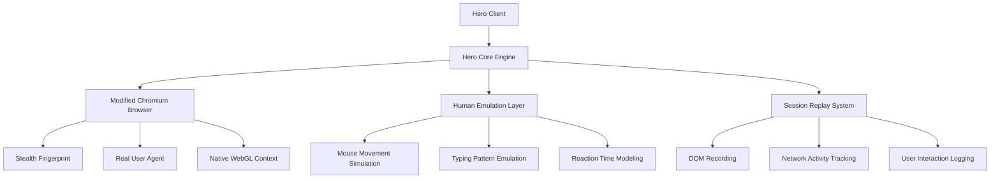
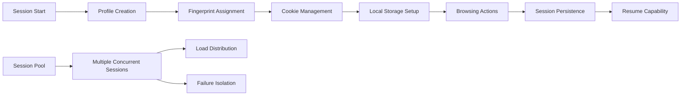
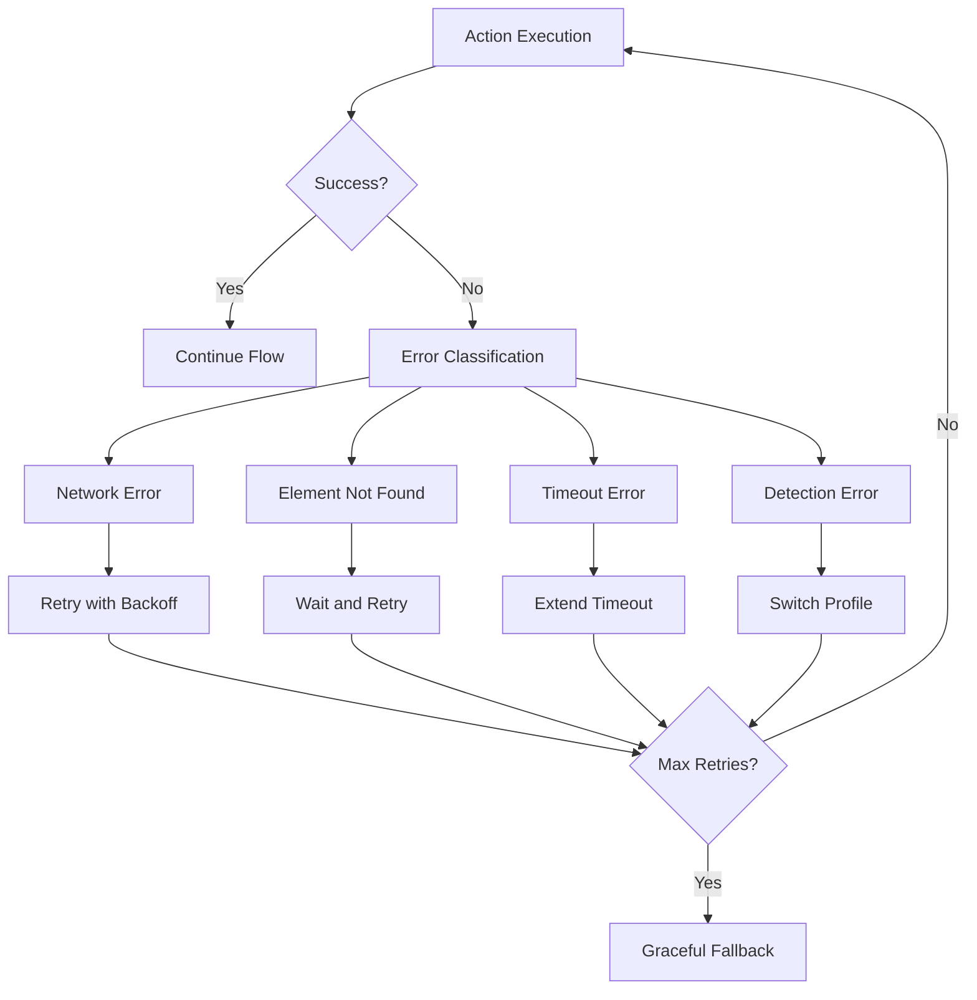

When it comes to browser automation that truly mimics human behavior, Ulixee Hero stands in a league of its own. While tools like Puppeteer and Playwright excel at speed and basic automation, Hero was built from the ground up with one primary goal: being undetectable. This isn't just another browser automation framework—it's a complete platform designed to replicate human browsing patterns so accurately that even the most sophisticated detection systems struggle to identify it as automated traffic.

Hero's approach to browser automation fundamentally differs from traditional tools. Instead of simply controlling a browser, it creates an entirely new browsing context that includes realistic mouse movements, natural typing patterns, genuine browser fingerprints, and even simulated human reaction times. This comprehensive approach to human simulation makes Hero particularly valuable for scraping websites with aggressive anti-bot measures.

## Architecture and Core Philosophy

The Hero platform consists of multiple components working together to create an authentic browsing experience. At its core lies the Hero browser engine, built on Chromium but heavily modified to remove automation signatures that typically betray bot activity.



Unlike other automation tools that layer detection evasion on top of existing browser controls, Hero rebuilds the automation experience from scratch. This means every mouse movement, keyboard input, and navigation action goes through Hero's human emulation layer before reaching the actual browser.

## Installation and Basic Setup

Hero requires a different approach to installation compared to traditional npm packages. The platform runs as a service that your scripts connect to, providing better isolation and more sophisticated resource management.

```javascript
// Install Hero
npm install @ulixee/hero

// Basic Hero setup
const Hero = require('@ulixee/hero');

async function basicHeroExample() {
  const hero = new Hero();
  
  // Navigate to a page with human-like behavior
  await hero.goto('https://example.com');
  
  // Hero automatically adds realistic delays and mouse movements
  await hero.waitForPaintingStable();
  
  // Extract content after the page has fully loaded
  const title = await hero.document.title;
  console.log('Page title:', title);
  
  // Always close the session
  await hero.close();
}

basicHeroExample();
```

The initial setup process reveals Hero's attention to detail. Instead of instantly loading pages, Hero simulates realistic loading patterns, including natural delays between actions and mouse movements that occur even during navigation.

## Human Emulation Features

Hero's human emulation capabilities extend far beyond simple delays and randomization. The platform incorporates research-based models of human computer interaction to create genuinely realistic browsing sessions.

```javascript
async function demonstrateHumanEmulation() {
  const hero = new Hero();
  
  await hero.goto('https://example.com/login');
  
  // Human-like form filling with realistic typing patterns
  const usernameField = await hero.querySelector('#username');
  
  // Hero varies typing speed, includes natural pauses, and may make/correct typos
  await usernameField.type('myusername', {
    humanlike: true // Enables advanced human simulation
  });
  
  // Realistic mouse movement to password field
  const passwordField = await hero.querySelector('#password');
  await passwordField.click(); // Includes natural mouse path and timing
  
  await passwordField.type('mypassword', {
    humanlike: true,
    typeInteractionDelay: [100, 300] // Random delays between keystrokes
  });
  
  // Human-like button clicking with realistic mouse approach
  const submitButton = await hero.querySelector('button[type="submit"]');
  await submitButton.click({
    verification: 'elementAtPath' // Ensures accurate targeting
  });
  
  await hero.close();
}
```

## Advanced Session Management

Hero's session management capabilities set it apart from other automation tools. The platform can maintain persistent sessions, handle complex authentication flows, and even resume interrupted scraping operations.



```javascript
async function advancedSessionManagement() {
  // Create a persistent session with specific characteristics
  const hero = new Hero({
    sessionName: 'persistent_scraper_session',
    sessionPersistence: true,
    userProfile: {
      // Simulate a specific user type
      deviceProfile: 'desktop',
      operatingSystem: 'mac',
      viewport: { width: 1440, height: 900 },
      locale: 'en-US'
    }
  });
  
  // Session state will be maintained across restarts
  await hero.goto('https://example.com');
  
  // Complex navigation maintaining session context
  const links = await hero.querySelectorAll('a[href*="/products/"]');
  
  for (let i = 0; i < Math.min(links.length, 5); i++) {
    // Each navigation maintains browsing history and context
    await links[i].click();
    
    // Wait for dynamic content with intelligent timeout handling
    await hero.waitForElement('.product-details', {
      timeoutMs: 10000
    });
    
    // Extract data while maintaining session context
    const productData = await hero.evaluateOnWindow(extractProductInfo);
    console.log('Product data:', productData);
    
    // Human-like back navigation
    await hero.goBack();
    await hero.waitForMillis([1000, 3000]); // Random delay
  }
  
  await hero.close();
}

// Custom extraction function that runs in browser context
function extractProductInfo() {
  return {
    name: document.querySelector('.product-name')?.textContent?.trim(),
    price: document.querySelector('.price')?.textContent?.trim(),
    description: document.querySelector('.description')?.textContent?.trim(),
    availability: document.querySelector('.stock-status')?.textContent?.trim()
  };
}
```

## Handling Complex Interactive Elements

Modern web applications often require complex interactions that go beyond simple clicking and typing. Hero excels at handling sophisticated user interface elements with realistic interaction patterns.

```javascript
async function handleComplexInteractions() {
  const hero = new Hero();
  
  await hero.goto('https://example.com/dashboard');
  
  // Handle dropdown menus with realistic interaction
  const dropdown = await hero.querySelector('.dropdown-trigger');
  await dropdown.click();
  
  // Wait for dropdown animation to complete
  await hero.waitForElement('.dropdown-menu', {
    waitForVisible: true
  });
  
  // Select option with mouse hover and realistic timing
  const option = await hero.querySelector('.dropdown-option[data-value="advanced"]');
  await option.hover(); // Realistic hover before click
  await hero.waitForMillis(200); // Brief pause like humans do
  await option.click();
  
  // Handle modal dialogs with proper focus management
  const modalTrigger = await hero.querySelector('.open-modal');
  await modalTrigger.click();
  
  await hero.waitForElement('.modal', {
    waitForVisible: true
  });
  
  // Interact within modal context
  const modalInput = await hero.querySelector('.modal input[type="text"]');
  await modalInput.type('Complex interaction data');
  
  // Handle file uploads (Hero can work with real files)
  const fileInput = await hero.querySelector('input[type="file"]');
  await fileInput.uploadFile('./data-file.csv');
  
  // Close modal with escape key (human-like behavior)
  await hero.keyboard.press('Escape');
  
  await hero.close();
}
```

## Performance Optimization and Resource Management

Hero's architecture allows for sophisticated performance optimization while maintaining human-like behavior patterns. The platform includes built-in resource management and optimization features.

```javascript
async function optimizedHeroSession() {
  const hero = new Hero({
    // Optimize for performance while maintaining stealth
    blockedResourceTypes: ['images', 'fonts', 'media'],
    blockedResourceUrls: [
      '*analytics*',
      '*tracking*',
      '*ads*'
    ],
    
    // Connection optimization
    connectionToCore: {
      host: 'localhost',
      port: 1818
    },
    
    // Resource limits
    maxConcurrentConnections: 6,
    requestTimeout: 30000
  });
  
  // Batch operations for efficiency
  const urls = [
    'https://example.com/page1',
    'https://example.com/page2',
    'https://example.com/page3'
  ];
  
  const results = [];
  
  for (const url of urls) {
    await hero.goto(url);
    
    // Parallel data extraction
    const [title, meta, content] = await Promise.all([
      hero.document.title,
      hero.querySelector('meta[name="description"]').getAttribute('content'),
      hero.querySelector('.main-content').textContent
    ]);
    
    results.push({ url, title, meta, content });
    
    // Efficient resource cleanup between pages
    await hero.executeJs(() => {
      // Clear large objects from memory
      if (window.largeDataObjects) {
        delete window.largeDataObjects;
      }
    });
  }
  
  await hero.close();
  return results;
}
```

## Error Handling and Recovery

Hero provides sophisticated error handling mechanisms that help maintain session stability and recover gracefully from various failure scenarios.



```javascript
async function robustHeroScraping() {
  const hero = new Hero();
  
  try {
    await hero.goto('https://example.com/data', {
      timeoutMs: 30000
    });
    
    // Intelligent waiting with multiple fallback strategies
    let targetElement;
    try {
      targetElement = await hero.waitForElement('.data-container', {
        timeoutMs: 10000
      });
    } catch (timeoutError) {
      // Fallback: try alternative selector
      targetElement = await hero.waitForElement('[data-testid="content"]', {
        timeoutMs: 5000
      });
    }
    
    // Robust data extraction with error recovery
    const extractData = async (retries = 3) => {
      try {
        return await hero.evaluateOnWindow(() => {
          const elements = document.querySelectorAll('.data-item');
          return Array.from(elements).map(el => ({
            text: el.textContent?.trim(),
            link: el.querySelector('a')?.href
          }));
        });
      } catch (error) {
        if (retries > 0) {
          console.log(`Extraction failed, retrying... (${retries} attempts left)`);
          await hero.waitForMillis(1000);
          return extractData(retries - 1);
        }
        throw error;
      }
    };
    
    const data = await extractData();
    console.log('Successfully extracted:', data.length, 'items');
    
  } catch (error) {
    console.error('Scraping failed:', error.message);
    
    // Capture debugging information
    const screenshot = await hero.takeScreenshot();
    const html = await hero.document.documentElement.outerHTML;
    
    // Log for debugging
    console.log('Screenshot saved, HTML length:', html.length);
    
  } finally {
    await hero.close();
  }
}
```

## Integration with Data Pipelines

Hero integrates seamlessly with existing data processing pipelines, offering flexible output formats and real-time streaming capabilities.

```javascript
async function pipelineIntegration() {
  const hero = new Hero();
  
  // Set up data streaming
  const dataStream = [];
  
  hero.on('resource-response', (response) => {
    // Capture API responses automatically
    if (response.url.includes('/api/') && response.status === 200) {
      console.log('API response captured:', response.url);
    }
  });
  
  await hero.goto('https://example.com/dashboard');
  
  // Real-time data extraction as page loads
  hero.on('dom-ready', async () => {
    const initialData = await hero.evaluateOnWindow(() => {
      return window.initialDataState || {};
    });
    
    if (Object.keys(initialData).length > 0) {
      dataStream.push({
        timestamp: Date.now(),
        type: 'initial_load',
        data: initialData
      });
    }
  });
  
  // Monitor dynamic content changes
  await hero.executeJs(() => {
    const observer = new MutationObserver((mutations) => {
      mutations.forEach((mutation) => {
        if (mutation.addedNodes.length > 0) {
          window.heroDataUpdated = true;
        }
      });
    });
    
    observer.observe(document.body, {
      childList: true,
      subtree: true
    });
  });
  
  // Periodic data collection
  for (let i = 0; i < 10; i++) {
    await hero.waitForMillis(2000);
    
    const hasUpdates = await hero.evaluateOnWindow(() => {
      if (window.heroDataUpdated) {
        window.heroDataUpdated = false;
        return true;
      }
      return false;
    });
    
    if (hasUpdates) {
      const newData = await hero.evaluateOnWindow(() => {
        // Extract updated content
        return Array.from(document.querySelectorAll('.live-data')).map(el => ({
          id: el.dataset.id,
          content: el.textContent.trim(),
          timestamp: Date.now()
        }));
      });
      
      dataStream.push({
        timestamp: Date.now(),
        type: 'dynamic_update',
        data: newData
      });
    }
  }
  
  await hero.close();
  
  // Process collected data
  console.log('Total data points collected:', dataStream.length);
  return dataStream;
}
```

Hero represents a paradigm shift in browser automation, moving beyond simple script execution to create genuinely human-like browsing experiences. Its comprehensive approach to detection evasion, combined with sophisticated session management and robust error handling, makes it an invaluable tool for complex web scraping scenarios.

The platform's ability to maintain persistent sessions while seamlessly handling dynamic content positions it as a premier choice for large-scale data extraction projects. Whether you're dealing with sophisticated anti-bot systems or simply need the most reliable browser automation available, Hero's human-centric design philosophy offers a compelling solution.

What challenges are you facing with traditional browser automation tools that Hero's human-like approach might solve? Have you encountered detection systems so sophisticated that they require this level of behavioral authenticity?