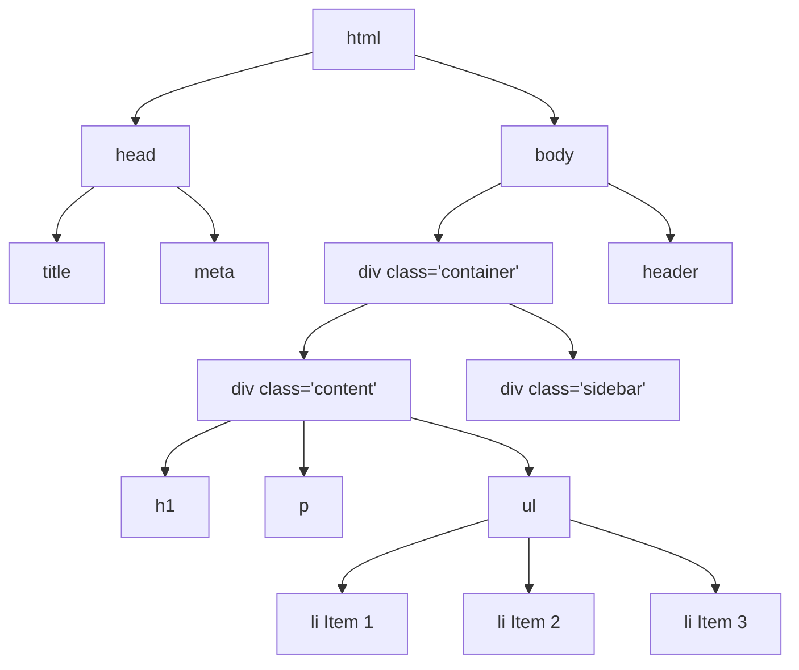
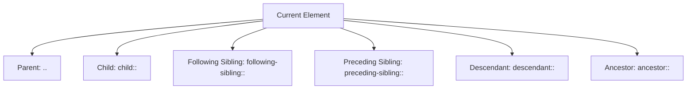
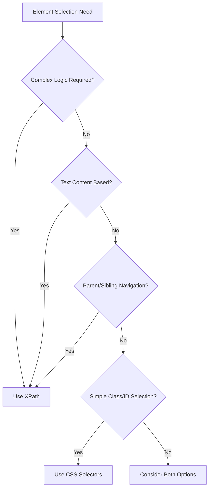

When you think about finding your way through a city, you need a map and clear directions. Web scraping works similarly – you need a way to navigate through the complex structure of HTML documents to find exactly what you're looking for. XPath (XML Path Language) serves as that powerful navigation system, providing a precise way to locate elements in web pages.

XPath isn't just another selector method; it's a comprehensive query language that treats HTML documents like a hierarchical tree structure. While CSS selectors are great for styling and basic element selection, XPath offers unmatched flexibility and power for complex data extraction scenarios.

## Understanding the HTML Tree Structure

Before diving into XPath syntax, let's visualize how HTML documents are structured:



This tree structure is the foundation of how XPath operates. Every element has a specific position and relationship to other elements, which XPath exploits to create precise selectors.

## XPath Syntax Fundamentals

XPath expressions follow a path-like syntax similar to file system navigation. Here are the core building blocks:

### Basic Path Expressions

```python
# Absolute path - starts from root
/html/body/div/h1

# Relative path - starts from current context
.//div[@class='content']

# Select all matching elements regardless of position
//div[@class='product']
```

### Node Selection Operators

The power of XPath lies in its operators and functions:

```python
from selenium import webdriver
from selenium.webdriver.common.by import By

driver = webdriver.Chrome()
driver.get("https://example-ecommerce.com")

# Select by tag name
titles = driver.find_elements(By.XPATH, "//h2")

# Select by attribute
products = driver.find_elements(By.XPATH, "//div[@class='product-card']")

# Select by text content
specific_link = driver.find_element(By.XPATH, "//a[text()='Contact Us']")

# Select by partial text
partial_match = driver.find_element(By.XPATH, "//span[contains(text(), 'Price')]")
```

## Advanced XPath Techniques

### Attribute-Based Selection

XPath excels at selecting elements based on their attributes:

```python
# Exact attribute match
driver.find_element(By.XPATH, "//input[@type='email']")

# Attribute contains value
driver.find_element(By.XPATH, "//div[contains(@class, 'product')]")

# Attribute starts with value
driver.find_element(By.XPATH, "//div[starts-with(@id, 'product-')]")

# Multiple attribute conditions
driver.find_element(By.XPATH, "//input[@type='text' and @name='username']")

# Attribute exists (regardless of value)
driver.find_elements(By.XPATH, "//img[@alt]")
```

### Positional Selection

Sometimes you need to select elements based on their position:

```python
# First element
first_product = driver.find_element(By.XPATH, "(//div[@class='product'])[1]")

# Last element
last_item = driver.find_element(By.XPATH, "(//li)[last()]")

# Second to last
second_last = driver.find_element(By.XPATH, "(//li)[last()-1]")

# Elements at specific positions
third_item = driver.find_element(By.XPATH, "(//div[@class='item'])[3]")
```

## Navigating Relationships

XPath shines when you need to navigate between related elements:



### Practical Relationship Navigation

```python
# Find parent element
parent = driver.find_element(By.XPATH, "//span[@class='price']/..")

# Find following sibling
next_sibling = driver.find_element(By.XPATH, "//h2/following-sibling::p")

# Find preceding sibling
prev_sibling = driver.find_element(By.XPATH, "//button/preceding-sibling::input")

# Find ancestor with specific attribute
container = driver.find_element(By.XPATH, "//span[@class='discount']/ancestor::div[@class='product-card']")

# Find descendant elements
all_links = driver.find_elements(By.XPATH, "//div[@class='menu']/descendant::a")
```

## Text-Based Selection Strategies

Working with text content is crucial for web scraping:

```python
# Exact text match
exact_link = driver.find_element(By.XPATH, "//a[text()='Learn More']")

# Partial text match
partial_text = driver.find_element(By.XPATH, "//h3[contains(text(), 'Special Offer')]")

# Case-insensitive text matching (XPath 2.0+)
case_insensitive = driver.find_element(By.XPATH, "//button[contains(translate(text(), 'ABCDEFGHIJKLMNOPQRSTUVWXYZ', 'abcdefghijklmnopqrstuvwxyz'), 'submit')]")

# Text normalization (removing extra spaces)
normalized = driver.find_element(By.XPATH, "//span[normalize-space(text())='$99.99']")
```

## Complex Conditional Logic

XPath supports sophisticated logical operations:

```python
# OR conditions
either_condition = driver.find_elements(By.XPATH, "//div[@class='sale' or @class='featured']")

# AND conditions with multiple criteria
complex_condition = driver.find_elements(By.XPATH, "//product[@available='true' and price < 100 and @category='electronics']")

# NOT conditions
not_condition = driver.find_elements(By.XPATH, "//div[not(@class='hidden')]")

# Combining conditions
combined = driver.find_elements(By.XPATH, "//item[@status='active' and (price < 50 or @discount='true')]")
```

## Handling Dynamic Content

Modern web applications often generate dynamic content, making XPath selection challenging:

```python
# Flexible class matching for dynamic classes
dynamic_element = driver.find_element(By.XPATH, "//div[contains(@class, 'btn-') and contains(@class, 'primary')]")

# ID patterns for generated IDs
generated_id = driver.find_element(By.XPATH, "//input[starts-with(@id, 'input-') and contains(@id, '-email')]")

# Data attributes (commonly used in modern frameworks)
data_attribute = driver.find_element(By.XPATH, "//button[@data-action='submit']")
```

## Performance Optimization Tips

XPath performance can vary significantly based on how you write your expressions:

```python
# Efficient - specific and direct
efficient = "//div[@class='products']//article[@data-id='123']"

# Less efficient - too broad
inefficient = "//*[contains(text(), 'Product')]"

# Optimized positioning
optimized = "(//div[@class='product-list']/div)[5]"

# Avoid deep nesting when possible
better = "//main//product[@id='item-456']"
instead_of = "/html/body/div/div/main/section/div/product[@id='item-456']"
```

## Real-World XPath Examples

Let's look at practical examples you might encounter:

```python
import time
from selenium import webdriver
from selenium.webdriver.common.by import By
from selenium.webdriver.support.ui import WebDriverWait
from selenium.webdriver.support import expected_conditions as EC

class ProductScraper:
    def __init__(self):
        self.driver = webdriver.Chrome()
        self.wait = WebDriverWait(self.driver, 10)
    
    def scrape_product_data(self, url):
        self.driver.get(url)
        
        # Product title with multiple possible structures
        title_xpath = "//h1[@class='product-title'] | //h1[contains(@class, 'title')] | //div[@class='product-info']//h1"
        title = self.wait.until(EC.presence_of_element_located((By.XPATH, title_xpath))).text
        
        # Price with various formats
        price_xpath = "//span[contains(@class, 'price') and not(contains(@class, 'old'))] | //div[@class='pricing']//span[contains(text(), '$')]"
        price = self.driver.find_element(By.XPATH, price_xpath).text
        
        # Reviews count (handling different structures)
        reviews_xpath = "//span[contains(text(), 'review')] | //a[contains(@href, 'reviews')]//span | //div[@class='rating']/following-sibling::span"
        reviews = self.driver.find_element(By.XPATH, reviews_xpath).text
        
        # Availability status
        availability_xpath = "//span[contains(translate(text(), 'ABCDEFGHIJKLMNOPQRSTUVWXYZ', 'abcdefghijklmnopqrstuvwxyz'), 'in stock')] | //div[@class='availability'][not(contains(@class, 'out'))]"
        
        try:
            availability = self.driver.find_element(By.XPATH, availability_xpath).text
        except:
            availability = "Unknown"
            
        return {
            'title': title,
            'price': price,
            'reviews': reviews,
            'availability': availability
        }
```

## XPath vs CSS Selectors: When to Use Each



## Common XPath Pitfalls and Solutions

### 1. Brittle Absolute Paths
```python
# Brittle
bad_xpath = "/html/body/div[2]/div[1]/section/article[3]/h2"

# Better
good_xpath = "//article[contains(@class, 'post')]//h2"
```

### 2. Over-Relying on Text Content
```python
# Fragile (breaks with language changes)
fragile = "//button[text()='Submit']"

# More robust
robust = "//button[@type='submit'] | //button[contains(@class, 'submit')]"
```

### 3. Ignoring Dynamic Content
```python
# Won't work with dynamically generated IDs
static = "//div[@id='content-12345']"

# Flexible approach
dynamic = "//div[starts-with(@id, 'content-') and contains(@class, 'main-content')]"
```

## Testing and Debugging XPath

Browser developer tools are invaluable for XPath development:

```javascript
// Test XPath in browser console
$x("//div[@class='product']")

// Count matching elements
$x("//a").length

// Get text content
$x("//h1")[0].textContent

// Verify XPath matches expected elements
console.log($x("//button[contains(text(), 'Add to Cart')]"))
```

XPath mastery transforms your web scraping capabilities from basic element selection to sophisticated data extraction. The investment in learning these patterns pays dividends when dealing with complex, dynamic websites where simple selectors fall short.

Whether you're extracting product catalogs, scraping news articles, or automating form interactions, XPath provides the precision and flexibility needed for professional web scraping projects. The key is practice – start with simple expressions and gradually incorporate more advanced techniques as your projects demand them.

What's the most complex element structure you've encountered in your scraping projects? Have you found XPath or CSS selectors more effective for your specific use cases?