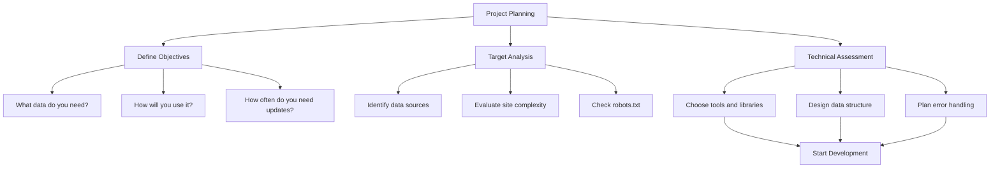
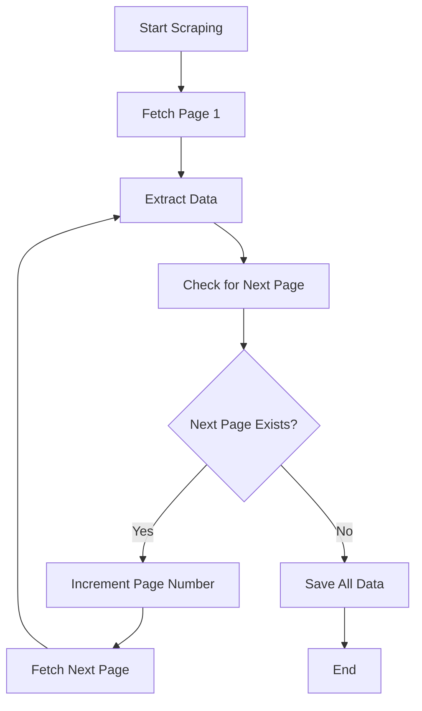
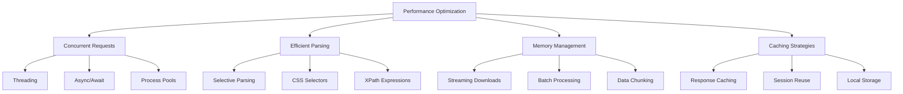

Building your first web scraping project can feel overwhelming. Between choosing the right tools, understanding website structures, and writing code that actually works, there's a lot to consider. This practical roadmap will guide you through creating a complete scraping project from start to finish, using real-world examples and best practices.

## Project Planning: The Foundation of Success

Before writing a single line of code, successful scraping projects begin with thorough planning. This phase determines whether your project will run smoothly or become a debugging nightmare.

### Define Your Objectives

Start by clearly defining what data you need and why you need it. Are you collecting product prices for market research? Gathering news articles for sentiment analysis? Or perhaps building a dataset for machine learning? Your objectives will shape every technical decision that follows.

### Target Analysis

Once you know what you want, identify the best sources. Not all websites are created equal when it comes to scraping. Look for sites that:

- Display the data you need clearly
- Have relatively simple HTML structures
- Don't require complex authentication
- Have reasonable loading times



## Setting Up Your Development Environment

A proper development environment saves countless hours later. Here's what you'll need for our example project:

```python
# requirements.txt
requests==2.31.0
beautifulsoup4==4.12.2
lxml==4.9.3
pandas==2.0.3
time==built-in
```

Create a virtual environment to keep dependencies isolated:

```bash
python -m venv scraping_env
source scraping_env/bin/activate  # On Windows: scraping_env\Scripts\activate
pip install -r requirements.txt
```

## Real-World Example: Scraping Book Information

Let's build a practical project that scrapes book information from a bookstore website. We'll extract titles, prices, ratings, and availability status.

### Initial Exploration

Start by examining the target website manually. Open your browser's developer tools and inspect the HTML structure:

```python
import requests
from bs4 import BeautifulSoup
import time
import pandas as pd

# First, let's explore the site structure
def explore_site(url):
    """
    Initial exploration function to understand site structure
    """
    response = requests.get(url)
    soup = BeautifulSoup(response.content, 'html.parser')
    
    print(f"Status Code: {response.status_code}")
    print(f"Page Title: {soup.title.text.strip()}")
    print(f"Number of books on page: {len(soup.find_all('article', class_='product_pod'))}")
    
    return soup

# Example usage
base_url = "http://books.toscrape.com/catalogue/page-1.html"
initial_soup = explore_site(base_url)
```

### Building the Core Scraper

Now let's build the main scraping logic. We'll create modular functions that handle different aspects of the scraping process:

```python
class BookScraper:
    def __init__(self, base_url, delay=1):
        self.base_url = base_url
        self.delay = delay
        self.session = requests.Session()
        self.session.headers.update({
            'User-Agent': 'Mozilla/5.0 (Windows NT 10.0; Win64; x64) AppleWebKit/537.36'
        })
    
    def get_page(self, url):
        """Fetch a single page with error handling"""
        try:
            response = self.session.get(url)
            response.raise_for_status()
            return BeautifulSoup(response.content, 'html.parser')
        except requests.RequestException as e:
            print(f"Error fetching {url}: {e}")
            return None
    
    def extract_book_data(self, book_element):
        """Extract data from a single book element"""
        try:
            title = book_element.find('h3').find('a')['title']
            price = book_element.find('p', class_='price_color').text.strip()
            
            # Extract rating
            rating_element = book_element.find('p', class_='star-rating')
            rating_classes = rating_element.get('class')
            rating = [cls for cls in rating_classes if cls != 'star-rating'][0]
            
            # Extract availability
            availability = book_element.find('p', class_='instock availability').text.strip()
            
            return {
                'title': title,
                'price': price,
                'rating': rating,
                'availability': availability
            }
        except (AttributeError, TypeError) as e:
            print(f"Error extracting book data: {e}")
            return None
    
    def scrape_page(self, page_url):
        """Scrape all books from a single page"""
        soup = self.get_page(page_url)
        if not soup:
            return []
        
        books = []
        book_elements = soup.find_all('article', class_='product_pod')
        
        for element in book_elements:
            book_data = self.extract_book_data(element)
            if book_data:
                books.append(book_data)
        
        time.sleep(self.delay)  # Be respectful to the server
        return books
```

### Handling Multiple Pages

Most real-world scraping involves multiple pages. Here's how to handle pagination:



```python
def scrape_all_pages(self, max_pages=None):
    """Scrape multiple pages with pagination handling"""
    all_books = []
    page_num = 1
    
    while True:
        if max_pages and page_num > max_pages:
            break
            
        page_url = f"http://books.toscrape.com/catalogue/page-{page_num}.html"
        print(f"Scraping page {page_num}...")
        
        books = self.scrape_page(page_url)
        
        if not books:  # No more pages or error occurred
            break
            
        all_books.extend(books)
        page_num += 1
        
        # Additional delay between pages
        time.sleep(self.delay)
    
    return all_books
```

## Data Processing and Storage

Raw scraped data often needs cleaning and transformation before it's useful:

```python
def clean_and_process_data(self, raw_data):
    """Clean and process the scraped data"""
    df = pd.DataFrame(raw_data)
    
    if df.empty:
        return df
    
    # Clean price column
    df['price_numeric'] = df['price'].str.replace('£', '').astype(float)
    
    # Convert rating to numeric
    rating_mapping = {
        'One': 1, 'Two': 2, 'Three': 3, 'Four': 4, 'Five': 5
    }
    df['rating_numeric'] = df['rating'].map(rating_mapping)
    
    # Clean availability
    df['in_stock'] = df['availability'].str.contains('In stock', case=False)
    
    return df

def save_data(self, data, filename='books_data.csv'):
    """Save processed data to file"""
    if isinstance(data, list):
        df = pd.DataFrame(data)
    else:
        df = data
    
    df.to_csv(filename, index=False)
    print(f"Data saved to {filename}")
    print(f"Total records: {len(df)}")
```

## Error Handling and Robustness

Professional scraping projects must handle various error conditions gracefully:

```python
def robust_scrape_with_retry(self, url, max_retries=3):
    """Scraping with retry logic and exponential backoff"""
    for attempt in range(max_retries):
        try:
            response = self.session.get(url, timeout=10)
            response.raise_for_status()
            return BeautifulSoup(response.content, 'html.parser')
        
        except requests.exceptions.Timeout:
            print(f"Timeout on attempt {attempt + 1}")
            time.sleep(2 ** attempt)  # Exponential backoff
        
        except requests.exceptions.ConnectionError:
            print(f"Connection error on attempt {attempt + 1}")
            time.sleep(5)
        
        except requests.exceptions.HTTPError as e:
            if e.response.status_code == 429:  # Rate limited
                print("Rate limited, waiting longer...")
                time.sleep(60)
            else:
                print(f"HTTP error: {e}")
                break
    
    return None
```

## Putting It All Together

Here's how to execute the complete scraping project:

```python
def main():
    """Main execution function"""
    scraper = BookScraper(
        base_url="http://books.toscrape.com",
        delay=1
    )
    
    try:
        # Scrape all available pages
        print("Starting scraping process...")
        raw_data = scraper.scrape_all_pages(max_pages=5)  # Limit for testing
        
        if raw_data:
            # Process and clean data
            processed_data = scraper.clean_and_process_data(raw_data)
            
            # Save to file
            scraper.save_data(processed_data, 'books_data.csv')
            
            # Display summary statistics
            print(f"\nScraping Summary:")
            print(f"Total books scraped: {len(processed_data)}")
            print(f"Average price: £{processed_data['price_numeric'].mean():.2f}")
            print(f"Most common rating: {processed_data['rating'].mode().iloc[0]}")
            
        else:
            print("No data was scraped successfully")
    
    except KeyboardInterrupt:
        print("\nScraping interrupted by user")
    except Exception as e:
        print(f"Unexpected error: {e}")

if __name__ == "__main__":
    main()
```

## Performance Optimization Strategies

As your project grows, performance becomes crucial:



## Monitoring and Maintenance

Set up basic monitoring to track your scraper's health:

```python
import logging
from datetime import datetime

# Configure logging
logging.basicConfig(
    level=logging.INFO,
    format='%(asctime)s - %(levelname)s - %(message)s',
    handlers=[
        logging.FileHandler('scraper.log'),
        logging.StreamHandler()
    ]
)

def log_scraping_session(self, start_time, end_time, records_scraped):
    """Log details of the scraping session"""
    duration = end_time - start_time
    logging.info(f"Scraping completed in {duration}")
    logging.info(f"Records scraped: {records_scraped}")
    logging.info(f"Average rate: {records_scraped/duration.total_seconds():.2f} records/second")
```

Building your first scraping project is an iterative process. Start simple, test frequently, and gradually add complexity as you gain confidence. Remember that each website is unique, so the techniques you learn here will need adaptation for different targets.

What data source are you planning to tackle for your first scraping project? Share your target website and the challenges you're anticipating – I'd love to help you navigate the specific hurdles you might encounter!