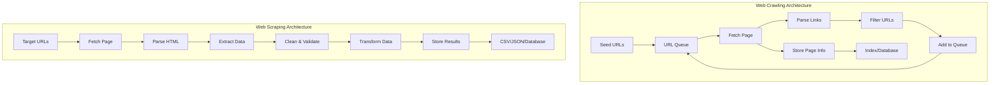
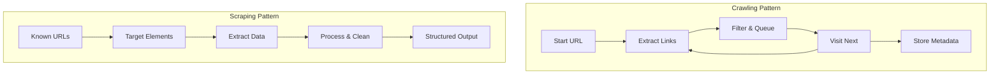

When diving into the world of automated data collection, two terms frequently surface and often get mixed up: web scraping and web crawling. While they're closely related and sometimes used together, understanding their distinct purposes, methodologies, and applications is crucial for anyone working in data extraction.

Think of web crawling as exploration and web scraping as extraction. A crawler is like a scout mapping out territory, while a scraper is like a harvester collecting specific resources from known locations. Both serve essential roles in the data ecosystem, but they tackle fundamentally different challenges.

## What is Web Crawling?

Web crawling is the systematic process of discovering and indexing web pages across the internet or within specific domains. Crawlers, also known as spiders or bots, follow links from page to page, building a comprehensive map of available content. Search engines like Google use massive crawling operations to discover new pages and update their indexes.

The primary goal of crawling is **discovery and navigation**. Crawlers start with seed URLs and recursively follow links, creating a web of interconnected pages. They're designed to be polite, respecting robots.txt files and implementing delays to avoid overwhelming servers.

```python
import requests
from bs4 import BeautifulSoup
from urllib.parse import urljoin, urlparse
import time
from collections import deque

class WebCrawler:
    def __init__(self, start_url, max_depth=3, delay=1):
        self.start_url = start_url
        self.max_depth = max_depth
        self.delay = delay
        self.visited = set()
        self.to_visit = deque([(start_url, 0)])
        self.domain = urlparse(start_url).netloc
        
    def is_valid_url(self, url):
        parsed = urlparse(url)
        return parsed.netloc == self.domain and url not in self.visited
    
    def crawl(self):
        while self.to_visit:
            current_url, depth = self.to_visit.popleft()
            
            if depth > self.max_depth or current_url in self.visited:
                continue
                
            try:
                response = requests.get(current_url, timeout=10)
                response.raise_for_status()
                self.visited.add(current_url)
                
                print(f"Crawled: {current_url} (Depth: {depth})")
                
                soup = BeautifulSoup(response.content, 'html.parser')
                
                # Find all links on the page
                for link in soup.find_all('a', href=True):
                    new_url = urljoin(current_url, link['href'])
                    if self.is_valid_url(new_url):
                        self.to_visit.append((new_url, depth + 1))
                
                time.sleep(self.delay)
                
            except requests.RequestException as e:
                print(f"Error crawling {current_url}: {e}")

# Usage
crawler = WebCrawler("https://example.com", max_depth=2)
crawler.crawl()
```

## What is Web Scraping?

Web scraping focuses on **extracting specific data** from web pages. Unlike crawling, which aims to discover pages, scraping targets particular information elements like prices, reviews, contact details, or product specifications. Scrapers are precision tools designed to parse HTML, navigate complex page structures, and extract structured data.

The scraping process involves identifying target elements, handling dynamic content, managing anti-bot measures, and formatting extracted data for storage or analysis.

```python
import requests
from bs4 import BeautifulSoup
import csv
import json

class ProductScraper:
    def __init__(self):
        self.session = requests.Session()
        self.session.headers.update({
            'User-Agent': 'Mozilla/5.0 (Windows NT 10.0; Win64; x64) AppleWebKit/537.36'
        })
    
    def scrape_product_details(self, url):
        try:
            response = self.session.get(url)
            response.raise_for_status()
            
            soup = BeautifulSoup(response.content, 'html.parser')
            
            product_data = {
                'title': self.extract_title(soup),
                'price': self.extract_price(soup),
                'rating': self.extract_rating(soup),
                'description': self.extract_description(soup),
                'availability': self.extract_availability(soup)
            }
            
            return product_data
            
        except requests.RequestException as e:
            print(f"Error scraping {url}: {e}")
            return None
    
    def extract_title(self, soup):
        title_selectors = [
            'h1.product-title',
            '.product-name h1',
            'h1[data-testid="product-title"]'
        ]
        
        for selector in title_selectors:
            element = soup.select_one(selector)
            if element:
                return element.get_text(strip=True)
        return "N/A"
    
    def extract_price(self, soup):
        price_selectors = [
            '.price-current',
            '.product-price .current',
            '[data-testid="price"]'
        ]
        
        for selector in price_selectors:
            element = soup.select_one(selector)
            if element:
                price_text = element.get_text(strip=True)
                # Clean and extract numeric value
                import re
                price_match = re.search(r'[\d,]+\.?\d*', price_text.replace(',', ''))
                if price_match:
                    return float(price_match.group())
        return 0.0
    
    def save_to_csv(self, products, filename='scraped_products.csv'):
        with open(filename, 'w', newline='', encoding='utf-8') as file:
            if products:
                writer = csv.DictWriter(file, fieldnames=products[0].keys())
                writer.writeheader()
                writer.writerows(products)

# Usage
scraper = ProductScraper()
products = []

product_urls = [
    "https://example-store.com/product1",
    "https://example-store.com/product2"
]

for url in product_urls:
    product_data = scraper.scrape_product_details(url)
    if product_data:
        products.append(product_data)

scraper.save_to_csv(products)
```

## Key Architectural Differences



The architectural differences reveal their core purposes. Crawlers maintain queues of URLs to visit, implement breadth-first or depth-first traversal strategies, and focus on link discovery. Scrapers concentrate on data extraction pipelines, handling parsing logic, data cleaning, and output formatting.

## Scope and Objectives

**Crawling Scope:**
- Discovers unknown pages and content
- Maps website structures and hierarchies  
- Creates comprehensive indexes
- Monitors changes across large site collections
- Feeds other systems with discovered URLs

**Scraping Objectives:**
- Extracts specific data points with precision
- Converts unstructured HTML into structured formats
- Monitors targeted information for changes
- Collects data for analysis, comparison, or integration
- Focuses on data quality and accuracy over coverage

## Technical Implementation Patterns



Crawlers implement sophisticated URL management systems, handling duplicate detection, priority queues, and politeness policies. They often use distributed architectures to handle massive scale operations efficiently.

Scrapers focus on robust data extraction mechanisms, implementing retry logic, error handling, and data validation. They require deep understanding of target site structures and often need frequent maintenance as layouts change.

## Error Handling and Resilience

Both crawlers and scrapers need robust error handling, but their approaches differ significantly:

```python
# Crawler error handling - focus on continuity
class RobustCrawler:
    def handle_crawl_error(self, url, error):
        if isinstance(error, requests.Timeout):
            # Re-queue with lower priority
            self.retry_queue.append((url, self.get_retry_delay()))
        elif isinstance(error, requests.HTTPError):
            if error.response.status_code == 429:  # Rate limited
                self.implement_backoff()
            elif error.response.status_code >= 500:  # Server error
                self.retry_later(url)
            else:  # Client error - skip
                self.log_skip(url, error)
        
    def implement_backoff(self):
        self.delay *= 2  # Exponential backoff
        time.sleep(self.delay)

# Scraper error handling - focus on data completeness
class RobustScraper:
    def handle_scrape_error(self, url, error):
        if isinstance(error, AttributeError):
            # Selector might have changed
            self.try_fallback_selectors()
        elif isinstance(error, ValueError):
            # Data parsing failed
            self.log_data_quality_issue(url)
            return self.create_partial_record()
        
    def try_fallback_selectors(self):
        # Implement alternative extraction methods
        for selector_set in self.fallback_selectors:
            try:
                return self.extract_with_selectors(selector_set)
            except:
                continue
        return None
```

## Performance and Resource Management

Crawlers prioritize breadth and efficiency, often processing hundreds of pages per second while being mindful of server resources. They implement sophisticated caching, compression, and bandwidth management.

Scrapers optimize for data quality and completeness, often processing fewer pages but with much deeper analysis of each page's content. They may use headless browsers for JavaScript rendering or implement complex parsing logic for difficult-to-extract data.

```python
# Performance optimization example for scraping
from concurrent.futures import ThreadPoolExecutor, as_completed
import threading

class PerformantScraper:
    def __init__(self, max_workers=5):
        self.max_workers = max_workers
        self.session_pool = threading.local()
    
    def get_session(self):
        if not hasattr(self.session_pool, 'session'):
            self.session_pool.session = requests.Session()
            self.session_pool.session.headers.update({
                'User-Agent': 'Mozilla/5.0...'
            })
        return self.session_pool.session
    
    def scrape_multiple_pages(self, urls):
        results = []
        
        with ThreadPoolExecutor(max_workers=self.max_workers) as executor:
            future_to_url = {
                executor.submit(self.scrape_single_page, url): url 
                for url in urls
            }
            
            for future in as_completed(future_to_url):
                url = future_to_url[future]
                try:
                    result = future.result(timeout=30)
                    if result:
                        results.append(result)
                except Exception as e:
                    print(f"Error processing {url}: {e}")
        
        return results
```

## When to Use Each Approach

**Choose crawling when you need to:**
- Discover new content or pages automatically
- Monitor large websites for structural changes
- Build comprehensive site maps or indexes
- Feed URLs to other processing systems
- Understand website architectures and link relationships

**Choose scraping when you need to:**
- Extract specific data points from known pages  
- Monitor particular information for changes
- Convert web data into structured formats
- Gather competitive intelligence or market data
- Automate data collection from regular sources

## Hybrid Approaches

Many real-world applications combine both techniques effectively. You might crawl to discover product pages, then scrape to extract detailed product information. Or use focused crawling to find pages matching specific criteria, then apply targeted scraping to those discovered pages.

```python
class HybridDataCollector:
    def __init__(self):
        self.crawler = WebCrawler("https://example-store.com")
        self.scraper = ProductScraper()
    
    def collect_product_data(self):
        # First, crawl to discover product pages
        product_urls = self.crawler.find_pages_matching("/product/")
        
        # Then scrape detailed data from discovered pages
        products = []
        for url in product_urls:
            product_data = self.scraper.scrape_product_details(url)
            if product_data:
                products.append(product_data)
        
        return products
```

Understanding these distinctions helps you choose the right tool for your specific needs and build more effective data collection systems. Whether you're mapping the web or mining specific treasures from it, knowing when to crawl and when to scrape can make the difference between a successful project and a frustrating dead end.

What's your experience been with crawling versus scraping? Have you found situations where the line between them gets blurry, or do you have favorite techniques for combining both approaches in your projects?