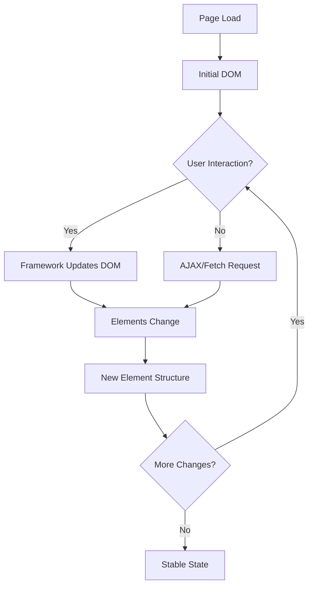
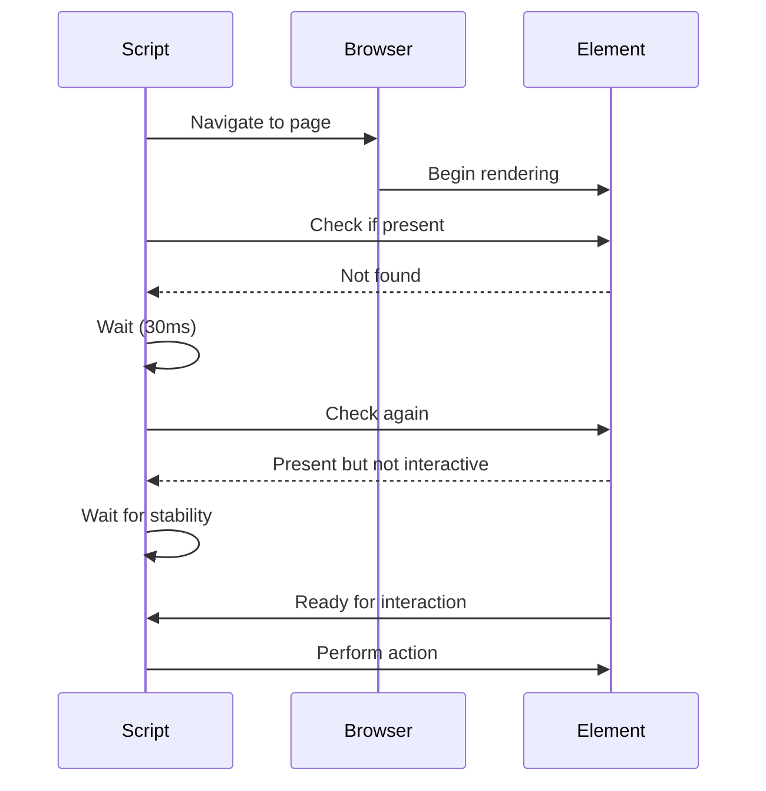

Modern web applications are masters of disguise. Elements appear, disappear, shift positions, and change their attributes faster than a magician's sleight of hand. One moment your scraper is successfully extracting data, the next it's throwing "Element not found" errors because that same element now has a different ID, class, or structure altogether.

This challenge becomes even more complex when dealing with single-page applications (SPAs), lazy-loaded content, and dynamic forms that rebuild themselves based on user interactions. The days of static HTML pages with predictable element structures are long gone, replaced by sophisticated React components, Vue.js applications, and Angular frameworks that treat the DOM as a constantly evolving canvas.

## Understanding Dynamic Element Behavior

Before diving into solutions, it's crucial to understand why elements change and the patterns behind these transformations. Modern web frameworks often generate dynamic IDs, class names, and data attributes to manage component states, prevent conflicts, and optimize rendering performance.



Consider this common scenario: a React application that generates component-specific class names during build time. What starts as a simple `.user-profile` class becomes `.user-profile_3kx9m2` in production, making your hardcoded selectors useless across different builds or environments.

## Robust Selector Strategies

The foundation of hunting changing elements lies in building selectors that can adapt to structural modifications while maintaining accuracy. Instead of relying on volatile attributes, focus on stable patterns and semantic relationships.

### Attribute-Based Hunting

Data attributes specifically designed for testing or automation tend to be more stable than styling-related classes or dynamically generated IDs:

```python
from playwright.sync_api import sync_playwright

def find_by_stable_attributes(page):
    # Prefer data attributes designed for testing
    element = page.locator('[data-testid="submit-button"]')
    
    # Use aria labels for accessible elements
    element = page.locator('[aria-label="Close dialog"]')
    
    # Target specific roles
    element = page.locator('[role="button"][aria-describedby*="submit"]')
    
    return element
```

### Content-Based Selectors

When structural attributes fail, the actual text content often remains consistent:

```python
def find_by_content(page):
    # Find by exact text
    submit_btn = page.locator('text="Submit Application"')
    
    # Partial text matching
    close_btn = page.locator('text=/Close|Cancel|Dismiss/i')
    
    # Combine text with element type
    specific_link = page.locator('a:has-text("Download Report")')
    
    return submit_btn, close_btn, specific_link
```

### Structural Relationship Mapping

Elements might change their attributes, but their relationships with parent, sibling, or child elements often remain stable:

```python
def find_by_relationships(page):
    # Find parent first, then navigate to target
    form = page.locator('form[action*="submit"]')
    submit_button = form.locator('button[type="submit"]')
    
    # Use sibling relationships
    label = page.locator('label:has-text("Email")')
    email_input = label.locator('+ input')
    
    # Navigate through hierarchies
    product_card = page.locator('.product-card:has-text("iPhone")')
    price = product_card.locator('.price')
    
    return submit_button, email_input, price
```

## Advanced XPath Techniques

XPath provides powerful capabilities for creating flexible selectors that can adapt to changing DOM structures:

```python
def advanced_xpath_selectors(driver):
    # Find elements by partial attribute values
    dynamic_id = driver.find_element(By.XPATH, 
        "//input[contains(@id, 'user-') and contains(@id, '-email')]")
    
    # Use position-based selection with conditions
    third_product = driver.find_element(By.XPATH, 
        "//div[@class='product-grid']/div[3][.//span[contains(text(), 'In Stock')]]")
    
    # Combine multiple conditions with logical operators
    active_user = driver.find_element(By.XPATH, 
        "//tr[td[1][text()='Active'] and td[2][contains(text(), 'Premium')]]//a[@class='edit-link']")
    
    # Navigate up and down the DOM tree
    parent_container = driver.find_element(By.XPATH, 
        "//span[text()='Error Message']/ancestor::div[@class='form-group']")
    
    return dynamic_id, third_product, active_user, parent_container
```

## Smart Waiting Strategies

Finding changing elements isn't just about location—it's about timing. Elements might exist but not be ready for interaction, or they might need time to stabilize after dynamic updates.



### Intelligent Wait Conditions

```python
from selenium.webdriver.support.ui import WebDriverWait
from selenium.webdriver.support import expected_conditions as EC
from selenium.webdriver.common.by import By

def smart_waiting(driver):
    wait = WebDriverWait(driver, 10)
    
    # Wait for element to be present and visible
    element = wait.until(
        EC.visibility_of_element_located((By.CSS_SELECTOR, ".dynamic-content"))
    )
    
    # Wait for element to be clickable
    button = wait.until(
        EC.element_to_be_clickable((By.XPATH, "//button[contains(text(), 'Process')]"))
    )
    
    # Custom condition: wait for element text to stabilize
    def text_stabilized(locator):
        def check_text_stable(driver):
            try:
                element = driver.find_element(*locator)
                initial_text = element.text
                time.sleep(0.1)
                return element.text == initial_text and len(initial_text) > 0
            except:
                return False
        return check_text_stable
    
    stable_element = wait.until(
        text_stabilized((By.CLASS_NAME, "loading-content"))
    )
```

### Playwright's Advanced Waiting

```python
async def playwright_smart_waiting(page):
    # Wait for element with retry logic
    await page.wait_for_selector(
        '.data-table tr', 
        state='attached',
        timeout=30000
    )
    
    # Wait for network to be idle before proceeding
    await page.wait_for_load_state('networkidle')
    
    # Custom waiting with polling
    async def wait_for_stable_element():
        for attempt in range(10):
            try:
                element = page.locator('.price-display')
                if await element.count() > 0:
                    text = await element.text_content()
                    await page.wait_for_timeout(200)
                    new_text = await element.text_content()
                    if text == new_text and text:
                        return element
            except:
                pass
            await page.wait_for_timeout(500)
        raise TimeoutError("Element never stabilized")
    
    stable_price = await wait_for_stable_element()
```

## Handling Framework-Specific Challenges

Different JavaScript frameworks present unique challenges for element hunting. Understanding these patterns helps build more reliable scrapers.

### React Applications

React's virtual DOM and component lifecycle can cause elements to unmount and remount unexpectedly:

```python
def handle_react_elements(page):
    # Wait for React to finish rendering
    page.wait_for_function("window.React !== undefined")
    
    # Look for React-specific attributes
    react_component = page.locator('[data-reactid]')
    
    # Use React DevTools if available
    page.evaluate("""
        if (window.__REACT_DEVTOOLS_GLOBAL_HOOK__) {
            window.__REACT_DEVTOOLS_GLOBAL_HOOK__.onCommitFiberRoot = () => {
                window.reactRenderComplete = true;
            };
        }
    """)
    
    page.wait_for_function("window.reactRenderComplete === true")
```

### Vue.js Applications

Vue's reactivity system can cause rapid DOM updates:

```python
def handle_vue_elements(page):
    # Wait for Vue instance to be ready
    page.wait_for_function("window.Vue !== undefined")
    
    # Use Vue's nextTick equivalent
    page.evaluate("""
        if (window.Vue) {
            Vue.nextTick(() => {
                window.vueReady = true;
            });
        }
    """)
    
    page.wait_for_function("window.vueReady === true")
```

## Building Resilient Element Finders

Create wrapper functions that implement multiple fallback strategies:

```python
class ResilientElementFinder:
    def __init__(self, driver):
        self.driver = driver
        self.wait = WebDriverWait(driver, 10)
    
    def find_element_with_fallbacks(self, primary_selector, fallback_selectors):
        # Try primary selector first
        try:
            return self.wait.until(
                EC.presence_of_element_located((By.CSS_SELECTOR, primary_selector))
            )
        except:
            pass
        
        # Try fallback selectors
        for selector_type, selector_value in fallback_selectors:
            try:
                return self.driver.find_element(selector_type, selector_value)
            except:
                continue
        
        raise Exception(f"Element not found with any selector")
    
    def find_by_multiple_strategies(self, element_config):
        strategies = [
            ('data-testid', element_config.get('testid')),
            ('aria-label', element_config.get('aria_label')),
            ('text_content', element_config.get('text')),
            ('css_class', element_config.get('class')),
            ('xpath', element_config.get('xpath'))
        ]
        
        for strategy, value in strategies:
            if not value:
                continue
                
            try:
                if strategy == 'data-testid':
                    return self.driver.find_element(By.CSS_SELECTOR, f'[data-testid="{value}"]')
                elif strategy == 'aria-label':
                    return self.driver.find_element(By.CSS_SELECTOR, f'[aria-label="{value}"]')
                elif strategy == 'text_content':
                    return self.driver.find_element(By.XPATH, f'//*[contains(text(), "{value}")]')
                elif strategy == 'css_class':
                    return self.driver.find_element(By.CLASS_NAME, value)
                elif strategy == 'xpath':
                    return self.driver.find_element(By.XPATH, value)
            except:
                continue
        
        return None

# Usage example
finder = ResilientElementFinder(driver)
submit_button = finder.find_by_multiple_strategies({
    'testid': 'submit-form',
    'aria_label': 'Submit application',
    'text': 'Submit',
    'class': 'btn-primary',
    'xpath': '//button[@type="submit"]'
})
```

## Performance Optimization for Element Hunting

Constantly searching for changing elements can slow down your scraper. Implement caching and optimization strategies:

```python
import time
from functools import lru_cache

class OptimizedElementHunter:
    def __init__(self, driver):
        self.driver = driver
        self.element_cache = {}
        self.last_page_hash = None
    
    def get_page_hash(self):
        # Simple hash based on URL and some DOM content
        return hash(self.driver.current_url + self.driver.find_element(By.TAG_NAME, 'body').get_attribute('outerHTML')[:1000])
    
    def find_element_cached(self, selector_strategies, cache_key=None):
        current_hash = self.get_page_hash()
        
        # Clear cache if page changed significantly
        if self.last_page_hash != current_hash:
            self.element_cache.clear()
            self.last_page_hash = current_hash
        
        # Check cache first
        if cache_key and cache_key in self.element_cache:
            element = self.element_cache[cache_key]
            try:
                element.is_displayed()  # Verify element is still valid
                return element
            except:
                del self.element_cache[cache_key]
        
        # Find element using strategies
        for strategy, selector in selector_strategies:
            try:
                element = self.driver.find_element(strategy, selector)
                if cache_key:
                    self.element_cache[cache_key] = element
                return element
            except:
                continue
        
        return None
```

The landscape of web elements is constantly shifting, but with the right techniques and mindset, you can build scrapers that adapt and thrive in this dynamic environment. Remember that element hunting is as much art as it is science—sometimes the most elegant solution comes from understanding the specific patterns and behaviors of the application you're scraping.

What's the most challenging dynamic element behavior you've encountered in your scraping projects? Have you discovered any unique strategies that work particularly well for specific types of applications?