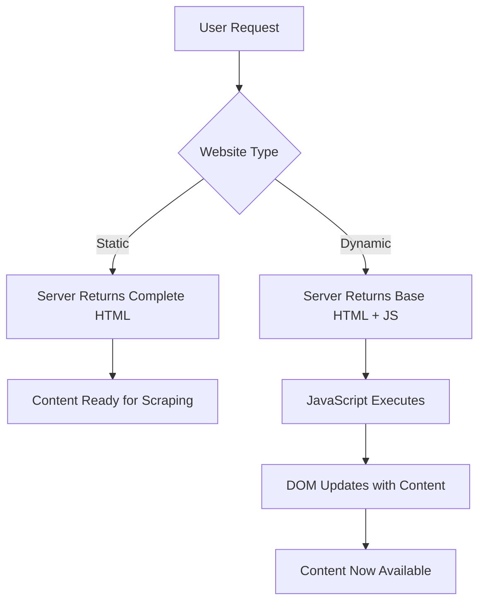
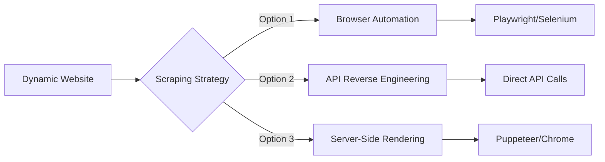
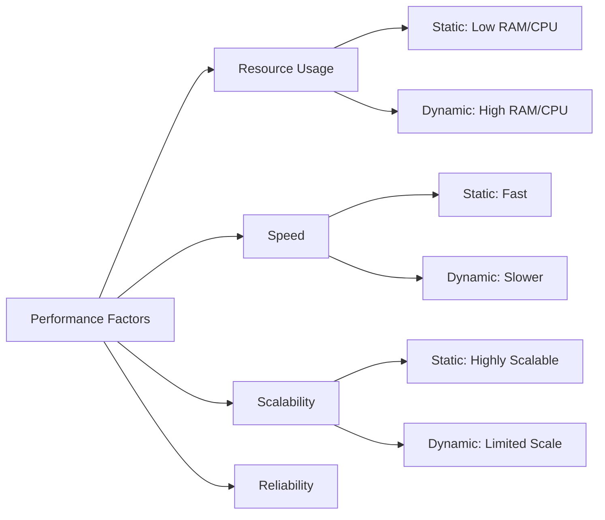

Understanding the fundamental difference between static and dynamic websites is crucial for any web scraper. This distinction determines your entire approach, from the tools you'll use to the complexity of your extraction pipeline. Let's dive deep into what makes websites tick and how it impacts your scraping strategy.

## The Architecture Behind Web Content

When you visit a website, what you see isn't always what you get on the first server response. The way content is delivered and rendered varies dramatically between static and dynamic websites, creating entirely different challenges for data extraction.



Static websites deliver fully-formed HTML content directly from the server. Every piece of text, every image reference, and every link exists in the initial HTML response. This means when your scraper makes a request, it receives the complete picture immediately.

Dynamic websites, however, send a skeleton HTML structure along with JavaScript code. The actual content gets populated after the JavaScript executes in the browser, often fetching data from APIs or other sources. This creates a timing challenge that many inexperienced scrapers stumble upon.

## Identifying Static vs. Dynamic Content

Before choosing your scraping approach, you need to identify what type of website you're dealing with. Here's a systematic approach to make this determination:

**The View Source Test**

Right-click on any webpage and select "View Page Source." This shows you the raw HTML that the server initially sends. If you can see the data you want to scrape in this source code, you're dealing with static content for that particular element.

```python
import requests
from bs4 import BeautifulSoup

def check_static_content(url, search_text):
    response = requests.get(url)
    soup = BeautifulSoup(response.content, 'html.parser')
    
    if search_text.lower() in soup.get_text().lower():
        print(f"'{search_text}' found in static HTML")
        return True
    else:
        print(f"'{search_text}' not found - likely dynamic content")
        return False

# Example usage
check_static_content("https://example.com", "target content")
```

**Network Tab Investigation**

Open your browser's developer tools and navigate to the Network tab. Reload the page and observe the requests. Static websites will show minimal network activity after the initial page load, while dynamic websites will show additional XHR or Fetch requests loading data.

**JavaScript Dependency Check**

Try disabling JavaScript in your browser and reload the page. If the content disappears or shows as loading placeholders, you're dealing with dynamic content that requires JavaScript execution.

## Scraping Static Websites

Static websites are the scraper's best friend. They're predictable, fast to process, and require minimal resources. Your entire scraping operation can rely on simple HTTP requests and HTML parsing.

```python
import requests
from bs4 import BeautifulSoup
import time
import random

class StaticScraper:
    def __init__(self):
        self.session = requests.Session()
        self.session.headers.update({
            'User-Agent': 'Mozilla/5.0 (Windows NT 10.0; Win64; x64) AppleWebKit/537.36'
        })
    
    def scrape_page(self, url):
        try:
            response = self.session.get(url)
            response.raise_for_status()
            
            soup = BeautifulSoup(response.content, 'html.parser')
            
            # Extract data directly from HTML
            data = {
                'title': soup.find('h1').get_text(strip=True) if soup.find('h1') else None,
                'content': [p.get_text(strip=True) for p in soup.find_all('p')],
                'links': [a.get('href') for a in soup.find_all('a', href=True)]
            }
            
            return data
            
        except requests.RequestException as e:
            print(f"Request failed: {e}")
            return None
    
    def scrape_multiple_pages(self, urls):
        results = []
        for url in urls:
            data = self.scrape_page(url)
            if data:
                results.append(data)
            
            # Respectful delay between requests
            time.sleep(random.uniform(1, 3))
        
        return results
```

The beauty of static scraping lies in its simplicity and efficiency. You can process hundreds of pages quickly without the overhead of browser automation. However, be mindful of rate limiting and implement proper delays between requests.

## Tackling Dynamic Websites

Dynamic websites require a different strategy entirely. You need to render the JavaScript to access the content, which means using browser automation tools or finding alternative data sources.



**Browser Automation Approach**

```python
from playwright.sync_api import sync_playwright
import json

class DynamicScraper:
    def __init__(self):
        self.playwright = None
        self.browser = None
        self.context = None
    
    def __enter__(self):
        self.playwright = sync_playwright().start()
        self.browser = self.playwright.chromium.launch(
            headless=True,
            args=['--no-sandbox', '--disable-dev-shm-usage']
        )
        self.context = self.browser.new_context(
            viewport={'width': 1920, 'height': 1080},
            user_agent='Mozilla/5.0 (Windows NT 10.0; Win64; x64) AppleWebKit/537.36'
        )
        return self
    
    def __exit__(self, exc_type, exc_val, exc_tb):
        if self.context:
            self.context.close()
        if self.browser:
            self.browser.close()
        if self.playwright:
            self.playwright.stop()
    
    def scrape_dynamic_content(self, url, wait_selector=None):
        page = self.context.new_page()
        
        try:
            page.goto(url)
            
            # Wait for dynamic content to load
            if wait_selector:
                page.wait_for_selector(wait_selector, timeout=30000)
            else:
                page.wait_for_load_state('networkidle')
            
            # Extract data after JavaScript execution
            data = page.evaluate("""
                () => {
                    return {
                        title: document.querySelector('h1')?.textContent?.trim(),
                        dynamicContent: Array.from(document.querySelectorAll('.dynamic-item'))
                            .map(item => item.textContent.trim()),
                        loadedData: window.loadedData || null
                    };
                }
            """)
            
            return data
            
        except Exception as e:
            print(f"Failed to scrape {url}: {e}")
            return None
        finally:
            page.close()

# Usage
with DynamicScraper() as scraper:
    result = scraper.scrape_dynamic_content(
        "https://example.com", 
        wait_selector=".dynamic-content"
    )
    print(json.dumps(result, indent=2))
```

**API Reverse Engineering Strategy**

Often, the most efficient way to scrape dynamic content is to bypass the website entirely and call the underlying APIs directly.

```python
import requests
import time

class APIScraper:
    def __init__(self):
        self.session = requests.Session()
        self.base_headers = {
            'Accept': 'application/json, text/plain, */*',
            'Accept-Language': 'en-US,en;q=0.9',
            'Referer': 'https://example.com',
            'User-Agent': 'Mozilla/5.0 (Windows NT 10.0; Win64; x64) AppleWebKit/537.36'
        }
    
    def find_api_endpoints(self, base_url):
        """
        Use browser dev tools to identify API endpoints,
        then replicate the requests here
        """
        api_endpoints = []
        
        # Common API patterns to check
        patterns = [
            f"{base_url}/api/data",
            f"{base_url}/api/v1/content",
            f"{base_url}/ajax/load",
            f"{base_url}/graphql"
        ]
        
        for endpoint in patterns:
            try:
                response = self.session.get(endpoint, headers=self.base_headers)
                if response.status_code == 200:
                    api_endpoints.append(endpoint)
            except:
                continue
        
        return api_endpoints
    
    def scrape_api_data(self, api_url, params=None):
        try:
            response = self.session.get(
                api_url, 
                headers=self.base_headers, 
                params=params
            )
            response.raise_for_status()
            return response.json()
        except Exception as e:
            print(f"API request failed: {e}")
            return None
```

## Performance Considerations

The choice between static and dynamic scraping approaches has significant performance implications that extend beyond simple execution time.



Static scraping can handle thousands of pages with minimal resource consumption. A single server can manage multiple concurrent scraping processes without breaking a sweat. Dynamic scraping, however, requires browser instances that consume significant memory and CPU resources.

## Hybrid Approach: Best of Both Worlds

Many modern websites combine static and dynamic elements. The navigation and basic structure might be static, while specific content sections load dynamically. A sophisticated scraper recognizes these patterns and adapts accordingly.

```python
class HybridScraper:
    def __init__(self):
        self.static_scraper = StaticScraper()
        self.dynamic_scraper = None
    
    def analyze_page_structure(self, url):
        # First, try static scraping
        static_content = self.static_scraper.scrape_page(url)
        
        # Check for dynamic content indicators
        response = requests.get(url)
        html_content = response.text
        
        dynamic_indicators = [
            'data-react-',
            'ng-app',
            'vue-app',
            'loading...',
            'spinner',
            'skeleton'
        ]
        
        has_dynamic_content = any(indicator in html_content.lower() 
                                for indicator in dynamic_indicators)
        
        return {
            'static_content': static_content,
            'needs_dynamic_scraping': has_dynamic_content
        }
    
    def scrape_intelligently(self, url):
        analysis = self.analyze_page_structure(url)
        
        if not analysis['needs_dynamic_scraping']:
            return analysis['static_content']
        
        # Initialize dynamic scraper only when needed
        if not self.dynamic_scraper:
            self.dynamic_scraper = DynamicScraper()
        
        with self.dynamic_scraper as scraper:
            return scraper.scrape_dynamic_content(url)
```

## Common Pitfalls and Solutions

**Timing Issues with Dynamic Content**

The most common mistake when scraping dynamic websites is not waiting long enough for content to load. Different elements load at different times, and network conditions can affect loading speeds.

```javascript
// Browser-side code to ensure content is fully loaded
function waitForContent(selector, timeout = 10000) {
    return new Promise((resolve, reject) => {
        const startTime = Date.now();
        
        function check() {
            const element = document.querySelector(selector);
            const currentTime = Date.now();
            
            if (element && element.textContent.trim()) {
                resolve(element);
            } else if (currentTime - startTime >= timeout) {
                reject(new Error('Timeout waiting for content'));
            } else {
                setTimeout(check, 100);
            }
        }
        
        check();
    });
}
```

**Memory Leaks in Browser Automation**

Dynamic scraping can quickly consume system resources if not managed properly. Always ensure proper cleanup of browser instances and implement resource monitoring.

**Inconsistent Data Structure**

Dynamic websites often return data in varying formats depending on the user's state, location, or other factors. Build your scrapers to handle these variations gracefully.

## The Strategic Decision Framework

Choosing between static and dynamic scraping approaches shouldn't be arbitrary. Consider these factors:

1. **Data Accessibility**: Can you access the required data through static HTML?
2. **Volume Requirements**: How many pages do you need to scrape daily?
3. **Real-time Needs**: Do you need the most current data, or is slightly delayed data acceptable?
4. **Resource Constraints**: What are your server and bandwidth limitations?
5. **Maintenance Overhead**: How much time can you invest in maintaining the scraper?

Understanding these architectural differences isn't just academic knowledge—it's the foundation that determines whether your scraping project succeeds or fails spectacularly. The website's structure dictates your entire technical approach, from infrastructure requirements to code complexity.

What type of websites are you currently struggling to scrape effectively? Have you encountered situations where the wrong approach led to incomplete data extraction or resource exhaustion? Share your experiences and let's discuss the specific challenges you're facing in your scraping projects.
------- End of File ( do not include this line ) -------