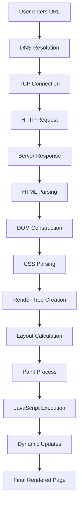
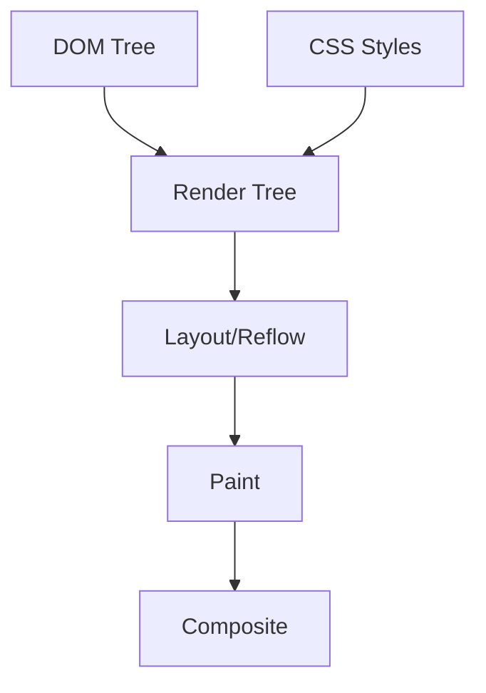
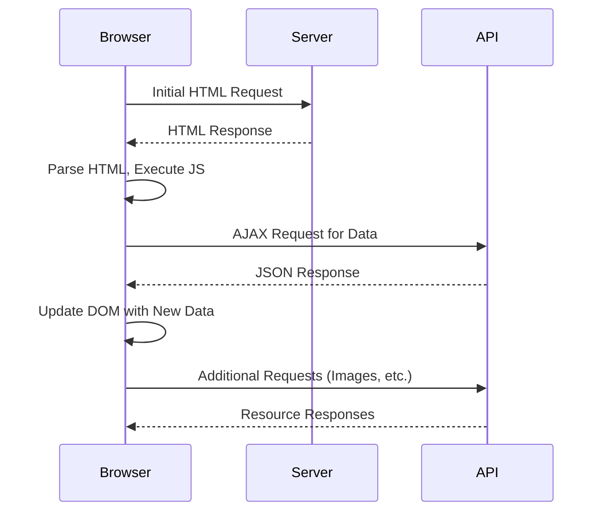

When you navigate to a website, a complex orchestration of events unfolds behind the scenes before you see the final rendered page. Understanding this process isn't just academic curiosity—it's crucial for effective web scraping and data extraction. The difference between a successful scrape and a failed one often lies in knowing exactly when and how content becomes available on a page.

## The Browser's Journey: From URL to Visual Content

The moment you enter a URL or click a link, your browser initiates a multi-step process that transforms raw HTML, CSS, and JavaScript into the interactive webpage you see. This journey involves network requests, parsing, rendering, and execution phases that each present unique opportunities and challenges for data extraction.



## HTML Parsing and DOM Construction

When the browser receives HTML content from the server, it immediately begins parsing the markup into a tree-like structure called the Document Object Model (DOM). This parsing happens incrementally—the browser doesn't wait for the entire HTML document to download before starting to build the DOM tree.

```python
import requests
from bs4 import BeautifulSoup

# This is what we get during the initial HTML parsing phase
response = requests.get('https://example.com')
soup = BeautifulSoup(response.content, 'html.parser')

# At this point, we only have the static HTML structure
# JavaScript hasn't executed yet, so dynamic content is missing
print(soup.prettify())
```

The DOM construction follows specific rules. When the parser encounters elements like `<script>` tags, it may pause HTML parsing to download and execute JavaScript, depending on the script's attributes. This blocking behavior is why script placement and attributes like `async` and `defer` significantly impact page load performance and content availability timing.

## CSS Processing and Style Calculation

Parallel to DOM construction, the browser processes CSS from various sources: inline styles, `<style>` tags, and external stylesheets. The browser must download all CSS resources before it can render content because CSS can dramatically affect layout and visibility.

```css
/* CSS can hide content that might be important for scraping */
.hidden-content {
    display: none;
    visibility: hidden;
}

.lazy-load {
    opacity: 0;
    transition: opacity 0.3s;
}

.lazy-load.loaded {
    opacity: 1;
}
```

This CSS processing phase is critical for scrapers to understand. Content might exist in the DOM but be invisible due to CSS rules. Modern websites frequently use CSS to control content visibility based on user interactions or loading states.

## The Render Tree and Layout Process

Once the browser has both DOM and CSS information, it creates the render tree—a combination that represents what should actually be displayed on screen. Elements with `display: none` are excluded from the render tree entirely, while elements with `visibility: hidden` are included but marked as invisible.



The layout process calculates the exact position and size of each element. This is where responsive design rules are applied, and where elements might shift based on viewport size, which is crucial when scraping mobile vs desktop versions of sites.

## JavaScript Execution: Where Things Get Complex

JavaScript execution is where page rendering becomes particularly relevant for web scraping. Modern websites heavily rely on JavaScript to load content, modify the DOM, and create interactive experiences. This creates several distinct scenarios:

### Client-Side Rendering (CSR)

Many modern web applications render content entirely through JavaScript. The initial HTML might be minimal, with JavaScript responsible for fetching data and creating the user interface:

```html
<!-- Initial HTML might look like this -->
<div id="app">Loading...</div>
<script src="app.js"></script>
```

```javascript
// JavaScript then populates the content
fetch('/api/data')
    .then(response => response.json())
    .then(data => {
        document.getElementById('app').innerHTML = generateHTML(data);
    });
```

For scrapers, this means the content you want won't be available immediately after the initial HTML loads. You need to wait for JavaScript execution to complete.

### Server-Side Rendering (SSR) with Hydration

Some applications render the initial content on the server but then "hydrate" it with JavaScript functionality on the client:

```python
from playwright.sync_api import sync_playwright

def scrape_with_hydration_awareness():
    with sync_playwright() as p:
        browser = p.chromium.launch()
        page = browser.new_page()
        
        # Navigate to the page
        page.goto('https://example.com')
        
        # Wait for hydration to complete
        # This might involve waiting for specific elements or network activities
        page.wait_for_load_state('networkidle')
        
        # Now extract data
        content = page.content()
        browser.close()
        return content
```

## Asynchronous Loading and Dynamic Content

Modern websites don't load all content at once. They employ various strategies to improve perceived performance:

### Lazy Loading

Content below the fold might not load until the user scrolls:

```javascript
// Intersection Observer for lazy loading
const observer = new IntersectionObserver((entries) => {
    entries.forEach(entry => {
        if (entry.isIntersecting) {
            loadContent(entry.target);
        }
    });
});

document.querySelectorAll('.lazy-load').forEach(el => {
    observer.observe(el);
});
```

### Infinite Scroll

Social media sites and product listings often load more content as users scroll:

```python
from selenium.webdriver.common.action_chains import ActionChains
import time

def scrape_infinite_scroll(driver):
    last_height = driver.execute_script("return document.body.scrollHeight")
    
    while True:
        # Scroll to bottom
        driver.execute_script("window.scrollTo(0, document.body.scrollHeight);")
        
        # Wait for new content to load
        time.sleep(2)
        
        new_height = driver.execute_script("return document.body.scrollHeight")
        if new_height == last_height:
            break
        last_height = new_height
```

## Network Requests and AJAX Calls

After the initial page load, websites often make additional network requests to fetch data. Understanding these patterns helps determine when content is fully loaded:



Monitoring these network requests helps determine the right moment to extract data:

```python
from playwright.sync_api import sync_playwright

def scrape_with_network_monitoring():
    with sync_playwright() as p:
        browser = p.chromium.launch()
        page = browser.new_page()
        
        # Track network requests
        requests = []
        page.on("request", lambda request: requests.append(request.url))
        
        page.goto('https://example.com')
        
        # Wait for specific API call to complete
        page.wait_for_response(lambda response: '/api/products' in response.url)
        
        # Now the product data should be available
        products = page.query_selector_all('.product')
        
        browser.close()
        return products
```

## Rendering Performance and Loading States

Different loading states provide different opportunities for data extraction. Websites typically progress through several states:

1. **Initial Load**: Basic HTML structure available
2. **DOMContentLoaded**: DOM fully constructed, but resources still loading
3. **Load Event**: All resources loaded, but JavaScript might still be executing
4. **Network Idle**: No network activity for a specified time
5. **Application Ready**: Custom application-specific ready state

```javascript
// Different ready states you might encounter
document.addEventListener('DOMContentLoaded', function() {
    console.log('DOM ready, but images/stylesheets might still be loading');
});

window.addEventListener('load', function() {
    console.log('All resources loaded, but app might still be initializing');
});

// Custom ready state
window.addEventListener('app-ready', function() {
    console.log('Application fully initialized and ready for interaction');
});
```

## Browser Differences and Rendering Engines

Different browsers have different rendering engines that can affect how and when content becomes available:

- **Chromium** (Chrome, Edge, Playwright): Blink engine
- **Firefox**: Gecko engine  
- **Safari**: WebKit engine

These differences can affect JavaScript execution timing, CSS interpretation, and network request handling. For consistent scraping results, it's often best to standardize on one browser engine:

```python
# Consistent browser choice for scraping
from playwright.sync_api import sync_playwright

def get_consistent_browser():
    # Always use Chromium for consistent behavior
    with sync_playwright() as p:
        return p.chromium.launch(
            args=[
                '--disable-blink-features=AutomationControlled',
                '--disable-dev-shm-usage',
                '--no-first-run'
            ]
        )
```

## Handling Single Page Applications (SPAs)

SPAs present unique challenges because they manipulate the URL and content without traditional page loads:

```python
def scrape_spa_navigation():
    with sync_playwright() as p:
        browser = p.chromium.launch()
        page = browser.new_page()
        
        page.goto('https://spa-example.com')
        
        # Navigate within the SPA
        page.click('a[href="/products"]')
        
        # Wait for the SPA to update content
        # URL might change, but it's not a traditional page load
        page.wait_for_selector('.product-list', state='visible')
        
        # Extract data from the updated view
        products = page.query_selector_all('.product-item')
        
        browser.close()
```

## Timing Strategies for Content Extraction

Knowing when to extract content requires understanding the specific loading patterns of your target site:

```python
from playwright.sync_api import sync_playwright
import time

class ContentTimingStrategy:
    def __init__(self, page):
        self.page = page
    
    def wait_for_element(self, selector, timeout=10000):
        """Wait for specific element to appear"""
        return self.page.wait_for_selector(selector, timeout=timeout)
    
    def wait_for_network_idle(self, timeout=30000):
        """Wait for network requests to settle"""
        self.page.wait_for_load_state('networkidle', timeout=timeout)
    
    def wait_for_custom_condition(self, condition_js, timeout=10000):
        """Wait for custom JavaScript condition"""
        self.page.wait_for_function(condition_js, timeout=timeout)
    
    def wait_for_stable_content(self, selector, stability_time=2000):
        """Wait for content to stop changing"""
        previous_content = ""
        stable_start = time.time()
        
        while True:
            current_content = self.page.inner_text(selector)
            if current_content != previous_content:
                previous_content = current_content
                stable_start = time.time()
            elif time.time() - stable_start > stability_time / 1000:
                break
            time.sleep(0.5)
```

## Performance Optimization for Scrapers

Understanding rendering allows you to optimize scraper performance by disabling unnecessary features:

```python
def create_optimized_browser():
    return sync_playwright().chromium.launch(
        args=[
            '--disable-javascript',  # Only if JS isn't needed
            '--disable-images',      # Skip image loading
            '--disable-css',         # Skip CSS if only extracting text
            '--disable-plugins',
            '--disable-extensions'
        ]
    )
```

The intricate dance between HTML parsing, CSS application, JavaScript execution, and network requests creates a complex landscape for web scraping. Each phase offers different data extraction opportunities and requires different timing strategies. Mastering these concepts transforms you from someone who occasionally succeeds at scraping to someone who can reliably extract data from even the most complex modern web applications.

What rendering challenges have you encountered in your scraping projects, and which timing strategy do you find most reliable for dynamic content?