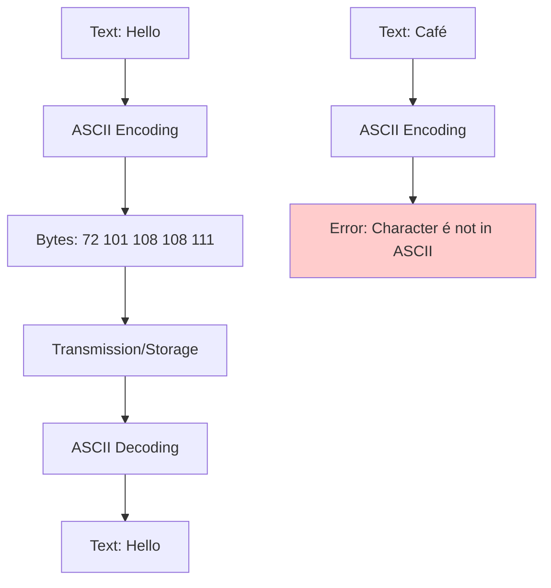
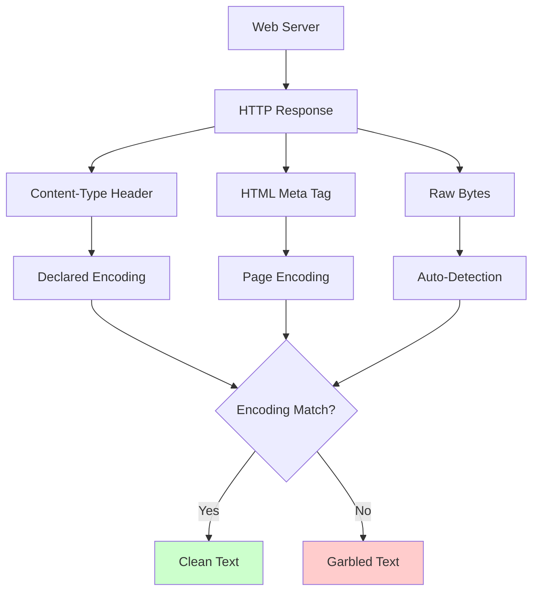
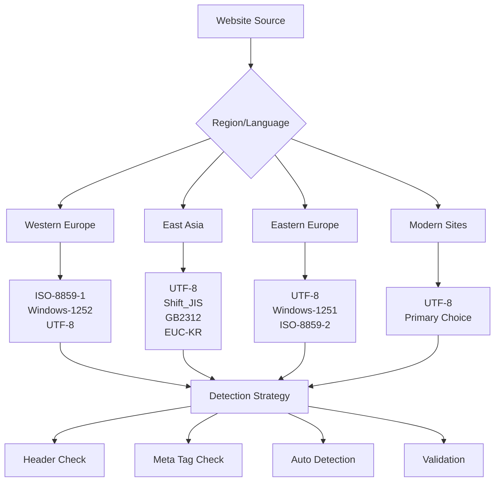

Every web scraper has encountered those mysterious question marks, diamond symbols, or completely garbled text when extracting data from websites. These aren't bugs in your code – they're encoding issues, and understanding them can save you hours of debugging frustration.

Character encoding determines how computers store and interpret text. When you scrape a website, you're essentially asking a server to send you text data, but that text needs to be encoded into bytes for transmission and then decoded back into readable characters. If this process goes wrong, you'll end up with corrupted data that can ruin your entire dataset.

## What Exactly Is Character Encoding?

Think of character encoding as a translation dictionary between human-readable text and computer-readable numbers. Every character you see – letters, numbers, symbols, emojis – has a corresponding numerical value that computers use internally.

The most basic encoding system is ASCII, which handles English characters and basic symbols using 7 bits per character. This gives us 128 possible characters, which works fine for basic English text but fails miserably when you encounter accented characters, non-Latin scripts, or modern symbols.



UTF-8 emerged as the solution to ASCII's limitations. It's a variable-length encoding that can represent every character in the Unicode standard while maintaining backward compatibility with ASCII. This means the first 128 characters in UTF-8 are identical to ASCII, but it can also handle millions of additional characters from virtually every writing system on Earth.

## Why Encoding Problems Happen in Web Scraping

When you make a request to a web server, multiple layers can introduce encoding issues. The server might send content in one encoding while claiming it's in another, or it might not specify an encoding at all, leaving your scraper to guess.

Browsers are quite forgiving with encoding issues and often make educated guesses about what encoding to use. Your scraping code, however, needs to be more explicit about handling these situations.



## Common Encoding Challenges and Solutions

The most frequent issue you'll encounter is the dreaded "UTF-8 decode error" or seeing replacement characters () in your scraped data. This usually happens when your code assumes UTF-8 encoding but receives data in a different format.

Here's how to handle encoding detection and conversion properly in Python:

```python
import requests
import chardet
from bs4 import BeautifulSoup

def scrape_with_proper_encoding(url):
    # Get raw response without automatic decoding
    response = requests.get(url)
    
    # Method 1: Trust the Content-Type header
    content_type = response.headers.get('content-type', '')
    if 'charset=' in content_type:
        declared_encoding = content_type.split('charset=')[1].split(';')[0]
        try:
            text = response.content.decode(declared_encoding)
            print(f"Successfully decoded with declared encoding: {declared_encoding}")
            return text
        except (UnicodeDecodeError, LookupError):
            print(f"Declared encoding {declared_encoding} failed")
    
    # Method 2: Auto-detect encoding
    detected = chardet.detect(response.content)
    detected_encoding = detected['encoding']
    confidence = detected['confidence']
    
    if confidence > 0.7:  # High confidence threshold
        try:
            text = response.content.decode(detected_encoding)
            print(f"Successfully decoded with detected encoding: {detected_encoding} (confidence: {confidence:.2f})")
            return text
        except UnicodeDecodeError:
            print(f"Detected encoding {detected_encoding} failed despite high confidence")
    
    # Method 3: Fallback to UTF-8 with error handling
    try:
        text = response.content.decode('utf-8')
        print("Successfully decoded with UTF-8")
        return text
    except UnicodeDecodeError:
        # Method 4: Last resort - decode with errors='replace'
        text = response.content.decode('utf-8', errors='replace')
        print("Decoded with UTF-8 using replacement characters for invalid bytes")
        return text

# Example usage
url = "https://example-site-with-encoding-issues.com"
content = scrape_with_proper_encoding(url)
```

For handling specific encoding scenarios, you might need to deal with mixed encodings within the same page. Some websites serve different parts of their content in different encodings, particularly when they embed user-generated content or pull data from multiple sources.

```python
def handle_mixed_encoding_content(raw_bytes):
    """
    Handle content that might have mixed encodings
    """
    # Split content into chunks and try different encodings
    chunk_size = 1024
    decoded_chunks = []
    
    for i in range(0, len(raw_bytes), chunk_size):
        chunk = raw_bytes[i:i + chunk_size]
        
        # Try multiple encodings in order of likelihood
        for encoding in ['utf-8', 'latin-1', 'cp1252', 'iso-8859-1']:
            try:
                decoded_chunk = chunk.decode(encoding)
                decoded_chunks.append(decoded_chunk)
                break
            except UnicodeDecodeError:
                continue
        else:
            # If all encodings fail, use replacement characters
            decoded_chunks.append(chunk.decode('utf-8', errors='replace'))
    
    return ''.join(decoded_chunks)
```

## JavaScript and Browser-Based Scraping

When using browser automation tools like Playwright or Puppeteer, encoding issues are less common because the browser handles the decoding automatically. However, you might still encounter problems when extracting text from the page or when the page uses JavaScript to dynamically load content with different encodings.

```javascript
// Playwright example for handling encoding in JavaScript
const { chromium } = require('playwright');

async function scrapeWithEncodingAwareness(url) {
    const browser = await chromium.launch();
    const page = await browser.newPage();
    
    // Set request interception to inspect encoding
    await page.route('**/*', async (route) => {
        const response = await route.continue();
        
        // Log encoding information
        const contentType = response.headers()['content-type'];
        if (contentType) {
            console.log(`Content-Type: ${contentType}`);
        }
    });
    
    await page.goto(url);
    
    // Extract text with proper encoding handling
    const textContent = await page.evaluate(() => {
        // Check document encoding
        console.log(`Document charset: ${document.characterSet}`);
        console.log(`Document inputEncoding: ${document.inputEncoding}`);
        
        // Return text content
        return document.body.innerText;
    });
    
    await browser.close();
    return textContent;
}
```

## Advanced Encoding Detection Strategies

Sometimes you need more sophisticated approaches to handle encoding detection, especially when dealing with legacy systems or poorly configured servers. Here's a robust detection strategy that considers multiple sources of encoding information:

```python
import re
from urllib.parse import urlparse

def advanced_encoding_detection(response, url):
    """
    Multi-layered encoding detection strategy
    """
    potential_encodings = []
    
    # 1. Check HTTP Content-Type header
    content_type = response.headers.get('content-type', '')
    charset_match = re.search(r'charset=([^;\s]+)', content_type, re.IGNORECASE)
    if charset_match:
        potential_encodings.append(('http_header', charset_match.group(1)))
    
    # 2. Check HTML meta tags
    # Look for both formats: <meta charset="..."> and <meta http-equiv="...">
    content_start = response.content[:2048]  # Check first 2KB only
    
    # Modern meta charset
    charset_meta = re.search(rb'<meta[^>]+charset=["\']?([^"\'>\s]+)', content_start, re.IGNORECASE)
    if charset_meta:
        potential_encodings.append(('meta_charset', charset_meta.group(1).decode('ascii', errors='ignore')))
    
    # Legacy meta http-equiv
    http_equiv_meta = re.search(rb'<meta[^>]+http-equiv=["\']content-type["\'][^>]+content=["\'][^"\']*charset=([^"\';\s]+)', content_start, re.IGNORECASE)
    if http_equiv_meta:
        potential_encodings.append(('meta_http_equiv', http_equiv_meta.group(1).decode('ascii', errors='ignore')))
    
    # 3. Use chardet for automatic detection
    detected = chardet.detect(response.content)
    if detected['encoding'] and detected['confidence'] > 0.6:
        potential_encodings.append(('chardet', detected['encoding']))
    
    # 4. Make educated guesses based on TLD or content patterns
    domain = urlparse(url).netloc
    if any(tld in domain for tld in ['.jp', '.cn', '.kr']):
        potential_encodings.extend([('guess_asian', 'utf-8'), ('guess_asian', 'shift_jis'), ('guess_asian', 'gb2312')])
    elif any(tld in domain for tld in ['.ru', '.bg', '.mk']):
        potential_encodings.extend([('guess_cyrillic', 'utf-8'), ('guess_cyrillic', 'windows-1251')])
    
    # 5. Try each encoding in order of reliability
    for source, encoding in potential_encodings:
        try:
            decoded_text = response.content.decode(encoding)
            # Validate the decoded text makes sense
            if validate_decoded_text(decoded_text):
                return decoded_text, encoding, source
        except (UnicodeDecodeError, LookupError):
            continue
    
    # Fallback to UTF-8 with replacement
    return response.content.decode('utf-8', errors='replace'), 'utf-8', 'fallback'

def validate_decoded_text(text):
    """
    Simple validation to check if decoded text looks reasonable
    """
    # Check for excessive replacement characters
    replacement_ratio = text.count('') / max(len(text), 1)
    if replacement_ratio > 0.1:  # More than 10% replacement characters
        return False
    
    # Check for reasonable character distribution
    printable_chars = sum(1 for c in text[:1000] if c.isprintable() or c.isspace())
    if printable_chars / min(len(text), 1000) < 0.8:  # Less than 80% printable
        return False
    
    return True
```

## Real-World Encoding Scenarios

Different regions and industries tend to use specific encodings. E-commerce sites in Western Europe often use ISO-8859-1 or Windows-1252 for legacy reasons, while Asian websites predominantly use UTF-8 but might have legacy sections in region-specific encodings like Shift_JIS for Japanese or GB2312 for Chinese.



When scraping international e-commerce platforms, you'll often encounter product descriptions, user reviews, and seller information in different encodings within the same page. Building a robust pipeline that can handle these mixed-encoding scenarios is crucial for data quality.

```python
class EncodingAwareSession:
    def __init__(self):
        self.session = requests.Session()
        self.encoding_cache = {}
    
    def get_with_smart_encoding(self, url, **kwargs):
        """
        Make a request with intelligent encoding detection and caching
        """
        # Check if we've seen this domain before
        domain = urlparse(url).netloc
        cached_encoding = self.encoding_cache.get(domain)
        
        response = self.session.get(url, **kwargs)
        
        # Try cached encoding first if available
        if cached_encoding:
            try:
                text = response.content.decode(cached_encoding)
                return text, cached_encoding
            except UnicodeDecodeError:
                # Cached encoding failed, remove it
                del self.encoding_cache[domain]
        
        # Perform full encoding detection
        text, encoding, source = advanced_encoding_detection(response, url)
        
        # Cache successful encoding for this domain
        if source != 'fallback':
            self.encoding_cache[domain] = encoding
            
        return text, encoding

# Usage example
session = EncodingAwareSession()
content, used_encoding = session.get_with_smart_encoding('https://example-international-site.com')
print(f"Content decoded using {used_encoding}")
```

## Testing and Debugging Encoding Issues

Creating test cases for encoding scenarios helps ensure your scraping pipeline handles edge cases gracefully. You can simulate different encoding problems by creating test data or using known problematic websites.

```python
def create_encoding_test_cases():
    """
    Generate test data for various encoding scenarios
    """
    test_cases = []
    
    # UTF-8 encoded content
    utf8_text = "Hello 世界 🌍 Café naïve résumé"
    utf8_bytes = utf8_text.encode('utf-8')
    test_cases.append(('utf-8', utf8_bytes, utf8_text))
    
    # Latin-1 encoded content
    latin1_text = "Café naïve résumé"  # No emojis or CJK characters
    latin1_bytes = latin1_text.encode('latin-1')
    test_cases.append(('latin-1', latin1_bytes, latin1_text))
    
    # Mixed encoding scenario (simulate corrupted data)
    mixed_bytes = "Hello ".encode('utf-8') + "Café".encode('latin-1') + " 世界".encode('utf-8')
    test_cases.append(('mixed', mixed_bytes, None))  # Expected result is complex
    
    return test_cases

def test_encoding_detection(detection_function):
    """
    Test encoding detection against various scenarios
    """
    test_cases = create_encoding_test_cases()
    
    for encoding_name, test_bytes, expected_text in test_cases:
        try:
            # Create a mock response object
            class MockResponse:
                def __init__(self, content):
                    self.content = content
                    self.headers = {}
            
            mock_response = MockResponse(test_bytes)
            detected_text, detected_encoding, source = detection_function(mock_response, 'http://test.com')
            
            print(f"Test: {encoding_name}")
            print(f"  Detected encoding: {detected_encoding}")
            print(f"  Detection source: {source}")
            print(f"  Result: {detected_text[:50]}...")
            
            if expected_text and detected_text == expected_text:
                print("  ✓ PASS")
            elif not expected_text:  # Mixed encoding case
                print("  ? MIXED (manual verification needed)")
            else:
                print("  ✗ FAIL")
            print()
            
        except Exception as e:
            print(f"  ERROR: {e}")

# Run tests
test_encoding_detection(advanced_encoding_detection)
```

Building encoding awareness into your web scraping toolkit isn't just about preventing errors – it's about ensuring data integrity across diverse web properties. Whether you're extracting product information from international marketplaces, scraping news articles from global sources, or collecting user-generated content from forums, proper encoding handling can make the difference between clean, usable data and a corrupted mess.

What's the most challenging encoding issue you've encountered while scraping, and how did you solve it? Drop a comment below – I'd love to hear about your encoding war stories and add them to future posts!