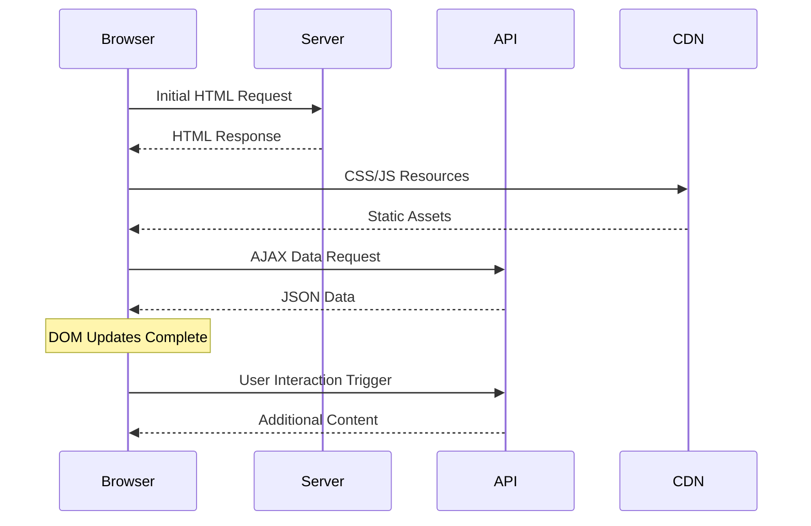
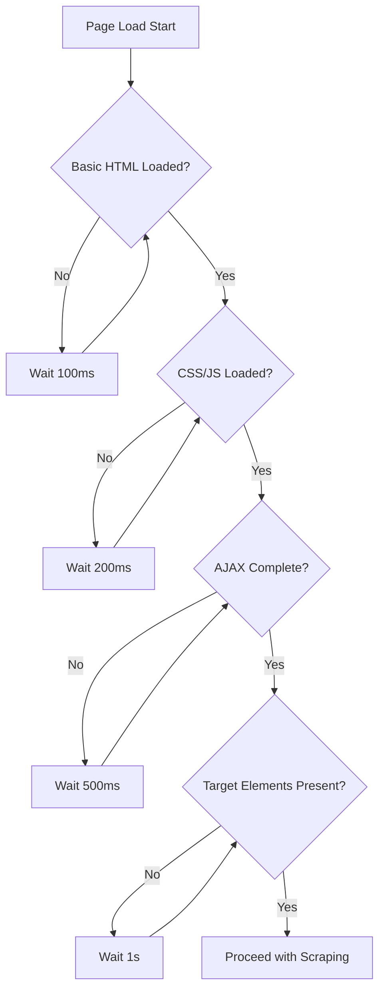

Web scraping would be infinitely easier if every website loaded instantly and all content appeared simultaneously. Unfortunately, the reality of modern web applications is far more complex. Pages load asynchronously, JavaScript renders content dynamically, and network requests fire at unpredictable intervals. This is where mastering waits becomes absolutely critical for successful browser automation.

The difference between a brittle scraper that fails randomly and a robust one that works consistently often comes down to how well you handle timing. Poor wait strategies lead to flaky tests, missed data, and frustrated developers debugging phantom issues. Master the art of waiting, and you'll build scrapers that are both reliable and efficient.

## Understanding the Web's Asynchronous Nature

Modern websites don't follow the simple request-response pattern of static pages. Instead, they're dynamic applications where content appears in waves. The initial HTML might load in 200ms, CSS and JavaScript in the next 500ms, and then AJAX requests might populate data over the following 2 seconds. Some content might not appear until user interaction triggers additional requests.



This asynchronous nature means that when your automation script thinks the page is ready, it might only be seeing the initial HTML shell. The data you actually need could still be loading, or worse, it might require user interaction to trigger.

## The Hierarchy of Wait Strategies

Not all waits are created equal. Understanding when to use each type is crucial for building efficient automation scripts.

### Implicit Waits: The Global Safety Net

Implicit waits set a default timeout for all element lookups. When you ask for an element that doesn't exist yet, the browser automation tool will keep checking until either the element appears or the timeout expires.

```python
# Selenium implicit wait
from selenium import webdriver
from selenium.webdriver.common.by import By

driver = webdriver.Chrome()
driver.implicitly_wait(10)  # Wait up to 10 seconds for any element

# This will wait up to 10 seconds if the element isn't immediately available
element = driver.find_element(By.ID, "dynamic-content")
```

```javascript
// Puppeteer doesn't have implicit waits, but you can simulate them
const puppeteer = require('puppeteer');

const browser = await puppeteer.launch();
const page = await browser.newPage();

// Custom implicit wait function
async function findElementWithTimeout(page, selector, timeout = 10000) {
    try {
        await page.waitForSelector(selector, { timeout });
        return await page.$(selector);
    } catch (error) {
        return null;
    }
}
```

Implicit waits are your safety net, but they're blunt instruments. They apply the same timeout to every element lookup, which can slow down your script when elements appear quickly.

### Explicit Waits: Precision Control

Explicit waits give you fine-grained control over specific conditions. Instead of waiting a fixed time or waiting for any element, you wait for specific conditions to be met.

```python
# Selenium explicit waits
from selenium.webdriver.support.ui import WebDriverWait
from selenium.webdriver.support import expected_conditions as EC

wait = WebDriverVait(driver, 20)

# Wait for element to be clickable
clickable_element = wait.until(
    EC.element_to_be_clickable((By.ID, "submit-button"))
)

# Wait for text to appear
wait.until(
    EC.text_to_be_present_in_element((By.CLASS_NAME, "status"), "Complete")
)

# Wait for custom condition
def data_loaded(driver):
    elements = driver.find_elements(By.CLASS_NAME, "data-row")
    return len(elements) > 0

wait.until(data_loaded)
```

```javascript
// Playwright explicit waits
const { chromium } = require('playwright');

const browser = await chromium.launch();
const page = await browser.newPage();

// Wait for element state
await page.waitForSelector('#data-table', { state: 'visible' });

// Wait for function to return truthy
await page.waitForFunction(() => {
    return document.querySelectorAll('.data-row').length > 0;
});

// Wait for network to be idle
await page.waitForLoadState('networwidle');
```

### Smart Waits: Network and State-Based

The most sophisticated wait strategies monitor the browser's state or network activity rather than just looking for elements.

```python
# Wait for network activity to settle
from selenium.webdriver.common.desired_capabilities import DesiredCapabilities

# Enable logging to monitor network requests
caps = DesiredCapabilities.CHROME
caps['goog:loggingPrefs'] = {'performance': 'ALL'}
driver = webdriver.Chrome(desired_capabilities=caps)

def wait_for_network_idle(driver, idle_time=2):
    """Wait for network to be idle for a specified time"""
    import time
    last_request_time = time.time()
    
    while True:
        logs = driver.get_log('performance')
        current_time = time.time()
        
        # Check for recent network activity
        recent_activity = False
        for log in logs:
            if 'Network' in log['message']:
                last_request_time = current_time
                recent_activity = True
                break
        
        if not recent_activity and (current_time - last_request_time) > idle_time:
            break
        
        time.sleep(0.5)
```

## Framework-Specific Wait Patterns

Different automation frameworks have their own philosophies and best practices for handling waits.

### Playwright: Built for Modern Web Apps

Playwright was designed with modern web applications in mind, offering sophisticated wait strategies out of the box.

```javascript
const { chromium } = require('playwright');

async function scrapeWithPlaywright() {
    const browser = await chromium.launch();
    const page = await browser.newPage();
    
    await page.goto('https://example.com/dynamic-content');
    
    // Auto-waiting: Most actions auto-wait for elements
    await page.click('#load-more'); // Waits for element to be actionable
    
    // Wait for specific network requests
    const responsePromise = page.waitForResponse(
        response => response.url().includes('/api/data') && response.status() === 200
    );
    
    await page.click('#refresh-data');
    await responsePromise;
    
    // Wait for DOM changes
    await page.waitForFunction(() => 
        document.querySelectorAll('.item').length > 10
    );
    
    const items = await page.locator('.item').all();
    return items.map(item => item.textContent());
}
```

### Selenium: The Veteran's Approach

Selenium requires more manual wait management but offers proven reliability across different browsers.

```python
class SmartWaiter:
    def __init__(self, driver, default_timeout=10):
        self.driver = driver
        self.wait = WebDriverWait(driver, default_timeout)
    
    def wait_for_page_load(self, timeout=30):
        """Wait for page to be completely loaded"""
        WebDriverWait(self.driver, timeout).until(
            lambda driver: driver.execute_script("return document.readyState") == "complete"
        )
    
    def wait_for_ajax(self, timeout=10):
        """Wait for jQuery AJAX requests to complete"""
        try:
            WebDriverWait(self.driver, timeout).until(
                lambda driver: driver.execute_script("return jQuery.active == 0")
            )
        except:
            # jQuery might not be present
            pass
    
    def wait_for_element_staleness(self, element, timeout=10):
        """Wait for an element to become stale (useful after page updates)"""
        WebDriverWait(self.driver, timeout).until(
            EC.staleness_of(element)
        )
    
    def wait_for_count_change(self, locator, expected_count, timeout=10):
        """Wait for a specific number of elements"""
        WebDriverWait(self.driver, timeout).until(
            lambda driver: len(driver.find_elements(*locator)) == expected_count
        )

# Usage
waiter = SmartWaiter(driver)
waiter.wait_for_page_load()
waiter.wait_for_ajax()

# Wait for dynamic content to load
waiter.wait_for_count_change((By.CLASS_NAME, "product-card"), 20)
```

## Common Wait Patterns and Anti-Patterns

### Pattern: Progressive Enhancement Waiting

Many modern sites load in layers. Build your waits to match this pattern:

```python
def wait_for_progressive_load(driver, stages):
    """
    Wait for multiple stages of page loading
    stages = [
        {'selector': '.header', 'timeout': 5},
        {'selector': '.main-content', 'timeout': 10},
        {'selector': '.sidebar', 'timeout': 15},
        {'condition': lambda d: len(d.find_elements(By.CLASS_NAME, 'item')) > 0, 'timeout': 20}
    ]
    """
    for stage in stages:
        wait = WebDriverWait(driver, stage['timeout'])
        
        if 'selector' in stage:
            wait.until(EC.presence_of_element_located((By.CSS_SELECTOR, stage['selector'])))
        elif 'condition' in stage:
            wait.until(stage['condition'])
```

### Anti-Pattern: Fixed Sleep Times

This is the most common mistake in browser automation:

```python
# DON'T DO THIS
import time
driver.get('https://example.com')
time.sleep(5)  # Hope everything loads in 5 seconds
element = driver.find_element(By.ID, 'dynamic-content')
```

Fixed sleeps are unreliable because:
- Network conditions vary
- Server response times fluctuate
- Content complexity differs between pages
- They waste time when content loads quickly

### Pattern: Retry with Exponential Backoff

For flaky elements or network-dependent content:

```python
import time
import random

def retry_with_backoff(func, max_retries=3, base_delay=1):
    """Retry a function with exponential backoff"""
    for attempt in range(max_retries):
        try:
            return func()
        except Exception as e:
            if attempt == max_retries - 1:
                raise e
            
            delay = base_delay * (2 ** attempt) + random.uniform(0, 1)
            time.sleep(delay)
    
def find_element_with_retry(driver, locator):
    def find_action():
        return WebDriverWait(driver, 5).until(
            EC.presence_of_element_located(locator)
        )
    
    return retry_with_backoff(find_action)
```

## Advanced Wait Strategies

### Waiting for Complex State Changes

Sometimes you need to wait for complex application states rather than simple element presence:

```javascript
// Wait for a React component to fully render
await page.waitForFunction(() => {
    const component = window.React && 
        window.React.findDOMNode && 
        window.myAppInstance;
    
    return component && 
           component.state && 
           component.state.loading === false &&
           component.state.data &&
           component.state.data.length > 0;
});

// Wait for charts/graphs to render
await page.waitForFunction(() => {
    const charts = document.querySelectorAll('.chart-container svg');
    return Array.from(charts).every(chart => 
        chart.getBoundingClientRect().height > 0
    );
});
```

### Custom Wait Conditions

Create reusable wait conditions for your specific use cases:

```python
class CustomConditions:
    @staticmethod
    def text_matches_regex(locator, pattern):
        """Wait for element text to match a regex pattern"""
        def condition(driver):
            import re
            try:
                element = driver.find_element(*locator)
                return re.search(pattern, element.text) is not None
            except:
                return False
        return condition
    
    @staticmethod
    def attribute_contains(locator, attribute, value):
        """Wait for element attribute to contain specific value"""
        def condition(driver):
            try:
                element = driver.find_element(*locator)
                attr_value = element.get_attribute(attribute)
                return value in (attr_value or '')
            except:
                return False
        return condition
    
    @staticmethod
    def minimum_elements_visible(locator, min_count):
        """Wait for minimum number of visible elements"""
        def condition(driver):
            try:
                elements = driver.find_elements(*locator)
                visible_count = sum(1 for el in elements if el.is_displayed())
                return visible_count >= min_count
            except:
                return False
        return condition

# Usage
wait = WebDriverWait(driver, 20)
wait.until(CustomConditions.text_matches_regex(
    (By.ID, 'status'), 
    r'Processing complete: \d+/\d+'
))
```

## Performance Optimization



Efficient wait strategies balance reliability with speed:

```python
class OptimizedWaiter:
    def __init__(self, driver):
        self.driver = driver
        self.short_wait = WebDriverWait(driver, 3)
        self.medium_wait = WebDriverWait(driver, 10)
        self.long_wait = WebDriverWait(driver, 30)
    
    def smart_wait_for_element(self, locator):
        """Try short wait first, then longer waits"""
        for wait_obj in [self.short_wait, self.medium_wait, self.long_wait]:
            try:
                return wait_obj.until(EC.presence_of_element_located(locator))
            except TimeoutException:
                continue
        raise TimeoutException(f"Element not found: {locator}")
    
    def wait_with_polling(self, condition, timeout=10, poll_frequency=0.5):
        """Custom polling interval for expensive operations"""
        wait = WebDriverWait(self.driver, timeout, poll_frequency)
        return wait.until(condition)
```

## Debugging Wait Issues

When waits fail, debugging can be challenging. Here are strategies to identify the root cause:

```python
def debug_wait_failure(driver, locator, timeout=10):
    """Debug why an element wait is failing"""
    print(f"Debugging wait for: {locator}")
    
    # Check if page is still loading
    ready_state = driver.execute_script("return document.readyState")
    print(f"Document ready state: {ready_state}")
    
    # Check for JavaScript errors
    logs = driver.get_log('browser')
    errors = [log for log in logs if log['level'] == 'SEVERE']
    if errors:
        print(f"JavaScript errors found: {errors}")
    
    # Check if element exists but isn't visible
    try:
        elements = driver.find_elements(*locator)
        print(f"Found {len(elements)} matching elements")
        
        for i, element in enumerate(elements):
            print(f"Element {i}: displayed={element.is_displayed()}, "
                  f"enabled={element.is_enabled()}, "
                  f"size={element.size}")
    except Exception as e:
        print(f"Error finding elements: {e}")
    
    # Check current page source for debugging
    if "loading" in driver.page_source.lower():
        print("Page appears to still be loading content")
```

The key to mastering waits in browser automation isn't just knowing the syntax—it's understanding the rhythm of modern web applications. Each site has its own loading patterns, timing quirks, and interactive behaviors. Start with conservative timeouts and explicit waits, then optimize based on the specific patterns you observe.

What's the most challenging timing issue you've encountered in your automation projects? Drop a comment and let's discuss strategies for handling those tricky edge cases that keep us all up at night debugging flaky scrapers.