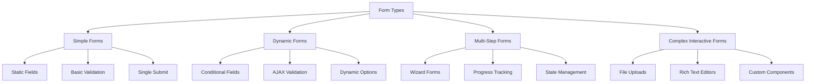
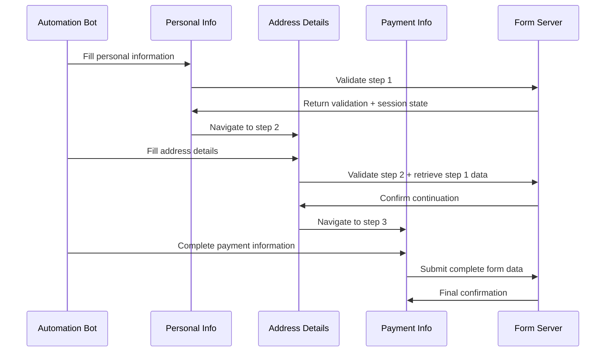
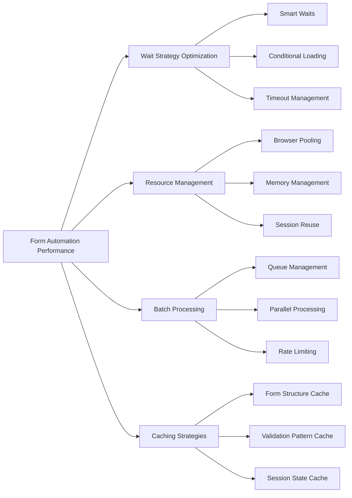

Forms are the backbone of web interaction. Whether you're automating user registrations, processing bulk data submissions, or testing web applications, mastering form automation is essential for any serious web scraper. The challenge lies not just in filling simple text fields, but in handling the complex, multi-step workflows that modern web applications demand.

Form automation goes beyond basic input filling. Modern forms include conditional logic, dynamic field generation, file uploads, CAPTCHAs, and multi-page workflows. Understanding how to navigate these complexities programmatically can transform your data collection capabilities and open doors to previously inaccessible information sources.

## Understanding Form Types and Complexity Levels

Before diving into automation techniques, it's crucial to categorize forms based on their complexity. This classification helps determine the appropriate automation strategy and tools needed for successful interaction.



Simple forms represent the most straightforward automation targets. These typically contain static fields with predictable selectors and basic client-side validation. Dynamic forms introduce JavaScript-driven behavior, where field visibility and options change based on user input. Multi-step forms span multiple pages or sections, requiring state management and navigation logic. Complex interactive forms incorporate rich UI components, file handling, and custom validation workflows.

## Essential Techniques for Basic Form Automation

Starting with fundamental form interaction patterns establishes the foundation for more advanced automation scenarios. Modern browser automation tools provide multiple approaches for element selection and interaction, each with specific advantages depending on the form structure.

```python
from playwright.sync_api import sync_playwright
import time

def fill_basic_form():
    with sync_playwright() as p:
        browser = p.chromium.launch(headless=False)
        page = browser.new_page()
        
        # Navigate to form page
        page.goto("https://example.com/contact-form")
        
        # Multiple selection strategies
        page.fill('input[name="email"]', 'user@example.com')
        page.fill('#phone-number', '+1234567890')
        page.fill('//input[@placeholder="Full Name"]', 'John Doe')
        
        # Handle different input types
        page.select_option('select[name="country"]', 'US')
        page.check('input[type="checkbox"][name="newsletter"]')
        page.click('input[type="radio"][value="male"]')
        
        # Handle textarea with longer content
        page.fill('textarea[name="message"]', 
                 'This is a longer message that spans multiple lines.')
        
        # Submit form
        page.click('button[type="submit"]')
        
        # Wait for submission result
        page.wait_for_selector('.success-message', timeout=10000)
        
        browser.close()
```

This basic approach handles most static forms effectively. However, real-world scenarios often require more sophisticated handling of dynamic elements and validation feedback.

## Handling Dynamic Forms and Conditional Logic

Dynamic forms present unique challenges as field visibility and validation rules change based on user interactions. These forms require careful orchestration of input sequences and responsive handling of DOM changes.

```javascript
const puppeteer = require('puppeteer');

async function handleDynamicForm() {
    const browser = await puppeteer.launch({ headless: false });
    const page = await browser.newPage();
    
    await page.goto('https://example.com/dynamic-form');
    
    // Handle conditional field visibility
    await page.select('#user-type', 'business');
    
    // Wait for business-specific fields to appear
    await page.waitForSelector('#company-name', { visible: true });
    await page.waitForSelector('#tax-id', { visible: true });
    
    // Fill newly visible fields
    await page.type('#company-name', 'Acme Corporation');
    await page.type('#tax-id', '12-3456789');
    
    // Handle dynamic validation
    await page.type('#email', 'invalid-email');
    await page.click('#validate-email');
    
    // Wait for validation error and correct it
    await page.waitForSelector('.email-error', { visible: true });
    await page.evaluate(() => document.querySelector('#email').value = '');
    await page.type('#email', 'valid@example.com');
    
    // Handle AJAX-loaded options
    await page.type('#city-input', 'New York');
    await page.waitForSelector('.city-suggestions');
    await page.click('.city-suggestion[data-city="new-york"]');
    
    await page.click('#submit-button');
    await browser.close();
}
```

Dynamic forms often implement progressive disclosure, where subsequent fields appear based on previous selections. Successful automation requires anticipating these changes and implementing robust waiting strategies.

## Multi-Step Form Navigation and State Management

Multi-step forms represent some of the most complex automation challenges in web scraping. These forms maintain state across multiple pages or sections, often with dependencies between steps that affect overall form validity.



Managing multi-step forms requires maintaining context between pages and handling various navigation patterns. Some forms use single-page interfaces with hidden sections, while others navigate between entirely different URLs.

```python
from selenium import webdriver
from selenium.webdriver.common.by import By
from selenium.webdriver.support.ui import WebDriverWait
from selenium.webdriver.support import expected_conditions as EC
import json

class MultiStepFormHandler:
    def __init__(self):
        self.driver = webdriver.Chrome()
        self.wait = WebDriverWait(self.driver, 10)
        self.form_data = {}
        
    def save_form_state(self, step_name, data):
        """Save form state for recovery purposes"""
        self.form_data[step_name] = data
        with open('form_state.json', 'w') as f:
            json.dump(self.form_data, f)
    
    def complete_step_one(self, personal_info):
        self.driver.get('https://example.com/registration/step1')
        
        # Fill personal information
        self.driver.find_element(By.NAME, 'first_name').send_keys(personal_info['first_name'])
        self.driver.find_element(By.NAME, 'last_name').send_keys(personal_info['last_name'])
        self.driver.find_element(By.NAME, 'email').send_keys(personal_info['email'])
        self.driver.find_element(By.NAME, 'phone').send_keys(personal_info['phone'])
        
        # Save state before proceeding
        self.save_form_state('step1', personal_info)
        
        # Click next with error handling
        next_button = self.wait.until(
            EC.element_to_be_clickable((By.ID, 'next-step'))
        )
        next_button.click()
        
        # Verify successful navigation
        self.wait.until(
            EC.presence_of_element_located((By.ID, 'step2-container'))
        )
    
    def complete_step_two(self, address_info):
        # Handle dynamic address validation
        address_input = self.wait.until(
            EC.presence_of_element_located((By.NAME, 'address'))
        )
        address_input.send_keys(address_info['street'])
        
        # Wait for address validation service
        self.wait.until(
            EC.presence_of_element_located((By.CLASS_NAME, 'address-validated'))
        )
        
        # Fill remaining address fields
        self.driver.find_element(By.NAME, 'city').send_keys(address_info['city'])
        self.driver.find_element(By.NAME, 'state').send_keys(address_info['state'])
        self.driver.find_element(By.NAME, 'zip').send_keys(address_info['zip'])
        
        self.save_form_state('step2', address_info)
        
        # Handle potential back/next navigation
        next_button = self.driver.find_element(By.ID, 'proceed-to-payment')
        next_button.click()
        
        self.wait.until(
            EC.url_contains('/step3')
        )
    
    def complete_final_step(self, payment_info):
        # Handle sensitive payment information
        card_frame = self.wait.until(
            EC.presence_of_element_located((By.ID, 'card-input-frame'))
        )
        
        # Switch to iframe for secure payment input
        self.driver.switch_to.frame(card_frame)
        
        self.driver.find_element(By.NAME, 'cardnumber').send_keys(payment_info['card_number'])
        self.driver.find_element(By.NAME, 'exp-date').send_keys(payment_info['expiry'])
        self.driver.find_element(By.NAME, 'cvc').send_keys(payment_info['cvc'])
        
        # Switch back to main content
        self.driver.switch_to.default_content()
        
        # Final submission
        submit_button = self.driver.find_element(By.ID, 'final-submit')
        submit_button.click()
        
        # Wait for confirmation
        confirmation = self.wait.until(
            EC.presence_of_element_located((By.CLASS_NAME, 'success-confirmation'))
        )
        
        return confirmation.text
```

## Advanced Input Handling and File Uploads

Modern forms often incorporate sophisticated input mechanisms beyond simple text fields. File uploads, rich text editors, drag-and-drop interfaces, and custom components require specialized handling techniques.

File uploads present particular challenges in browser automation, especially when dealing with multiple files, drag-and-drop interfaces, or cloud storage integrations.

```python
import os
from playwright.sync_api import sync_playwright

def handle_advanced_form_inputs():
    with sync_playwright() as p:
        browser = p.chromium.launch()
        page = browser.new_page()
        
        page.goto('https://example.com/advanced-form')
        
        # Handle file uploads
        file_input = page.locator('input[type="file"]')
        file_path = os.path.abspath('sample_document.pdf')
        file_input.set_input_files(file_path)
        
        # Handle multiple file uploads
        multi_file_input = page.locator('#multi-file-upload')
        files = [
            os.path.abspath('document1.pdf'),
            os.path.abspath('document2.jpg'),
            os.path.abspath('document3.docx')
        ]
        multi_file_input.set_input_files(files)
        
        # Handle drag-and-drop file upload
        page.locator('#drop-zone').dispatch_event(
            'drop',
            {
                'dataTransfer': {
                    'files': [{'name': 'dragged_file.txt', 'type': 'text/plain'}]
                }
            }
        )
        
        # Handle rich text editor (TinyMCE example)
        page.frame('rich-text-editor').fill('body', 'Rich text content with <strong>formatting</strong>')
        
        # Handle custom slider components
        slider = page.locator('.price-slider')
        slider_box = slider.bounding_box()
        page.mouse.click(
            slider_box['x'] + slider_box['width'] * 0.7,  # 70% position
            slider_box['y'] + slider_box['height'] / 2
        )
        
        # Handle date picker
        page.click('#date-picker-trigger')
        page.wait_for_selector('.date-picker-calendar')
        page.click('.date-picker-calendar [data-date="2024-12-15"]')
        
        browser.close()
```

## Error Handling and Recovery Strategies

Robust form automation requires comprehensive error handling and recovery mechanisms. Forms can fail for numerous reasons: network timeouts, validation errors, server issues, or unexpected UI changes.

```python
import logging
from selenium.common.exceptions import TimeoutException, NoSuchElementException
from selenium.webdriver.support.ui import WebDriverWait
from selenium.webdriver.support import expected_conditions as EC

class ResilientFormFiller:
    def __init__(self, driver):
        self.driver = driver
        self.logger = logging.getLogger(__name__)
        self.max_retries = 3
        
    def safe_fill_field(self, locator, value, retry_count=0):
        try:
            element = WebDriverWait(self.driver, 10).until(
                EC.presence_of_element_located(locator)
            )
            
            # Clear field before filling
            element.clear()
            element.send_keys(value)
            
            # Verify the value was entered correctly
            if element.get_attribute('value') != value:
                raise ValueError(f"Field value mismatch: expected {value}")
                
            return True
            
        except (TimeoutException, NoSuchElementException) as e:
            self.logger.warning(f"Failed to fill field {locator}: {str(e)}")
            
            if retry_count < self.max_retries:
                self.logger.info(f"Retrying field fill (attempt {retry_count + 1})")
                time.sleep(2)
                return self.safe_fill_field(locator, value, retry_count + 1)
            else:
                self.logger.error(f"Max retries exceeded for field {locator}")
                return False
                
        except ValueError as e:
            self.logger.error(f"Value validation failed: {str(e)}")
            return False
    
    def handle_form_validation_errors(self):
        """Detect and handle form validation errors"""
        try:
            error_elements = self.driver.find_elements(By.CLASS_NAME, 'error-message')
            
            if error_elements:
                for error in error_elements:
                    error_text = error.text
                    self.logger.warning(f"Form validation error: {error_text}")
                    
                    # Handle specific error types
                    if 'email' in error_text.lower():
                        self.correct_email_field()
                    elif 'phone' in error_text.lower():
                        self.correct_phone_field()
                    elif 'required' in error_text.lower():
                        self.fill_required_fields()
                        
                return len(error_elements) > 0
                
        except Exception as e:
            self.logger.error(f"Error handling validation errors: {str(e)}")
            return False
```

## Performance Optimization and Best Practices

Form automation performance significantly impacts overall scraping efficiency, especially when processing large volumes of submissions. Optimization strategies focus on reducing wait times, minimizing browser overhead, and implementing intelligent retry mechanisms.



Implementing intelligent waiting strategies reduces unnecessary delays while ensuring reliable form interaction. Using explicit waits instead of hard-coded delays improves both speed and reliability.

```python
from concurrent.futures import ThreadPoolExecutor, as_completed
import queue
import threading

class OptimizedFormProcessor:
    def __init__(self, max_workers=5):
        self.form_queue = queue.Queue()
        self.max_workers = max_workers
        self.results = []
        
    def batch_process_forms(self, form_data_list):
        """Process multiple forms concurrently"""
        
        with ThreadPoolExecutor(max_workers=self.max_workers) as executor:
            future_to_form = {
                executor.submit(self.process_single_form, form_data): form_data 
                for form_data in form_data_list
            }
            
            for future in as_completed(future_to_form):
                form_data = future_to_form[future]
                try:
                    result = future.result()
                    self.results.append(result)
                    print(f"Completed form for {form_data.get('email', 'unknown')}")
                except Exception as e:
                    print(f"Form processing failed: {str(e)}")
    
    def process_single_form(self, form_data):
        # Use browser context for isolation
        with sync_playwright() as p:
            browser = p.chromium.launch()
            context = browser.new_context()
            page = context.new_page()
            
            try:
                # Optimized form filling logic
                success = self.fill_form_optimized(page, form_data)
                return {'status': 'success' if success else 'failed', 'data': form_data}
            finally:
                context.close()
                browser.close()
```

Form automation represents one of the most practical applications of browser automation in web scraping. The techniques covered here—from basic input handling to complex multi-step workflows—form the foundation for extracting data from interactive web applications and automated testing scenarios.

The evolution of web forms continues toward increasingly sophisticated user experiences, incorporating real-time validation, progressive enhancement, and rich interactive components. Staying ahead of these trends requires continuous learning and adaptation of automation strategies.

What's the most complex form you've encountered in your automation projects, and which techniques would you apply to tackle its unique challenges? Share your experiences and let's explore advanced form automation scenarios together.