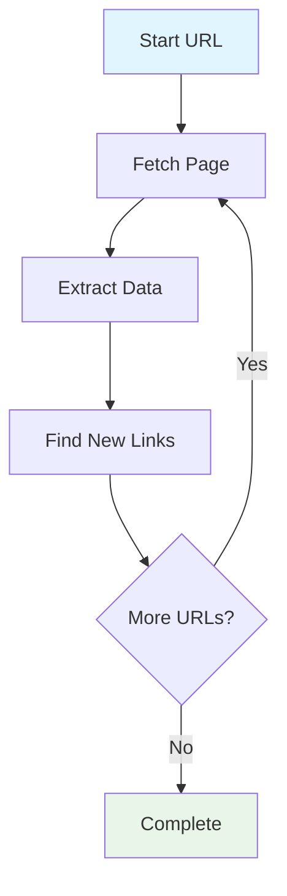
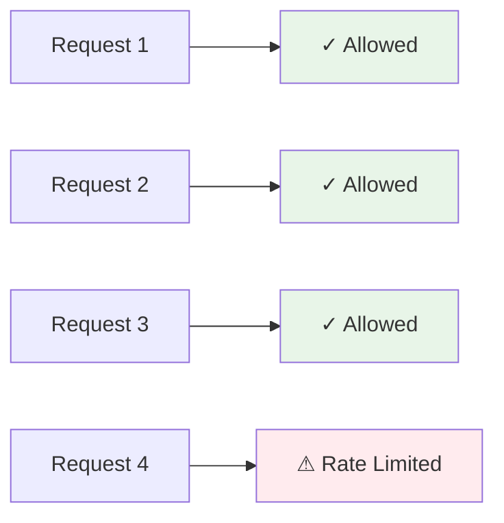
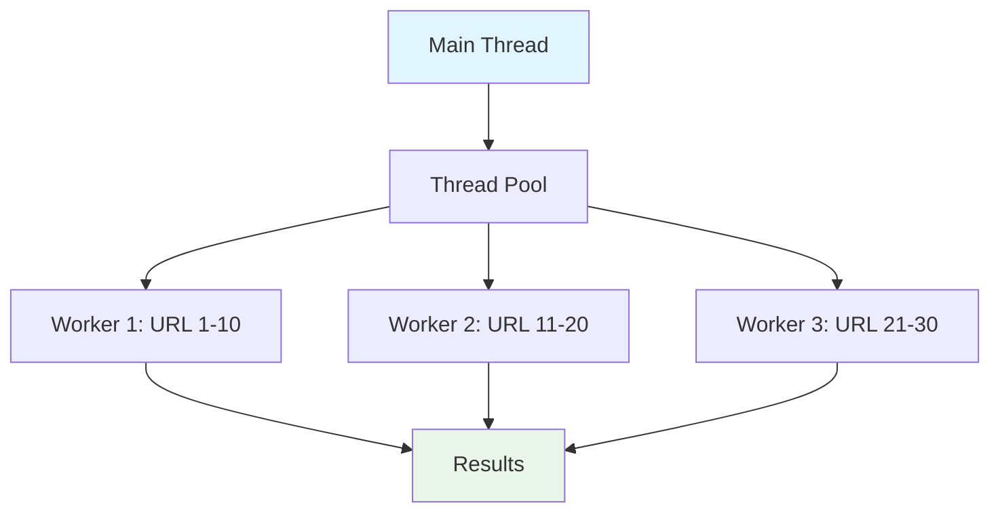

Starting your web scraping journey feels like entering a new country where everyone speaks a different language. Terms like "headless browsers," "rate limiting," and "xpath selectors" get thrown around casually, leaving newcomers scratching their heads. Let's break down these mysterious terms into plain English so you can navigate web scraping conversations with confidence.

## Core Web Scraping Concepts

**Web Scraping** is the process of automatically extracting data from websites using software programs. Think of it as having a robot that visits websites and copies information for you, much faster and more accurately than doing it manually.

**Data Extraction** refers to the specific act of pulling useful information from the raw HTML, JSON, or other data formats you encounter. It's like finding needles in a haystack, but your program knows exactly where to look.

**Crawling** involves systematically browsing through multiple pages of a website, following links from one page to another. A web crawler is like a methodical explorer mapping out an entire website's structure.



## HTML and Data Selection

**DOM (Document Object Model)** represents the structure of a webpage as a tree of elements. When you inspect a webpage's source code, you're looking at the DOM. It's like the blueprint of a house - it shows how everything is organized and connected.

**CSS Selectors** are patterns used to target specific elements on a webpage. They work like addresses for HTML elements. For example, `.product-title` targets all elements with the class "product-title."

```python
# CSS selector examples
soup.select('.price')  # All elements with class 'price'
soup.select('#main-content')  # Element with ID 'main-content'
soup.select('div.product h2')  # h2 tags inside div with class 'product'
```

**XPath** is another way to navigate and select elements in HTML documents, using a path-like syntax similar to file system navigation. It's more powerful than CSS selectors but also more complex.

```python
# XPath examples
driver.find_element(By.XPATH, "//div[@class='price']")  # Div with class 'price'
driver.find_element(By.XPATH, "//a[contains(text(), 'Next Page')]")  # Link containing 'Next Page'
```

**Beautiful Soup** is a Python library that makes parsing HTML documents easier. It creates a navigable tree structure from HTML, letting you search and modify the parse tree in intuitive ways.

## Browser Automation Technologies

**Headless Browsers** run without a graphical user interface. They process web pages just like regular browsers but invisibly, making them perfect for automated tasks. Think of them as invisible browsers working behind the scenes.

**Selenium** is a automation framework that controls web browsers programmatically. It can click buttons, fill forms, and navigate websites just like a human would, but much faster and without getting tired.

```python
from selenium import webdriver
from selenium.webdriver.common.by import By

# Initialize headless Chrome
options = webdriver.ChromeOptions()
options.add_argument('--headless')
driver = webdriver.Chrome(options=options)

driver.get('https://example.com')
title = driver.find_element(By.TAG_NAME, 'h1').text
driver.quit()
```

**Playwright** and **Puppeteer** are modern alternatives to Selenium, offering better performance and more reliable automation capabilities. They're like the newer, faster cars in the browser automation world.

**WebDriver** is the interface that allows your code to communicate with browsers. It's the translator between your scraping script and the browser.

## HTTP and Network Concepts

**HTTP Requests** are messages sent from your scraping program to web servers asking for data. The most common types are GET (retrieve data) and POST (send data).

**Headers** are additional information sent with HTTP requests, like showing your ID card when entering a building. They can include details about your browser, preferred language, or authentication credentials.

```python
import requests

headers = {
    'User-Agent': 'Mozilla/5.0 (Windows NT 10.0; Win64; x64) AppleWebKit/537.36',
    'Accept': 'text/html,application/xhtml+xml,application/xml;q=0.9,*/*;q=0.8',
    'Accept-Language': 'en-US,en;q=0.5'
}

response = requests.get('https://example.com', headers=headers)
```

**Cookies** are small pieces of data stored by websites in your browser to remember information about you. They're like name tags that websites stick on you to recognize you on return visits.

**Sessions** maintain state between multiple requests, keeping you "logged in" or remembering your preferences across different page visits.

**APIs (Application Programming Interfaces)** are structured ways for programs to communicate with each other. Many websites offer APIs as an alternative to scraping, providing data in clean, organized formats.

## Anti-Bot and Security Measures

**Rate Limiting** controls how many requests you can make within a specific time period. Websites use this to prevent overload from automated requests. It's like a bouncer controlling how many people enter a club per minute.



**CAPTCHA** challenges verify that the user is human by presenting puzzles that are easy for humans but difficult for bots to solve.

**IP Blocking** prevents specific IP addresses from accessing a website, usually triggered by suspicious activity patterns.

**User-Agent** strings identify the browser and operating system making the request. Websites often check these to distinguish between legitimate browsers and scraping bots.

**Robots.txt** is a file that tells web crawlers which parts of a website they should or shouldn't access. It's like a "Do Not Enter" sign for bots, though it's more of a suggestion than a law.

## Proxy and Privacy Tools

**Proxies** act as intermediaries between your scraping program and target websites, hiding your real IP address. They're like wearing a mask at a masquerade ball - your identity remains hidden.

**Rotating Proxies** automatically switch between different proxy servers to avoid detection and bypass rate limits.

```python
import requests

proxies = {
    'http': 'http://proxy1.example.com:8080',
    'https': 'https://proxy1.example.com:8080'
}

response = requests.get('https://target-site.com', proxies=proxies)
```

**VPN (Virtual Private Network)** encrypts your internet connection and routes it through remote servers, providing privacy and location masking.

## Data Processing and Storage

**Parsing** means analyzing and interpreting data to extract meaningful information. It's like reading a letter and understanding its contents rather than just seeing random characters.

**Regular Expressions (Regex)** are patterns used to match and extract specific text from strings. They're extremely powerful for cleaning and processing scraped data.

```python
import re

# Extract email addresses from text
text = "Contact us at info@example.com or support@test.org"
emails = re.findall(r'\b[A-Za-z0-9._%+-]+@[A-Za-z0-9.-]+\.[A-Z|a-z]{2,}\b', text)
print(emails)  # ['info@example.com', 'support@test.org']
```

**JSON (JavaScript Object Notation)** is a lightweight data format that's easy for humans to read and write. Many websites use JSON to send data between servers and web applications.

**CSV (Comma-Separated Values)** files store tabular data in plain text format, making them perfect for spreadsheet applications and data analysis.

## Performance and Optimization

**Asynchronous Scraping** allows your program to handle multiple requests simultaneously instead of waiting for each one to complete before starting the next. It's like having multiple cashiers at a store instead of just one.

```python
import asyncio
import aiohttp

async def fetch_url(session, url):
    async with session.get(url) as response:
        return await response.text()

async def scrape_multiple_urls(urls):
    async with aiohttp.ClientSession() as session:
        tasks = [fetch_url(session, url) for url in urls]
        return await asyncio.gather(*tasks)
```

**Concurrency** refers to managing multiple scraping tasks at the same time, improving efficiency and reducing total execution time.

**Thread Pool** and **Process Pool** are ways to distribute scraping work across multiple threads or processes, speeding up large-scale operations.



## Error Handling and Debugging

**Exception Handling** deals with errors that occur during scraping, like network timeouts or missing elements. Proper error handling keeps your scrapers running smoothly even when things go wrong.

**Retry Logic** automatically attempts failed requests multiple times before giving up, accounting for temporary network issues or server problems.

```python
import time
from requests.exceptions import RequestException

def scrape_with_retry(url, max_retries=3):
    for attempt in range(max_retries):
        try:
            response = requests.get(url, timeout=10)
            return response
        except RequestException as e:
            if attempt == max_retries - 1:
                raise e
            time.sleep(2 ** attempt)  # Exponential backoff
```

**Logging** records what your scraper does, helping you debug issues and monitor performance. It's like keeping a diary of your scraper's activities.

## Advanced Concepts

**JavaScript Rendering** handles websites that build content dynamically with JavaScript. Some sites don't show their data until JavaScript executes, requiring special tools to see the complete page.

**WebSocket** connections enable real-time communication between browsers and servers, often used for live data feeds or chat applications.

**AJAX** requests load data in the background without refreshing the entire page. Understanding AJAX helps you find where dynamic content comes from.

**Fingerprinting** involves websites collecting detailed information about visitors' browsers and devices to identify them uniquely, even without cookies.

Now that you have a solid foundation in web scraping terminology, you're ready to dive deeper into specific techniques and tools. Which of these concepts would you like to explore through hands-on examples first?