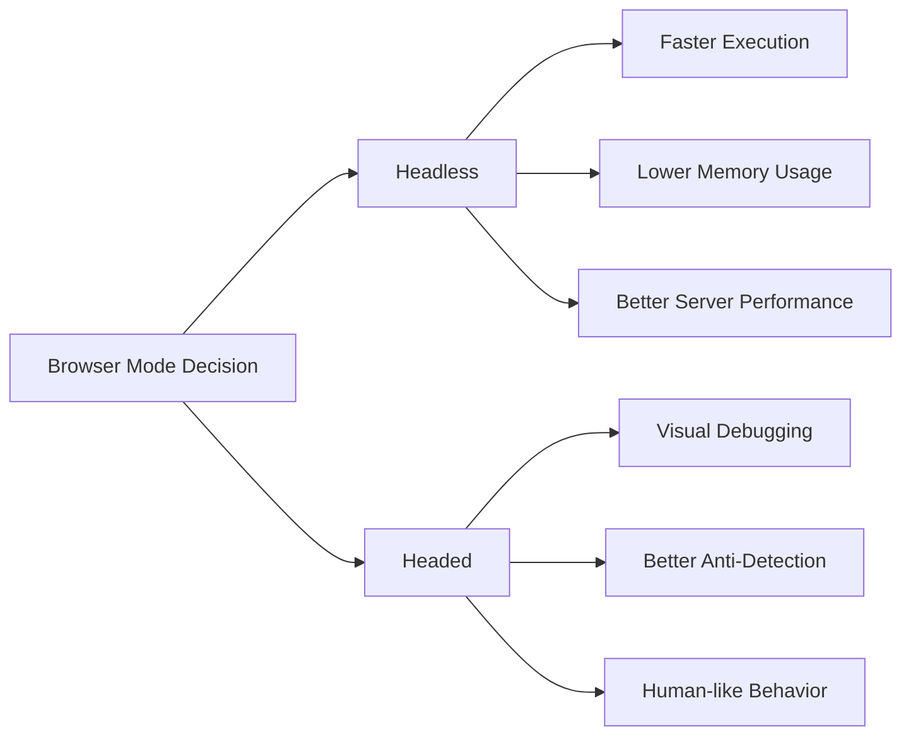
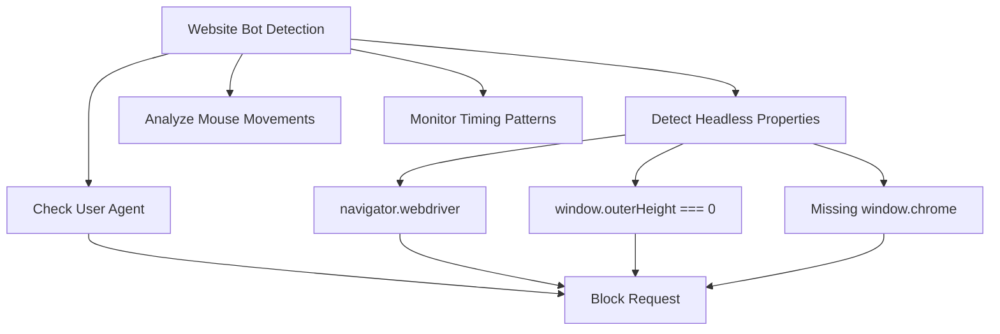
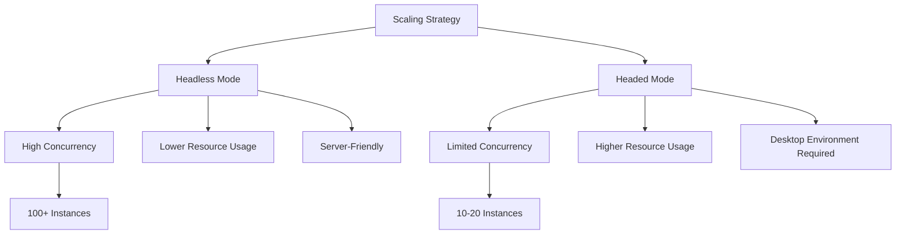

When diving into browser automation, one of the first decisions you'll face is whether to run your browser in headless or headed mode. This choice might seem simple on the surface, but it carries significant implications for performance, debugging capabilities, detection avoidance, and overall scraping success.

Headless browsers run without a visible user interface, operating entirely in the background. Headed browsers, on the other hand, display the familiar browser window where you can watch every action unfold in real-time. Each approach has distinct advantages and trade-offs that can make or break your scraping project.

## Understanding the Fundamental Difference

The distinction between headless and headed browsers goes beyond mere visibility. When a browser runs in headless mode, it allocates fewer system resources to rendering graphics, managing windows, and handling user interface elements. This streamlined operation typically results in faster execution and lower memory consumption.

```python
from selenium import webdriver
from selenium.webdriver.chrome.options import Options

# Headed browser - visible window
driver_headed = webdriver.Chrome()

# Headless browser - invisible operation
chrome_options = Options()
chrome_options.add_argument("--headless")
driver_headless = webdriver.Chrome(options=chrome_options)
```

However, some websites implement detection mechanisms that specifically target headless browsers. They might check for the absence of certain window properties, missing GPU rendering capabilities, or behavioral patterns that suggest automated operation.

## Performance Impact Analysis

The performance difference between headless and headed browsers can be substantial, particularly when running multiple instances or processing large datasets.



In headless mode, you can expect:
- 20-40% faster page load times
- 30-50% reduction in memory usage
- Ability to run more concurrent instances
- Better suited for server environments

Playwright demonstrates this performance difference clearly:

```javascript
const { chromium } = require('playwright');

// Performance comparison function
async function comparePerformance() {
    const headlessStart = Date.now();
    const headlessBrowser = await chromium.launch({ headless: true });
    const headlessPage = await headlessBrowser.newPage();
    await headlessPage.goto('https://example.com');
    const headlessTime = Date.now() - headlessStart;
    await headlessBrowser.close();

    const headedStart = Date.now();
    const headedBrowser = await chromium.launch({ headless: false });
    const headedPage = await headedBrowser.newPage();
    await headedPage.goto('https://example.com');
    const headedTime = Date.now() - headedStart;
    await headedBrowser.close();

    console.log(`Headless: ${headlessTime}ms, Headed: ${headedTime}ms`);
}
```

## Debugging Advantages of Headed Browsers

When developing and troubleshooting scraping scripts, headed browsers provide invaluable visual feedback. You can observe exactly what your automation is interacting with, identify timing issues, and spot unexpected page behaviors.

```python
from playwright.sync_api import sync_playwright

def debug_with_headed_browser():
    with sync_playwright() as p:
        # Use headed mode for debugging
        browser = p.chromium.launch(
            headless=False,
            slow_mo=1000  # Slow down actions for observation
        )
        page = browser.new_page()
        
        # Watch the automation in real-time
        page.goto("https://example.com")
        page.click("button#submit")
        
        # Add breakpoints for manual inspection
        page.pause()  # Pauses execution for manual debugging
        
        browser.close()
```

The visual debugging capability becomes particularly crucial when:
- Elements don't behave as expected
- Timing issues cause intermittent failures
- Page layouts change dynamically
- Authentication flows require manual intervention

## Anti-Detection Considerations

Modern websites employ sophisticated bot detection systems that can identify headless browsers through various fingerprinting techniques. Some detection methods specifically target headless browsers by checking for:



Certain properties are only available when a browser runs with a visible interface:

```javascript
// Properties that might be missing in headless mode
console.log(window.outerHeight);  // Often 0 in headless
console.log(window.outerWidth);   // Often 0 in headless
console.log(navigator.webdriver); // Often true in automation
console.log(window.chrome);       // Might be undefined in headless
```

To combat headless detection, you can implement stealth measures:

```python
from playwright.sync_api import sync_playwright

def stealth_headless_setup():
    with sync_playwright() as p:
        browser = p.chromium.launch(
            headless=True,
            args=[
                '--disable-blink-features=AutomationControlled',
                '--disable-dev-shm-usage',
                '--no-first-run',
                '--no-default-browser-check',
                '--disable-infobars'
            ]
        )
        
        page = browser.new_page()
        
        # Override the webdriver property
        page.add_init_script("""
            Object.defineProperty(navigator, 'webdriver', {
                get: () => undefined,
            });
        """)
        
        # Set realistic viewport
        page.set_viewport_size({"width": 1366, "height": 768})
        
        return browser, page
```

## Resource Management and Scalability

When scaling your scraping operations, the choice between headless and headed becomes crucial for resource management. Headed browsers consume significantly more system resources, limiting the number of concurrent instances you can run.



For production environments, consider this resource allocation pattern:

```python
import asyncio
from playwright.async_api import async_playwright

class ScalableScraper:
    def __init__(self, headless=True, max_concurrent=10):
        self.headless = headless
        self.semaphore = asyncio.Semaphore(max_concurrent)
    
    async def scrape_page(self, url):
        async with self.semaphore:
            async with async_playwright() as p:
                browser = await p.chromium.launch(headless=self.headless)
                page = await browser.new_page()
                
                try:
                    await page.goto(url)
                    # Perform scraping operations
                    content = await page.content()
                    return content
                finally:
                    await browser.close()
    
    async def scrape_multiple(self, urls):
        tasks = [self.scrape_page(url) for url in urls]
        return await asyncio.gather(*tasks)
```

## Development vs Production Strategies

The optimal approach often involves using different modes for different phases of your project lifecycle. During development and debugging, headed browsers provide essential visual feedback. In production, headless browsers deliver the performance and resource efficiency you need.

```python
import os
from selenium import webdriver
from selenium.webdriver.chrome.options import Options

class AdaptiveBrowser:
    def __init__(self):
        self.is_development = os.getenv('ENVIRONMENT') == 'development'
    
    def create_driver(self):
        options = Options()
        
        if not self.is_development:
            # Production: optimize for performance
            options.add_argument("--headless")
            options.add_argument("--no-sandbox")
            options.add_argument("--disable-dev-shm-usage")
            options.add_argument("--disable-gpu")
        else:
            # Development: optimize for debugging
            options.add_argument("--start-maximized")
            options.add_experimental_option("detach", True)
        
        return webdriver.Chrome(options=options)
```

## Hybrid Approaches and Best Practices

Sometimes the best solution combines both approaches. You might start with headless browsers for the bulk of your scraping, then switch to headed mode when encountering specific challenges or requiring manual intervention.

```python
class HybridScraper:
    def __init__(self):
        self.retry_count = 0
        self.max_retries = 3
    
    def scrape_with_fallback(self, url):
        try:
            # First attempt: fast headless scraping
            return self.scrape_headless(url)
        except Exception as e:
            if self.retry_count < self.max_retries:
                self.retry_count += 1
                # Fallback: headed browser for complex scenarios
                return self.scrape_headed(url)
            else:
                raise e
    
    def scrape_headless(self, url):
        # Fast, efficient headless scraping
        pass
    
    def scrape_headed(self, url):
        # More robust headed scraping with anti-detection
        pass
```

## Server Environment Considerations

Running headed browsers in server environments presents unique challenges. Most server setups lack display capabilities, making headed browsers impossible without additional configuration.

```bash
# Install virtual display for server environments
sudo apt-get update
sudo apt-get install xvfb

# Run headed browser with virtual display
export DISPLAY=:99
Xvfb :99 -screen 0 1366x768x24 > /dev/null 2>&1 &
```

```python
import os
from pyvirtualdisplay import Display

class ServerBrowser:
    def __init__(self, use_virtual_display=True):
        if use_virtual_display and 'DISPLAY' not in os.environ:
            self.display = Display(visible=0, size=(1366, 768))
            self.display.start()
        else:
            self.display = None
    
    def cleanup(self):
        if self.display:
            self.display.stop()
```

The decision between headless and headed browsers ultimately depends on your specific requirements, environment constraints, and the sophistication of your target websites' bot detection systems. Consider starting with headless for development speed, switching to headed for debugging complex issues, and making the final choice based on your production environment's capabilities and detection challenges.

Your scraping strategy should evolve with your project's needs—are you prioritizing speed and efficiency, or do you need to navigate sophisticated anti-bot measures? The answer will guide you toward the right balance between visibility and performance.