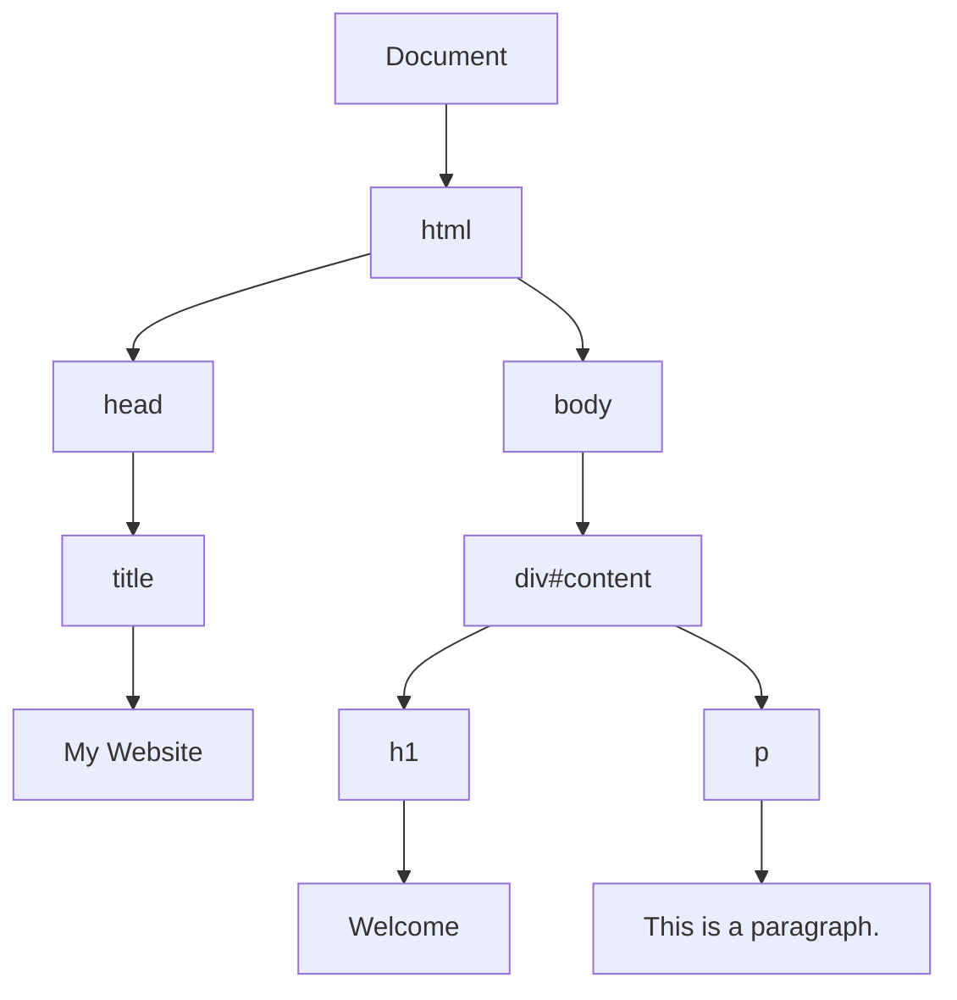
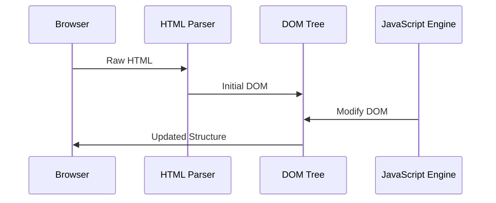
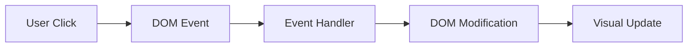

When you visit a website, your browser doesn't just display the raw HTML code. Instead, it transforms that code into something much more sophisticated: the Document Object Model, or DOM. Understanding the DOM is crucial for anyone involved in web scraping because it's literally how browsers "see" and interact with websites.

Think of the DOM as a living, breathing representation of a webpage that exists in your browser's memory. While HTML is static text, the DOM is a dynamic structure that can be modified, traversed, and manipulated in real-time.

## What Exactly Is the DOM?

The DOM is a programming interface that represents HTML and XML documents as a tree structure. Every element, attribute, and piece of text in your HTML becomes a node in this tree. But here's the key difference: the DOM isn't just a copy of your HTML—it's an interpretation of it.

When a browser encounters HTML like this:

```html
<!DOCTYPE html>
<html>
<head>
    <title>My Website</title>
</head>
<body>
    <div id="content">
        <h1>Welcome</h1>
        <p>This is a paragraph.</p>
    </div>
</body>
</html>
```

The browser creates a DOM tree that looks like this:



Each box represents a node in the DOM tree. Some nodes are elements (like `div`, `h1`), while others are text nodes containing the actual content.

## How Browsers Build the DOM

The process of building the DOM happens in several stages, and understanding this helps explain why web scraping can be tricky:

### 1. HTML Parsing
The browser reads the HTML character by character, tokenizing it into meaningful chunks. If there are syntax errors, the browser tries to fix them automatically.

### 2. DOM Construction
Using the tokens, the browser builds the DOM tree. This is where things get interesting—the browser adds elements that might not be explicitly in your HTML:

```html
<table>
    <tr>
        <td>Cell content</td>
    </tr>
</table>
```

Even though there's no `<tbody>` tag in the HTML, the browser automatically adds one to the DOM because it's required by HTML standards.

### 3. JavaScript Execution
After the initial DOM is built, JavaScript can modify it. Elements can be added, removed, or changed. This is why static HTML scrapers often miss dynamically generated content.



## DOM vs. HTML: The Critical Differences

This distinction is fundamental for web scrapers. Here are the key differences:

### Error Correction
HTML might have errors, but the DOM represents what the browser actually renders:

```html
<!-- Malformed HTML -->
<p>Paragraph 1
<p>Paragraph 2</p>
```

The DOM will automatically close the first `<p>` tag, creating two separate paragraph elements.

### Dynamic Content
JavaScript can completely change the DOM after the initial HTML loads:

```javascript
// This content won't be in the original HTML
document.getElementById('content').innerHTML = '<h2>Dynamic Content</h2>';
```

### Browser-Specific Behavior
Different browsers might interpret the same HTML slightly differently, resulting in different DOM representations.

## Navigating the DOM Structure

The DOM provides several ways to traverse and access elements, which directly translate to how web scrapers work:

### Parent-Child Relationships
```javascript
// Getting child elements
const parent = document.getElementById('container');
const children = parent.children;

// Getting parent element
const child = document.querySelector('.item');
const parent = child.parentElement;
```

### Sibling Relationships
```javascript
// Next sibling
const next = element.nextElementSibling;

// Previous sibling
const prev = element.previousElementSibling;
```

### Element Properties
The DOM provides rich information about each element:

```javascript
const element = document.querySelector('div');
console.log(element.tagName);        // DIV
console.log(element.className);      // CSS classes
console.log(element.textContent);    // Text content
console.log(element.innerHTML);      // Inner HTML
console.log(element.outerHTML);      // Outer HTML
```

## DOM Manipulation in Action

Here's how the DOM changes dynamically:

```html
<div id="dynamic-content">
    <p>Original content</p>
</div>

<script>
// Add new element
const container = document.getElementById('dynamic-content');
const newParagraph = document.createElement('p');
newParagraph.textContent = 'Added by JavaScript';
container.appendChild(newParagraph);

// Modify existing element
const original = container.querySelector('p');
original.textContent = 'Modified content';
</script>
```

After this JavaScript runs, the DOM contains different content than the original HTML.

## Implications for Web Scraping

Understanding the DOM is crucial because different scraping approaches interact with it differently:

### Static HTML Scraping
Tools like `requests` in Python only see the original HTML:

```python
import requests
from bs4 import BeautifulSoup

response = requests.get('https://example.com')
soup = BeautifulSoup(response.text, 'html.parser')
# This only sees the initial HTML, not DOM modifications
```

### Browser-Based Scraping
Tools like Playwright or Selenium see the actual DOM:

```python
from playwright.sync_api import sync_playwright

with sync_playwright() as p:
    browser = p.chromium.launch()
    page = browser.new_page()
    page.goto('https://example.com')
    
    # This sees the DOM after JavaScript execution
    content = page.content()
    
    # You can also interact with the DOM directly
    element = page.query_selector('#dynamic-content')
    text = element.text_content()
```

## DOM Events and Interactivity

The DOM is also an event-driven system. Elements can respond to user interactions:



This event system is why some content only appears after user interaction, making it invisible to simple scrapers.

## Common DOM Gotchas for Scrapers

### 1. Lazy Loading
Content that loads only when scrolled into view:

```javascript
// Playwright example to handle lazy loading
await page.evaluate(() => {
    window.scrollTo(0, document.body.scrollHeight);
});
await page.wait_for_timeout(2000); // Wait for content to load
```

### 2. Shadow DOM
Some modern web components use Shadow DOM, which creates isolated DOM trees:

```javascript
// Accessing Shadow DOM content
const shadowHost = document.querySelector('#shadow-host');
const shadowContent = shadowHost.shadowRoot.querySelector('.inside-shadow');
```

### 3. Dynamic IDs and Classes
JavaScript might generate random IDs or classes:

```javascript
// Element might have ID like "item-1647892345"
const dynamicElement = document.querySelector('[id^="item-"]');
```

## Debugging DOM Issues

When scraping fails, DOM inspection is crucial:

```python
# Playwright debugging
page.screenshot(path='debug.png')
print(page.content())  # See the actual DOM
page.pause()  # Interactive debugging
```

Browser developer tools are invaluable for understanding DOM structure:
- Elements tab shows the live DOM
- Console allows DOM manipulation testing
- Network tab reveals dynamic content loading

## Performance Considerations

The DOM has performance implications for both browsers and scrapers:

### DOM Size Impact
Large DOMs slow down both rendering and scraping:

```python
# Count DOM elements
element_count = page.evaluate('document.querySelectorAll("*").length')
print(f"DOM contains {element_count} elements")
```

### Memory Usage
The DOM consumes browser memory proportional to its size and complexity.

## Modern DOM Features

Contemporary web development introduces new DOM concepts:

### Virtual DOM
Frameworks like React create virtual representations of the DOM for performance.

### Web Components
Custom elements that extend the DOM with new functionality.

### Intersection Observer
API for efficiently detecting when elements become visible:

```javascript
const observer = new IntersectionObserver((entries) => {
    entries.forEach(entry => {
        if (entry.isIntersecting) {
            // Element is visible, load content
        }
    });
});
```

The DOM is the bridge between static HTML and dynamic web experiences. For web scrapers, understanding this bridge means the difference between scraping what you see in the source code and scraping what users actually experience.

Every website interaction, every piece of dynamic content, and every user experience element flows through the DOM. Master it, and you'll understand not just what's happening on the page, but why your scrapers sometimes see different content than you expect.

What's the most surprising DOM behavior you've encountered while scraping? Have you ever found content in the DOM that wasn't in the original HTML source?
```