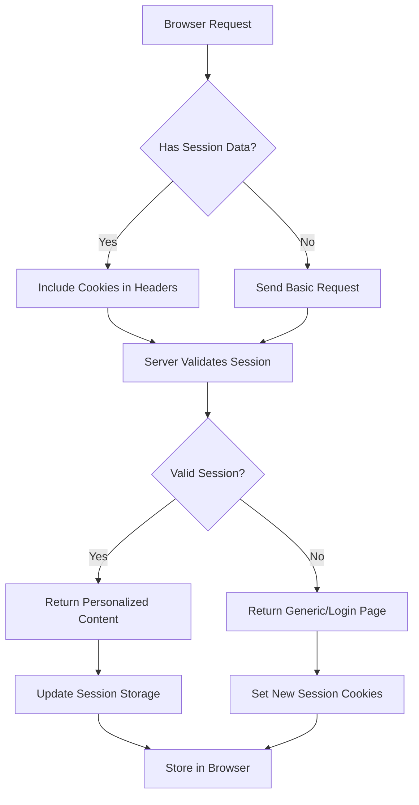
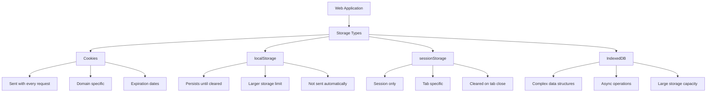
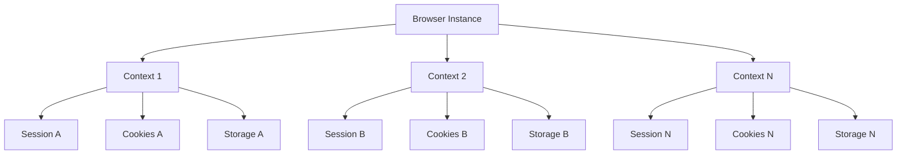

When automating browsers for web scraping, one of the most critical aspects to master is session management. Modern web applications heavily rely on various storage mechanisms to maintain user state, track authentication, and provide personalized experiences. Understanding how to properly manage cookies, localStorage, sessionStorage, and other state persistence methods can make the difference between a successful scraping operation and a frustrated debugging session.

## The Foundation of Web Session Management

Web sessions are built on the stateless nature of HTTP, where each request is independent. Understanding [client-server basics as the foundation of web scraping](/posts/client-server-basics-foundation-web-scraping/) helps explain why sessions are necessary. To create a stateful experience, web applications use several storage mechanisms that persist data between requests and page loads.


```mermaid
graph TD
    A[Browser Request] --> B{Has Session Data?}
    B -->|Yes| C[Include Cookies in Headers]
    B -->|No| D[Send Basic Request]
    C --> E[Server Validates Session]
    D --> E
    E --> F{Valid Session?}
    F -->|Yes| G[Return Personalized Content]
    F -->|No| H[Return Generic/Login Page]
    G --> I[Update Session Storage]
    H --> J[Set New Session Cookies]
    I --> K[Store in Browser]
    J --> K
```

## Cookie Management in Browser Automation

Cookies remain the most fundamental session management mechanism. They're automatically included in HTTP requests and provide a seamless way to maintain state across page visits. For a focused look at this topic, see [session and cookie management for maintaining auth across requests](/posts/session-cookie-management-maintaining-auth-across-requests/).

### Playwright Cookie Management

```javascript
const { chromium } = require('playwright');

async function manageCookies() {
    const browser = await chromium.launch();
    const context = await browser.newContext();
    const page = await context.newPage();
    
    // Navigate to login page
    await page.goto('https://example.com/login');
    
    // Perform login
    await page.fill('#username', 'your_username');
    await page.fill('#password', 'your_password');
    await page.click('#login-button');
    
    // Wait for login to complete
    await page.waitForURL('**/dashboard');
    
    // Save cookies for later use
    const cookies = await context.cookies();
    console.log('Session cookies:', cookies);
    
    // Save cookies to file
    const fs = require('fs');
    fs.writeFileSync('session_cookies.json', JSON.stringify(cookies, null, 2));
    
    await browser.close();
}

// Load and use saved cookies
async function useSavedCookies() {
    const browser = await chromium.launch();
    const context = await browser.newContext();
    
    // Load cookies from file
    const fs = require('fs');
    const cookies = JSON.parse(fs.readFileSync('session_cookies.json', 'utf8'));
    
    // Add cookies to context
    await context.addCookies(cookies);
    
    const page = await context.newPage();
    
    // Navigate to protected page - should be logged in
    await page.goto('https://example.com/dashboard');
    
    await browser.close();
}
```

The same pattern applies in Selenium: use `driver.get_cookies()` to save and `driver.add_cookie(cookie)` to restore, with the requirement that you navigate to the domain before adding cookies.

## Local Storage and Session Storage Management

Modern web applications increasingly use localStorage and sessionStorage for client-side state management. These storage mechanisms aren't automatically sent with HTTP requests like cookies, but they're crucial for maintaining application state.


```mermaid
graph TB
    A[Web Application] --> B[Storage Types]
    B --> C[Cookies]
    B --> D[localStorage]
    B --> E[sessionStorage]
    B --> F[IndexedDB]
    
    C --> C1[Sent with every request]
    C --> C2[Domain specific]
    C --> C3[Expiration dates]
    
    D --> D1[Persists until cleared]
    D --> D2[Larger storage limit]
    D --> D3[Not sent automatically]
    
    E --> E1[Session only]
    E --> E2[Tab specific]
    E --> E3[Cleared on tab close]
    
    F --> F1[Complex data structures]
    F --> F2[Async operations]
    F --> F3[Large storage capacity]
```

### Accessing Browser Storage

```javascript
// Playwright storage management
async function manageStorage(page) {
    // Access localStorage
    const localStorageData = await page.evaluate(() => {
        const storage = {};
        for (let i = 0; i < localStorage.length; i++) {
            const key = localStorage.key(i);
            storage[key] = localStorage.getItem(key);
        }
        return storage;
    });
    
    // Access sessionStorage
    const sessionStorageData = await page.evaluate(() => {
        const storage = {};
        for (let i = 0; i < sessionStorage.length; i++) {
            const key = sessionStorage.key(i);
            storage[key] = sessionStorage.getItem(key);
        }
        return storage;
    });
    
    console.log('Local Storage:', localStorageData);
    console.log('Session Storage:', sessionStorageData);
    
    // Set storage values
    await page.evaluate(() => {
        localStorage.setItem('user_preference', 'dark_mode');
        sessionStorage.setItem('temp_data', 'session_value');
    });
}
```

In Selenium, the same approach works via `driver.execute_script()` -- iterate over `localStorage` or `sessionStorage` keys and call `getItem()` to read values, or `setItem()` to write them.

## Advanced Session Persistence Strategies

For complex applications, you'll need more sophisticated session management strategies that handle multiple storage types and maintain state across browser restarts.

### Complete Session Backup and Restore

```python
import json
import os
from selenium import webdriver
from selenium.webdriver.chrome.options import Options

class SessionManager:
    def __init__(self, session_file='complete_session.json'):
        self.session_file = session_file
        self.driver = None
    
    def save_complete_session(self, driver):
        """Save cookies, localStorage, and sessionStorage"""
        session_data = {
            'cookies': driver.get_cookies(),
            'localStorage': driver.execute_script("""
                var storage = {};
                for (var i = 0; i < localStorage.length; i++) {
                    var key = localStorage.key(i);
                    storage[key] = localStorage.getItem(key);
                }
                return storage;
            """),
            'sessionStorage': driver.execute_script("""
                var storage = {};
                for (var i = 0; i < sessionStorage.length; i++) {
                    var key = sessionStorage.key(i);
                    storage[key] = sessionStorage.getItem(key);
                }
                return storage;
            """),
            'url': driver.current_url
        }
        
        with open(self.session_file, 'w') as f:
            json.dump(session_data, f, indent=2)
        
        print(f"Session saved to {self.session_file}")
    
    def load_complete_session(self, driver, domain):
        """Restore complete session state"""
        if not os.path.exists(self.session_file):
            print("No session file found")
            return False
        
        with open(self.session_file, 'r') as f:
            session_data = json.load(f)
        
        # Navigate to domain first
        driver.get(domain)
        
        # Restore cookies
        for cookie in session_data.get('cookies', []):
            try:
                driver.add_cookie(cookie)
            except Exception as e:
                print(f"Failed to add cookie {cookie.get('name')}: {e}")
        
        # Restore localStorage
        for key, value in session_data.get('localStorage', {}).items():
            driver.execute_script(f"""
                localStorage.setItem('{key}', '{value}');
            """)
        
        # Restore sessionStorage  
        for key, value in session_data.get('sessionStorage', {}).items():
            driver.execute_script(f"""
                sessionStorage.setItem('{key}', '{value}');
            """)
        
        # Navigate to original URL if available
        if session_data.get('url'):
            driver.get(session_data['url'])
        
        print("Session restored successfully")
        return True
```

## Handling Session Expiration and Renewal

Real-world applications require robust session handling that can detect when sessions expire and automatically renew them. This is especially important for [cookie and state management in long-running scraping jobs](/posts/cookie-state-management-long-running-scraping-jobs/).

```javascript
class SessionManager {
    constructor(page) {
        this.page = page;
        this.loginCredentials = null;
        this.sessionCheckers = [];
    }
    
    async setLoginCredentials(username, password) {
        this.loginCredentials = { username, password };
    }
    
    async isSessionValid() {
        // Check for common signs of expired session
        const indicators = [
            () => this.page.url().includes('login'),
            () => this.page.locator('text=Login').isVisible(),
            () => this.page.locator('.login-form').isVisible(),
            () => this.page.locator('text=Session expired').isVisible()
        ];
        
        for (const check of indicators) {
            try {
                if (await check()) {
                    return false;
                }
            } catch (e) {
                // Ignore errors from checks
            }
        }
        
        return true;
    }
    
    async renewSession() {
        if (!this.loginCredentials) {
            throw new Error('No login credentials provided');
        }
        
        console.log('Session expired, renewing...');
        
        await this.page.goto('https://example.com/login');
        await this.page.fill('#username', this.loginCredentials.username);
        await this.page.fill('#password', this.loginCredentials.password);
        await this.page.click('#login-button');
        
        // Wait for login to complete
        await this.page.waitForURL('**/dashboard');
        
        console.log('Session renewed successfully');
    }
    
    async executeWithSessionCheck(action) {
        try {
            if (!(await this.isSessionValid())) {
                await this.renewSession();
            }
            
            return await action();
        } catch (error) {
            // If action fails, check if it's due to session expiration
            if (!(await this.isSessionValid())) {
                await this.renewSession();
                return await action(); // Retry once
            }
            
            throw error;
        }
    }
}

// Usage
async function scrapeWithSessionManagement() {
    const browser = await chromium.launch();
    const context = await browser.newContext();
    const page = await context.newPage();
    
    const sessionManager = new SessionManager(page);
    await sessionManager.setLoginCredentials('username', 'password');
    
    // Initial login
    await sessionManager.renewSession();
    
    // Perform actions with automatic session renewal
    await sessionManager.executeWithSessionCheck(async () => {
        await page.goto('https://example.com/protected-data');
        return await page.locator('.data-table').textContent();
    });
    
    await browser.close();
}
```

## Browser Profile and Context Management

For long-term session persistence, managing browser profiles and contexts becomes crucial. Our guide on [user session persistence and keeping logins alive in automation](/posts/user-session-persistence-keeping-logins-alive-automation/) dives deeper into these strategies.


```mermaid
graph TD
    A[Browser Instance] --> B[Context 1]
    A --> C[Context 2]
    A --> D[Context N]
    
    B --> B1[Session A]
    B --> B2[Cookies A]
    B --> B3[Storage A]
    
    C --> C1[Session B]
    C --> C2[Cookies B]
    C --> C3[Storage B]
    
    D --> D1[Session N]
    D --> D2[Cookies N]
    D --> D3[Storage N]
```

### Persistent Browser Profiles

```javascript
// Playwright with persistent context
async function createPersistentSession() {
    const userDataDir = './browser-profile';
    
    const context = await chromium.launchPersistentContext(userDataDir, {
        headless: false,
        viewport: { width: 1920, height: 1080 }
    });
    
    const page = await context.newPage();
    
    // Perform login - state will be saved to profile
    await page.goto('https://example.com/login');
    // ... login process
    
    // Close context - session data is automatically saved
    await context.close();
}
```

To resume a saved session, simply call `launchPersistentContext` with the same `userDataDir` and navigate directly to the protected area -- the session data will already be present.

Managing session state effectively is like conducting an orchestra—every storage mechanism must work in harmony to create a seamless user experience. Sessions often come into play during [form filling automation and login flows](/posts/form-filling-automation-simple-inputs-complex-multi-step/), where maintaining auth state is essential. For Selenium-specific techniques, see [Selenium session management: saving cookies and localStorage](/posts/selenium-session-management-saving-cookies-localstorage/). Whether you're maintaining authentication across multiple scraping sessions or preserving complex application state, the techniques we've explored provide the foundation for robust, reliable browser automation.

What's your biggest challenge when it comes to maintaining sessions during long-running scraping operations? Have you found creative ways to detect and handle session expiration in the applications you're working with?
