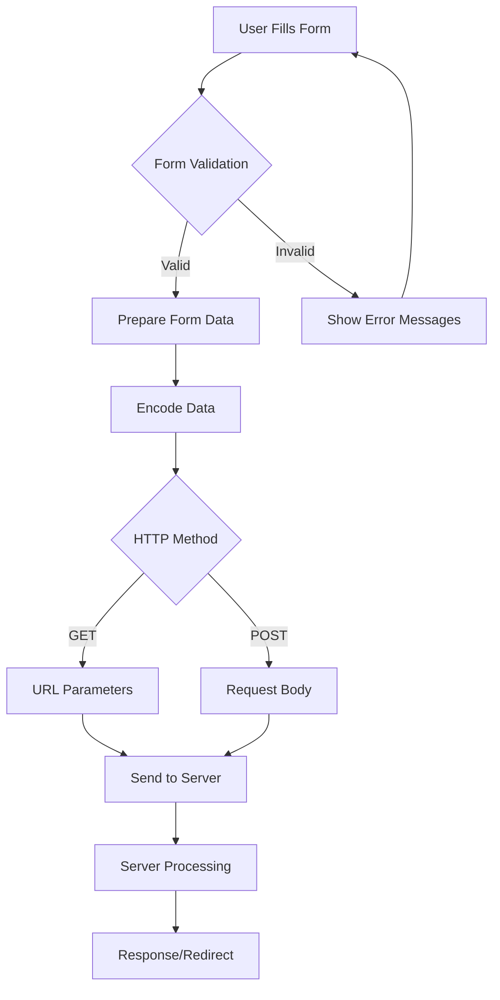
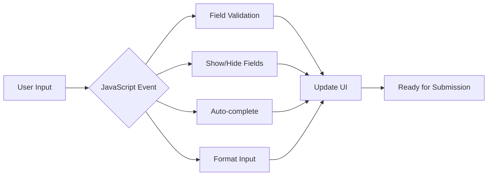
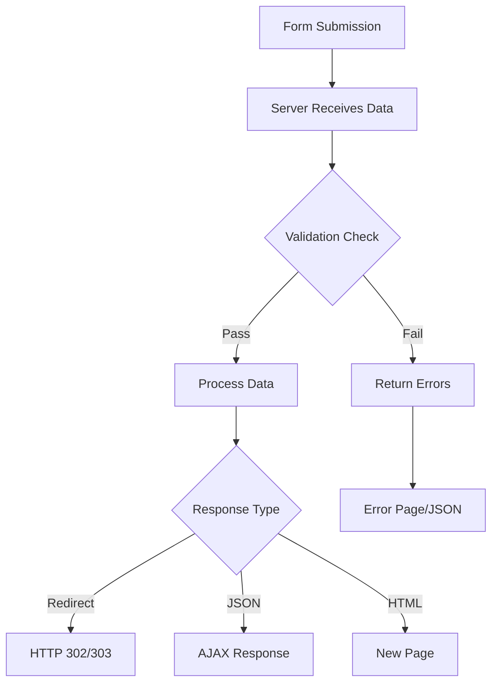

Web forms are the gateway to interactive data on the internet. Every time you log into a website, submit a search query, or upload a file, you're interacting with web forms. For web scrapers and data extraction specialists, understanding how forms work internally is crucial for automating these interactions and accessing the data behind them.

Forms represent one of the most dynamic aspects of web scraping because they require active participation rather than passive data collection. Unlike static content scraping, form interaction involves understanding the structure, validation rules, and submission mechanisms that websites use to collect and process user input.

## Anatomy of Web Forms

At its core, a web form is an HTML structure that collects user input and transmits it to a server for processing. The basic building blocks include the form element itself, various input controls, and submission mechanisms.

```html
<form action="/submit-data" method="POST" enctype="multipart/form-data">
    <input type="text" name="username" required>
    <input type="password" name="password" minlength="8">
    <input type="email" name="email">
    <select name="country">
        <option value="US">United States</option>
        <option value="CA">Canada</option>
    </select>
    <textarea name="comments" rows="4" cols="50"></textarea>
    <input type="submit" value="Submit">
</form>
```

The form element defines where the data goes (action attribute) and how it's sent (method attribute). The enctype attribute specifies how the form data should be encoded when submitting to the server, which becomes particularly important when dealing with file uploads.



## Input Types and Their Data Patterns

Modern HTML provides numerous input types, each with specific data patterns and validation rules. Understanding these patterns is essential for web scrapers to provide appropriate data and handle validation correctly.

Text-based inputs include standard text fields, email addresses, URLs, and telephone numbers. Each has its own validation pattern:

```html
<input type="text" name="fullname" pattern="[A-Za-z\s]+" title="Only letters and spaces">
<input type="email" name="email" pattern="[a-z0-9._%+-]+@[a-z0-9.-]+\.[a-z]{2,}$">
<input type="url" name="website" placeholder="https://example.com">
<input type="tel" name="phone" pattern="[0-9]{3}-[0-9]{3}-[0-9]{4}">
```

Numeric inputs provide built-in validation and formatting:

```html
<input type="number" name="age" min="18" max="99" step="1">
<input type="range" name="rating" min="1" max="10" value="5">
```

Date and time inputs create standardized formats that eliminate ambiguity:

```html
<input type="date" name="birthdate" min="1900-01-01" max="2024-12-31">
<input type="datetime-local" name="appointment">
<input type="time" name="meeting-time" step="900"> <!-- 15-minute intervals -->
```

When scraping forms programmatically, you need to respect these constraints to avoid validation errors:

```python
from datetime import datetime, timedelta
import re

def validate_form_input(input_type, value, constraints):
    """Validate form input based on type and constraints"""
    if input_type == "email":
        pattern = r'^[a-zA-Z0-9._%+-]+@[a-zA-Z0-9.-]+\.[a-zA-Z]{2,}$'
        return re.match(pattern, value) is not None
    
    elif input_type == "number":
        try:
            num = float(value)
            min_val = constraints.get('min')
            max_val = constraints.get('max')
            if min_val and num < float(min_val):
                return False
            if max_val and num > float(max_val):
                return False
            return True
        except ValueError:
            return False
    
    elif input_type == "date":
        try:
            date_obj = datetime.strptime(value, '%Y-%m-%d')
            min_date = constraints.get('min')
            max_date = constraints.get('max')
            if min_date and date_obj < datetime.strptime(min_date, '%Y-%m-%d'):
                return False
            if max_date and date_obj > datetime.strptime(max_date, '%Y-%m-%d'):
                return False
            return True
        except ValueError:
            return False
    
    return True
```

## Form Data Encoding and Transmission

The way form data gets encoded and transmitted depends on the form's method and enctype attributes. This understanding is crucial when intercepting or replicating form submissions.

For application/x-www-form-urlencoded (the default), data is encoded as key-value pairs:

```python
import urllib.parse

def encode_form_data(form_data):
    """Encode form data as URL-encoded string"""
    encoded_data = urllib.parse.urlencode(form_data)
    return encoded_data

# Example usage
form_data = {
    'username': 'john_doe',
    'email': 'john@example.com',
    'message': 'Hello, world!'
}
encoded = encode_form_data(form_data)
# Results in: username=john_doe&email=john%40example.com&message=Hello%2C+world%21
```

For multipart/form-data, typically used with file uploads, the encoding is more complex:

```python
import requests
from requests_toolbelt.multipart.encoder import MultipartEncoder

def submit_multipart_form(url, form_data, files=None):
    """Submit form with multipart encoding"""
    multipart_data = MultipartEncoder(
        fields={
            'username': 'john_doe',
            'profile_pic': ('avatar.jpg', open('avatar.jpg', 'rb'), 'image/jpeg'),
            'description': 'User profile description'
        }
    )
    
    response = requests.post(
        url,
        data=multipart_data,
        headers={'Content-Type': multipart_data.content_type}
    )
    return response
```

## Dynamic Form Behavior and JavaScript

Modern web forms often include dynamic behavior powered by JavaScript. This can include real-time validation, conditional fields that appear based on other selections, and AJAX submissions that don't reload the page.



Here's how dynamic forms might behave:

```javascript
// Real-time validation
document.getElementById('email').addEventListener('input', function(e) {
    const email = e.target.value;
    const isValid = /^[^\s@]+@[^\s@]+\.[^\s@]+$/.test(email);
    
    if (isValid) {
        e.target.classList.remove('invalid');
        e.target.classList.add('valid');
    } else {
        e.target.classList.remove('valid');
        e.target.classList.add('invalid');
    }
});

// Conditional field display
document.getElementById('country').addEventListener('change', function(e) {
    const stateField = document.getElementById('state-container');
    if (e.target.value === 'US') {
        stateField.style.display = 'block';
        document.getElementById('state').required = true;
    } else {
        stateField.style.display = 'none';
        document.getElementById('state').required = false;
    }
});
```

When scraping such forms, you need to account for these behaviors:

```python
from selenium import webdriver
from selenium.webdriver.support.ui import WebDriverWait
from selenium.webdriver.support import expected_conditions as EC
from selenium.webdriver.common.by import By

def handle_dynamic_form(driver, form_data):
    """Handle dynamic form with conditional fields"""
    
    # Fill country first
    country_select = driver.find_element(By.NAME, "country")
    country_select.send_keys(form_data['country'])
    
    # Wait for conditional fields to appear
    if form_data['country'] == 'US':
        state_field = WebDriverWait(driver, 10).until(
            EC.presence_of_element_located((By.NAME, "state"))
        )
        state_field.send_keys(form_data['state'])
    
    # Fill other fields
    for field_name, value in form_data.items():
        if field_name not in ['country', 'state']:
            field = driver.find_element(By.NAME, field_name)
            field.clear()
            field.send_keys(value)
            
            # Trigger validation events
            driver.execute_script("arguments[0].dispatchEvent(new Event('input', {bubbles: true}));", field)
```

## Form Output Processing

Understanding how servers process form output is equally important. Forms can produce various types of responses: successful submissions, validation errors, redirects, or AJAX responses.



Here's how to handle different response types:

```python
import requests
import json
from urllib.parse import urlparse

def submit_and_process_form(url, form_data, session=None):
    """Submit form and process different response types"""
    if session is None:
        session = requests.Session()
    
    response = session.post(url, data=form_data)
    
    # Handle redirects
    if response.status_code in [301, 302, 303, 307, 308]:
        redirect_url = response.headers.get('Location')
        print(f"Form submission redirected to: {redirect_url}")
        return session.get(redirect_url)
    
    # Handle JSON responses (AJAX submissions)
    content_type = response.headers.get('content-type', '')
    if 'application/json' in content_type:
        try:
            json_response = response.json()
            if json_response.get('success'):
                print("Form submitted successfully")
                return json_response.get('data')
            else:
                print("Form submission failed:")
                for error in json_response.get('errors', []):
                    print(f"  - {error}")
                return None
        except json.JSONDecodeError:
            print("Invalid JSON response")
    
    # Handle HTML responses
    elif 'text/html' in content_type:
        # Look for success/error indicators in HTML
        if "success" in response.text.lower() or "thank you" in response.text.lower():
            print("Form likely submitted successfully")
        elif "error" in response.text.lower() or "invalid" in response.text.lower():
            print("Form submission likely failed")
    
    return response
```

## Advanced Form Techniques

Some forms employ sophisticated techniques to prevent automated submissions or ensure data integrity. These include CSRF tokens, rate limiting, and multi-step processes.

CSRF (Cross-Site Request Forgery) tokens are hidden form fields that must be included with submissions:

```python
from bs4 import BeautifulSoup
import requests

def extract_csrf_token(session, form_url):
    """Extract CSRF token from form page"""
    response = session.get(form_url)
    soup = BeautifulSoup(response.content, 'html.parser')
    
    csrf_input = soup.find('input', {'name': '_token'}) or \
                 soup.find('input', {'name': 'csrf_token'}) or \
                 soup.find('input', {'name': '_csrf'})
    
    if csrf_input:
        return csrf_input.get('value')
    
    # Check meta tags
    csrf_meta = soup.find('meta', {'name': 'csrf-token'})
    if csrf_meta:
        return csrf_meta.get('content')
    
    return None

def submit_form_with_csrf(form_url, submit_url, form_data):
    """Submit form with CSRF protection"""
    session = requests.Session()
    
    # Get CSRF token
    csrf_token = extract_csrf_token(session, form_url)
    if csrf_token:
        form_data['_token'] = csrf_token
    
    # Submit form
    return session.post(submit_url, data=form_data)
```

Multi-step forms require maintaining state between requests:

```python
class MultiStepFormHandler:
    def __init__(self):
        self.session = requests.Session()
        self.current_step = 1
        self.form_state = {}
    
    def submit_step(self, url, step_data):
        """Submit one step of multi-step form"""
        # Merge with existing state
        self.form_state.update(step_data)
        
        response = self.session.post(url, data=step_data)
        
        # Check if more steps are required
        if "step" in response.url or "continue" in response.text.lower():
            self.current_step += 1
            return False, response  # More steps needed
        else:
            return True, response   # Form complete
```

Forms are the interactive backbone of the modern web, serving as the primary mechanism for users to input data and websites to collect information. Whether you're automating user registrations, submitting search queries, or uploading files, mastering form interaction opens up vast possibilities for data extraction and automation.

The key to successful form automation lies in understanding not just the visible interface, but the underlying mechanics of data validation, encoding, transmission, and response processing. Each form presents its own unique challenges, from dynamic JavaScript behaviors to sophisticated security measures.

What's the most complex form interaction challenge you've encountered in your web scraping projects, and how would you approach solving it using the techniques we've explored?