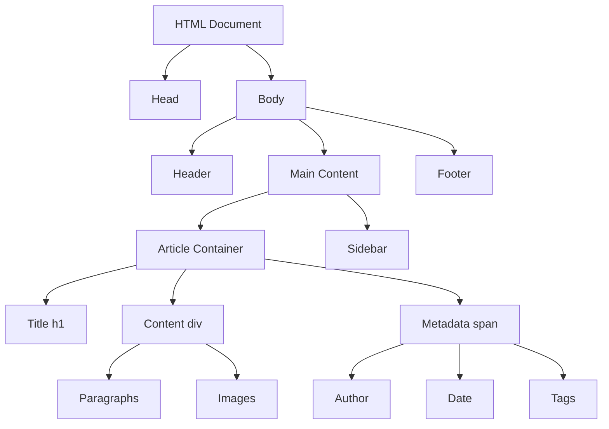
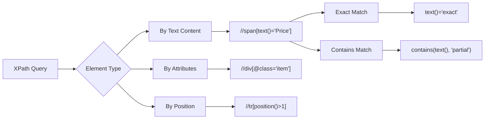

When you first look at a webpage's source code, it can feel like staring at a wall of text with thousands of HTML elements sprawled across multiple files. Finding the exact piece of data you need resembles searching for a specific grain of sand on a beach. However, with the right techniques and tools, you can systematically identify and extract any element from even the most complex web pages.

The foundation of successful web scraping lies in understanding how to efficiently locate and target the specific elements containing your desired data. This skill separates amateur scrapers from professionals who can navigate any website structure with confidence.

## Understanding the Web Page Anatomy

Modern websites are built using a hierarchical structure called the Document Object Model (DOM). Every element on a page has a specific location within this tree-like structure, making it possible to create precise paths to reach your target data.



When examining any webpage, start by understanding its overall structure. Use your browser's developer tools to inspect the page hierarchy and identify patterns in how content is organized. Most websites follow consistent naming conventions and structural patterns that make element identification more predictable.

## CSS Selectors: Your Primary Weapon

CSS selectors provide the most intuitive way to target elements. They use the same syntax that web developers use to style pages, making them readable and maintainable.

### Basic Selectors

```python
import requests
from bs4 import BeautifulSoup

# Target elements by tag
soup.select('div')          # All div elements
soup.select('h1')           # All h1 elements

# Target by class
soup.select('.product-name')     # Elements with class 'product-name'
soup.select('.price.sale')       # Elements with both 'price' and 'sale' classes

# Target by ID
soup.select('#main-content')     # Element with ID 'main-content'

# Target by attribute
soup.select('[data-id]')         # Elements with data-id attribute
soup.select('[href*="contact"]') # Links containing 'contact' in href
```

### Advanced Selector Patterns

```python
# Descendant combinations
soup.select('article .author-name')    # .author-name inside article
soup.select('div > span')              # span directly inside div

# Sibling selectors
soup.select('h2 + p')                  # p immediately after h2
soup.select('h2 ~ p')                  # All p elements after h2

# Pseudo-selectors
soup.select('tr:nth-child(even)')      # Even table rows
soup.select('li:first-child')          # First list item
soup.select('div:not(.advertisement)') # Divs without advertisement class
```

## XPath: When CSS Selectors Aren't Enough

XPath provides more powerful selection capabilities, especially when you need to navigate based on text content or complex relationships between elements.

```python
from selenium import webdriver
from selenium.webdriver.common.by import By

driver = webdriver.Chrome()

# Select by text content
driver.find_elements(By.XPATH, "//span[text()='Add to Cart']")

# Select by partial text
driver.find_elements(By.XPATH, "//a[contains(text(), 'Learn More')]")

# Navigate to parent/ancestor
driver.find_elements(By.XPATH, "//span[@class='price']/../..")

# Complex conditions
driver.find_elements(By.XPATH, "//div[@class='product' and @data-category='electronics']")

# Position-based selection
driver.find_elements(By.XPATH, "//table//tr[position()>1]")  # Skip header row
```



## Dynamic Element Identification Strategies

Many modern websites load content dynamically, requiring different approaches to element identification.

### Handling AJAX Content

```python
from selenium.webdriver.support.ui import WebDriverWait
from selenium.webdriver.support import expected_conditions as EC

def wait_for_element(driver, selector, timeout=10):
    """Wait for element to be present and visible"""
    wait = WebDriverWait(driver, timeout)
    return wait.until(EC.visibility_of_element_located((By.CSS_SELECTOR, selector)))

# Wait for dynamic content
driver.get('https://example.com')
products = wait_for_element(driver, '.product-list .item')
```

### Identifying Stable Selectors

Dynamic websites often change class names and IDs, but certain attributes remain stable:

```python
# Prefer data attributes (more stable)
soup.select('[data-testid="product-price"]')
soup.select('[data-component="ProductCard"]')

# Use semantic HTML when possible
soup.select('article header h1')  # More stable than .title-large
soup.select('nav ul li a')        # More reliable than .menu-item

# Combine multiple attributes for specificity
soup.select('button[type="submit"][data-action="purchase"]')
```

## Pattern Recognition Techniques

Successful scrapers develop an eye for common patterns that websites use to organize content.

### Container Patterns

```python
# Product listing patterns
products = soup.select('.product-grid .product-card')
products = soup.select('[data-testid*="product"]')  
products = soup.select('.listing-container > .item')

# Article patterns  
articles = soup.select('article, .post, .entry')
titles = soup.select('article h1, article h2, .post-title')
content = soup.select('article .content, .post-body, .entry-text')

# Navigation patterns
menu_items = soup.select('nav ul li a, .menu .menu-item, .navigation-link')
```

### Data Extraction Workflows

```python
def extract_product_data(product_element):
    """Extract structured data from product container"""
    try:
        name = product_element.select_one('.product-name, h3, .title').text.strip()
        price = product_element.select_one('.price, .cost, [data-price]').text.strip()
        image = product_element.select_one('img').get('src')
        link = product_element.select_one('a').get('href')
        
        return {
            'name': name,
            'price': price,
            'image': image,
            'link': link
        }
    except AttributeError as e:
        print(f"Missing element in product: {e}")
        return None

# Apply to all products
products_data = []
for product in soup.select('.product-item'):
    data = extract_product_data(product)
    if data:
        products_data.append(data)
```

## Dealing with Challenging Scenarios

Real-world scraping often presents obstacles that require creative solutions.

### Shadow DOM Elements

```javascript
// For sites using Shadow DOM (execute via Selenium)
const shadowHost = document.querySelector('.shadow-host');
const shadowRoot = shadowHost.shadowRoot;
const targetElement = shadowRoot.querySelector('.hidden-content');
return targetElement.textContent;
```

### Heavily Nested Structures

```python
# Use specific descendant patterns
soup.select('.main-container .content-wrapper .article-section .text-content p')

# Or break it down step by step
container = soup.select_one('.main-container')
if container:
    wrapper = container.select_one('.content-wrapper')
    if wrapper:
        content = wrapper.select('.text-content p')
```

### Multiple Similar Elements

```python
# When multiple elements have same class but different purposes
price_elements = soup.select('.price')

# Filter by context
actual_prices = []
for price in price_elements:
    # Check if it's inside a product container
    if price.find_parent('.product-card'):
        actual_prices.append(price.text.strip())
```

## Building Robust Selectors

Create selectors that can withstand minor website changes:

```python
def get_robust_selector(soup, target_text):
    """Generate multiple selector options for the same element"""
    selectors = []
    
    # Find element containing target text
    element = soup.find(string=target_text)
    if element:
        parent = element.find_parent()
        
        # Generate various selector options
        if parent.get('class'):
            selectors.append(f".{' '.join(parent['class'])}")
        
        if parent.get('id'):
            selectors.append(f"#{parent['id']}")
            
        if parent.get('data-testid'):
            selectors.append(f"[data-testid='{parent['data-testid']}']")
            
        # Add positional selector as fallback
        tag_siblings = parent.find_parent().find_all(parent.name)
        position = tag_siblings.index(parent) + 1
        selectors.append(f"{parent.name}:nth-child({position})")
    
    return selectors
```

## Testing and Validation

Always verify that your selectors work consistently:

```python
def validate_selectors(url, selectors, expected_count=None):
    """Test multiple selectors against a page"""
    response = requests.get(url)
    soup = BeautifulSoup(response.content, 'html.parser')
    
    results = {}
    for name, selector in selectors.items():
        elements = soup.select(selector)
        results[name] = {
            'count': len(elements),
            'success': len(elements) > 0,
            'sample_text': elements[0].text.strip() if elements else None
        }
        
        if expected_count and len(elements) != expected_count:
            print(f"Warning: {name} found {len(elements)}, expected {expected_count}")
    
    return results

# Test your selectors
test_selectors = {
    'products': '.product-card',
    'prices': '.price',
    'titles': '.product-title'
}

results = validate_selectors('https://example-shop.com', test_selectors, expected_count=20)
```

Mastering element identification transforms web scraping from a frustrating guessing game into a systematic process. The key lies in understanding website patterns, using the right tools for each situation, and building robust selectors that can adapt to minor changes.

Remember that websites are living entities that evolve over time. The selectors that work today might need adjustment tomorrow. By developing a systematic approach to element identification and building flexibility into your scraping code, you'll be prepared to handle whatever challenges the web throws at you.

What's the most challenging website structure you've encountered, and how did you crack the code to extract its hidden data treasures?