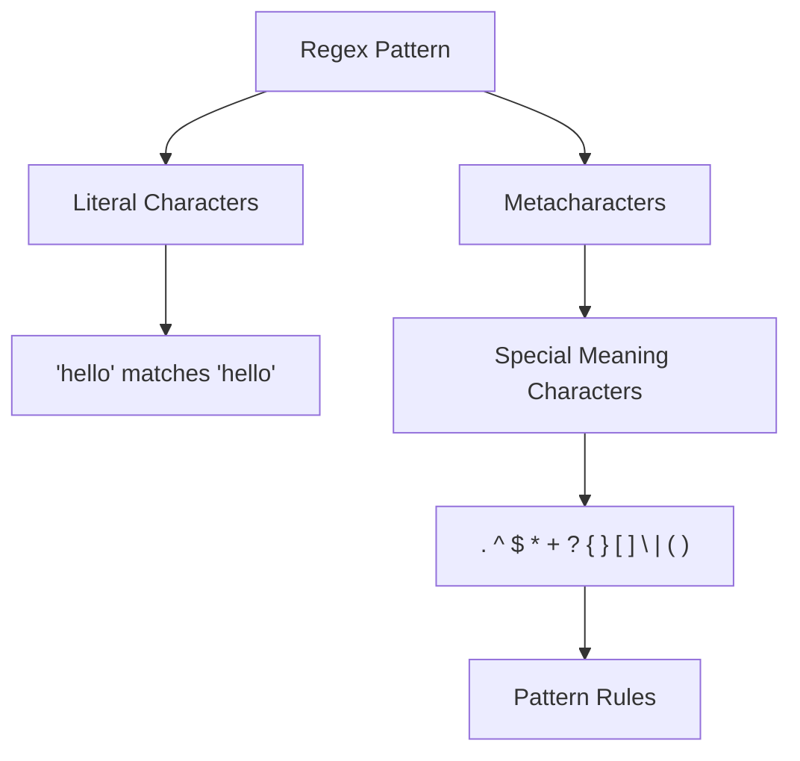
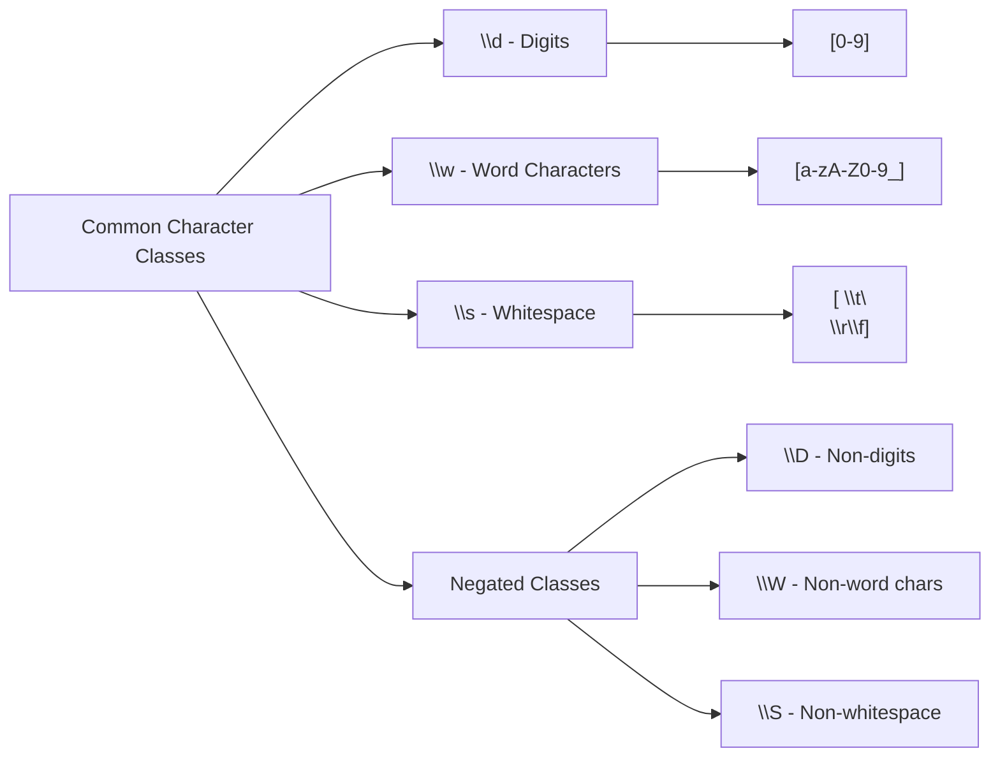

Regular expressions, commonly known as regex, are powerful pattern-matching tools that every web scraper should master. When you're extracting data from web pages, you'll frequently encounter situations where you need to find specific patterns within text, validate data formats, or clean extracted content. Regex provides an elegant solution to these challenges.

Think of regex as a search language for text patterns. Instead of looking for exact matches, you define patterns that describe what you're looking for. This makes regex incredibly versatile for web scraping tasks like extracting email addresses, phone numbers, prices, or any structured data from HTML content.

## Understanding Basic Regex Components

Regex patterns consist of literal characters and special metacharacters. Literal characters match themselves exactly, while metacharacters have special meanings that define pattern rules.



The most fundamental metacharacter is the dot (.), which matches any single character except newlines. For example, the pattern `h.llo` would match "hello", "hallo", or "h3llo".

Character classes, defined with square brackets, let you specify a set of characters to match. The pattern `[aeiou]` matches any vowel, while `[0-9]` matches any digit. You can also use ranges like `[a-z]` for lowercase letters or `[A-Za-z0-9]` for alphanumeric characters.

## Quantifiers and Repetition

Quantifiers control how many times a character or group should match. These are essential for flexible pattern matching in web scraping scenarios.

```python
import re

# Different quantifier examples
text = "I have 5 apples, 23 oranges, and 100 bananas"

# * matches 0 or more
pattern_star = r'\d*'  # Matches any number of digits (including none)

# + matches 1 or more  
pattern_plus = r'\d+'  # Matches one or more digits
numbers = re.findall(pattern_plus, text)
print(numbers)  # ['5', '23', '100']

# ? matches 0 or 1 (optional)
pattern_question = r'colou?r'  # Matches both 'color' and 'colour'

# {n,m} matches between n and m times
pattern_range = r'\d{2,3}'  # Matches 2 or 3 digits
large_numbers = re.findall(pattern_range, text)
print(large_numbers)  # ['23', '100']
```

## Anchors and Boundaries

Anchors specify position within the text rather than matching characters. The caret (^) matches the beginning of a line, while the dollar sign ($) matches the end. Word boundaries (\b) are particularly useful for matching whole words.

```python
import re

text = "The email admin@example.com belongs to the administrator"

# Without word boundary - matches partial words
pattern_partial = r'admin'
matches = re.findall(pattern_partial, text)
print(matches)  # ['admin', 'admin'] - matches both instances

# With word boundary - matches whole words only
pattern_boundary = r'\badmin\b'
matches = re.findall(pattern_boundary, text)
print(matches)  # ['admin'] - only matches the standalone word
```

## Character Classes and Shortcuts

Regex provides predefined character classes for common patterns. These shortcuts make your patterns more readable and maintainable.



```python
import re

html_content = """
<div class="price">$29.99</div>
<span class="discount">Save 15%!</span>
<p>Contact: john.doe@email.com</p>
"""

# Extract prices using digit class
prices = re.findall(r'\$\d+\.\d+', html_content)
print(f"Prices: {prices}")  # ['$29.99']

# Extract percentages
percentages = re.findall(r'\d+%', html_content)
print(f"Percentages: {percentages}")  # ['15%']

# Extract email addresses
emails = re.findall(r'\w+\.\w+@\w+\.\w+', html_content)
print(f"Emails: {emails}")  # ['john.doe@email.com']
```

## Groups and Capturing

Parentheses create groups that capture matched text for later use. This is incredibly powerful for extracting specific parts of matched patterns.

```python
import re

product_data = """
Product: iPhone 14 Pro - Price: $999.99 - Stock: 25
Product: MacBook Air - Price: $1,199.00 - Stock: 12  
Product: iPad Mini - Price: $499.99 - Stock: 8
"""

# Capture product details using groups
pattern = r'Product: (.+?) - Price: \$([0-9,]+\.\d{2}) - Stock: (\d+)'
matches = re.findall(pattern, product_data)

for name, price, stock in matches:
    print(f"Product: {name}")
    print(f"Price: ${price}")
    print(f"Stock: {stock} units")
    print("---")
```

Named groups make your patterns more readable and maintainable:

```python
import re

log_entry = "2025-05-15 14:30:25 - ERROR - Failed to connect to database"

# Using named groups
pattern = r'(?P<date>\d{4}-\d{2}-\d{2}) (?P<time>\d{2}:\d{2}:\d{2}) - (?P<level>\w+) - (?P<message>.*)'
match = re.match(pattern, log_entry)

if match:
    print(f"Date: {match.group('date')}")
    print(f"Time: {match.group('time')}")
    print(f"Level: {match.group('level')}")
    print(f"Message: {match.group('message')}")
```

## Practical Web Scraping Patterns

Let's explore common regex patterns used in web scraping scenarios:

```python
import re

# Sample HTML content
html_sample = """
<div class="product-info">
    <h2>Wireless Headphones</h2>
    <span class="price">$79.99</span>
    <div class="rating">4.5/5 stars</div>
    <p>Contact us at support@techstore.com or call (555) 123-4567</p>
    <div class="url">Visit: https://www.example.com/products/headphones</div>
</div>
"""

# Extract various data types
email_pattern = r'[a-zA-Z0-9._%+-]+@[a-zA-Z0-9.-]+\.[a-zA-Z]{2,}'
phone_pattern = r'\(?\d{3}\)?[-.\s]?\d{3}[-.\s]?\d{4}'
url_pattern = r'https?://[a-zA-Z0-9.-]+\.[a-zA-Z]{2,}[/\w.-]*'
price_pattern = r'\$\d+\.\d{2}'
rating_pattern = r'(\d+\.?\d*)/5'

emails = re.findall(email_pattern, html_sample)
phones = re.findall(phone_pattern, html_sample)  
urls = re.findall(url_pattern, html_sample)
prices = re.findall(price_pattern, html_sample)
ratings = re.findall(rating_pattern, html_sample)

print(f"Emails: {emails}")
print(f"Phones: {phones}")
print(f"URLs: {urls}")
print(f"Prices: {prices}")
print(f"Ratings: {ratings}")
```

## Advanced Techniques

Lookahead and lookbehind assertions allow you to match patterns based on what comes before or after, without including those parts in the match:

```python
import re

text = "The temperature is 25°C today and 77°F yesterday"

# Positive lookahead - match numbers followed by °C
celsius = re.findall(r'\d+(?=°C)', text)
print(f"Celsius: {celsius}")  # ['25']

# Positive lookbehind - match numbers preceded by specific text
# Note: Python requires fixed-width lookbehind
amounts = re.findall(r'(?<=is )\d+', text)
print(f"Temperature values: {amounts}")  # ['25']
```

## Regex in Different Languages

While regex patterns are largely universal, implementation varies across programming languages:

```javascript
// JavaScript regex example
const text = "Visit our website at https://example.com or email us at info@example.com";
const urlRegex = /https?:\/\/[a-zA-Z0-9.-]+\.[a-zA-Z]{2,}/g;
const emailRegex = /[a-zA-Z0-9._%+-]+@[a-zA-Z0-9.-]+\.[a-zA-Z]{2,}/g;

const urls = text.match(urlRegex);
const emails = text.match(emailRegex);

console.log("URLs:", urls);
console.log("Emails:", emails);
```

```ruby
# Ruby regex example
text = "Product codes: ABC123, XYZ789, DEF456"
product_codes = text.scan(/[A-Z]{3}\d{3}/)
puts product_codes  # ["ABC123", "XYZ789", "DEF456"]
```

## Performance Considerations

Regex performance can significantly impact your web scraping scripts, especially when processing large amounts of data:

```python
import re
import time

# Compile regex patterns for better performance
compiled_email = re.compile(r'[a-zA-Z0-9._%+-]+@[a-zA-Z0-9.-]+\.[a-zA-Z]{2,}')
compiled_phone = re.compile(r'\(?\d{3}\)?[-.\s]?\d{3}[-.\s]?\d{4}')

# Use compiled patterns for repeated matching
large_text = "contact@example.com " * 10000

start_time = time.time()
for _ in range(100):
    re.findall(r'[a-zA-Z0-9._%+-]+@[a-zA-Z0-9.-]+\.[a-zA-Z]{2,}', large_text)
uncompiled_time = time.time() - start_time

start_time = time.time()
for _ in range(100):
    compiled_email.findall(large_text)
compiled_time = time.time() - start_time

print(f"Uncompiled: {uncompiled_time:.4f}s")
print(f"Compiled: {compiled_time:.4f}s")
```

## Real-World Scraping Example

Here's a practical example of using regex to extract structured data from a scraped webpage:

```python
import re
import requests
from typing import List, Dict

def extract_product_info(html_content: str) -> List[Dict[str, str]]:
    """Extract product information using regex patterns"""
    
    products = []
    
    # Pattern to match product blocks
    product_pattern = r'<div class="product">(.*?)</div>'
    product_blocks = re.findall(product_pattern, html_content, re.DOTALL)
    
    for block in product_blocks:
        product = {}
        
        # Extract product name
        name_match = re.search(r'<h3[^>]*>([^<]+)</h3>', block)
        if name_match:
            product['name'] = name_match.group(1).strip()
        
        # Extract price
        price_match = re.search(r'\$(\d+\.\d{2})', block)
        if price_match:
            product['price'] = price_match.group(1)
        
        # Extract rating
        rating_match = re.search(r'(\d+\.?\d*)\s*stars?', block)
        if rating_match:
            product['rating'] = rating_match.group(1)
        
        if product:  # Only add if we found some data
            products.append(product)
    
    return products

# Example usage with sample HTML
sample_html = """
<div class="product">
    <h3>Wireless Mouse</h3>
    <span class="price">$24.99</span>
    <div class="rating">4.2 stars</div>
</div>
<div class="product">
    <h3>Mechanical Keyboard</h3>
    <span class="price">$89.99</span>
    <div class="rating">4.8 stars</div>
</div>
"""

products = extract_product_info(sample_html)
for product in products:
    print(product)
```

## Testing and Debugging Regex

Testing regex patterns is crucial for reliable web scraping. Use online regex testers and write comprehensive tests:

```python
import re
import unittest

class TestRegexPatterns(unittest.TestCase):
    
    def test_email_pattern(self):
        email_pattern = r'[a-zA-Z0-9._%+-]+@[a-zA-Z0-9.-]+\.[a-zA-Z]{2,}'
        
        valid_emails = [
            "user@example.com",
            "test.email@domain.org", 
            "name+tag@site.co.uk"
        ]
        
        invalid_emails = [
            "invalid.email",
            "@domain.com",
            "user@"
        ]
        
        for email in valid_emails:
            self.assertTrue(re.match(email_pattern, email), f"Should match: {email}")
        
        for email in invalid_emails:
            self.assertFalse(re.match(email_pattern, email), f"Should not match: {email}")

# Run tests
if __name__ == '__main__':
    unittest.main()
```

Mastering regex opens up powerful possibilities for data extraction and text processing in your web scraping projects. The patterns and techniques covered here form the foundation for handling complex data extraction scenarios you'll encounter in real-world scraping tasks.

What specific data extraction challenges are you facing in your web scraping projects? Share your tricky regex problems in the comments, and let's solve them together!