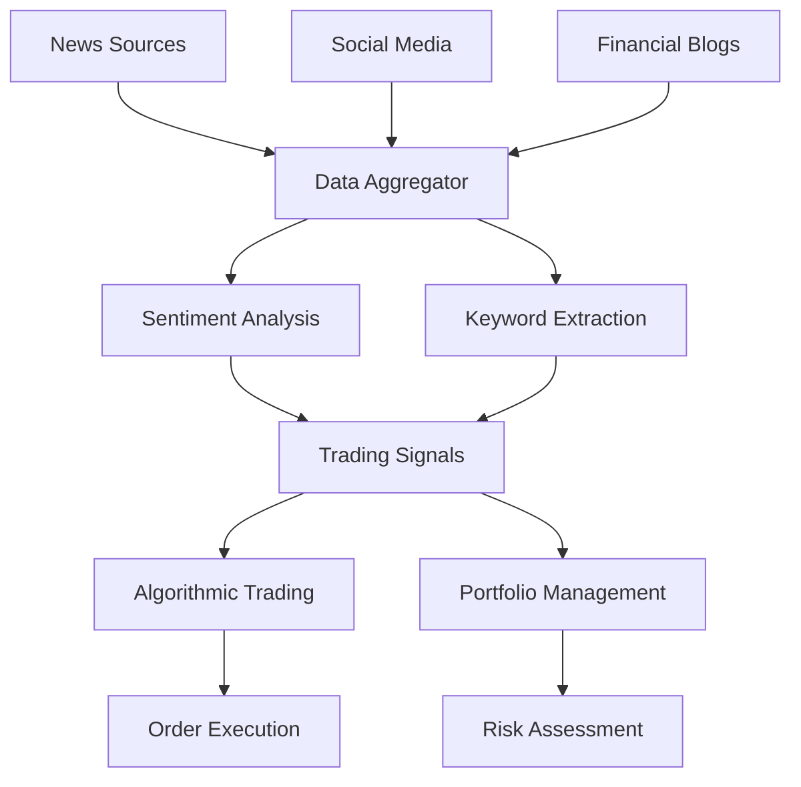
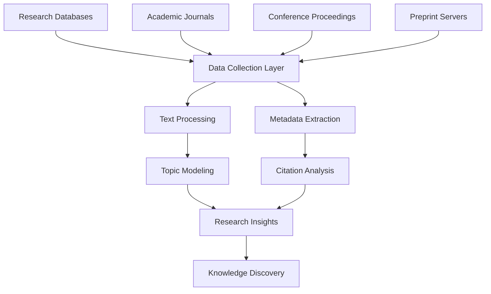

Web scraping has evolved far beyond simple data collection tasks. What started as a tool for gathering basic information has transformed into a sophisticated technology powering multi-million dollar businesses, driving critical decision-making processes, and revolutionizing how organizations interact with data across the internet.

The applications of web scraping span virtually every industry, from finance and healthcare to entertainment and government. Understanding these real-world applications not only demonstrates the power of web scraping but also reveals opportunities for innovation and competitive advantage that many businesses haven't yet explored.

## E-commerce Intelligence and Price Monitoring

E-commerce represents one of the most lucrative applications of web scraping technology. Companies like Amazon, eBay, and thousands of smaller retailers rely on sophisticated scraping systems to maintain competitive positioning and optimize their operations.

Price monitoring forms the backbone of dynamic pricing strategies. Major retailers continuously monitor competitor prices across thousands of products, adjusting their own pricing in real-time to maximize profit margins while remaining competitive. This isn't just about matching prices – it's about understanding market dynamics, seasonal trends, and consumer behavior patterns.

```python
import requests
from bs4 import BeautifulSoup
import json
from datetime import datetime

class PriceMonitor:
    def __init__(self):
        self.session = requests.Session()
        self.session.headers.update({
            'User-Agent': 'Mozilla/5.0 (Windows NT 10.0; Win64; x64) AppleWebKit/537.36'
        })
    
    def scrape_product_price(self, url, selectors):
        try:
            response = self.session.get(url)
            soup = BeautifulSoup(response.content, 'html.parser')
            
            price_element = soup.select_one(selectors['price'])
            title_element = soup.select_one(selectors['title'])
            
            if price_element and title_element:
                price = self.extract_price(price_element.get_text())
                return {
                    'title': title_element.get_text().strip(),
                    'price': price,
                    'url': url,
                    'timestamp': datetime.now().isoformat(),
                    'currency': 'USD'
                }
        except Exception as e:
            print(f"Error scraping {url}: {e}")
            return None
    
    def extract_price(self, price_text):
        import re
        price_match = re.search(r'[\d,]+\.?\d*', price_text.replace(',', ''))
        return float(price_match.group()) if price_match else None

# Usage for monitoring competitor prices
monitor = PriceMonitor()
competitors = [
    {
        'site': 'competitor_a',
        'url': 'https://example.com/product/123',
        'selectors': {'price': '.price', 'title': 'h1'}
    }
]

for competitor in competitors:
    price_data = monitor.scrape_product_price(
        competitor['url'], 
        competitor['selectors']
    )
    if price_data:
        print(f"Found price: ${price_data['price']} for {price_data['title']}")
```

Inventory tracking represents another critical application. Retailers monitor stock levels across competitors to identify supply chain disruptions, popular products, and market opportunities. When a competitor runs out of stock on a popular item, it presents an immediate opportunity to capture additional market share.

Product catalog management also relies heavily on web scraping. Companies automatically extract product specifications, descriptions, and images from manufacturer websites and competitor catalogs to populate their own product databases efficiently.

## Financial Markets and Investment Intelligence

The financial industry represents perhaps the most sophisticated and high-stakes application of web scraping technology. Investment firms, hedge funds, and trading platforms utilize web scraping to gain microsecond advantages in rapidly moving markets.

News sentiment analysis drives algorithmic trading decisions. Financial firms scrape thousands of news sources, social media platforms, and financial blogs in real-time, applying natural language processing to determine market sentiment and predict price movements before human traders can react.



Alternative data collection has become a multi-billion dollar industry. Investment firms scrape satellite imagery to predict crop yields, parking lot occupancy to forecast retail earnings, and shipping data to anticipate supply chain impacts on stock prices. This alternative data provides insights that traditional financial analysis cannot capture.

Regulatory compliance monitoring requires continuous surveillance of regulatory websites, legal databases, and government publications. Financial institutions must stay current with changing regulations across multiple jurisdictions, making automated monitoring essential for compliance and risk management.

## Real Estate Market Analysis

Real estate professionals leverage web scraping to gain comprehensive market insights that would be impossible to gather manually. Multiple Listing Services (MLS), property websites, and government records provide rich datasets for market analysis and investment decisions.

Property valuation models rely on scraped data from comparable sales, rental rates, and market trends. Real estate investors and appraisers use this information to identify undervalued properties, predict market movements, and optimize investment portfolios.

Market trend analysis involves scraping historical and current property data to identify emerging neighborhoods, price trends, and investment opportunities. This data-driven approach has revolutionized real estate investment, enabling more precise risk assessment and return predictions.

## Lead Generation and Sales Intelligence

B2B companies have transformed their sales processes through sophisticated web scraping applications. Contact information extraction from professional networks, company websites, and industry directories provides sales teams with qualified leads and comprehensive prospect information.

Company intelligence gathering involves scraping corporate websites, press releases, job postings, and social media to understand prospects' business challenges, growth patterns, and decision-making processes. This intelligence enables personalized sales approaches and higher conversion rates.

```javascript
const puppeteer = require('puppeteer');

class LeadScraper {
    async scrapeCompanyInfo(companyUrl) {
        const browser = await puppeteer.launch({ headless: true });
        const page = await browser.newPage();
        
        try {
            await page.goto(companyUrl, { waitUntil: 'networkidle2' });
            
            const companyInfo = await page.evaluate(() => {
                const getTextContent = (selector) => {
                    const element = document.querySelector(selector);
                    return element ? element.textContent.trim() : null;
                };
                
                return {
                    name: getTextContent('h1') || getTextContent('.company-name'),
                    description: getTextContent('.company-description') || 
                                getTextContent('meta[name="description"]'),
                    industry: getTextContent('.industry') || 
                             getTextContent('[data-industry]'),
                    employees: getTextContent('.employee-count') || 
                              getTextContent('[data-employees]'),
                    location: getTextContent('.location') || 
                             getTextContent('.address')
                };
            });
            
            // Scrape recent news/press releases
            const recentNews = await page.evaluate(() => {
                const newsItems = document.querySelectorAll('.news-item, .press-release');
                return Array.from(newsItems).slice(0, 5).map(item => ({
                    title: item.querySelector('h3, h2, .title')?.textContent?.trim(),
                    date: item.querySelector('.date, time')?.textContent?.trim(),
                    url: item.querySelector('a')?.href
                }));
            });
            
            await browser.close();
            
            return {
                ...companyInfo,
                recentNews,
                scrapedAt: new Date().toISOString()
            };
            
        } catch (error) {
            await browser.close();
            throw error;
        }
    }
}
```

## Academic Research and Data Science

Academic institutions and research organizations utilize web scraping for large-scale data collection across diverse fields. Social science researchers scrape social media platforms to study human behavior, political sentiment, and cultural trends.

Scientific literature mining involves scraping research databases, academic journals, and preprint servers to track research trends, identify collaboration opportunities, and accelerate scientific discovery. This application has become particularly important in rapidly evolving fields like artificial intelligence and biotechnology.

Educational data collection supports institutional research, student success initiatives, and educational policy development. Universities scrape various data sources to understand student outcomes, employment trends, and industry demands for curriculum development.



## Government and Public Policy

Government agencies and policy organizations employ web scraping for public safety, regulatory enforcement, and policy research. Law enforcement agencies monitor online marketplaces for illegal activities, track cybersecurity threats, and gather intelligence on criminal networks.

Policy research involves scraping public records, government databases, and citizen feedback platforms to inform policy decisions and measure policy effectiveness. This data-driven approach to governance has improved transparency and accountability in public administration.

Public health surveillance systems scrape various data sources to monitor disease outbreaks, track vaccination rates, and identify health trends. The COVID-19 pandemic demonstrated the critical importance of automated data collection for public health decision-making.

## Media and Content Intelligence

Media companies and content creators use web scraping to monitor brand mentions, track competitor content strategies, and identify trending topics. This intelligence drives content planning, advertising strategies, and audience engagement initiatives.

Copyright and plagiarism detection systems continuously scrape the internet to identify unauthorized use of copyrighted content, protecting intellectual property rights for creators and organizations.

Social media monitoring extends beyond simple mention tracking to include sentiment analysis, influencer identification, and trend prediction. Brands use this intelligence to manage reputation, identify partnership opportunities, and optimize marketing campaigns.

## Supply Chain and Logistics Optimization

Global supply chains rely on web scraping for real-time visibility into shipping schedules, port congestion, weather conditions, and regulatory changes. This information enables proactive supply chain management and risk mitigation.

Supplier monitoring involves scraping supplier websites, regulatory databases, and industry publications to assess supplier stability, compliance status, and performance metrics. This continuous monitoring helps prevent supply chain disruptions and ensures quality standards.

## Innovation and Emerging Applications

Artificial intelligence and machine learning applications increasingly depend on web-scraped datasets for training and validation. Companies scrape diverse data sources to create comprehensive datasets for computer vision, natural language processing, and predictive modeling applications.

IoT and smart city applications utilize web scraping to integrate data from various online sources with sensor networks, creating comprehensive intelligence systems for urban planning, traffic management, and resource optimization.

Environmental monitoring combines scraped data from government agencies, research institutions, and citizen science platforms to track climate change impacts, pollution levels, and conservation efforts.

The applications of web scraping continue expanding as organizations recognize the strategic value of publicly available data. From optimizing business operations to advancing scientific research, web scraping has become an essential capability for data-driven decision making.

The key to successful web scraping applications lies not just in the technical implementation, but in identifying valuable data sources, ensuring compliance with legal and ethical guidelines, and transforming raw data into actionable insights. As the internet continues growing and evolving, what new applications for web scraping do you see emerging in your industry?