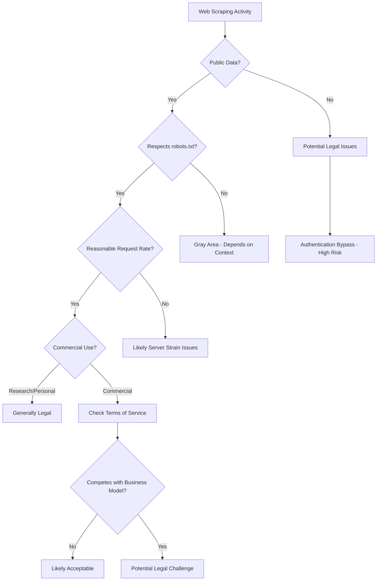
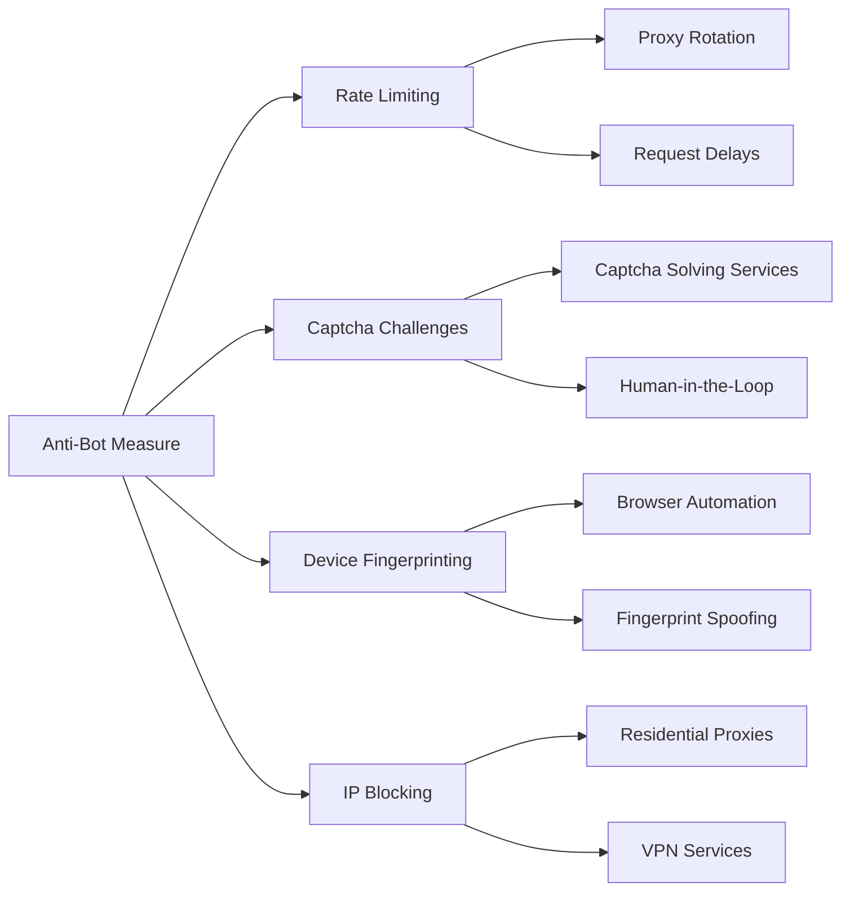
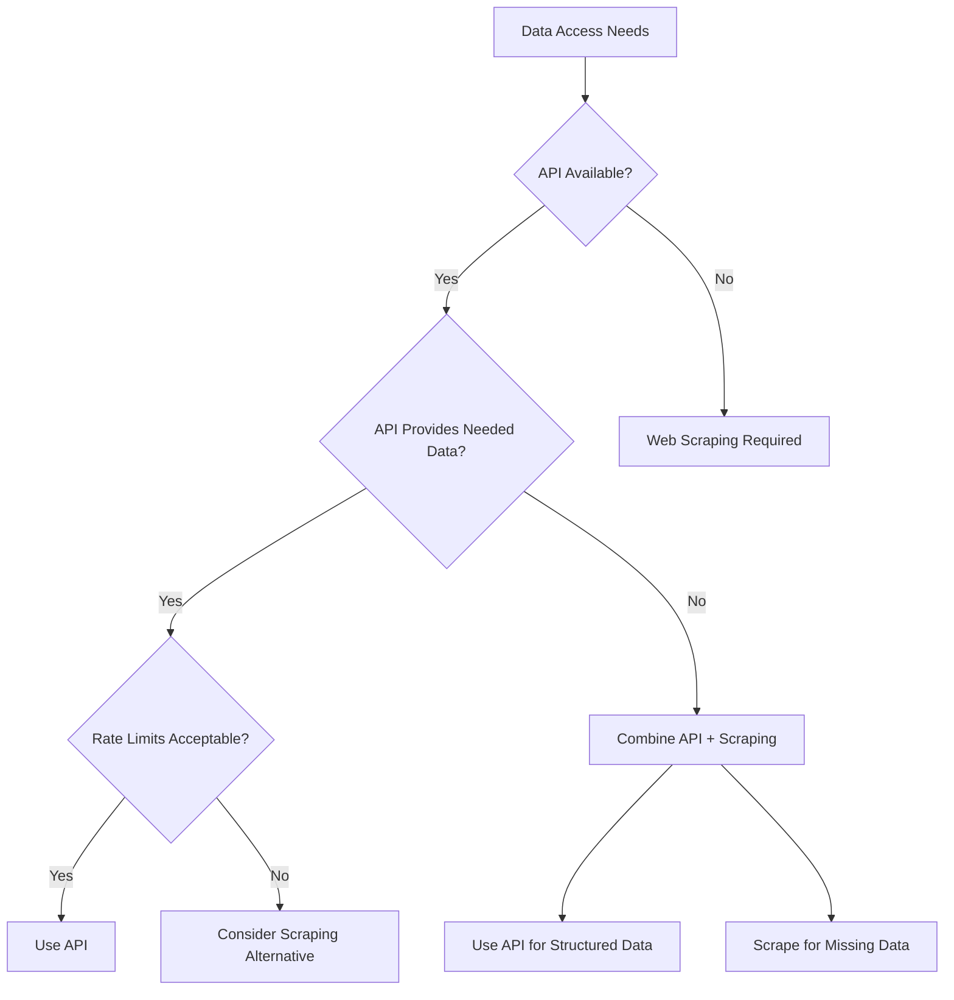

The world of web scraping is riddled with misconceptions that can either discourage legitimate practitioners or lead others down problematic paths. After years of working in data extraction, I've encountered countless myths that deserve to be debunked. Let's explore the most persistent misconceptions about web scraping and reveal the truth behind them.

## Myth 1: Web Scraping is Always Illegal

This is perhaps the most damaging myth in our field. The reality is far more nuanced than a simple "legal" or "illegal" classification.

**The Truth:** Web scraping legality depends on multiple factors including the data being scraped, how it's collected, what it's used for, and the jurisdiction you're operating in. Public data that's freely accessible without authentication is generally fair game for scraping, especially when used for legitimate purposes like research, price comparison, or journalism.



The key is understanding that scraping becomes problematic when it:
- Bypasses authentication or paywalls
- Violates explicit terms of service
- Causes server damage through excessive requests
- Involves copyrighted content used commercially
- Constitutes unfair competition

## Myth 2: If There's No robots.txt, Everything is Permitted

Many scrapers believe that the absence of a robots.txt file means they have carte blanche to scrape anything on a website.

**The Truth:** The robots.txt file is a polite suggestion, not a legal document. Its absence doesn't grant permission, and its presence doesn't create legally binding restrictions. However, respecting robots.txt demonstrates good faith and ethical scraping practices.

```python
import requests
from urllib.robotparser import RobotFileParser

def check_robots_txt(url, user_agent='*'):
    rp = RobotFileParser()
    rp.set_url(f"{url}/robots.txt")
    try:
        rp.read()
        return rp.can_fetch(user_agent, url)
    except:
        # No robots.txt found - proceed with caution
        return True

# Example usage
can_scrape = check_robots_txt('https://example.com/products')
if can_scrape:
    print("Robots.txt allows scraping")
else:
    print("Consider alternative approaches or seek permission")
```

## Myth 3: Web Scraping Always Requires Advanced Programming Skills

This misconception keeps many people from exploring web scraping, thinking they need years of programming experience.

**The Truth:** While advanced scraping scenarios require sophisticated skills, basic web scraping can be learned relatively quickly. Modern tools and libraries have significantly lowered the entry barrier.

```python
# Simple scraping example - just a few lines
import requests
from bs4 import BeautifulSoup

response = requests.get('https://quotes.toscrape.com/')
soup = BeautifulSoup(response.content, 'html.parser')

for quote in soup.find_all('div', class_='quote'):
    text = quote.find('span', class_='text').get_text()
    author = quote.find('small', class_='author').get_text()
    print(f'"{text}" - {author}')
```

No-code and low-code solutions also exist for non-programmers, though they have limitations compared to custom-coded solutions.

## Myth 4: All Anti-Bot Measures are Unbeatable

Some people believe that modern anti-bot systems like Cloudflare, Captcha, or device fingerprinting make web scraping impossible.

**The Truth:** While anti-bot measures have become more sophisticated, they're not impenetrable. The key is understanding that it's an arms race, not an absolute barrier.



Effective strategies include:
- Using residential proxy networks
- Browser automation with tools like Playwright
- Implementing human-like behavior patterns
- Solving captchas programmatically or via services
- Rotating user agents and request headers

## Myth 5: Faster Scraping is Always Better

Many beginners think that hammering a server with rapid-fire requests is the most efficient approach.

**The Truth:** Aggressive scraping often backfires, leading to IP bans, server errors, and incomplete data collection. Sustainable scraping focuses on consistency over speed.

```python
import time
import random
from requests.adapters import HTTPAdapter
from urllib3.util.retry import Retry

def create_session_with_retries():
    session = requests.Session()
    retry_strategy = Retry(
        total=3,
        backoff_factor=1,
        status_forcelist=[429, 500, 502, 503, 504]
    )
    adapter = HTTPAdapter(max_retries=retry_strategy)
    session.mount("http://", adapter)
    session.mount("https://", adapter)
    return session

def polite_scraping(urls):
    session = create_session_with_retries()
    
    for url in urls:
        try:
            response = session.get(url, timeout=10)
            # Process response here
            
            # Random delay between requests
            delay = random.uniform(1, 3)
            time.sleep(delay)
            
        except requests.exceptions.RequestException as e:
            print(f"Error scraping {url}: {e}")
            continue
```

## Myth 6: Web Scraping is Just for Big Tech Companies

There's a perception that web scraping is only valuable for large corporations with massive infrastructure.

**The Truth:** Web scraping provides value at all scales. Small businesses use it for competitor monitoring, researchers extract data for academic studies, and individuals automate personal tasks.

Common use cases across different scales:
- **Individual**: Personal portfolio tracking, job listing aggregation
- **Small Business**: Price monitoring, lead generation, market research
- **Enterprise**: Competitive intelligence, supply chain monitoring, risk assessment

## Myth 7: APIs Make Web Scraping Obsolete

Some believe that the prevalence of APIs eliminates the need for web scraping.

**The Truth:** APIs and web scraping serve different purposes and often complement each other. Many websites don't offer APIs, and even when they do, APIs might not provide all the data available on the public website.



## Myth 8: Web Scraping Data is Always Accurate

There's an assumption that scraped data is inherently reliable since it comes directly from websites.

**The Truth:** Scraped data quality depends on the source website's accuracy, your extraction logic, and data validation processes. Websites can contain errors, outdated information, or inconsistent formatting.

```python
def validate_scraped_data(data):
    """Basic data validation for scraped content"""
    cleaned_data = []
    
    for item in data:
        # Remove empty or None values
        if not item or item.strip() == '':
            continue
            
        # Basic format validation
        if len(item) > 1000:  # Suspiciously long text
            continue
            
        # Remove obvious parsing artifacts
        if item.startswith('<') or 'javascript:' in item:
            continue
            
        cleaned_data.append(item.strip())
    
    return cleaned_data
```

## Myth 9: You Need Expensive Tools to Scrape Effectively

The belief that effective web scraping requires purchasing expensive commercial tools can be a significant barrier to entry.

**The Truth:** While commercial tools can provide convenience and advanced features, powerful open-source alternatives exist for virtually every scraping need. The choice between free and paid tools depends on your specific requirements, technical expertise, and business constraints.

Free tools often provide more flexibility and learning opportunities, while paid solutions offer convenience and support.

## Myth 10: Web Scraping Skills aren't Transferable

Some view web scraping as a niche skill with limited applicability outside of data extraction.

**The Truth:** Web scraping teaches valuable transferable skills including:
- HTTP protocol understanding
- HTML/CSS/JavaScript proficiency
- Problem-solving and debugging
- Data processing and analysis
- Automation and workflow optimization
- Understanding of web technologies and APIs

These skills apply to web development, data analysis, QA testing, and many other technical roles.

Understanding these myths and their realities helps create a more informed and responsible scraping community. The key to successful web scraping lies not in believing oversimplified narratives, but in developing nuanced understanding of the technical, legal, and ethical considerations involved.

What myths about web scraping have you encountered in your experience? Have you found yourself believing any of these misconceptions before learning the full story?
```