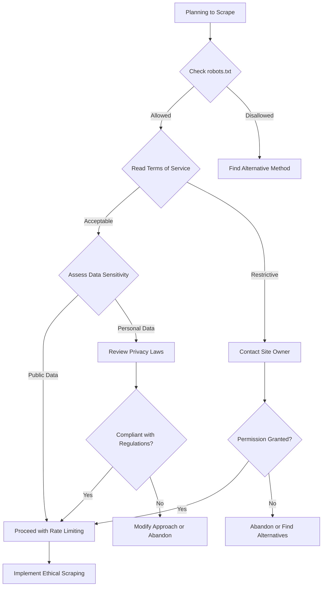
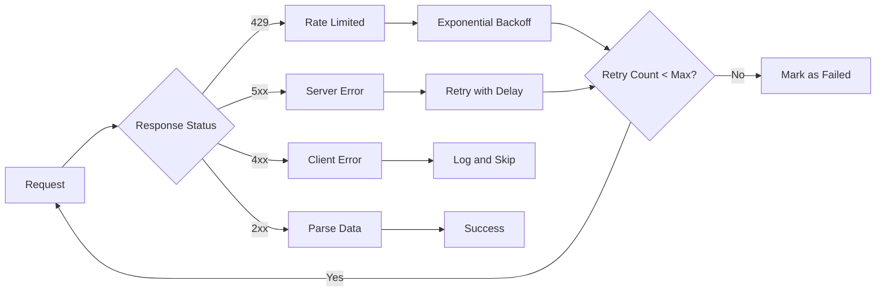

When I first started web scraping, I made the rookie mistake of diving straight into code without asking the right questions. I'd fire up requests or selenium and start pulling data, only to hit roadblocks that could have been avoided with proper planning. Over the years, I've learned that the most successful scraping projects begin not with writing code, but with asking the right questions.

Think of web scraping like planning a heist in a movie – except completely legal and ethical. You wouldn't just walk into a bank without understanding the layout, security measures, and escape routes. Similarly, successful web scraping requires reconnaissance, strategy, and careful planning.

## The Strategic Foundation

### What Exactly Do You Need?

This might seem obvious, but you'd be surprised how many projects fail because the data requirements weren't clearly defined. I've seen developers spend weeks building elaborate scrapers only to realize they were collecting the wrong information.

Start by documenting specific data points:
- What fields are absolutely essential?
- What's nice-to-have but not critical?
- How granular should the data be?
- What time range do you need?

For example, if you're scraping product information, do you need just prices and titles, or do you also need reviews, specifications, availability, and seller information? Each additional data point increases complexity and potential failure points.

### How Much Data Are We Talking About?

Scale dramatically affects your approach. Scraping 100 product pages is vastly different from scraping 100,000. Consider these factors:

**Volume Impact on Strategy:**
- Small scale (< 1,000 pages): Simple scripts often suffice
- Medium scale (1,000 - 100,000 pages): Need rate limiting and error handling
- Large scale (100,000+ pages): Requires distributed systems, proxies, and sophisticated error recovery

```python
# Small scale approach
import requests
from bs4 import BeautifulSoup

def simple_scrape(urls):
    results = []
    for url in urls:
        response = requests.get(url)
        soup = BeautifulSoup(response.content, 'html.parser')
        # Extract data
        results.append(extract_data(soup))
    return results
```

```python
# Large scale approach with rate limiting
import asyncio
import aiohttp
from asyncio import Semaphore

class ScalableScraper:
    def __init__(self, max_concurrent=10, delay=1):
        self.semaphore = Semaphore(max_concurrent)
        self.delay = delay
    
    async def scrape_url(self, session, url):
        async with self.semaphore:
            try:
                async with session.get(url) as response:
                    content = await response.text()
                    # Process content
                    await asyncio.sleep(self.delay)
                    return self.extract_data(content)
            except Exception as e:
                return {'error': str(e), 'url': url}
```

## Legal and Ethical Considerations

### Is This Legal?

This is perhaps the most crucial question, yet it's often overlooked until problems arise. The legal landscape for web scraping is complex and varies by jurisdiction.

**Key Legal Factors:**
- **robots.txt**: While not legally binding, it indicates the site owner's preferences
- **Terms of Service**: Violating these can have legal consequences
- **Copyright and data ownership**: Some data may be protected
- **Computer Fraud and Abuse Act (CFAA)**: In the US, this can apply to scraping
- **GDPR and privacy laws**: Personal data scraping has strict regulations

```python
# Always check robots.txt first
import urllib.robotparser

def check_robots_txt(base_url, user_agent='*'):
    robots_url = f"{base_url}/robots.txt"
    try:
        rp = urllib.robotparser.RobotFileParser()
        rp.set_url(robots_url)
        rp.read()
        return rp.can_fetch(user_agent, base_url)
    except:
        return True  # If robots.txt doesn't exist
```

### What's the Ethical Approach?

Beyond legal compliance, consider the ethical implications:

- **Server load**: Will your scraping impact the site's performance?
- **Business impact**: Could your scraping harm the site owner's business?
- **Data sensitivity**: Are you handling personal or sensitive information?
- **Attribution**: Should you credit the data source?



## Technical Architecture Questions

### What's Your Technical Approach?

The choice between different scraping methods depends on several factors:

**Static Content** → Basic HTTP requests
**JavaScript-heavy sites** → Browser automation
**Real-time data** → WebSocket monitoring
**Mobile apps** → API interception

```python
# Decision matrix for tool selection
def choose_scraping_method(site_characteristics):
    if site_characteristics['javascript_heavy']:
        if site_characteristics['scale'] == 'large':
            return 'playwright_cluster'  # Distributed browser automation
        else:
            return 'playwright'  # Single instance browser automation
    
    elif site_characteristics['has_api']:
        return 'api_direct'  # Always prefer official APIs
    
    elif site_characteristics['simple_html']:
        return 'requests_beautifulsoup'  # Lightweight and fast
    
    else:
        return 'hybrid_approach'  # Combination of methods
```

### How Will You Handle Failures?

Web scraping is inherently unreliable. Sites go down, structures change, and anti-bot measures trigger. Your strategy should account for:

**Failure Types:**
- Network timeouts and connectivity issues
- Rate limiting and IP blocking
- Site structure changes
- Data format changes
- Server errors (5xx responses)



### What About Infrastructure?

Consider where and how your scraper will run:

**Local Development:**
- Good for prototyping and small-scale projects
- Limited by single IP and processing power
- Easy to debug and iterate

**Cloud Infrastructure:**
- Scalable and distributed
- Multiple IP addresses available
- Higher complexity and cost

**Proxy Networks:**
- Essential for large-scale projects
- Residential vs. datacenter proxies
- Cost vs. reliability tradeoffs

```python
# Infrastructure abstraction example
class ScrapingInfrastructure:
    def __init__(self, config):
        self.proxy_manager = ProxyManager(config['proxies'])
        self.session_manager = SessionManager(config['sessions'])
        self.storage = StorageManager(config['storage'])
    
    async def scrape_with_infrastructure(self, url):
        proxy = await self.proxy_manager.get_proxy()
        session = await self.session_manager.get_session(proxy)
        
        try:
            data = await self.scrape_url(session, url, proxy)
            await self.storage.save(data)
            return data
        except Exception as e:
            await self.proxy_manager.report_failure(proxy, e)
            raise
```

## Data Strategy Questions

### How Will You Store the Data?

Your storage strategy affects everything from scraping speed to data analysis capabilities:

**File-based Storage:**
- JSON, CSV, XML for simple projects
- Easy to start, difficult to scale
- Good for prototypes and small datasets

**Databases:**
- SQL for structured, relational data
- NoSQL for flexible, document-based data
- Graph databases for relationship-heavy data

**Cloud Storage:**
- Scalable and managed
- Integration with analytics tools
- Backup and disaster recovery built-in

### What's Your Data Quality Strategy?

Raw scraped data is often messy and inconsistent. Plan for:

**Data Validation:**
- Required fields and data types
- Value ranges and formats
- Duplicate detection and handling

**Data Cleaning:**
- Standardizing formats (dates, currencies, etc.)
- Handling missing or invalid data
- Normalizing text and encodings

```python
# Data validation example
from pydantic import BaseModel, validator
from datetime import datetime
from typing import Optional

class ProductData(BaseModel):
    title: str
    price: float
    currency: str
    availability: bool
    scraped_at: datetime
    url: str
    
    @validator('price')
    def price_must_be_positive(cls, v):
        if v <= 0:
            raise ValueError('Price must be positive')
        return v
    
    @validator('currency')
    def currency_must_be_valid(cls, v):
        valid_currencies = ['USD', 'EUR', 'GBP', 'JPY']
        if v not in valid_currencies:
            raise ValueError(f'Currency must be one of {valid_currencies}')
        return v

def validate_scraped_data(raw_data):
    validated_items = []
    errors = []
    
    for item in raw_data:
        try:
            validated_item = ProductData(**item)
            validated_items.append(validated_item)
        except Exception as e:
            errors.append({'item': item, 'error': str(e)})
    
    return validated_items, errors
```

## Monitoring and Maintenance

### How Will You Know When Things Break?

Web scraping requires ongoing monitoring because websites constantly change:

**Monitoring Strategies:**
- Success rate tracking
- Data quality metrics
- Performance monitoring
- Error alerting

**Key Metrics to Track:**
- Pages successfully scraped vs. attempted
- Average response time
- Data completeness and accuracy
- Error types and frequencies

### What's Your Maintenance Plan?

Successful scrapers require ongoing maintenance:

**Regular Maintenance Tasks:**
- Monitoring for site changes
- Updating selectors and parsing logic
- Reviewing and updating rate limits
- Proxy rotation and management
- Data quality audits

The most successful scraping projects I've worked on had clear answers to these questions before writing the first line of code. They also had stakeholders who understood that scraping is an ongoing process, not a one-time setup.

Remember, the goal isn't just to extract data – it's to extract reliable, accurate, and useful data in a sustainable way. Taking time to ask these questions upfront will save you countless hours of debugging, refactoring, and explaining to stakeholders why your scraper suddenly stopped working.

What's the most important question you think every web scraper should ask before starting a project? Have you experienced situations where better planning could have prevented major issues down the line?