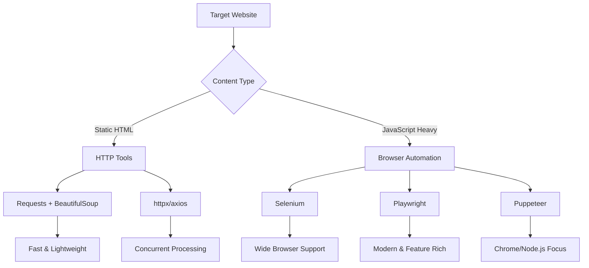
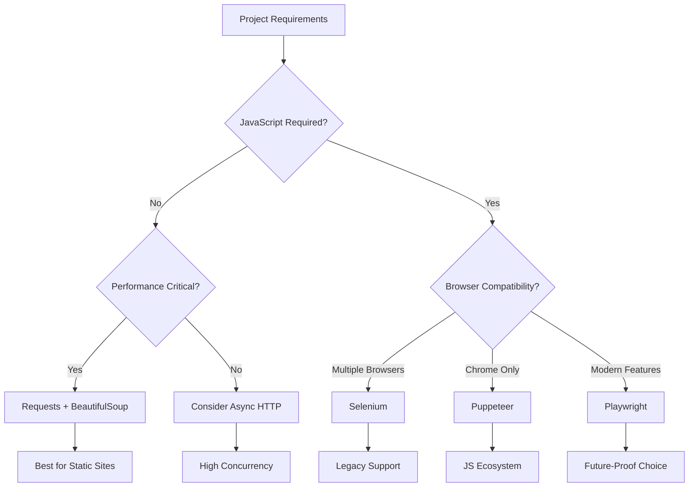

Choosing the right web scraping tool can make or break your data extraction project. With dozens of options available, from simple HTTP clients to sophisticated browser automation frameworks, the decision often paralyzes newcomers and even experienced developers. Each tool has its sweet spot, limitations, and learning curve that can dramatically impact your project's success.

The landscape of web scraping tools has evolved significantly over the past decade. What started with basic HTTP requests and HTML parsing has expanded into a rich ecosystem of specialized tools designed for different scenarios. Understanding these tools and their capabilities is crucial for making informed decisions that align with your project requirements, technical expertise, and resource constraints.

## The Foundation Layer: HTTP-Based Tools

At the most basic level, web scraping involves making HTTP requests and parsing responses. Tools in this category are lightweight, fast, and perfect for static content extraction.

### Python Requests + BeautifulSoup

The combination of Python's `requests` library with `BeautifulSoup` represents the entry point for most scrapers. This approach works excellently for static websites that don't rely heavily on JavaScript.

```python
import requests
from bs4 import BeautifulSoup

# Simple scraping example
response = requests.get('https://example.com')
soup = BeautifulSoup(response.content, 'html.parser')

# Extract data
titles = soup.find_all('h2', class_='product-title')
prices = soup.find_all('span', class_='price')

for title, price in zip(titles, prices):
    print(f"{title.text}: {price.text}")
```

This approach excels in scenarios where:
- The target website renders content server-side
- You need maximum speed and minimal resource usage
- The scraping logic is straightforward
- You're dealing with APIs or simple HTML structures

However, it falls short when dealing with modern single-page applications (SPAs) that render content dynamically through JavaScript.

### Advanced HTTP Clients

Tools like `httpx` in Python or `axios` in JavaScript offer more sophisticated features while maintaining the lightweight HTTP approach.

```python
import asyncio
import httpx
from bs4 import BeautifulSoup

async def scrape_multiple_pages(urls):
    async with httpx.AsyncClient() as client:
        tasks = [client.get(url) for url in urls]
        responses = await asyncio.gather(*tasks)
        
        for response in responses:
            soup = BeautifulSoup(response.content, 'html.parser')
            # Process each page
            yield soup
```

These tools provide better performance for concurrent requests and more advanced HTTP features like connection pooling and automatic retries.

## Browser Automation: The Heavy Artillery

When JavaScript rendering becomes necessary, browser automation tools step in. They control real browsers or headless browser instances to execute JavaScript and capture the fully rendered DOM.



### Selenium: The Veteran

Selenium has been the go-to browser automation tool for over a decade. It supports multiple browsers and programming languages, making it versatile but sometimes clunky.

```python
from selenium import webdriver
from selenium.webdriver.common.by import By
from selenium.webdriver.support.ui import WebDriverWait
from selenium.webdriver.support import expected_conditions as EC

# Setup Chrome driver
options = webdriver.ChromeOptions()
options.add_argument('--headless')
driver = webdriver.Chrome(options=options)

try:
    driver.get('https://example.com')
    
    # Wait for dynamic content
    wait = WebDriverWait(driver, 10)
    products = wait.until(
        EC.presence_of_all_elements_located((By.CLASS_NAME, 'product-item'))
    )
    
    for product in products:
        title = product.find_element(By.CLASS_NAME, 'title').text
        price = product.find_element(By.CLASS_NAME, 'price').text
        print(f"{title}: {price}")
        
finally:
    driver.quit()
```

Selenium's strengths include mature ecosystem, extensive documentation, and broad browser support. However, it's resource-intensive, relatively slow, and has a steeper learning curve for complex scenarios.

### Playwright: The Modern Contender

Playwright emerged as a modern alternative, offering better performance, more reliable element detection, and built-in features that reduce boilerplate code.

```python
from playwright.sync_api import sync_playwright

def scrape_with_playwright():
    with sync_playwright() as p:
        browser = p.chromium.launch(headless=True)
        page = browser.new_page()
        
        # Navigate and wait for network idle
        page.goto('https://example.com')
        page.wait_for_load_state('networkidle')
        
        # Extract data with better selectors
        products = page.query_selector_all('.product-item')
        
        for product in products:
            title = product.query_selector('.title').inner_text()
            price = product.query_selector('.price').inner_text()
            print(f"{title}: {price}")
        
        browser.close()

scrape_with_playwright()
```

Playwright offers several advantages over Selenium:
- Better handling of modern web apps
- More reliable waiting mechanisms
- Built-in network interception
- Faster execution and setup
- Better debugging tools

### Puppeteer: The JavaScript Specialist

For JavaScript developers, Puppeteer provides a Node.js API for controlling Chrome or Chromium browsers.

```javascript
const puppeteer = require('puppeteer');

(async () => {
    const browser = await puppeteer.launch({ headless: true });
    const page = await browser.newPage();
    
    await page.goto('https://example.com');
    
    // Wait for content to load
    await page.waitForSelector('.product-item');
    
    // Extract data
    const products = await page.evaluate(() => {
        const items = Array.from(document.querySelectorAll('.product-item'));
        return items.map(item => ({
            title: item.querySelector('.title').textContent,
            price: item.querySelector('.price').textContent
        }));
    });
    
    console.log(products);
    await browser.close();
})();
```

Puppeteer excels in Chrome-specific scenarios and integrates naturally with JavaScript build tools and workflows.

## Decision Framework: Choosing Your Tool

The choice between these tools depends on several factors that form a decision matrix:



### Performance Considerations

Different tools have varying performance characteristics:

**Resource Usage:**
- HTTP tools: Minimal memory and CPU usage
- Selenium: High resource consumption, slower startup
- Playwright: Moderate resource usage, faster than Selenium
- Puppeteer: Efficient for Chrome-specific tasks

**Speed Comparison:**
- Simple HTTP requests: 10-100ms per request
- Selenium-based scraping: 2-5 seconds per page
- Playwright/Puppeteer: 1-3 seconds per page

### Learning Curve Analysis

The complexity of getting started varies significantly:

**Beginner-Friendly:**
- Requests + BeautifulSoup: Shallow learning curve, extensive tutorials
- Basic Selenium: Well-documented, many examples available

**Intermediate:**
- Playwright: Modern API design, good documentation
- Puppeteer: Requires JavaScript knowledge

**Advanced:**
- Complex Selenium setups with custom configurations
- Async implementations with any tool

## Specialized Tools for Specific Scenarios

Beyond the mainstream options, several specialized tools address specific use cases:

### Scrapy Framework

For large-scale scraping projects, Scrapy provides a complete framework with built-in handling for robots.txt, throttling, and data pipelines.

```python
import scrapy

class ProductSpider(scrapy.Spider):
    name = 'products'
    start_urls = ['https://example.com/products']
    
    def parse(self, response):
        for product in response.css('.product-item'):
            yield {
                'title': product.css('.title::text').get(),
                'price': product.css('.price::text').get(),
                'url': response.urljoin(product.css('a::attr(href)').get())
            }
        
        # Follow pagination
        next_page = response.css('.pagination .next::attr(href)').get()
        if next_page:
            yield response.follow(next_page, self.parse)
```

### API-First Approaches

Modern applications often expose GraphQL or REST APIs that can be more efficient than scraping HTML:

```python
import requests

# GraphQL query example
query = """
query GetProducts($limit: Int!) {
    products(limit: $limit) {
        id
        title
        price
        description
    }
}
"""

response = requests.post(
    'https://api.example.com/graphql',
    json={'query': query, 'variables': {'limit': 50}},
    headers={'Authorization': 'Bearer your-token'}
)

data = response.json()
```

## Practical Implementation Strategy

Starting your web scraping journey requires a methodical approach:

### Phase 1: Assessment
1. Analyze the target website's structure
2. Check for JavaScript dependencies
3. Identify anti-scraping measures
4. Estimate data volume and update frequency

### Phase 2: Tool Selection
1. Start with the simplest tool that meets requirements
2. Prototype with your chosen tool
3. Benchmark performance with realistic data
4. Plan for scalability needs

### Phase 3: Implementation
1. Implement robust error handling
2. Add appropriate delays and throttling
3. Build monitoring and logging systems
4. Test across different scenarios

## Real-World Examples

Let's examine how different tools handle the same scraping task:

**Scenario:** Extracting product listings from an e-commerce site with infinite scroll

**HTTP Approach Limitation:**
```python
# This won't work for infinite scroll
response = requests.get('https://shop.example.com/products')
# Only gets initial products, missing dynamically loaded content
```

**Playwright Solution:**
```python
from playwright.sync_api import sync_playwright

def scrape_infinite_scroll():
    with sync_playwright() as p:
        browser = p.chromium.launch()
        page = browser.new_page()
        page.goto('https://shop.example.com/products')
        
        # Scroll to load more products
        for _ in range(5):  # Scroll 5 times
            page.evaluate('window.scrollTo(0, document.body.scrollHeight)')
            page.wait_for_timeout(2000)  # Wait for content to load
        
        # Now extract all products
        products = page.query_selector_all('.product-card')
        return len(products)
```

This example clearly shows when browser automation becomes necessary.

## Building Your Scraping Toolkit

Rather than committing to a single tool, consider building a flexible toolkit:

```python
class ScrapingToolkit:
    def __init__(self):
        self.session = requests.Session()
        self.browser = None
    
    def try_simple_first(self, url):
        """Try HTTP request first"""
        try:
            response = self.session.get(url)
            if self.has_required_content(response.text):
                return response
        except Exception:
            pass
        return None
    
    def fallback_to_browser(self, url):
        """Use browser automation as fallback"""
        if not self.browser:
            self.browser = self.setup_browser()
        return self.browser_scrape(url)
    
    def scrape_intelligently(self, url):
        """Choose the right tool automatically"""
        simple_result = self.try_simple_first(url)
        if simple_result:
            return self.parse_simple(simple_result)
        else:
            return self.fallback_to_browser(url)
```

This approach maximizes efficiency by using the simplest tool that works for each specific case.

Your scraping journey will evolve as you encounter different challenges and requirements. The key is starting with the right foundation and scaling your toolkit as needed. What type of data extraction challenge are you facing, and which tool from this comparison seems most aligned with your current project needs?