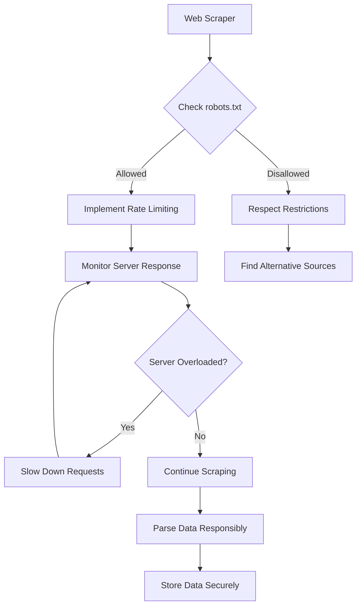
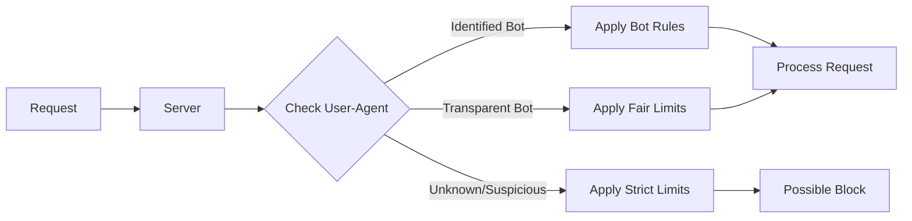
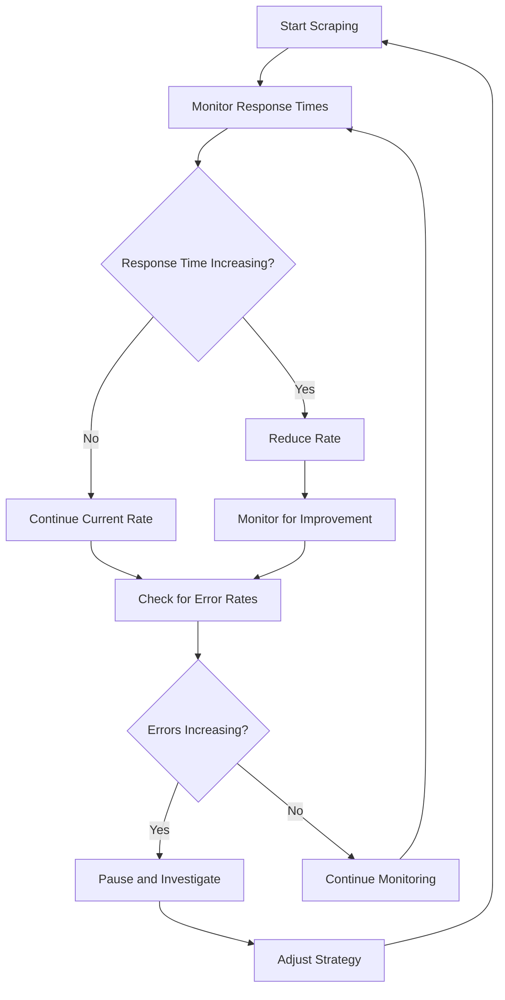

Web scraping is a powerful tool that can unlock valuable insights from the vast ocean of online data. However, with great power comes great responsibility. The line between legitimate data gathering and harmful automated behavior isn't always clear, but understanding and following proper etiquette can make the difference between being a welcomed visitor and an unwanted pest on the web.

Think of web scraping like visiting someone's house. You wouldn't burst through the front door, rummage through every room at lightning speed, and leave without a word. Similarly, when your scraper visits a website, it should behave respectfully, follow the house rules, and avoid overwhelming the host.

## Understanding the Digital Social Contract

Every website operates under an implicit social contract with its visitors. When you browse a site manually, you naturally pace your interactions – reading content, pausing between pages, and generally behaving like a human. Automated scrapers, by their very nature, can violate this contract by requesting dozens of pages per second, consuming excessive bandwidth, and potentially disrupting service for other users.

The foundation of responsible scraping lies in recognizing that websites are businesses with real costs. Every request hits their servers, consumes bandwidth, and requires computational resources. A poorly designed scraper can inadvertently launch what amounts to a distributed denial-of-service attack, bringing down websites and costing businesses money.



## The robots.txt Protocol: Your First Stop

Before your scraper makes its first request, it should always check the site's `robots.txt` file. This simple text file, located at the root of every domain (e.g., `https://example.com/robots.txt`), serves as a website's formal statement about automated access preferences.

```python
import requests
from urllib.robotparser import RobotFileParser

def check_robots_txt(url, user_agent='*'):
    """
    Check if scraping is allowed according to robots.txt
    """
    try:
        rp = RobotFileParser()
        robots_url = f"{url.rstrip('/')}/robots.txt"
        rp.set_url(robots_url)
        rp.read()
        
        return rp.can_fetch(user_agent, url)
    except Exception as e:
        print(f"Error reading robots.txt: {e}")
        # Default to cautious approach
        return False

# Example usage
target_url = "https://example.com/products"
if check_robots_txt(target_url, 'MyBot/1.0'):
    print("Scraping allowed by robots.txt")
else:
    print("Scraping restricted by robots.txt")
```

While `robots.txt` isn't legally binding, respecting it demonstrates good faith and helps maintain positive relationships with website owners. Some sites use robots.txt to direct scrapers to API endpoints or provide specific guidelines for automated access.

## Rate Limiting: The Art of Patience

One of the most crucial aspects of responsible scraping is implementing proper rate limiting. This means controlling the frequency and volume of your requests to avoid overwhelming target servers. A good rule of thumb is to make your scraper behavior indistinguishable from that of a careful human user.

```python
import time
import random
from typing import Optional

class ResponsibleScraper:
    def __init__(self, 
                 min_delay: float = 1.0, 
                 max_delay: float = 3.0,
                 max_retries: int = 3):
        self.min_delay = min_delay
        self.max_delay = max_delay
        self.max_retries = max_retries
        self.last_request_time = 0
        
    def make_request(self, url: str, session: requests.Session) -> Optional[requests.Response]:
        """
        Make a rate-limited request with retries
        """
        for attempt in range(self.max_retries):
            # Ensure minimum delay between requests
            elapsed = time.time() - self.last_request_time
            delay = random.uniform(self.min_delay, self.max_delay)
            
            if elapsed < delay:
                time.sleep(delay - elapsed)
            
            try:
                response = session.get(url, timeout=10)
                self.last_request_time = time.time()
                
                # Check for rate limiting signals
                if response.status_code == 429:  # Too Many Requests
                    retry_after = int(response.headers.get('Retry-After', 60))
                    print(f"Rate limited. Waiting {retry_after} seconds...")
                    time.sleep(retry_after)
                    continue
                    
                response.raise_for_status()
                return response
                
            except requests.exceptions.RequestException as e:
                print(f"Request failed (attempt {attempt + 1}): {e}")
                if attempt < self.max_retries - 1:
                    time.sleep(2 ** attempt)  # Exponential backoff
                    
        return None
```

## Identifying Yourself: The User-Agent Dilemma

The User-Agent header identifies your scraper to the server. While some scrapers try to masquerade as popular browsers, responsible scraping involves being transparent about your identity. This doesn't mean you can't use standard browser User-Agents, but you should be prepared to identify yourself if asked.

```python
headers = {
    'User-Agent': 'MyCompanyBot/1.0 (contact@mycompany.com)',
    'Accept': 'text/html,application/xhtml+xml,application/xml;q=0.9,*/*;q=0.8',
    'Accept-Language': 'en-US,en;q=0.5',
    'Accept-Encoding': 'gzip, deflate',
    'Connection': 'keep-alive',
}
```

Including contact information in your User-Agent allows website administrators to reach out if there are issues, rather than immediately blocking your IP address.



## Handling Errors Gracefully

Responsible scrapers don't just handle success cases – they gracefully manage errors and respect server responses. This includes understanding HTTP status codes and implementing appropriate retry logic.

```python
def handle_response(response: requests.Response) -> bool:
    """
    Handle different response codes appropriately
    """
    if response.status_code == 200:
        return True
    elif response.status_code == 404:
        print("Page not found - may have been removed")
        return False
    elif response.status_code == 403:
        print("Access forbidden - check robots.txt or terms of service")
        return False
    elif response.status_code == 429:
        print("Rate limited - implement longer delays")
        return False
    elif response.status_code >= 500:
        print("Server error - try again later")
        return False
    else:
        print(f"Unexpected status code: {response.status_code}")
        return False
```

## Data Usage and Storage Ethics

Responsible scraping extends beyond the collection process to how you use and store the gathered data. Just because data is publicly accessible doesn't mean it's free to use for any purpose. Consider these principles:

**Data Minimization**: Only collect what you actually need. Scraping entire websites "just in case" is wasteful and potentially problematic.

**Purpose Limitation**: Use scraped data only for the stated purpose. Don't repurpose personal information or proprietary content without permission.

**Security**: Protect scraped data with appropriate security measures, especially if it contains personal information.

```python
class DataHandler:
    def __init__(self, purpose: str):
        self.purpose = purpose
        self.collected_data = []
        
    def collect_data(self, data: dict) -> bool:
        """
        Only collect data relevant to stated purpose
        """
        if self.is_relevant(data) and self.is_appropriate(data):
            # Remove unnecessary fields
            cleaned_data = self.clean_data(data)
            self.collected_data.append(cleaned_data)
            return True
        return False
        
    def is_relevant(self, data: dict) -> bool:
        # Check if data is actually needed for the purpose
        pass
        
    def is_appropriate(self, data: dict) -> bool:
        # Check if data collection is appropriate (no personal info, etc.)
        pass
        
    def clean_data(self, data: dict) -> dict:
        # Remove unnecessary or sensitive fields
        pass
```

## Monitoring and Adaptation

A responsible scraper continuously monitors its impact and adapts accordingly. This means watching for signs that your activities are causing problems and being ready to adjust your approach.



## Legal and Terms of Service Considerations

While technical etiquette is important, legal compliance is essential. Always review the terms of service of websites you plan to scrape. Some sites explicitly prohibit automated access, while others provide guidelines for acceptable use.

Key legal considerations include:

- **Copyright**: Respect intellectual property rights
- **Privacy**: Be especially careful with personal information
- **Terms of Service**: Honor explicit restrictions
- **Fair Use**: Understand the boundaries of fair use doctrine
- **International Law**: Consider laws in both your jurisdiction and the website's

## Building Positive Relationships

Sometimes the best approach is direct communication. If you need substantial data from a website, consider reaching out to the administrators. Many organizations are willing to work with legitimate researchers and businesses, especially if you can demonstrate value or offer reciprocal benefits.

```python
def check_for_api(domain: str) -> Optional[str]:
    """
    Check if site offers an API as alternative to scraping
    """
    common_api_paths = [
        '/api',
        '/api/v1', 
        '/.well-known/api',
        '/developers',
        '/api-docs'
    ]
    
    for path in common_api_paths:
        try:
            response = requests.get(f"https://{domain}{path}")
            if response.status_code == 200:
                return f"https://{domain}{path}"
        except:
            continue
    
    return None
```

## Emergency Protocols

Even responsible scrapers can sometimes cause unintended problems. Having an emergency protocol helps you respond quickly when issues arise:

1. **Circuit Breaker**: Implement automatic stopping mechanisms
2. **Contact Information**: Maintain current contact details in your User-Agent
3. **Rapid Response**: Be prepared to immediately halt operations if contacted
4. **Cleanup**: Have procedures to remove problematic data if necessary

The web scraping community thrives when practitioners operate with integrity and respect. By following these principles, you're not just avoiding problems – you're contributing to a sustainable ecosystem where valuable data remains accessible to legitimate users.

What strategies have you found most effective for maintaining positive relationships with the websites you scrape? Have you ever been contacted by a site administrator, and how did you handle the situation?