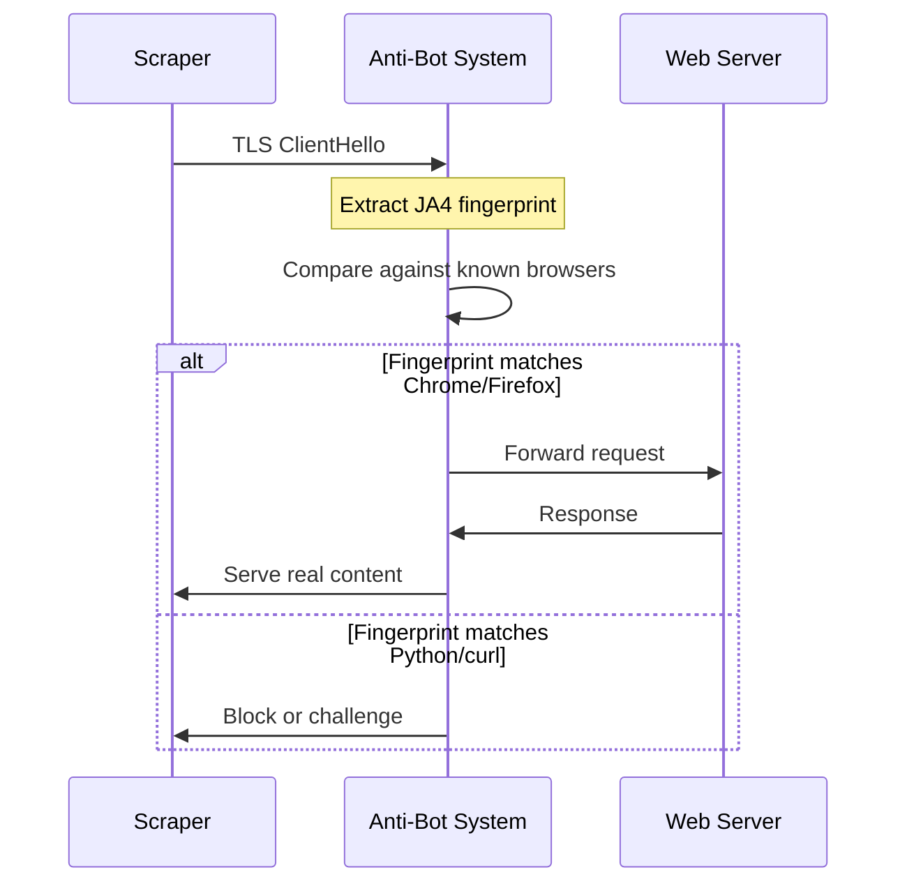
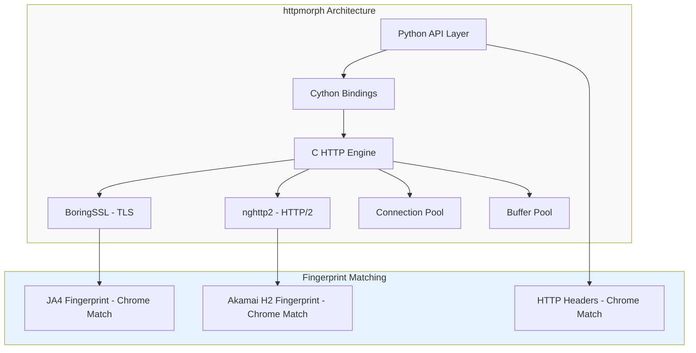
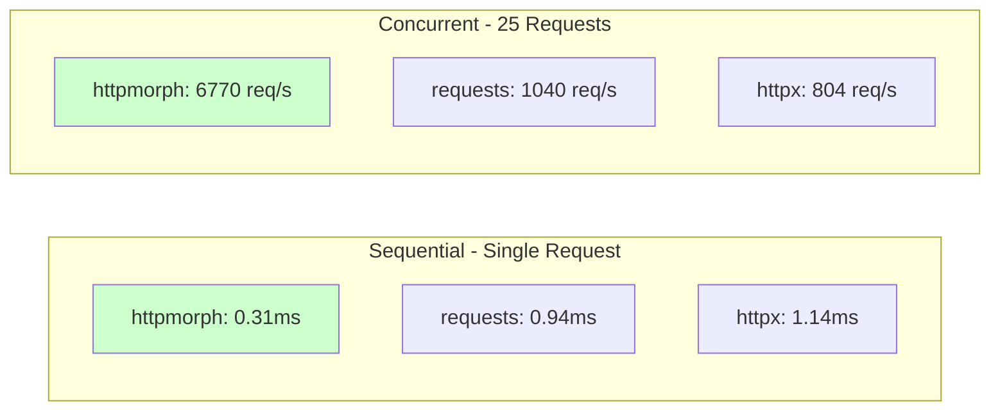
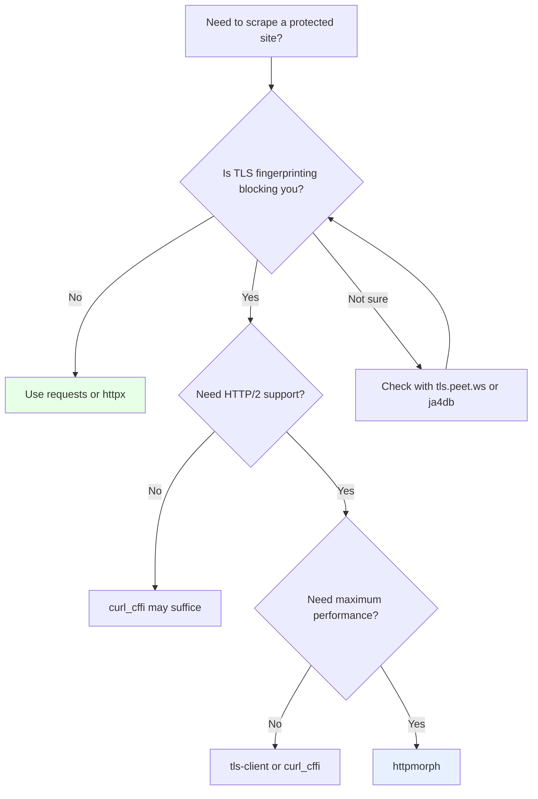

Every scraper developer has hit the wall: your request headers are perfect, your cookies are fresh, your proxy is clean, and you still get blocked. The problem is not in what your code sends. It is in how the underlying TLS library introduces itself to the server. Libraries like `requests` and `httpx` use OpenSSL or Python's `ssl` module, and their TLS handshakes look nothing like a real browser. Anti-bot systems fingerprint these handshakes using techniques like JA3 and JA4, and they can tell the difference between Chrome and a Python script before your request even reaches the application layer.

httpmorph is an open-source Python HTTP client built from scratch in C that solves this problem directly. Instead of patching over Python's TLS stack, it replaces it entirely with BoringSSL (the same TLS library Chrome uses) and generates perfect JA4 fingerprints matching Chrome versions 127 through 131. It has been gaining traction on GitHub with over 100 stars and is worth looking at for anyone dealing with fingerprint-based blocking.

## The Fingerprinting Problem

To understand why httpmorph exists, you need to understand what TLS fingerprinting actually detects. When a client initiates a TLS handshake (the ClientHello message), it announces a specific combination of:

- Supported cipher suites and their order
- TLS extensions and their order
- Supported curves (elliptic curves for key exchange)
- Signature algorithms
- ALPN protocols (h2, http/1.1)

Each TLS library produces a distinct combination of these values. OpenSSL, which Python's `ssl` module and `requests` rely on, generates a fingerprint that looks nothing like Chrome's BoringSSL. Anti-bot services like Cloudflare, Akamai, and DataDome maintain databases of known fingerprints and can reject or challenge any connection that does not match a recognized browser.



The JA4 fingerprint is a hash derived from the TLS ClientHello parameters. A standard Python `requests` call produces a JA4 that maps to "Python urllib3/OpenSSL," not "Chrome 131 on macOS." No amount of header manipulation can fix this because the fingerprint is extracted before HTTP headers are even sent.

```python
import requests

# This request has perfect headers but a Python TLS fingerprint
response = requests.get('https://protected-site.com', headers={
    'User-Agent': 'Mozilla/5.0 (Macintosh; Intel Mac OS X 10_15_7) '
                  'AppleWebKit/537.36 (KHTML, like Gecko) '
                  'Chrome/131.0.0.0 Safari/537.36',
    'Accept': 'text/html,application/xhtml+xml',
    'Accept-Language': 'en-US,en;q=0.9',
    'Accept-Encoding': 'gzip, deflate, br',
})
# Result: 403 Forbidden
# The server fingerprinted the TLS handshake, not the headers
```

## How httpmorph Solves It

httpmorph takes a different approach than most fingerprinting solutions. Instead of wrapping libcurl or monkey-patching Python's SSL context, it implements the entire HTTP stack in C from the ground up, using BoringSSL for TLS and nghttp2 for HTTP/2.



Because BoringSSL is the same library Chrome uses for its TLS stack, the JA4 fingerprint that httpmorph produces is identical to a real Chrome browser. This is not an approximation or a best-effort match. It is the same library generating the same handshake with the same cipher suite ordering, the same extensions, and the same elliptic curve preferences.

The fingerprint matching extends beyond TLS. httpmorph also matches Chrome's HTTP/2 fingerprint (the Akamai H2 fingerprint), which includes the SETTINGS frame values, window update size, priority frames, and pseudo-header order. Sites that fingerprint at the HTTP/2 layer -- and Akamai-protected sites do -- will see httpmorph as indistinguishable from Chrome.

## Getting Started

httpmorph provides an API that mirrors the `requests` library, making migration straightforward.

```python
import httpmorph

# Basic GET request -- same as requests
response = httpmorph.get('https://example.com')
print(response.status_code)  # 200
print(response.text)         # HTML content

# The response includes TLS fingerprint info
print(response.tls_version)     # 'TLSv1.3'
print(response.ja3_fingerprint) # JA4 hash matching Chrome
print(response.http_version)    # '2.0'
```

For session-based scraping with persistent cookies:

```python
import httpmorph

session = httpmorph.Session(browser='chrome')

# Login
session.post('https://example.com/login', data={
    'username': 'user@example.com',
    'password': 'password123'
})

# Subsequent requests carry the session cookies
profile = session.get('https://example.com/dashboard')
print(session.cookies)  # Cookies persisted across requests
```

Selecting specific Chrome versions and operating systems:

```python
# Chrome 131 on Windows
session = httpmorph.Session(browser='chrome131', os='windows')

# Chrome 127 on macOS
session = httpmorph.Session(browser='chrome127', os='macos')

# Default: latest Chrome version, OS matches your platform
session = httpmorph.Session(browser='chrome')
```

## HTTP/2 Support

Unlike `requests` (which only supports HTTP/1.1), httpmorph supports HTTP/2 natively through nghttp2. HTTP/2 is the default for most modern websites, and not supporting it is itself a fingerprinting signal since real browsers always negotiate HTTP/2 when available.

```python
import httpmorph

client = httpmorph.Client(http2=True)
response = client.get('https://www.google.com')
print(response.http_version)  # '2.0'

# HTTP/2 multiplexing allows concurrent requests on a single connection
# This is handled automatically by the connection pool
```

```javascript
// For comparison: Node.js equivalent using undici
// httpmorph provides this same HTTP/2 capability in Python
// without needing a separate library

const { Client } = require('undici');
const client = new Client('https://www.google.com', {
    allowH2: true
});
```

## Async Support

httpmorph's async implementation uses C-level event loops (kqueue on macOS, epoll on Linux) rather than Python thread pools. This means async operations do not consume Python threads and can handle higher concurrency.

```python
import asyncio
import httpmorph

async def scrape_multiple(urls):
    client = httpmorph.AsyncClient()
    tasks = [client.get(url) for url in urls]
    responses = await asyncio.gather(*tasks)

    for url, response in zip(urls, responses):
        print(f"{url}: {response.status_code}")

    return responses

urls = [
    'https://example.com/page/1',
    'https://example.com/page/2',
    'https://example.com/page/3',
]

results = asyncio.run(scrape_multiple(urls))
```

## Performance

Since the core HTTP engine is written in C, httpmorph avoids the Python interpreter overhead that slows down `requests` and `httpx`. The performance difference is most noticeable in concurrent and high-throughput scenarios.



For local and concurrent workloads, httpmorph is roughly 3x faster than `requests` in sequential mode and 6.5x faster in concurrent mode. The advantage comes from the C implementation eliminating per-request Python overhead, connection pooling that reuses TLS sessions, and the native async I/O engine.

For network-bound remote requests where latency dominates, the performance difference narrows. The C overhead savings are small compared to a 100ms network round trip. That said, the connection pooling and HTTP/2 multiplexing still provide measurable gains when making many requests to the same host.

```python
# Connection pooling in action
import httpmorph

session = httpmorph.Session(browser='chrome')

# First request: full TLS handshake + HTTP/2 negotiation
response1 = session.get('https://api.example.com/products/1')

# Subsequent requests: reuse existing connection
# No TLS handshake, no TCP setup -- just send the HTTP/2 frame
response2 = session.get('https://api.example.com/products/2')
response3 = session.get('https://api.example.com/products/3')

# The session handles connection lifecycle automatically
print(response1.total_time_us)  # ~95000 (95ms with TLS)
print(response2.total_time_us)  # ~12000 (12ms reusing connection)
```

## How It Compares to Alternatives

Several other libraries attempt to solve the fingerprinting problem. Each takes a different approach with different trade-offs.

**curl_cffi** wraps libcurl via CFFI and can impersonate browser fingerprints. It is more mature and widely used, but it inherits libcurl's complexity and its fingerprint matching is done through configuration rather than using the actual browser TLS library. httpmorph's use of BoringSSL (Chrome's own TLS library) means the fingerprint is not a simulation -- it is the real thing.

**tls-client** is another wrapper around a Go-based TLS library. It works well but introduces Go runtime overhead and adds complexity to the build process. httpmorph stays within the C/Python ecosystem.

**requests + patches** (like requests-impersonate) try to modify the TLS fingerprint by patching Python's SSL context. This approach is fragile and cannot match all fingerprint dimensions (cipher suite ordering, extension ordering, etc.) because Python's `ssl` module does not expose the necessary low-level controls.

The unique advantage of httpmorph is that it does not wrap or patch anything. The HTTP client, TLS stack, and HTTP/2 implementation are all built from the ground up in C, giving complete control over every byte of the handshake and every frame of the protocol.

## Proxy Support

Proxy rotation is a standard part of any scraping setup, and httpmorph supports HTTP and HTTPS proxies with authentication:

```python
import httpmorph

# Basic proxy
response = httpmorph.get(
    'https://example.com',
    proxy='http://proxy.example.com:8080'
)

# Authenticated proxy
response = httpmorph.get(
    'https://example.com',
    proxy='http://proxy.example.com:8080',
    proxy_auth=('username', 'password')
)

# Session with persistent proxy
session = httpmorph.Session(browser='chrome')
session.proxies = {
    'http': 'http://proxy.example.com:8080',
    'https': 'http://proxy.example.com:8080',
}
response = session.get('https://example.com')
```

## Choosing httpmorph vs Traditional Tools



httpmorph is a strong fit when:

- TLS fingerprinting is the primary blocking mechanism you face
- You need HTTP/2 with proper Akamai H2 fingerprinting
- You want a requests-compatible API without rewriting your scraper
- Performance matters because you are making thousands of requests
- You want zero external Python dependencies

It may not be the right choice if you need a production-hardened, battle-tested library (it is still in alpha), or if your target sites do not use TLS fingerprinting for detection.

## Installation

httpmorph is available on PyPI with pre-built wheels for major platforms:

```bash
pip install httpmorph
```

Pre-built wheels cover Linux (x86_64, ARM64), macOS (Intel, Apple Silicon), and Windows (x64) across Python 3.8 through 3.13. Building from source requires CMake, a C compiler, and Go (for BoringSSL's build system).

## Looking Ahead

TLS fingerprinting is becoming a standard part of anti-bot infrastructure. As more sites adopt JA4-based detection, the gap between what Python's standard HTTP libraries produce and what real browsers produce will become an increasingly common cause of blocked requests. Libraries like httpmorph that solve the problem at the TLS level rather than the HTTP level address the root cause rather than working around the symptoms.

The project is still in alpha (version 0.2.8 at time of writing), but the core fingerprinting and performance features are functional. For scraping projects where fingerprint-based blocking is the main obstacle, it is worth testing against your target sites to see if the Chrome-matching JA4 fingerprint resolves the issue.
