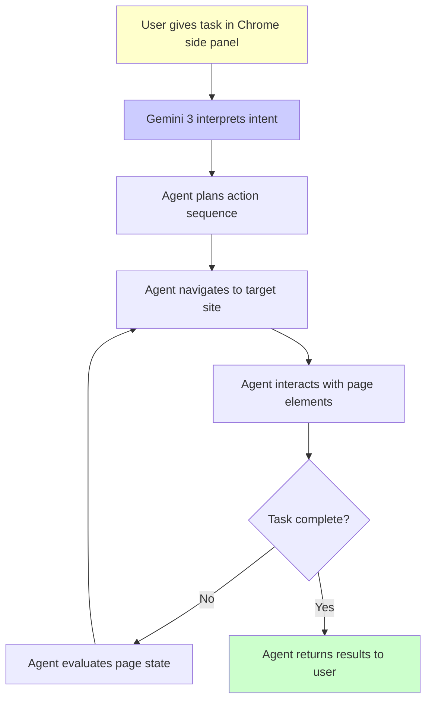
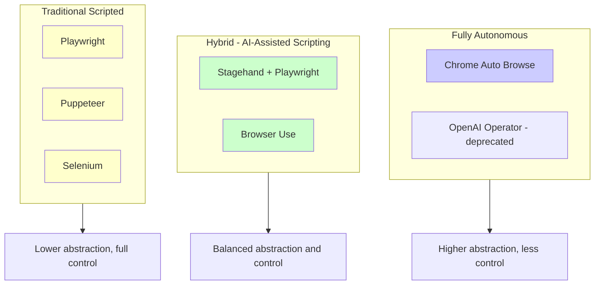
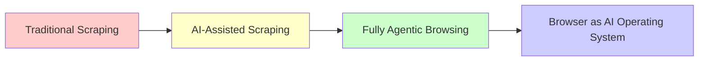

On January 28, 2026, Google announced Chrome Auto Browse, a feature powered by Gemini 3 that lets an AI agent autonomously navigate websites, fill forms, compare prices, and complete multi-step tasks on behalf of the user. For anyone working in web scraping or browser automation, this is worth paying close attention to.

Auto Browse is not another chatbot overlay. It changes how the browser itself interacts with the web, and it raises practical questions about the future of scrapers and automation tools. This post covers what Auto Browse does, how it compares to existing browser agents, and what it means for the web scraping community.

## What Chrome Auto Browse Actually Does

Chrome Auto Browse lives in Chrome's side panel, the same area where you might already use Google's AI features. When you give it a task like "find the cheapest round-trip flight from SFO to Tokyo in March," the agent takes over. It navigates to travel sites, enters search criteria, waits for results, compares prices across multiple tabs, and reports back with a summary.

The key capabilities include:

- **Autonomous navigation**: The agent clicks links, scrolls pages, and moves between sites without human intervention
- **Form interaction**: It fills out search forms, login fields, and multi-step wizards
- **Price and product comparison**: It can open multiple tabs and synthesize information across them
- **Multi-step task execution**: Scheduling appointments, managing subscriptions, filing expense reports

Google is offering this on a tiered basis. AI Pro subscribers get 20 daily tasks, while AI Ultra subscribers get 200. Each "task" represents one complete multi-step workflow.



## The Architecture Behind Auto Browse

Google has not published the full technical details, but the general architecture can be inferred from the broader pattern of browser agents. At its core, Auto Browse follows a perceive-plan-act loop that all agentic browsing systems share.

The agent takes a screenshot or DOM snapshot of the current page, feeds it to a vision-language model (in this case Gemini 3), and receives back a structured action to perform. That action might be "click the button labeled Search" or "type March 15 into the departure date field." The agent executes the action, observes the new page state, and repeats until the task is complete.

This loop is the same pattern that web scrapers have used for years, just with an LLM replacing the hardcoded logic.

```python
# The conceptual loop behind any browser agent
# (simplified pseudocode)
from playwright.sync_api import sync_playwright

def browser_agent_loop(task, llm_client):
    with sync_playwright() as p:
        browser = p.chromium.launch(headless=False)
        page = browser.new_page()
        page.goto("https://www.google.com")

        while True:
            # Perceive: capture current state
            screenshot = page.screenshot()
            page_text = page.inner_text("body")

            # Plan: ask LLM what to do next
            action = llm_client.decide_action(
                task=task,
                screenshot=screenshot,
                page_text=page_text
            )

            if action.type == "done":
                return action.result

            # Act: execute the decided action
            if action.type == "click":
                page.click(action.selector)
            elif action.type == "type":
                page.fill(action.selector, action.text)
            elif action.type == "navigate":
                page.goto(action.url)

            page.wait_for_load_state("networkidle")
```

```javascript
// The same loop in JavaScript with Playwright
const { chromium } = require('playwright');

async function browserAgentLoop(task, llmClient) {
    const browser = await chromium.launch({ headless: false });
    const page = await browser.newPage();
    await page.goto('https://www.google.com');

    while (true) {
        // Perceive
        const screenshot = await page.screenshot({ encoding: 'base64' });
        const pageText = await page.innerText('body');

        // Plan
        const action = await llmClient.decideAction({
            task,
            screenshot,
            pageText
        });

        if (action.type === 'done') {
            await browser.close();
            return action.result;
        }

        // Act
        if (action.type === 'click') {
            await page.click(action.selector);
        } else if (action.type === 'type') {
            await page.fill(action.selector, action.text);
        } else if (action.type === 'navigate') {
            await page.goto(action.url);
        }

        await page.waitForLoadState('networkidle');
    }
}
```

## How Auto Browse Compares to Existing Browser Agents

Google is not the first to build a browser agent. Several serious players already exist, and understanding where Auto Browse fits helps clarify what is actually new.

### OpenAI Operator

OpenAI launched Operator in January 2025 as a standalone browser agent. It could navigate websites, book reservations, and handle multi-step tasks. Operator achieved a 38.1% success rate on the OSWorld benchmark and 58.1% on WebArena, which measures web-based task completion. However, OpenAI deprecated Operator in August 2025, folding its capabilities into ChatGPT's agent mode. The takeaway: standalone browser agents struggle to find a sustainable form factor. Google seems to have learned from this by embedding Auto Browse directly into Chrome.

### Browser Use

Browser Use is an open-source framework that connects LLMs to browser automation. It achieves an impressive 89.1% on the WebVoyager benchmark, well above the commercial offerings. Its strength lies in its modular design -- you can swap in different LLMs, customize the action space, and extend the perceive-plan-act loop.

### Stagehand by Browserbase

Stagehand has gained enormous traction in the developer community, amassing over 50,000 GitHub stars. It extends Playwright with AI-powered selectors, letting you write automation scripts that use natural language to identify elements instead of brittle CSS selectors. Stagehand sits at a practical middle ground between fully autonomous agents and traditional scripted automation.



## Building Your Own Browser Agent

You do not need to wait for Google to get agentic browsing. Open-source tools already make it possible to build a browser agent that rivals what Auto Browse offers. Below is a practical example using Playwright and an LLM API.

```python
# A simple but functional browser agent using Playwright + LLM
import json
import base64
from playwright.sync_api import sync_playwright
from openai import OpenAI

client = OpenAI()

SYSTEM_PROMPT = """You are a browser automation agent. Given a screenshot
and the user's task, return a JSON action to perform.

Valid actions:
- {"type": "click", "selector": "css selector"}
- {"type": "type", "selector": "css selector", "text": "text to type"}
- {"type": "navigate", "url": "https://..."}
- {"type": "scroll", "direction": "down"}
- {"type": "done", "result": "summary of findings"}
"""

def get_next_action(task, screenshot_b64, page_html):
    response = client.chat.completions.create(
        model="gpt-4o",
        messages=[
            {"role": "system", "content": SYSTEM_PROMPT},
            {"role": "user", "content": [
                {"type": "text", "text": f"Task: {task}\n\nPage HTML (truncated): {page_html[:3000]}"},
                {"type": "image_url", "image_url": {
                    "url": f"data:image/png;base64,{screenshot_b64}"
                }}
            ]}
        ],
        response_format={"type": "json_object"}
    )
    return json.loads(response.choices[0].message.content)

def run_agent(task, start_url="https://www.google.com", max_steps=15):
    with sync_playwright() as p:
        browser = p.chromium.launch(headless=False)
        page = browser.new_page(viewport={"width": 1280, "height": 720})
        page.goto(start_url)

        for step in range(max_steps):
            screenshot = base64.b64encode(
                page.screenshot()
            ).decode()
            html = page.content()

            action = get_next_action(task, screenshot, html)
            print(f"Step {step + 1}: {action}")

            if action["type"] == "done":
                browser.close()
                return action["result"]

            execute_action(page, action)

        browser.close()
        return "Max steps reached without completing task"

def execute_action(page, action):
    if action["type"] == "click":
        page.click(action["selector"], timeout=5000)
    elif action["type"] == "type":
        page.fill(action["selector"], action["text"])
    elif action["type"] == "navigate":
        page.goto(action["url"])
    elif action["type"] == "scroll":
        page.mouse.wheel(0, 500)
    page.wait_for_load_state("domcontentloaded")
```

```javascript
// Equivalent agent in JavaScript
const { chromium } = require('playwright');
const OpenAI = require('openai');

const openai = new OpenAI();

const SYSTEM_PROMPT = `You are a browser automation agent. Given a screenshot
and the user's task, return a JSON action to perform.

Valid actions:
- {"type": "click", "selector": "css selector"}
- {"type": "type", "selector": "css selector", "text": "text to type"}
- {"type": "navigate", "url": "https://..."}
- {"type": "done", "result": "summary of findings"}`;

async function getNextAction(task, screenshotB64, pageHtml) {
    const response = await openai.chat.completions.create({
        model: 'gpt-4o',
        messages: [
            { role: 'system', content: SYSTEM_PROMPT },
            { role: 'user', content: [
                { type: 'text', text: `Task: ${task}\n\nPage HTML: ${pageHtml.slice(0, 3000)}` },
                { type: 'image_url', image_url: {
                    url: `data:image/png;base64,${screenshotB64}`
                }}
            ]}
        ],
        response_format: { type: 'json_object' }
    });
    return JSON.parse(response.choices[0].message.content);
}

async function runAgent(task, startUrl = 'https://www.google.com') {
    const browser = await chromium.launch({ headless: false });
    const page = await browser.newPage({ viewport: { width: 1280, height: 720 } });
    await page.goto(startUrl);

    for (let step = 0; step < 15; step++) {
        const screenshot = (await page.screenshot()).toString('base64');
        const html = await page.content();
        const action = await getNextAction(task, screenshot, html);

        console.log(`Step ${step + 1}:`, action);

        if (action.type === 'done') {
            await browser.close();
            return action.result;
        }

        await executeAction(page, action);
    }

    await browser.close();
    return 'Max steps reached';
}

async function executeAction(page, action) {
    switch (action.type) {
        case 'click':
            await page.click(action.selector, { timeout: 5000 });
            break;
        case 'type':
            await page.fill(action.selector, action.text);
            break;
        case 'navigate':
            await page.goto(action.url);
            break;
    }
    await page.waitForLoadState('domcontentloaded');
}
```

## What This Means for Web Scraping Professionals

The question on everyone's mind in the scraping community: does Chrome Auto Browse change the game? The answer has some layers to it.

### Auto Browse is not a scraping tool

Auto Browse is designed for end users performing one-off tasks. It has daily limits (20 or 200 tasks depending on your subscription), runs in a visible browser, and is optimized for tasks that a human would normally do manually. It is not built for extracting thousands of product listings or monitoring prices across hundreds of pages.

### But it validates the architecture

What Auto Browse does validate is that the perceive-plan-act loop works at scale. Google is betting that an LLM can reliably navigate arbitrary websites and complete complex tasks. This same architecture is exactly what modern scraping frameworks are adopting. If Google's Gemini 3 can fill out a hotel booking form, then an open-source LLM can fill out any form your scraper encounters.

### The browser is becoming the OS for AI agents

This trend has been building for over a year, and Auto Browse makes it concrete. The browser is becoming the universal interface through which AI agents interact with the digital world. Every website is essentially an API for an agent that can see and click. For web scraping professionals, this means:

1. Anti-bot systems will evolve to handle AI agents, not just automated scripts
2. Natural language selectors will increasingly replace CSS selectors and XPath in scraping code
3. Visual understanding of pages will matter as much as DOM parsing
4. Resilience to layout changes will become a built-in feature rather than something you code around

### Practical takeaway

If you are building scrapers today, start incorporating LLM-powered element selection into your toolkit. Tools like Stagehand already make this practical. You do not need to go fully autonomous, but adding a layer of AI-powered resilience to your existing Playwright or Puppeteer scripts will pay dividends as websites continue to evolve.

```python
# Example: Adding LLM-powered fallback to a traditional scraper
from playwright.sync_api import sync_playwright

def resilient_scrape(page, task_description):
    # Try traditional CSS selector first
    try:
        price = page.locator(".product-price").first.text_content(timeout=3000)
        return price
    except Exception:
        pass

    # Fall back to LLM-powered extraction
    screenshot = page.screenshot()
    html = page.content()
    # Send to LLM to identify the price element
    selector = ask_llm_for_selector(
        f"Find the CSS selector for: {task_description}",
        screenshot, html
    )
    return page.locator(selector).first.text_content()
```

```javascript
// JavaScript version of the resilient scraper pattern
async function resilientScrape(page, taskDescription) {
    // Try traditional selector first
    try {
        const price = await page.locator('.product-price')
            .first()
            .textContent({ timeout: 3000 });
        return price;
    } catch (e) {
        // Fall back to LLM-powered extraction
        const screenshot = (await page.screenshot()).toString('base64');
        const html = await page.content();
        const selector = await askLlmForSelector(
            `Find the CSS selector for: ${taskDescription}`,
            screenshot, html
        );
        return await page.locator(selector).first().textContent();
    }
}
```

## Looking Ahead

Chrome Auto Browse is a notable announcement, but it is an early step in a much longer journey. The daily task limits, the restriction to Chrome, and the reliance on Google's servers all constrain its current utility. For web scraping professionals, the real story is not Auto Browse itself but the broader direction it points toward: AI agents that understand and interact with websites the way humans do.

The tools to build these agents are already open source and available today. Browser Use achieves 89.1% on WebVoyager. Stagehand has over 50,000 stars on GitHub. Playwright gives you the browser control foundation. The pieces are there.



Whether you adopt Google's Auto Browse or build your own agents with open-source tools, the way web scraping works is changing. The browser agent era has arrived, and the developers who integrate LLM-powered resilience into their scraping stacks now will be better positioned as websites and anti-bot systems continue to evolve.
