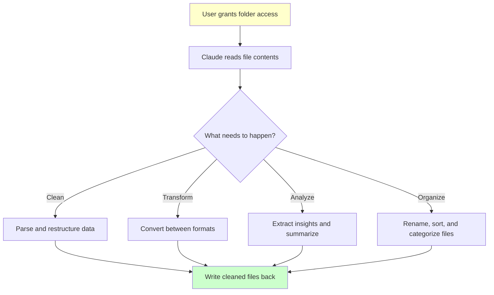
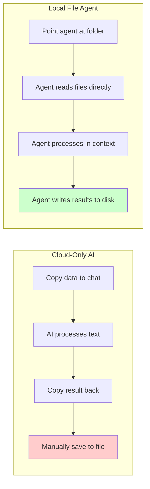
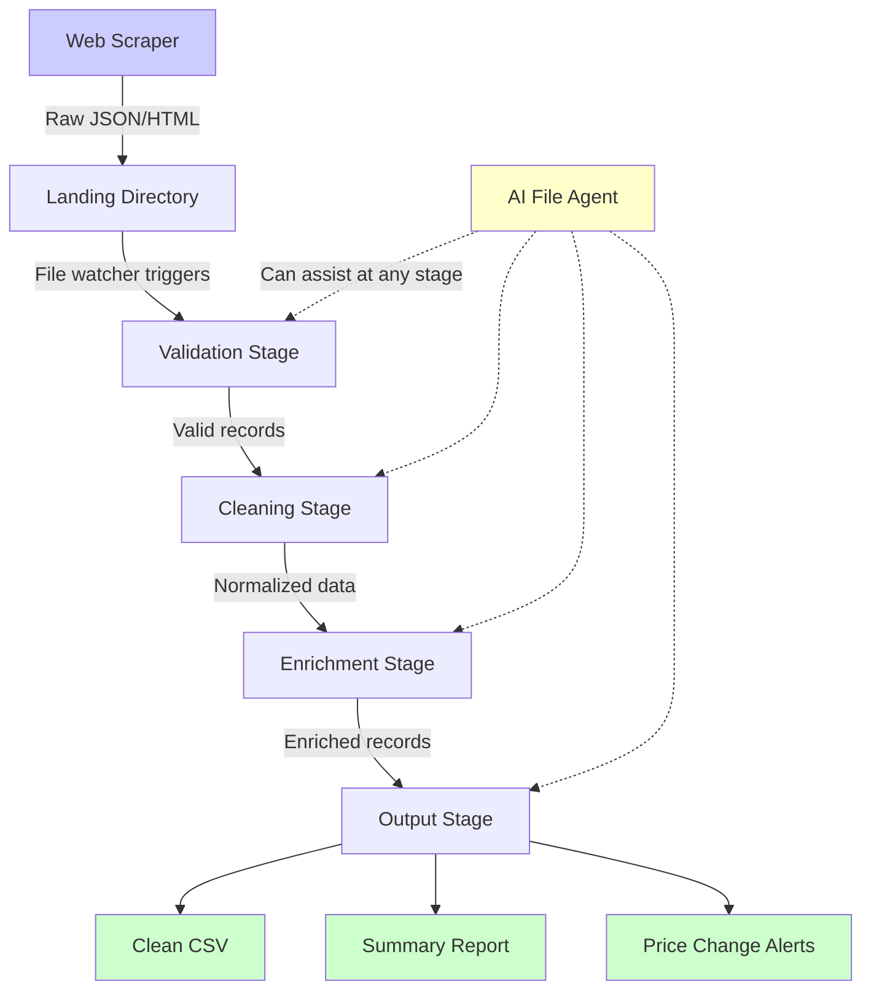

Every web scraper eventually faces the same problem: you have the data, now what? You have pulled thousands of records from a website, dumped them into CSV files or JSON blobs, and now they sit in a folder on your machine waiting to be cleaned, transformed, and turned into something useful. This post-scraping phase is where most automation pipelines quietly fall apart.

Anthropic's launch of Claude Cowork in January 2026 addresses this gap directly. Cowork gives Claude direct access to local file folders, allowing it to read, edit, and create files on your machine. It launched for Claude Max subscribers on January 12 and expanded to Pro subscribers on January 16. What makes it relevant for the scraping community is not just the feature itself, but what it signals about the direction AI agents are heading: from cloud-only chat interfaces to tools that interact with your actual system.

This post covers how file-based AI agents complement web scraping workflows, what Cowork specifically brings to the table, and how to build your own file processing pipelines.

## What Claude Cowork Does

Cowork allows Claude to work with files in designated folders on your local machine. You grant it access to a specific directory, and from that point on, the AI can read the contents of files, edit them in place, and create new files. Think of it as giving an AI assistant a desk in your office with access to your filing cabinet.

The practical use cases Anthropic highlights include reorganizing a messy downloads folder, converting receipt screenshots into structured expense spreadsheets, and drafting reports from scattered notes. From an engineering perspective, one interesting detail is that Anthropic built Cowork in approximately a week and a half using Claude Code, their own developer tool. That speed of development says something about how mature the underlying infrastructure has become.



## The Shift from Cloud to Local

For years, AI assistants have been cloud-bound. You paste text into a chat window, the model processes it on a remote server, and you copy the result back. This round-trip workflow breaks down when you are dealing with large datasets, sensitive information, or workflows that need to interact with your file system.

Cowork works differently. The AI reaches into your local environment. It sees your files as they are, not as you describe them. This distinction matters for web scraping workflows, where the output is often a folder full of JSON files, CSV exports, or raw HTML dumps that need systematic processing.

In most scraping projects, the biggest bottleneck is not the scraping itself. It is the data pipeline that follows. Cleaning malformed CSV files, deduplicating records across multiple scrape runs, normalizing date formats, extracting structured data from semi-structured dumps -- these tasks are tedious, repetitive, and exactly the kind of work that a file-based AI agent can handle.



## Connecting Scraping to File Processing

The real power of file-based agents shows up when they connect to your scraping pipeline. A concrete scenario: you scrape product data from an e-commerce site nightly. Each run produces a JSON file with hundreds of products. Over a week, you have seven files that need to be merged, deduplicated, and analyzed for price changes.

With a traditional approach, you write custom scripts for each transformation step. With a file agent, you describe the transformation in natural language and let the agent handle the details. But you do not have to pick one or the other. The most effective approach combines both.

### Scraping Output to Clean CSV

A common scenario: your scraper produces messy JSON that needs to become a clean CSV.

```python
# Step 1: Your scraper produces raw JSON output
import json
import csv
from pathlib import Path
from datetime import datetime

def scraper_output_to_json(products, output_dir="./scraped_data"):
    """Save scraper output as timestamped JSON files"""
    Path(output_dir).mkdir(exist_ok=True)
    timestamp = datetime.now().strftime("%Y%m%d_%H%M%S")
    filepath = f"{output_dir}/products_{timestamp}.json"

    with open(filepath, "w") as f:
        json.dump(products, f, indent=2)

    print(f"Saved {len(products)} products to {filepath}")
    return filepath

# Example raw scraper output with typical messiness
raw_products = [
    {"name": "Widget A", "price": "$29.99", "stock": "In Stock", "url": "https://shop.example.com/widget-a"},
    {"name": "Widget B ", "price": "44.50", "stock": "in stock", "url": "https://shop.example.com/widget-b"},
    {"name": "widget c", "price": "$0.00", "stock": "Out of Stock", "url": "https://shop.example.com/widget-c"},
    {"name": "Widget A", "price": "$29.99", "stock": "In Stock", "url": "https://shop.example.com/widget-a"},
]

scraper_output_to_json(raw_products)
```

```python
# Step 2: Clean and normalize the scraped data
import json
import csv
import re
from pathlib import Path

def clean_price(price_str):
    """Extract numeric price from various formats"""
    if not price_str:
        return None
    cleaned = re.sub(r'[^\d.]', '', str(price_str))
    try:
        value = float(cleaned)
        return value if value > 0 else None
    except ValueError:
        return None

def normalize_stock(stock_str):
    """Standardize stock status"""
    if not stock_str:
        return "unknown"
    lower = stock_str.strip().lower()
    if "in stock" in lower:
        return "in_stock"
    elif "out" in lower:
        return "out_of_stock"
    return "unknown"

def clean_scraped_json(input_path, output_path):
    """Transform messy scraper JSON into clean CSV"""
    with open(input_path) as f:
        raw_data = json.load(f)

    # Clean and deduplicate
    seen_urls = set()
    cleaned = []

    for item in raw_data:
        url = item.get("url", "").strip()
        if url in seen_urls:
            continue
        seen_urls.add(url)

        price = clean_price(item.get("price"))
        if price is None:
            continue  # Skip items with invalid prices

        cleaned.append({
            "name": item.get("name", "").strip().title(),
            "price": price,
            "stock_status": normalize_stock(item.get("stock")),
            "url": url
        })

    # Write clean CSV
    with open(output_path, "w", newline="") as f:
        writer = csv.DictWriter(f, fieldnames=["name", "price", "stock_status", "url"])
        writer.writeheader()
        writer.writerows(cleaned)

    print(f"Cleaned {len(raw_data)} raw records into {len(cleaned)} clean records")
    return cleaned

clean_scraped_json("./scraped_data/products_20260131_120000.json", "./clean_data/products.csv")
```

```javascript
// The same cleaning pipeline in JavaScript
const fs = require('fs');
const path = require('path');
const { parse } = require('json2csv');

function cleanPrice(priceStr) {
    if (!priceStr) return null;
    const cleaned = String(priceStr).replace(/[^\d.]/g, '');
    const value = parseFloat(cleaned);
    return value > 0 ? value : null;
}

function normalizeStock(stockStr) {
    if (!stockStr) return 'unknown';
    const lower = stockStr.trim().toLowerCase();
    if (lower.includes('in stock')) return 'in_stock';
    if (lower.includes('out')) return 'out_of_stock';
    return 'unknown';
}

function cleanScrapedJson(inputPath, outputPath) {
    const rawData = JSON.parse(fs.readFileSync(inputPath, 'utf-8'));
    const seenUrls = new Set();
    const cleaned = [];

    for (const item of rawData) {
        const url = (item.url || '').trim();
        if (seenUrls.has(url)) continue;
        seenUrls.add(url);

        const price = cleanPrice(item.price);
        if (price === null) continue;

        cleaned.push({
            name: (item.name || '').trim().replace(/\b\w/g, c => c.toUpperCase()),
            price,
            stock_status: normalizeStock(item.stock),
            url
        });
    }

    const csvOutput = parse(cleaned, {
        fields: ['name', 'price', 'stock_status', 'url']
    });

    fs.mkdirSync(path.dirname(outputPath), { recursive: true });
    fs.writeFileSync(outputPath, csvOutput);
    console.log(`Cleaned ${rawData.length} raw records into ${cleaned.length} clean records`);
    return cleaned;
}

cleanScrapedJson('./scraped_data/products_20260131_120000.json', './clean_data/products.csv');
```

### Merging Multiple Scrape Runs

When you run scrapers on a schedule, you end up with multiple output files that need to be merged and compared.

```python
# Merge multiple scrape runs and track price changes
import json
import csv
from pathlib import Path
from collections import defaultdict

def merge_scrape_runs(data_dir, output_path):
    """Merge multiple JSON scrape files and detect price changes"""
    product_history = defaultdict(list)

    # Read all JSON files in chronological order
    json_files = sorted(Path(data_dir).glob("products_*.json"))
    print(f"Found {len(json_files)} scrape files to merge")

    for filepath in json_files:
        # Extract timestamp from filename
        timestamp = filepath.stem.replace("products_", "")

        with open(filepath) as f:
            products = json.load(f)

        for product in products:
            url = product.get("url", "").strip()
            if not url:
                continue

            price = clean_price(product.get("price"))
            product_history[url].append({
                "name": product.get("name", "").strip().title(),
                "price": price,
                "timestamp": timestamp,
                "stock": normalize_stock(product.get("stock"))
            })

    # Build merged output with price change detection
    merged = []
    for url, history in product_history.items():
        latest = history[-1]
        prices = [h["price"] for h in history if h["price"] is not None]

        merged.append({
            "name": latest["name"],
            "url": url,
            "current_price": latest["price"],
            "min_price": min(prices) if prices else None,
            "max_price": max(prices) if prices else None,
            "price_changed": len(set(prices)) > 1,
            "times_seen": len(history),
            "current_stock": latest["stock"],
            "last_scraped": latest["timestamp"]
        })

    # Write merged report
    with open(output_path, "w", newline="") as f:
        fields = ["name", "url", "current_price", "min_price",
                  "max_price", "price_changed", "times_seen",
                  "current_stock", "last_scraped"]
        writer = csv.DictWriter(f, fieldnames=fields)
        writer.writeheader()
        writer.writerows(merged)

    price_changes = sum(1 for m in merged if m["price_changed"])
    print(f"Merged {len(merged)} unique products, {price_changes} with price changes")

merge_scrape_runs("./scraped_data", "./reports/price_tracking.csv")
```

## Building a File Processing Pipeline

The pattern that Cowork popularizes -- an agent that reads, transforms, and writes files -- can be implemented in your own scraping infrastructure. Below is a complete pipeline that watches a directory for new scraper output and automatically processes it.

```python
# Automated file processing pipeline for scraped data
import json
import csv
import time
import hashlib
from pathlib import Path
from datetime import datetime
from watchdog.observers import Observer
from watchdog.events import FileSystemEventHandler

class ScrapedDataProcessor(FileSystemEventHandler):
    """Watch for new scraper output and process it automatically"""

    def __init__(self, input_dir, output_dir):
        self.input_dir = Path(input_dir)
        self.output_dir = Path(output_dir)
        self.output_dir.mkdir(parents=True, exist_ok=True)
        self.processed_hashes = set()

    def on_created(self, event):
        if event.is_directory:
            return
        if event.src_path.endswith('.json'):
            print(f"New file detected: {event.src_path}")
            self.process_file(event.src_path)

    def process_file(self, filepath):
        """Run the full processing pipeline on a new file"""
        # Deduplicate based on content hash
        content_hash = self._file_hash(filepath)
        if content_hash in self.processed_hashes:
            print(f"Skipping duplicate file: {filepath}")
            return
        self.processed_hashes.add(content_hash)

        with open(filepath) as f:
            raw_data = json.load(f)

        # Stage 1: Validate
        valid_records = self._validate(raw_data)

        # Stage 2: Clean
        cleaned_records = self._clean(valid_records)

        # Stage 3: Enrich
        enriched_records = self._enrich(cleaned_records)

        # Stage 4: Write outputs
        self._write_csv(enriched_records, filepath)
        self._write_summary(enriched_records, filepath)

        print(f"Pipeline complete: {len(raw_data)} raw -> {len(enriched_records)} processed")

    def _validate(self, records):
        """Remove records missing required fields"""
        required_fields = ["name", "price", "url"]
        return [r for r in records if all(r.get(f) for f in required_fields)]

    def _clean(self, records):
        """Normalize and standardize all fields"""
        cleaned = []
        seen = set()
        for r in records:
            url = r["url"].strip().rstrip("/")
            if url in seen:
                continue
            seen.add(url)
            cleaned.append({
                "name": r["name"].strip().title(),
                "price": float(re.sub(r'[^\d.]', '', str(r["price"]))),
                "url": url,
                "category": r.get("category", "uncategorized").lower(),
                "stock": normalize_stock(r.get("stock", ""))
            })
        return cleaned

    def _enrich(self, records):
        """Add computed fields"""
        for r in records:
            r["price_tier"] = (
                "budget" if r["price"] < 25
                else "mid" if r["price"] < 100
                else "premium"
            )
            r["processed_at"] = datetime.now().isoformat()
        return records

    def _write_csv(self, records, source_path):
        stem = Path(source_path).stem
        output_path = self.output_dir / f"{stem}_clean.csv"
        if not records:
            return
        with open(output_path, "w", newline="") as f:
            writer = csv.DictWriter(f, fieldnames=records[0].keys())
            writer.writeheader()
            writer.writerows(records)
        print(f"CSV written: {output_path}")

    def _write_summary(self, records, source_path):
        stem = Path(source_path).stem
        output_path = self.output_dir / f"{stem}_summary.txt"
        total = len(records)
        avg_price = sum(r["price"] for r in records) / total if total else 0
        in_stock = sum(1 for r in records if r["stock"] == "in_stock")

        summary = f"""Scrape Summary Report
Generated: {datetime.now().isoformat()}
Source: {source_path}

Total Products: {total}
Average Price: ${avg_price:.2f}
In Stock: {in_stock} ({100*in_stock/total:.1f}% of total)
Out of Stock: {total - in_stock}

Price Tiers:
  Budget (under $25): {sum(1 for r in records if r['price_tier'] == 'budget')}
  Mid ($25-$100): {sum(1 for r in records if r['price_tier'] == 'mid')}
  Premium (over $100): {sum(1 for r in records if r['price_tier'] == 'premium')}
"""
        with open(output_path, "w") as f:
            f.write(summary)
        print(f"Summary written: {output_path}")

    def _file_hash(self, filepath):
        with open(filepath, "rb") as f:
            return hashlib.md5(f.read()).hexdigest()

# Start the pipeline watcher
def start_pipeline(input_dir="./scraped_data", output_dir="./processed_data"):
    processor = ScrapedDataProcessor(input_dir, output_dir)
    observer = Observer()
    observer.schedule(processor, input_dir, recursive=False)
    observer.start()
    print(f"Watching {input_dir} for new scraper output...")
    try:
        while True:
            time.sleep(1)
    except KeyboardInterrupt:
        observer.stop()
    observer.join()
```

```javascript
// JavaScript version: file watcher for scraped data processing
const fs = require('fs');
const path = require('path');
const chokidar = require('chokidar');
const { parse } = require('json2csv');
const crypto = require('crypto');

class ScrapedDataProcessor {
    constructor(inputDir, outputDir) {
        this.inputDir = inputDir;
        this.outputDir = outputDir;
        this.processedHashes = new Set();
        fs.mkdirSync(outputDir, { recursive: true });
    }

    start() {
        const watcher = chokidar.watch(this.inputDir, {
            ignored: /^\./,
            persistent: true,
            awaitWriteFinish: { stabilityThreshold: 2000 }
        });

        watcher.on('add', (filePath) => {
            if (filePath.endsWith('.json')) {
                console.log(`New file detected: ${filePath}`);
                this.processFile(filePath);
            }
        });

        console.log(`Watching ${this.inputDir} for new scraper output...`);
    }

    processFile(filePath) {
        const content = fs.readFileSync(filePath, 'utf-8');
        const hash = crypto.createHash('md5').update(content).digest('hex');

        if (this.processedHashes.has(hash)) {
            console.log(`Skipping duplicate: ${filePath}`);
            return;
        }
        this.processedHashes.add(hash);

        const rawData = JSON.parse(content);
        const validated = this.validate(rawData);
        const cleaned = this.clean(validated);
        const enriched = this.enrich(cleaned);

        this.writeCsv(enriched, filePath);
        this.writeSummary(enriched, filePath);

        console.log(`Pipeline complete: ${rawData.length} raw -> ${enriched.length} processed`);
    }

    validate(records) {
        return records.filter(r => r.name && r.price && r.url);
    }

    clean(records) {
        const seen = new Set();
        return records.filter(r => {
            const url = r.url.trim().replace(/\/$/, '');
            if (seen.has(url)) return false;
            seen.add(url);
            r.url = url;
            r.name = r.name.trim();
            r.price = parseFloat(String(r.price).replace(/[^\d.]/g, ''));
            return r.price > 0;
        });
    }

    enrich(records) {
        return records.map(r => ({
            ...r,
            price_tier: r.price < 25 ? 'budget' : r.price < 100 ? 'mid' : 'premium',
            processed_at: new Date().toISOString()
        }));
    }

    writeCsv(records, sourcePath) {
        if (!records.length) return;
        const stem = path.basename(sourcePath, '.json');
        const csvContent = parse(records);
        const outputPath = path.join(this.outputDir, `${stem}_clean.csv`);
        fs.writeFileSync(outputPath, csvContent);
        console.log(`CSV written: ${outputPath}`);
    }

    writeSummary(records, sourcePath) {
        const stem = path.basename(sourcePath, '.json');
        const total = records.length;
        const avgPrice = total ? records.reduce((s, r) => s + r.price, 0) / total : 0;
        const outputPath = path.join(this.outputDir, `${stem}_summary.txt`);

        const summary = `Scrape Summary Report
Total Products: ${total}
Average Price: $${avgPrice.toFixed(2)}
Generated: ${new Date().toISOString()}`;

        fs.writeFileSync(outputPath, summary);
    }
}

const processor = new ScrapedDataProcessor('./scraped_data', './processed_data');
processor.start();
```

## The Scraping-to-Report Pipeline

The end goal of most scraping projects is a report or dashboard. The full pipeline from initial scrape to final output looks like this:



The dashed lines from the AI file agent show where tools like Claude Cowork fit in. They do not replace your pipeline. They augment it. When you encounter an edge case your cleaning script does not handle, or when you need a one-off transformation that is not worth scripting, a file agent can step in and handle it conversationally.

## When to Use File Agents vs. Scripts

There is a fairly clear dividing line between when a file agent makes sense and when a traditional script is the better tool.

File agents work well when you are doing a one-off data cleanup that is not worth automating, when the transformation logic is ambiguous or requires judgment calls, when you need to explore and understand data before deciding how to process it, or when the task involves natural language processing like summarizing or categorizing.

On the other hand, traditional scripts are the right choice when the same transformation runs on a schedule, when you need deterministic and reproducible results, when the data volume is large enough to require streaming, or when the pipeline needs to run without human oversight.

The best pipelines use both. Scripts handle the predictable, high-volume work. File agents handle the exceptions and the exploratory work that feeds back into better scripts.

## What This Means for the Scraping Community

Claude Cowork is one product from one company, but it reflects a broader movement. AI agents are leaving the chat window and entering the file system. For web scraping professionals, this has a few practical consequences.

First, the line between "scraping" and "data processing" is blurring. Tools that can read your scraped output, understand its structure, and transform it on the fly make the entire pipeline more fluid. You spend less time writing boilerplate transformation code and more time on the scraping logic that actually matters.

Second, data quality stands to improve. When an AI agent can flag anomalies, fill in missing fields based on context, and standardize inconsistent formatting, the output of your scraping pipeline gets cleaner without additional manual effort.

Third, reporting becomes conversational. Instead of building a dashboard for every scraping project, you can point a file agent at your output directory and ask it questions. "What were the biggest price drops this week?" is a perfectly valid query when the agent can read your CSV files directly.

The scraping workflow is evolving from a linear pipeline to an interactive loop where AI agents participate at every stage. Whether you adopt Cowork specifically or build your own file processing tools, the principle is the same: let AI handle the tedious parts so you can focus on the interesting ones.
