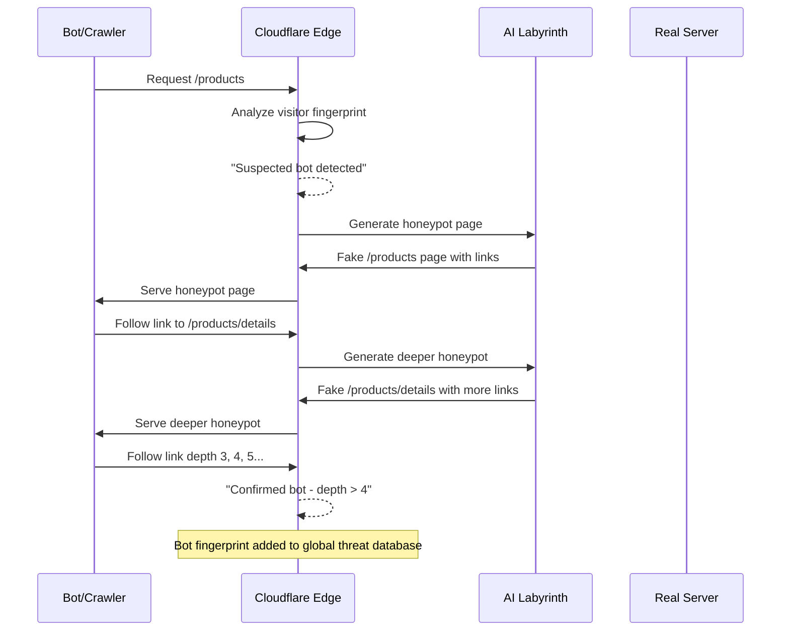
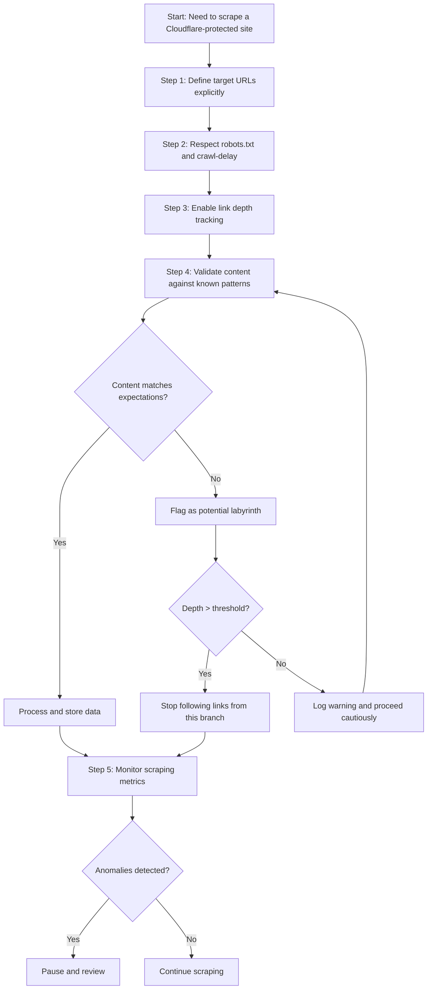
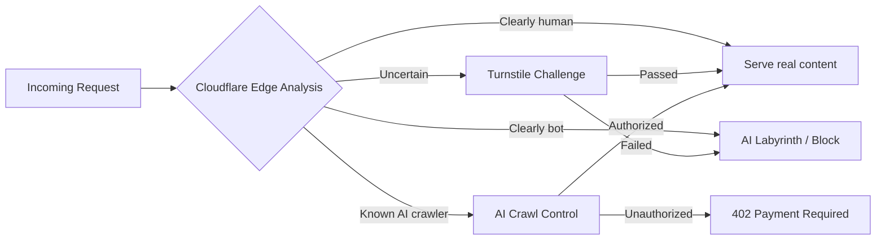

The cat-and-mouse game between scrapers and anti-bot systems has followed a predictable pattern for years: bots request pages, defenses block them with 403 or 429 responses, and scrapers adapt. Cloudflare's AI Labyrinth takes a different approach. Instead of blocking scrapers outright, it traps them -- leading unauthorized crawlers through an endless maze of AI-generated pages that look convincing but contain nothing of value. The scraper wastes compute, bandwidth, and time chasing ghosts, all while revealing itself as a bot.

Understanding how AI Labyrinth works matters for any legitimate scraper operating on today's web. Whether you are building a search engine crawler, a price comparison tool, or a research data pipeline, you need to know how to detect when you have wandered into a labyrinth and how to avoid it in the first place.

## How AI Labyrinth Works

Traditional anti-bot measures are reactive: they detect suspicious behavior and respond with blocks. AI Labyrinth is proactive and deceptive. When Cloudflare's detection systems flag a visitor as a likely bot, rather than serving a challenge page or an error, the system quietly redirects the crawler into a parallel universe of fake content.

These honeypot pages are generated by AI and designed to look like legitimate website content. They have proper HTML structure, realistic text, internal links, and plausible navigation. To an automated system following links and parsing content, everything appears normal. But the pages lead nowhere meaningful -- they just link to more fake pages, creating an infinite recursive trap.

The behavioral signal is what makes this work. Any visitor that follows links four or more levels deep into this generated content is almost certainly a bot. Real humans rarely click that deep into unfamiliar content without backing out. This depth signal becomes a powerful fingerprinting mechanism that Cloudflare can use to identify and classify bot traffic across its entire network.



## Why This Changes the Game

The shift from blocking to trapping is one of the more notable changes in anti-bot strategy in recent years. A few reasons it matters:

Instead of a quick failure, scrapers face a resource drain. When a scraper gets a 403, it knows immediately that it has been detected and can switch strategies -- rotate proxies, change headers, add delays. With AI Labyrinth, the scraper does not know it has been caught. It continues burning resources scraping worthless content.

Every bot that falls into a labyrinth teaches Cloudflare more about bot behavior patterns, building network-wide intelligence. These signals feed into their broader threat detection models, making it harder for similar bots to operate across any Cloudflare-protected site.

Unlike premium bot management features, AI Labyrinth is available to every Cloudflare customer at no additional cost. Even small websites can deploy sophisticated bot defense. And since the labyrinth is only served to suspected bots, legitimate visitors never see it -- no CAPTCHAs, no challenge pages.

## Detecting If You Are in a Labyrinth

For legitimate scrapers, the first line of defense is detection. If your scraper can recognize when it has entered fake content, it can back out before wasting resources or getting fingerprinted.

### Link Depth Tracking

The simplest signal is crawl depth. If your scraper is following links more than a few levels deep from your entry point, that should raise a flag.

```python
from urllib.parse import urlparse, urljoin
from collections import defaultdict

class LinkDepthTracker:
    """Track crawl depth from seed URLs to detect labyrinth traps."""

    def __init__(self, max_depth=3, warning_depth=2):
        self.max_depth = max_depth
        self.warning_depth = warning_depth
        self.depth_map = {}  # url -> depth from seed
        self.seed_urls = set()

    def add_seed(self, url):
        """Register a starting URL at depth 0."""
        normalized = self._normalize(url)
        self.seed_urls.add(normalized)
        self.depth_map[normalized] = 0

    def register_link(self, source_url, target_url):
        """Record a discovered link and compute its depth."""
        source = self._normalize(source_url)
        target = self._normalize(target_url)

        source_depth = self.depth_map.get(source, float('inf'))
        new_depth = source_depth + 1

        # Only update if this is a shorter path
        if target not in self.depth_map or new_depth < self.depth_map[target]:
            self.depth_map[target] = new_depth

        return self.depth_map[target]

    def should_follow(self, url):
        """Determine if a URL is safe to follow based on depth."""
        normalized = self._normalize(url)
        depth = self.depth_map.get(normalized, float('inf'))

        if depth > self.max_depth:
            return False, f"Depth {depth} exceeds max {self.max_depth} - possible labyrinth"
        elif depth >= self.warning_depth:
            return True, f"Warning: depth {depth} approaching limit"
        return True, "OK"

    def _normalize(self, url):
        parsed = urlparse(url)
        return f"{parsed.scheme}://{parsed.netloc}{parsed.path}".rstrip('/')


# Usage
tracker = LinkDepthTracker(max_depth=3)
tracker.add_seed("https://example.com/products")

# As your scraper discovers links
depth = tracker.register_link(
    "https://example.com/products",
    "https://example.com/products/category-a"
)
print(f"Link depth: {depth}")  # 1

safe, msg = tracker.should_follow("https://example.com/products/category-a/item/detail/specs")
print(f"Safe to follow: {safe}, {msg}")
```

The equivalent approach in JavaScript:

```javascript
class LinkDepthTracker {
  constructor(maxDepth = 3) {
    this.maxDepth = maxDepth;
    this.depthMap = new Map();
    this.seedUrls = new Set();
  }

  addSeed(url) {
    const normalized = this.normalize(url);
    this.seedUrls.add(normalized);
    this.depthMap.set(normalized, 0);
  }

  registerLink(sourceUrl, targetUrl) {
    const source = this.normalize(sourceUrl);
    const target = this.normalize(targetUrl);
    const sourceDepth = this.depthMap.get(source) ?? Infinity;
    const newDepth = sourceDepth + 1;

    if (!this.depthMap.has(target) || newDepth < this.depthMap.get(target)) {
      this.depthMap.set(target, newDepth);
    }
    return this.depthMap.get(target);
  }

  shouldFollow(url) {
    const depth = this.depthMap.get(this.normalize(url)) ?? Infinity;
    if (depth > this.maxDepth) {
      return { safe: false, reason: `Depth ${depth} exceeds limit - possible labyrinth` };
    }
    return { safe: true, reason: "OK" };
  }

  normalize(url) {
    const parsed = new URL(url);
    return `${parsed.protocol}//${parsed.host}${parsed.pathname}`.replace(/\/$/, "");
  }
}

// Usage
const tracker = new LinkDepthTracker(3);
tracker.addSeed("https://example.com/products");

const depth = tracker.registerLink(
  "https://example.com/products",
  "https://example.com/products/category-a"
);
console.log(`Link depth: ${depth}`); // 1
```

### Content Validation

Depth alone is not enough. A more robust approach involves validating that the content you are scraping matches expected patterns. AI-generated honeypot pages may look realistic at a glance, but they tend to diverge from the structural patterns of the real site.

```python
import hashlib
from difflib import SequenceMatcher

class ContentValidator:
    """Validate scraped content against expected patterns to detect fakes."""

    def __init__(self):
        self.known_patterns = {}  # domain -> list of structural fingerprints
        self.content_hashes = set()

    def learn_pattern(self, domain, html_content):
        """Learn the structural pattern of a known-good page."""
        fingerprint = self._structural_fingerprint(html_content)
        if domain not in self.known_patterns:
            self.known_patterns[domain] = []
        self.known_patterns[domain].append(fingerprint)

    def validate(self, domain, html_content):
        """Check if page content matches expected patterns."""
        issues = []

        # Check structural similarity
        fingerprint = self._structural_fingerprint(html_content)
        if domain in self.known_patterns:
            similarities = [
                SequenceMatcher(None, fingerprint, known).ratio()
                for known in self.known_patterns[domain]
            ]
            max_similarity = max(similarities) if similarities else 0
            if max_similarity < 0.3:
                issues.append(f"Structure deviation: {max_similarity:.2f} similarity")

        # Check for duplicate content across pages
        content_hash = hashlib.md5(html_content.encode()).hexdigest()
        if content_hash in self.content_hashes:
            issues.append("Duplicate content detected across pages")
        self.content_hashes.add(content_hash)

        # Check for suspiciously generic content
        generic_signals = [
            "lorem ipsum",
            "placeholder text",
            "sample content",
        ]
        lower_content = html_content.lower()
        for signal in generic_signals:
            if signal in lower_content:
                issues.append(f"Generic content signal: '{signal}'")

        return len(issues) == 0, issues

    def _structural_fingerprint(self, html_content):
        """Create a fingerprint based on HTML tag structure, not content."""
        import re
        tags = re.findall(r'<(/?\w+)', html_content)
        return ' '.join(tags[:100])  # First 100 tags as fingerprint
```

### Request Chain Analysis

Another useful detection method is analyzing the chain of requests your scraper makes. Labyrinth pages tend to generate predictable link patterns that differ from organic site navigation.

```python
from collections import Counter
from urllib.parse import urlparse

class RequestChainAnalyzer:
    """Analyze request patterns to detect labyrinth traps."""

    def __init__(self):
        self.chains = []  # list of (url, referrer, timestamp) tuples
        self.path_segments = Counter()
        self.domain_page_counts = Counter()

    def record_request(self, url, referrer=None, timestamp=None):
        """Record each request in the chain."""
        self.chains.append((url, referrer, timestamp))

        parsed = urlparse(url)
        segments = [s for s in parsed.path.split('/') if s]
        for segment in segments:
            self.path_segments[segment] += 1
        self.domain_page_counts[parsed.netloc] += 1

    def analyze(self):
        """Analyze the request chain for labyrinth indicators."""
        warnings = []

        # Check for unusually deep path structures
        deep_paths = [
            url for url, _, _ in self.chains
            if len(urlparse(url).path.split('/')) > 5
        ]
        if len(deep_paths) > 3:
            warnings.append(
                f"Found {len(deep_paths)} deep paths - possible labyrinth"
            )

        # Check for repetitive path segments (AI-generated patterns)
        total_segments = sum(self.path_segments.values())
        if total_segments > 0:
            most_common = self.path_segments.most_common(5)
            for segment, count in most_common:
                ratio = count / total_segments
                if ratio > 0.3 and count > 5:
                    warnings.append(
                        f"Segment '{segment}' appears in {ratio:.0%} of paths"
                    )

        # Check for rapid page discovery rate
        if len(self.chains) > 20:
            unique_pages = len(set(url for url, _, _ in self.chains))
            discovery_rate = unique_pages / len(self.chains)
            if discovery_rate > 0.95:
                warnings.append(
                    "Nearly all pages are unique - possible generated content"
                )

        return warnings


# Usage
analyzer = RequestChainAnalyzer()
analyzer.record_request("https://shop.example.com/products")
analyzer.record_request("https://shop.example.com/products/widgets")
analyzer.record_request("https://shop.example.com/products/widgets/blue/details")
analyzer.record_request("https://shop.example.com/products/widgets/blue/details/specs")
analyzer.record_request("https://shop.example.com/products/widgets/blue/details/specs/more")

warnings = analyzer.analyze()
for w in warnings:
    print(f"WARNING: {w}")
```

## Defense Strategies for Legitimate Scrapers

Understanding how the trap works is only half the picture. You also need practical strategies to avoid falling into labyrinths while still collecting the data you need.



### Strategy 1: Scrape from a Known URL List

The most reliable way to avoid labyrinths is to never blindly follow links in the first place. Instead of crawling, maintain an explicit list of URLs to scrape.

```python
class TargetedScraper:
    """Scrape from a predefined URL list instead of following links."""

    def __init__(self, target_urls):
        self.target_urls = set(target_urls)
        self.scraped = set()
        self.results = []

    def scrape_all(self, session):
        for url in self.target_urls:
            if url in self.scraped:
                continue

            response = session.get(url, timeout=10)

            # Do NOT follow any links found on the page
            # Only extract data from the target URLs
            data = self.extract_data(response.text)
            self.results.append(data)
            self.scraped.add(url)

        return self.results

    def extract_data(self, html):
        # Your extraction logic here
        pass


# Build your URL list from a sitemap or known patterns
target_urls = [
    "https://shop.example.com/products/1",
    "https://shop.example.com/products/2",
    "https://shop.example.com/products/3",
]
scraper = TargetedScraper(target_urls)
```

### Strategy 2: Sitemap-First Crawling

Most legitimate websites publish XML sitemaps that list all their real pages. Starting from the sitemap rather than following on-page links keeps you firmly in real content territory.

```python
import requests
import xml.etree.ElementTree as ET

def get_urls_from_sitemap(sitemap_url):
    """Extract URLs from an XML sitemap instead of crawling links."""
    response = requests.get(sitemap_url, timeout=10)
    root = ET.fromstring(response.content)

    # Handle both sitemap index and regular sitemaps
    namespace = {'ns': 'http://www.sitemaps.org/schemas/sitemap/0.9'}
    urls = []

    # Check if this is a sitemap index
    sitemaps = root.findall('ns:sitemap/ns:loc', namespace)
    if sitemaps:
        for sitemap in sitemaps:
            urls.extend(get_urls_from_sitemap(sitemap.text))
    else:
        for url_elem in root.findall('ns:url/ns:loc', namespace):
            urls.append(url_elem.text)

    return urls


# Usage
real_urls = get_urls_from_sitemap("https://example.com/sitemap.xml")
print(f"Found {len(real_urls)} legitimate URLs from sitemap")
```

```javascript
const axios = require("axios");
const { XMLParser } = require("fast-xml-parser");

async function getUrlsFromSitemap(sitemapUrl) {
  const response = await axios.get(sitemapUrl, { timeout: 10000 });
  const parser = new XMLParser();
  const parsed = parser.parse(response.data);

  // Handle sitemap index
  if (parsed.sitemapindex?.sitemap) {
    const sitemaps = Array.isArray(parsed.sitemapindex.sitemap)
      ? parsed.sitemapindex.sitemap
      : [parsed.sitemapindex.sitemap];

    const allUrls = [];
    for (const sm of sitemaps) {
      const urls = await getUrlsFromSitemap(sm.loc);
      allUrls.push(...urls);
    }
    return allUrls;
  }

  // Regular sitemap
  if (parsed.urlset?.url) {
    const urls = Array.isArray(parsed.urlset.url)
      ? parsed.urlset.url
      : [parsed.urlset.url];
    return urls.map((u) => u.loc);
  }

  return [];
}

// Usage
getUrlsFromSitemap("https://example.com/sitemap.xml")
  .then((urls) => console.log(`Found ${urls.length} URLs from sitemap`));
```

### Strategy 3: Behavioral Fingerprint Awareness

Beyond link depth, consider how your scraper's overall behavior pattern looks. A legitimate user reads content, pauses, and navigates selectively. A bot that falls into a labyrinth follows every link at machine speed.

```python
import time
import random

class HumanLikeCrawler:
    """Crawl with human-like patterns to avoid labyrinth detection."""

    def __init__(self, depth_tracker, content_validator):
        self.depth_tracker = depth_tracker
        self.content_validator = content_validator
        self.pages_visited = 0
        self.pages_since_backtrack = 0

    def visit_page(self, url, session):
        # Check depth before visiting
        safe, msg = self.depth_tracker.should_follow(url)
        if not safe:
            print(f"Skipping {url}: {msg}")
            return None

        # Add human-like delay
        delay = random.uniform(2.0, 5.0)
        time.sleep(delay)

        response = session.get(url, timeout=10)

        # Validate content
        domain = urlparse(url).netloc
        valid, issues = self.content_validator.validate(domain, response.text)
        if not valid:
            print(f"Content validation failed for {url}: {issues}")
            return None

        self.pages_visited += 1
        self.pages_since_backtrack += 1

        # Simulate human backtracking behavior
        if self.pages_since_backtrack > random.randint(3, 6):
            self.pages_since_backtrack = 0
            # A real user would go back to a previous page
            # Do not keep diving deeper

        return response
```

## The Broader Anti-Bot Landscape

AI Labyrinth does not exist in isolation. It is part of a layered defense strategy that Cloudflare and other providers are building. Cloudflare Turnstile has been replacing traditional CAPTCHAs with less intrusive challenge mechanisms. Their bot management platform uses machine learning-based behavioral analysis to classify traffic. And their newer AI Crawl Control feature can respond with 402 Payment Required status codes, signaling that content access requires a commercial agreement.



The web is moving away from simple binary allow/block decisions toward multi-layered approaches. For scrapers, this means that brute force tactics are becoming increasingly expensive and counterproductive. The most effective approach is to operate transparently -- identify your bot, respect rate limits, use official APIs where available, and focus on sites where your access is welcome or at least tolerated.

## Key Takeaways

AI Labyrinth is a clever inversion of the traditional anti-bot playbook. Instead of telling bots to go away, it invites them to stay -- in a prison made of fake content. For legitimate scrapers, the defenses are straightforward: know your target URLs, track your crawl depth, validate content patterns, and behave like a thoughtful human rather than a link-following machine.

Well-built scraping pipelines treat anti-bot measures not as obstacles to overcome, but as signals to respect. If a site is deploying AI Labyrinth, it is communicating something about how it wants to be accessed. Often the best response is to find an API, a data partnership, or a different source entirely.
