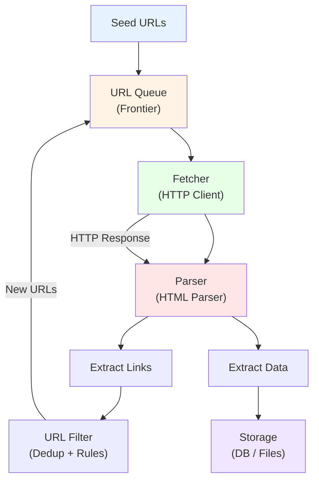
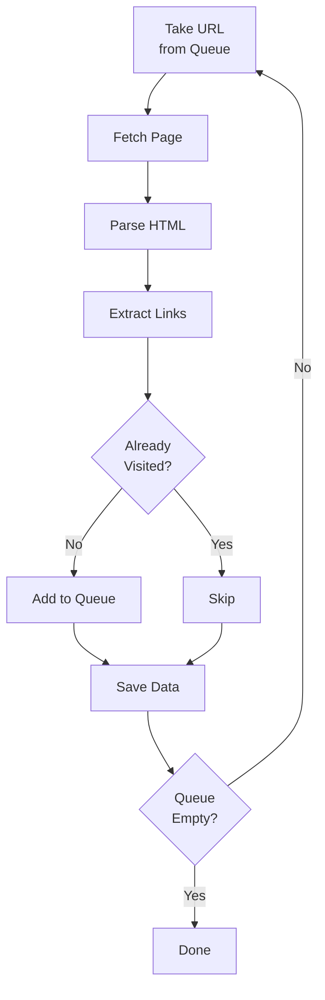
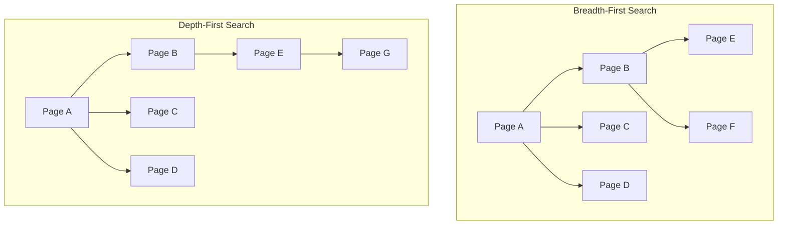
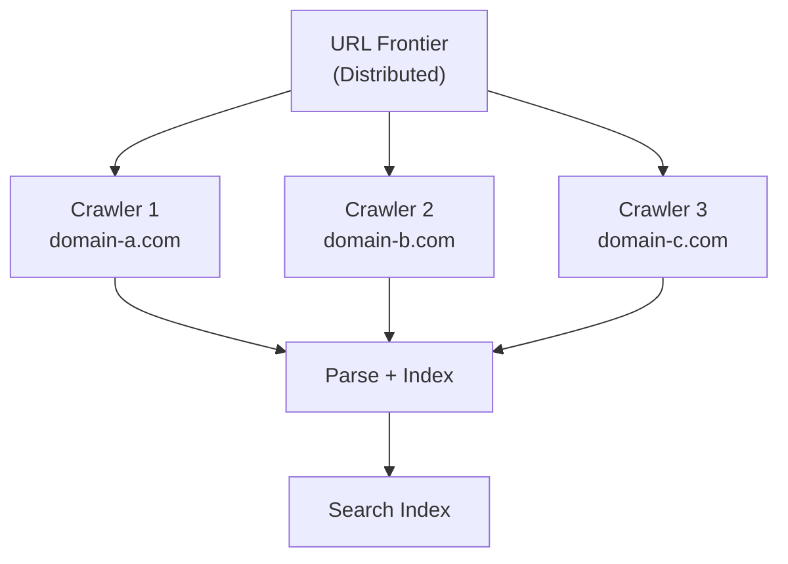
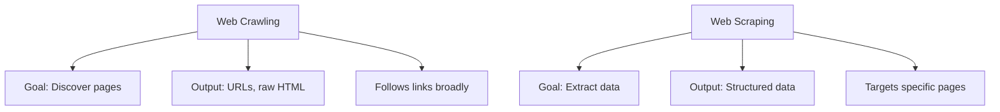

A web crawler is a program that systematically visits web pages and follows links to discover new ones -- like a spider traversing its web. Every search engine you have ever used depends on crawlers to build its index. Every price comparison site, news aggregator, and dataset behind a machine learning model started with a crawler visiting pages, extracting content, and moving on to the next URL. Understanding how crawlers work gives you a foundation for building scrapers, automating research, and appreciating the infrastructure that powers the modern web.

This post breaks down the core principles of web crawling, walks through the architecture of a basic crawler, and builds a working one in Python.

## The Core Idea: Follow the Links

Web crawling starts with a simple observation: web pages link to other web pages. If you start at one page and follow every link you find, you can eventually reach a large portion of the web. The earliest search engines were built on exactly this idea.

A crawler needs three things to get started:

1. **A seed URL** -- the starting point
2. **A way to fetch pages** -- an HTTP client
3. **A way to find links** -- an HTML parser

Everything else -- queues, filters, storage, politeness rules -- builds on top of these basics.

## Crawler Architecture

Before writing any code, it helps to see how the pieces fit together. Here is the high-level architecture of a web crawler.



The crawler starts with seed URLs, adds them to a queue, fetches each page, parses the HTML, extracts links and data, filters out duplicates, and feeds new URLs back into the queue. This loop continues until the queue is empty or the crawler reaches a stopping condition.

## The Crawl Loop

The heart of every crawler is a loop. It works like this:

1. Take a URL from the queue
2. Fetch the page at that URL
3. Parse the HTML response
4. Extract all links from the page
5. Filter out URLs you have already visited
6. Add new URLs to the queue
7. Save any data you want to keep
8. Repeat



This is a breadth-first crawl by default. The queue is FIFO (first in, first out), so the crawler visits all links on the first page before moving to pages discovered from those links.

## Key Components Explained

Each component in the architecture diagram has a specific job. Let's look at them one by one.

### URL Frontier (Queue)

The URL frontier is the list of URLs the crawler plans to visit. It is more than just a simple queue -- in production crawlers, it handles prioritization, politeness scheduling, and domain-level rate limiting.

For a basic crawler, a Python `deque` works fine:

```python
from collections import deque

queue = deque(["https://example.com"])
```

Production crawlers like Googlebot maintain frontiers with billions of URLs, stored on disk with priority queues for important pages and back-off timers for each domain.

### Fetcher (HTTP Client)

The fetcher downloads web pages. It sends an HTTP GET request and receives the HTML response. A basic fetcher uses a library like Python's `requests`:

```python
import requests

def fetch(url):
    try:
        response = requests.get(url, timeout=10)
        response.raise_for_status()
        return response.text
    except requests.RequestException as e:
        print(f"Failed to fetch {url}: {e}")
        return None
```

Key considerations for the fetcher:

- **Timeouts** -- do not wait forever for a response
- **Error handling** -- servers return errors, connections drop
- **User-Agent header** -- identify your crawler
- **Retries** -- transient failures happen

### Parser (HTML Parser)

The parser takes raw HTML and turns it into a structured representation you can query. BeautifulSoup is the standard choice for Python:

```python
from bs4 import BeautifulSoup

def parse(html):
    return BeautifulSoup(html, "html.parser")
```

The parser lets you find specific elements, extract text content, and navigate the document tree.

### Link Extractor

The link extractor finds all the `<a>` tags in a page and pulls out their `href` attributes:

```python
from urllib.parse import urljoin, urlparse

def extract_links(soup, base_url):
    links = set()
    for anchor in soup.find_all("a", href=True):
        href = anchor["href"]
        # Convert relative URLs to absolute
        full_url = urljoin(base_url, href)
        # Only keep HTTP/HTTPS links
        parsed = urlparse(full_url)
        if parsed.scheme in ("http", "https"):
            links.add(full_url)
    return links
```

The `urljoin` call is important. Many links on web pages are relative (like `/about` or `../products`). You need to resolve them against the page's base URL to get a full, usable URL.

### URL Filter

The URL filter prevents the crawler from visiting the same page twice and enforces any domain restrictions:

```python
visited = set()

def should_visit(url, allowed_domain=None):
    if url in visited:
        return False
    if allowed_domain:
        parsed = urlparse(url)
        if parsed.netloc != allowed_domain:
            return False
    return True
```

Without deduplication, a crawler would visit the same pages over and over, wasting time and bandwidth. In the worst case, it would get stuck in an infinite loop.

### Storage

The storage layer saves the data the crawler extracts. For a simple crawler, writing to files or printing to the console works. For production use, a database is more appropriate:

```python
import json

def save_page(url, title, links_found):
    data = {
        "url": url,
        "title": title,
        "links_found": len(links_found),
    }
    print(json.dumps(data, indent=2))
```


<figure>
  
  <figcaption>Crawling is about discovery — scraping is about extraction. <span class="img-credit">Photo by Amol Mande / <a href="https://www.pexels.com" target="_blank" rel="noopener noreferrer">Pexels</a></span></figcaption>
</figure>

## Breadth-First vs Depth-First Crawling

The order in which a crawler visits pages matters. The two basic strategies are breadth-first search (BFS) and depth-first search (DFS).



**Breadth-first** uses a FIFO queue. It visits all pages at the current depth before going deeper. This is the default for most crawlers because it gives broader coverage quickly and is less likely to get trapped in deep link chains.

```python
from collections import deque
queue = deque()  # FIFO -- breadth-first
queue.append(url)
next_url = queue.popleft()  # Take from the front
```

**Depth-first** uses a LIFO stack. It follows one chain of links as deep as it goes before backtracking. This can be useful for crawling specific sections of a site but is more prone to getting stuck.

```python
stack = []  # LIFO -- depth-first
stack.append(url)
next_url = stack.pop()  # Take from the end
```

Most production crawlers use breadth-first or a priority-based approach where important pages (higher PageRank, fresher content) are visited first.

## Politeness: Being a Good Crawler

A crawler that fires requests as fast as possible will get blocked, overload servers, and potentially cause real problems for website operators. Polite crawling is both an ethical requirement and a practical necessity.

### robots.txt

The `robots.txt` file tells crawlers which parts of a site they are allowed to visit. It lives at the root of every domain:

```
https://example.com/robots.txt
```

A typical `robots.txt` looks like this:

```
User-agent: *
Disallow: /admin/
Disallow: /private/
Crawl-delay: 2

User-agent: Googlebot
Allow: /
```

Here is how to check it in Python:

```python
from urllib.robotparser import RobotFileParser

def can_fetch(url, user_agent="MyCrawler"):
    parsed = urlparse(url)
    robots_url = f"{parsed.scheme}://{parsed.netloc}/robots.txt"
    rp = RobotFileParser()
    rp.set_url(robots_url)
    rp.read()
    return rp.can_fetch(user_agent, url)
```

### Crawl Delays

Even if `robots.txt` does not specify a crawl delay, you should add one. A delay of 1-2 seconds between requests to the same domain is a reasonable default:

```python
import time

CRAWL_DELAY = 1  # seconds

# In the crawl loop
time.sleep(CRAWL_DELAY)
```

### Rate Limiting

For crawlers that visit multiple domains, per-domain rate limiting is essential. You do not want to hammer one server with rapid-fire requests while ignoring others:

```python
from collections import defaultdict

last_request_time = defaultdict(float)

def wait_for_domain(url, min_delay=1.0):
    domain = urlparse(url).netloc
    elapsed = time.time() - last_request_time[domain]
    if elapsed < min_delay:
        time.sleep(min_delay - elapsed)
    last_request_time[domain] = time.time()
```

## Building a Simple Crawler in Python

Let's put everything together into a working crawler. This one starts at a seed URL, follows links within the same domain, and prints what it finds:

```python
import requests
from bs4 import BeautifulSoup
from collections import deque
from urllib.parse import urljoin, urlparse
import time

def crawl(seed_url, max_pages=20, delay=1.0):
    """A simple breadth-first web crawler."""
    visited = set()
    queue = deque([seed_url])
    seed_domain = urlparse(seed_url).netloc

    while queue and len(visited) < max_pages:
        url = queue.popleft()

        if url in visited:
            continue

        # Only crawl pages on the same domain
        if urlparse(url).netloc != seed_domain:
            continue

        print(f"Crawling: {url}")

        try:
            response = requests.get(url, timeout=10, headers={
                "User-Agent": "SimpleCrawler/1.0"
            })
            response.raise_for_status()
        except requests.RequestException as e:
            print(f"  Error: {e}")
            continue

        visited.add(url)

        soup = BeautifulSoup(response.text, "html.parser")

        # Extract page title
        title = soup.title.string if soup.title else "No title"
        print(f"  Title: {title}")

        # Extract and queue new links
        links_found = 0
        for anchor in soup.find_all("a", href=True):
            link = urljoin(url, anchor["href"])
            parsed = urlparse(link)
            # Clean the URL -- remove fragments
            clean_link = f"{parsed.scheme}://{parsed.netloc}{parsed.path}"
            if clean_link not in visited and parsed.netloc == seed_domain:
                queue.append(clean_link)
                links_found += 1

        print(f"  New links found: {links_found}")

        # Be polite -- wait between requests
        time.sleep(delay)

    print(f"\nCrawl complete. Visited {len(visited)} pages.")
    return visited

if __name__ == "__main__":
    crawl("https://example.com", max_pages=10)
```

Run it and you get output like this:

```
Crawling: https://example.com
  Title: Example Domain
  New links found: 1

Crawl complete. Visited 1 pages.
```

The `example.com` site is intentionally minimal, so there is not much to crawl. Try it on a site with more pages to see it in action. Just remember to keep `max_pages` reasonable and respect the site's `robots.txt`.


<figure>
  
  <figcaption>A good crawler knows where to go and when to stop. <span class="img-credit">Photo by Саша Алалыкин / <a href="https://www.pexels.com" target="_blank" rel="noopener noreferrer">Pexels</a></span></figcaption>
</figure>

## How Search Engines Crawl at Scale

The simple crawler above works, but search engines like Google operate at a completely different scale. Googlebot crawls billions of pages. Here is what changes when you go from a script to a planetary-scale crawler.

### Distributed Architecture

A single machine cannot crawl the web. Search engines use thousands of machines, each responsible for crawling a subset of domains. A central coordinator distributes work and merges results.



### Prioritization

Not all pages are equally important. Search engine crawlers prioritize pages based on:

- **PageRank** -- pages with more inbound links get crawled more often
- **Freshness** -- news sites get crawled every few minutes, static pages less often
- **Change frequency** -- pages that change frequently get recrawled sooner
- **Sitemap hints** -- `sitemap.xml` tells crawlers which pages exist and when they last changed

### DNS Caching

Every URL fetch requires a DNS lookup. At scale, this becomes a bottleneck. Search engine crawlers maintain their own DNS caches to avoid millions of redundant lookups.

### Content Deduplication

The same content often appears at multiple URLs (with and without `www`, with trailing slashes, with query parameters). Search engines use content hashing (like SimHash) to detect near-duplicate pages and avoid indexing the same content multiple times.

## Common Crawling Challenges

Even simple crawlers run into problems. Here are the most common ones and how to handle them.

### Infinite Loops and Spider Traps

Some websites generate URLs endlessly. A calendar page might let you click "next month" forever, generating a new URL each time. Query parameters can create infinite variations of the same page.

```
https://example.com/calendar?month=1&year=2026
https://example.com/calendar?month=2&year=2026
https://example.com/calendar?month=3&year=2026
... (never ends)
```

**Solutions:**

- Set a maximum crawl depth
- Limit the number of pages per domain
- Normalize URLs by removing unnecessary query parameters
- Track URL patterns and detect repetitive structures

```python
MAX_DEPTH = 5

# Track depth alongside URLs
queue = deque([(seed_url, 0)])  # (url, depth)

while queue:
    url, depth = queue.popleft()
    if depth > MAX_DEPTH:
        continue
    # ... crawl the page ...
    for link in new_links:
        queue.append((link, depth + 1))
```

### Duplicate Content

Different URLs can point to the same content. These are all potentially the same page:

```
https://example.com/page
https://example.com/page/
https://www.example.com/page
https://example.com/page?ref=twitter
```

Normalize URLs before adding them to the visited set:

```python
def normalize_url(url):
    parsed = urlparse(url)
    # Lowercase the scheme and domain
    scheme = parsed.scheme.lower()
    netloc = parsed.netloc.lower()
    # Remove trailing slash from path
    path = parsed.path.rstrip("/") or "/"
    # Remove common tracking parameters
    return f"{scheme}://{netloc}{path}"
```

### JavaScript-Rendered Content

Many modern websites render content with JavaScript. A simple HTTP client only gets the initial HTML, which may be mostly empty. If a page requires JavaScript to show its content, you need a headless browser:

```python
from playwright.sync_api import sync_playwright

def fetch_with_browser(url):
    with sync_playwright() as p:
        browser = p.chromium.launch(headless=True)
        page = browser.new_page()
        page.goto(url, wait_until="networkidle")
        html = page.content()
        browser.close()
        return html
```

This is much slower than plain HTTP requests, so most crawlers use it only when necessary.

## Scrapy: A Production Crawler Framework

Writing a crawler from scratch is educational, but for production use, frameworks handle the hard parts for you. Scrapy is the most popular Python crawling framework, and it implements every concept we have discussed. Modern AI-powered crawlers like [Crawl4AI](/posts/crawl4ai-v08-crash-recovery-prefetch-mode-and-whats-new/) are pushing these concepts even further with crash recovery and prefetch modes.

Here is a Scrapy spider that does the same thing as our simple crawler:

```python
import scrapy

class SimpleSpider(scrapy.Spider):
    name = "simple"
    start_urls = ["https://example.com"]
    allowed_domains = ["example.com"]

    custom_settings = {
        "DOWNLOAD_DELAY": 1,          # Politeness delay
        "DEPTH_LIMIT": 5,             # Maximum crawl depth
        "CLOSESPIDER_PAGECOUNT": 20,  # Stop after 20 pages
        "ROBOTSTXT_OBEY": True,       # Respect robots.txt
    }

    def parse(self, response):
        # Extract data
        yield {
            "url": response.url,
            "title": response.css("title::text").get(),
        }

        # Follow links
        for href in response.css("a::attr(href)").getall():
            yield response.follow(href, callback=self.parse)
```

Scrapy gives you all of this out of the box:

| Feature | Simple Crawler | Scrapy |
|---------|---------------|--------|
| URL deduplication | Manual `set()` | Built-in filter |
| robots.txt | Manual parsing | Automatic |
| Crawl delay | `time.sleep()` | `DOWNLOAD_DELAY` setting |
| Depth limiting | Manual tracking | `DEPTH_LIMIT` setting |
| Concurrent requests | None (sequential) | Async with Twisted |
| Data export | Manual | CSV, JSON, XML pipelines |
| Error handling | Try/except | Retry middleware |
| Link following | Manual extraction | `response.follow()` |

Run a Scrapy spider with:

```bash
scrapy crawl simple -o results.json
```

## Crawling vs Scraping

These terms are often used interchangeably, but they describe different activities.

**Crawling** is about discovery. A crawler navigates from page to page, following links to find new URLs. Its primary job is to map out what exists. The output of a crawler is a list of URLs or a collection of raw HTML pages.

**Scraping** is about extraction. A scraper targets specific pages and pulls out structured data -- product prices, article text, contact information. Its primary job is to turn unstructured HTML into structured data.



In practice, most projects combine both. You crawl to discover pages, then scrape the pages you care about. Scrapy is designed for exactly this workflow -- the `parse` method can both extract data and follow links.

A typical pipeline looks like this:

```python
class ProductSpider(scrapy.Spider):
    name = "products"
    start_urls = ["https://shop.example.com/"]

    def parse(self, response):
        # Crawl: follow category links
        for link in response.css("a.category-link::attr(href)").getall():
            yield response.follow(link, callback=self.parse)

        # Crawl: follow product links, switch to scraping
        for link in response.css("a.product-link::attr(href)").getall():
            yield response.follow(link, callback=self.parse_product)

    def parse_product(self, response):
        # Scrape: extract structured data from product page
        yield {
            "name": response.css("h1.product-name::text").get(),
            "price": response.css("span.price::text").get(),
            "description": response.css("div.description::text").get(),
            "url": response.url,
        }
```

## What to Remember

Web crawling boils down to a loop: fetch, parse, extract links, repeat. Every crawler from a 30-line Python script to Googlebot follows this same pattern. The differences are in scale, politeness, and how intelligently the crawler decides what to visit next.

If you are building your first crawler:

- Start with the simple Python crawler above and modify it for your use case
- Always [respect `robots.txt`](/posts/is-robots-txt-legally-binding-scraping-law-explained/) and add crawl delays
- Use URL normalization and deduplication from the start
- Set hard limits on depth and page count to avoid runaway crawls
- Move to Scrapy when you outgrow your custom code

Understanding these fundamentals makes every other web scraping concept easier to grasp. Whether you end up using [Scrapy, Playwright, or a custom solution](/posts/playwright-vs-puppeteer-vs-selenium-vs-scrapy-2026-mega-comparison/), the principles stay the same.
