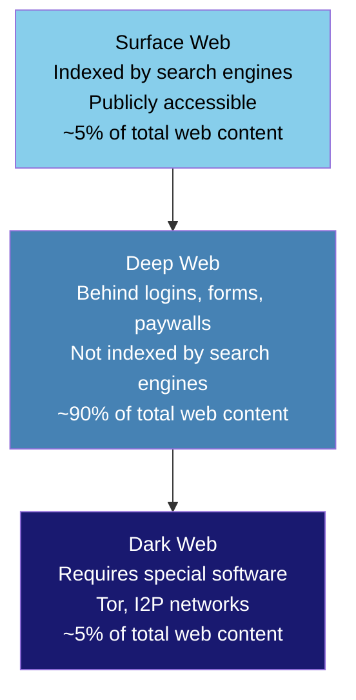
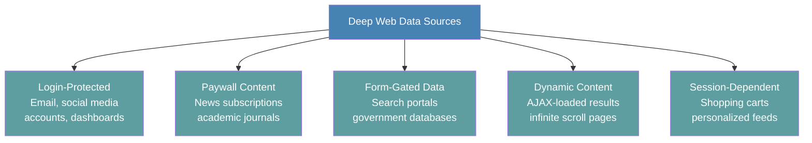
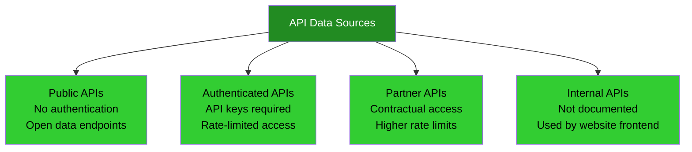
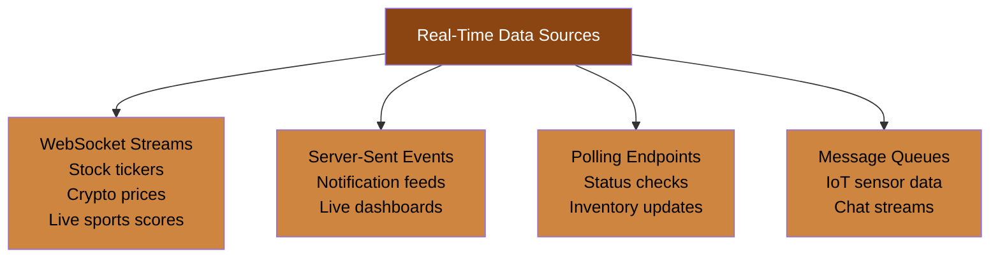
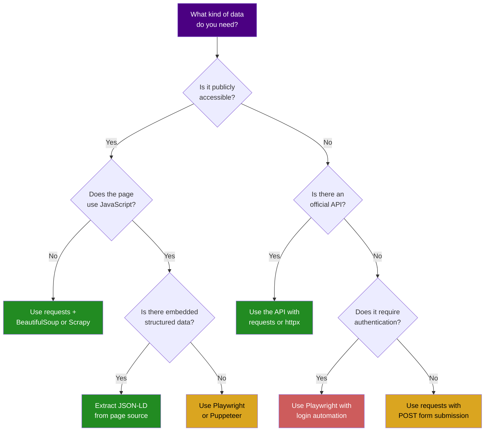

The web is not a single flat layer of pages waiting to be scraped. It is more like a series of concentric rings, each with different access requirements, different levels of structure, and different tools needed to extract data from them. Before you write a single line of scraping code, understanding these layers saves you from picking the wrong approach for the data you actually need. A Wikipedia article and a bank statement are both "on the web," but the techniques for accessing them have almost nothing in common. This post maps out the major types of web data sources, explains what makes each one different, and helps you figure out which approach fits your project.

Think of this as the lay of the land before you start building. Whether you are a data analyst trying to pull public statistics, a researcher collecting structured records, or a developer building a data pipeline, knowing what kind of source you are dealing with determines everything that follows.

## The Iceberg Model of Web Data

The most useful mental model for web data is the iceberg. What you see from the surface -- the pages Google indexes and returns in search results -- is only a small fraction of what actually exists online. Below that sits the deep web: everything behind logins, paywalls, search forms, and authentication barriers. And at the very bottom, disconnected from standard browsers entirely, sits the dark web.

The percentages are rough estimates, but the proportions are directionally correct. Most people spend their entire internet lives on the surface web and never think about the vast amount of data sitting just below it. For anyone working with web data professionally, the deep web is where the most valuable and hardest-to-access information lives.

Each layer has different characteristics that affect how you approach data collection.

## Surface Web: The Easy Layer

The surface web consists of all publicly accessible pages that search engines can find and index. If you can reach it by typing a URL into your browser without logging in, and if Google or Bing can crawl it, it belongs to the surface web.

This is the easiest layer to scrape. Pages are designed to be found, and the data on them is intended for public consumption. The technical barriers are low.

### What lives here

- **Reference sites**: Wikipedia, public government data portals, educational institution pages
- **News and media**: Online newspapers, blogs, press releases, public archives
- **E-commerce listings**: Product pages on Amazon, eBay, and retail sites (the public-facing catalog, not your account details)
- **Public directories**: Business listings, phone directories, open data catalogs
- **Forums and communities**: Reddit threads, Stack Overflow questions, public discussion boards
- **Job boards**: Public job listings on Indeed, LinkedIn (public pages), Glassdoor

### How to access it

Surface web scraping is the most straightforward form of data collection. The data is right there in the HTML.

- **HTTP libraries**: Python's `requests` or `httpx` fetch the raw HTML. This is the fastest and most efficient approach when pages do not rely on JavaScript rendering. For a deeper look at when to use each, see [Python requests vs Selenium](/posts/python-requests-vs-selenium-speed-performance-comparison/).
- **HTML parsers**: `BeautifulSoup` and `lxml` parse the downloaded HTML and let you extract specific elements using CSS selectors or XPath.
- **Crawling frameworks**: `Scrapy` handles the full pipeline -- following links, managing request queues, respecting rate limits, and exporting structured data.
- **Simple HTTP clients**: `curl` or `wget` for quick one-off downloads.

The surface web is where most beginners start, and for good reason. The feedback loop is fast: make a request, look at the HTML, write a selector, extract the data. No authentication, no JavaScript rendering, no session management.

### The catch

Even on the surface web, things are not always simple. Many modern websites render their content with JavaScript, which means the HTML you get from a plain HTTP request may be an empty shell. Anti-bot protections like Cloudflare, DataDome, and PerimeterX can block automated requests even on public pages. And rate limiting can throttle or ban your IP if you send too many requests too quickly.

Still, the surface web remains the lowest-friction starting point for any data collection project.

## Deep Web: The Big Layer

The deep web is everything that search engines cannot or do not index. This is not because the content is illegal or hidden intentionally -- it is simply behind some kind of access barrier. Your email inbox is deep web. Your bank account dashboard is deep web. A university library's journal search portal is deep web.

### What lives here

- **Email and messaging**: Gmail inboxes, Slack workspaces, internal messaging systems
- **Financial accounts**: Bank statements, trading platforms, payment histories
- **Subscription content**: Paywalled news articles, premium research databases, streaming platform catalogs
- **Government databases**: Court records, patent filings, property records (often behind search forms)
- **Enterprise applications**: CRM systems, internal dashboards, HR platforms
- **Academic resources**: Journal article databases, library catalogs with full-text search

### How to access it

Deep web data collection is harder because you need to authenticate and maintain sessions. Simple HTTP requests are usually not enough.

- **Browser automation**: `Selenium`, `Playwright`, and `Puppeteer` control a real browser, which means they can fill in login forms, click buttons, wait for JavaScript to render content, and maintain session cookies automatically.
- **Session management with HTTP**: If you understand the authentication flow, you can sometimes replicate it with `requests` by capturing cookies and tokens. This is faster than browser automation but requires more reverse engineering.
- **Headless browsers**: Running browsers without a visible window (`--headless` mode) lets you automate deep web access at scale without the overhead of a GUI.

### Important considerations

Scraping the deep web raises additional ethical and legal questions. Just because you have login credentials does not mean you have the right to scrape the data behind them at scale. Terms of service often explicitly prohibit automated access. The Computer Fraud and Abuse Act (CFAA) and similar laws in other jurisdictions can apply when you access systems in ways that go beyond your authorized use.

Always read the terms of service. Always consider whether an official API exists before resorting to scraping. And always be aware that scraping data you are personally authorized to view is different from scraping data that belongs to other users.

<figure>
  
  <figcaption>Web scraping is the bridge between the visible web and usable data. Photo by Google DeepMind / <a href="https://www.pexels.com" target="_blank" rel="noopener noreferrer">Pexels</a></figcaption>
</figure>

## APIs: The Structured Layer

APIs (Application Programming Interfaces) are purpose-built endpoints that return data in structured formats like JSON or XML. Unlike web pages, which are designed for humans to read in a browser, APIs are designed for machines to consume directly. This makes them the cleanest and most reliable data source when they are available.

### Public APIs

These require no authentication and are freely available to anyone. They are the gold standard for data collection because the provider explicitly wants you to access the data this way.

- **Weather data**: OpenWeatherMap, WeatherAPI
- **Government data**: data.gov endpoints, census APIs, SEC EDGAR
- **Reference data**: Wikipedia API, Open Library API
- **Geolocation**: OpenStreetMap Nominatim, IP geolocation services

### Authenticated APIs

These require you to register for an API key, and they typically enforce rate limits and usage quotas. Many offer free tiers with limited requests per day and paid tiers for higher volumes.

- **Social media**: Twitter/X API, Reddit API, YouTube Data API
- **Financial data**: Alpha Vantage, Polygon.io, Yahoo Finance
- **E-commerce**: Amazon Product Advertising API, eBay Browse API
- **Maps and places**: Google Maps API, Yelp Fusion API

### Private and internal APIs

Many websites use internal APIs to load data dynamically on their pages. These are not documented or officially supported for third-party use, but they can be discovered by inspecting network traffic in your browser's developer tools. The data comes back as clean JSON, which is far easier to parse than HTML.

Using undocumented APIs is a gray area. The data format can change without notice, breaking your scraper. And the provider may consider it unauthorized access if you bypass their intended interface.

### Tools for APIs

- **HTTP libraries**: `requests`, `httpx`, `aiohttp` in Python. `fetch`, `axios` in JavaScript. No HTML parsing needed -- you get structured data directly.
- **API clients**: Many popular APIs have official client libraries that handle authentication, pagination, and error handling for you.
- **API testing tools**: Postman, Insomnia, or `curl` for exploring and debugging API endpoints.

The biggest advantage of APIs is reliability. When a website redesigns its HTML, every scraper targeting that site breaks. When an API changes, the provider typically versions the endpoints and gives advance notice. Your data pipeline becomes much more maintainable.

## Databases Exposed as Web Interfaces

A significant amount of valuable data lives in databases that are accessible through web-based search interfaces but are not crawlable in the traditional sense. These are common in government, legal, academic, and industrial contexts.

### How they work

You cannot simply request a URL and get data back. Instead, you need to:

1. Navigate to a search form
2. Fill in query parameters
3. Submit the form
4. Parse the results page
5. Handle pagination if there are multiple pages of results

Examples include court record search systems, patent databases, property tax records, corporate filing registries, and academic paper search engines.

### Tools for form-based databases

- **HTTP with POST requests**: If you can inspect the form submission and replicate it with `requests`, this is the fastest approach. Look at the form action URL, the field names, and the request method (usually POST).
- **Browser automation**: When the form relies on JavaScript, CAPTCHA solving, or complex multi-step workflows, `Playwright` or `Selenium` can automate the entire interaction.
- **Specialized scrapers**: Some databases have known quirks, and the community has built dedicated tools for them (e.g., PACER for US federal court records).

### Challenges

Form-based databases often have anti-automation measures. CAPTCHAs, session tokens that expire quickly, and rate limits that are lower than what you would see on a public website. They may also return results in formats that are hard to parse, like PDFs or scanned document images.

The key insight is that form-based databases are fundamentally different from web pages. You are not scraping a page -- you are querying a database through a web interface. Your approach should reflect that distinction. For practical techniques on handling these interactions, see our guide on [how to automate web form filling](/posts/how-to-automate-web-form-filling-complete-guide/).

<figure>
  
  <figcaption>The web is vast, but the right tools make it navigable. Photo by Matheus Bertelli / <a href="https://www.pexels.com" target="_blank" rel="noopener noreferrer">Pexels</a></figcaption>
</figure>

## Real-Time Data: Streams and Feeds

Not all web data sits still waiting to be fetched. Some data flows continuously in real time, and collecting it requires a different architectural approach.

### WebSocket streams

WebSockets maintain a persistent, bidirectional connection between client and server. Instead of requesting data each time you want an update, the server pushes new data to you as it becomes available. Financial data platforms, cryptocurrency exchanges, and live sports scoreboards commonly use WebSockets.

Collecting WebSocket data requires keeping a connection open and processing messages as they arrive. Python's `websockets` library and JavaScript's native WebSocket API handle this. For more complex scenarios, `Playwright` can intercept WebSocket frames through its network monitoring capabilities.

### Server-Sent Events (SSE)

SSE is a simpler, one-directional version of WebSockets. The server pushes updates to the client over a standard HTTP connection. It is commonly used for live notification feeds, dashboard updates, and progress indicators.

### Polling

When real-time streaming is not available, you can approximate it by polling an endpoint at regular intervals. This is less efficient than WebSockets but simpler to implement and more widely supported. The trade-off is between data freshness (how often you poll) and resource usage (how many requests you make).

### Considerations for real-time data

Real-time data collection requires thinking about storage differently. You are not scraping a static snapshot -- you are recording a stream. This means you need to consider time-series databases, message queues, or append-only logs rather than simple CSV files or relational tables.

You also need to handle connection drops, reconnection logic, and deduplication. Real-time data pipelines are inherently more complex than batch scraping jobs.

## Structured Data Embedded in Pages

Here is a source that many scrapers overlook entirely: structured data that website owners deliberately embed in their HTML for search engines and other machines to consume. This is often the easiest and most reliable data source available, and it requires almost no parsing effort.

### JSON-LD

JSON-LD (JavaScript Object Notation for Linked Data) is the most common format. It appears as a `<script type="application/ld+json">` tag in the page's HTML. Inside that tag is a clean JSON object describing the page's content using standardized schemas from schema.org.

A product page might include JSON-LD with the product name, price, availability, rating, and review count -- all neatly structured without you having to write a single CSS selector.

### Schema.org and microdata

Schema.org provides a standardized vocabulary for describing web content. It can be embedded as JSON-LD (most common), microdata (HTML attributes), or RDFa. The schema covers products, recipes, events, organizations, people, reviews, job postings, and dozens of other content types.

### Why this matters for scrapers

When structured data is present, you get several advantages:

- **No fragile selectors**: The data is already in a structured format. No CSS selectors to break when the site redesigns.
- **Standardized fields**: Product prices, ratings, and availability follow consistent naming conventions across different websites.
- **High reliability**: Site owners maintain this data because it directly affects their search engine rankings. If it breaks, their SEO suffers, so they fix it quickly.
- **Easy extraction**: Parse the HTML, find `<script type="application/ld+json">` tags, and parse the JSON inside them. That is the entire pipeline.

### The limitation

Not every piece of data you want will be in the structured data. It typically covers the main entity on a page (a product, an article, a recipe) but not secondary details, related items, or navigational elements. Think of it as a shortcut for the most important data points, not a replacement for full scraping.

## Choosing Your Approach

The type of data source you are dealing with should drive your choice of tools and techniques. Here is a decision framework that maps common scenarios to recommended approaches.

### General principles

1. **Always check for an API first.** If the data provider offers a public or authenticated API, use it. APIs are more reliable, more efficient, and less likely to get you blocked or into legal trouble.

2. **Check for structured data second.** Before writing CSS selectors, view the page source and search for `application/ld+json`. You might find exactly what you need already structured.

3. **Use the lightest tool that works.** If plain HTTP requests can fetch the data, do not spin up a browser. Browsers are slower, use more memory, and are harder to scale. Escalate to browser automation only when you need JavaScript rendering or complex interaction.

4. **Respect the source.** Rate-limit your requests. Identify your scraper with a meaningful user agent. Follow robots.txt directives. And always consider whether the data owner would consider your access appropriate.

5. **Plan for the data type.** Static pages need snapshot storage. Real-time streams need time-series infrastructure. Form-based databases need query strategies. Match your pipeline architecture to the data source.

## Summary of Data Source Types

Here is a quick reference for the major categories:

| Data Source | Access Difficulty | Data Quality | Best Tools |
|---|---|---|---|
| Surface web (static) | Low | Variable | requests, BeautifulSoup, Scrapy |
| Surface web (JS-rendered) | Medium | Variable | Playwright, Puppeteer |
| Deep web (login-required) | High | Often high | Playwright, Selenium |
| Public APIs | Low | High | requests, httpx |
| Authenticated APIs | Low-Medium | High | requests with API keys |
| Form-based databases | Medium-High | High | requests (POST), Playwright |
| Real-time streams | Medium | High (time-sensitive) | websockets, Playwright |
| Embedded structured data | Low | High | BeautifulSoup (JSON-LD parsing) |

The web is not one thing. It is a stack of different data sources, each with its own access patterns, tools, and trade-offs. The most effective data practitioners are not the ones who master a single tool -- they are the ones who understand the landscape well enough to pick the right approach for each source they encounter.

Before you start any data collection project, take ten minutes to understand what kind of source you are dealing with. That small investment in reconnaissance consistently saves hours of wasted effort on the wrong approach.
