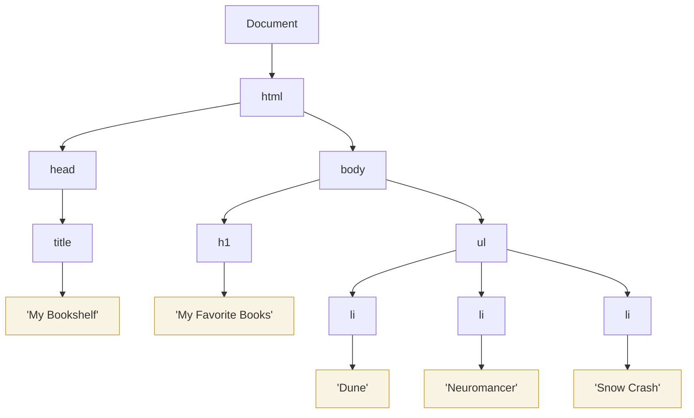
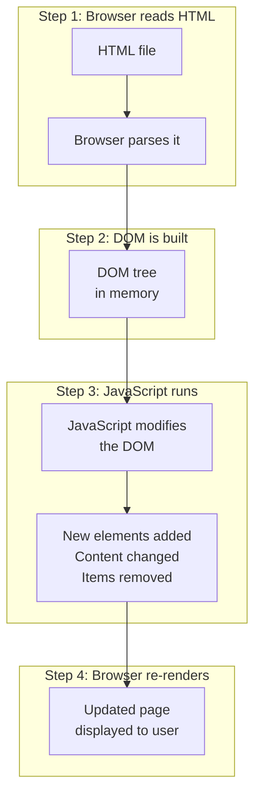
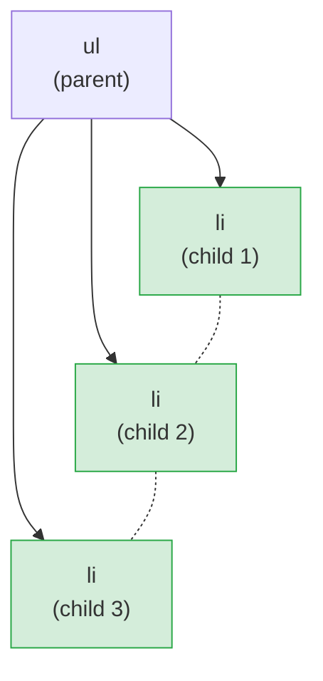
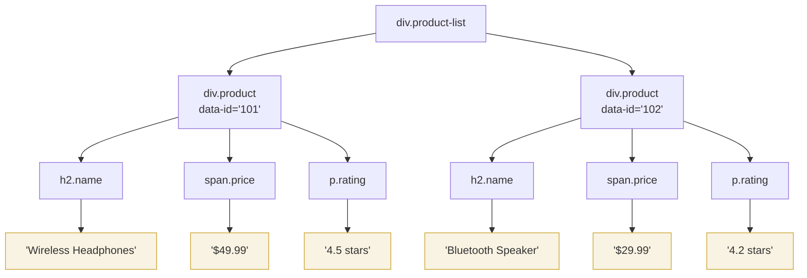
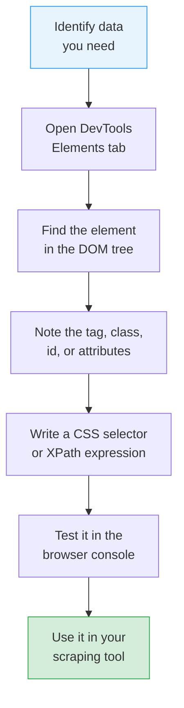

DOM stands for **Document Object Model**. If you have ever wondered what is actually happening when your browser loads a webpage, the DOM is the answer. It is the internal structure your browser builds from the raw HTML code so it can display, organize, and let you interact with every piece of content on the page. Understanding the DOM does not require a computer science degree. You just need the right mental model, and that is what this post is for.

## The Recipe Analogy

Think of HTML as a recipe written on a piece of paper. It lists ingredients and steps, but it is not food you can eat. When you hand that recipe to a chef (your browser), the chef reads it and produces an actual dish (the DOM). The dish might look a little different from the recipe -- maybe the chef added a garnish, fixed a missing step, or rearranged the plating. The point is that the recipe and the dish are related but not identical.

HTML is the recipe. The DOM is the dish.

When you "view source" on a webpage, you see the recipe. When you open Chrome DevTools and look at the Elements tab, you see the dish -- the DOM that the browser actually built and is working with right now.

## From HTML to DOM Tree

Here is a simple HTML page:

```html
<!DOCTYPE html>
<html>
  <head>
    <title>My Bookshelf</title>
  </head>
  <body>
    <h1>My Favorite Books</h1>
    <ul>
      <li>Dune</li>
      <li>Neuromancer</li>
      <li>Snow Crash</li>
    </ul>
  </body>
</html>
```

When the browser reads this HTML, it does not just display it as text. It builds a tree structure in memory. Every tag becomes a **node** in the tree, and the nesting of tags determines the parent-child relationships.

Here is what that tree looks like:



The yellow nodes are **text nodes** -- they hold the actual readable content. Everything else is an **element node** that represents an HTML tag. This tree is the DOM.

## Why Does the DOM Matter?

If you just want to read a webpage, you do not need to think about the DOM at all. But if you want to **extract data** from a webpage (web scraping), or understand why a page behaves a certain way, the DOM becomes essential.

Every piece of data on a webpage lives somewhere in this tree. A product name, a price, a review, a link -- each one is a node (or inside a node) in the DOM tree. To extract it programmatically, you need to describe its location in the tree.

Think of it like giving directions to someone in a building:

- "Go to the second floor (body), find the third room on the left (ul), and grab the first item on the shelf (first li)."

That is essentially what scraping tools do. They navigate the DOM tree to find exactly the data you need.

## The DOM Is Live

Here is something that surprises many beginners: the DOM is not a static snapshot. It is a **live** structure that changes in real time.

When a page first loads, the browser builds the DOM from the HTML. But then JavaScript can modify it -- adding new elements, removing others, changing text content, or rearranging the tree entirely.



This is why scraping can be tricky. If you download the raw HTML from a server (like a simple HTTP request), you get the recipe -- step 1. But the actual data you see in your browser might only appear after JavaScript runs in steps 3 and 4. The HTML source and the live DOM can be completely different.

A practical example: imagine an online store. The HTML file might contain an empty `<div id="products"></div>`. JavaScript then fetches product data from an API and injects it into that div. If you scrape the raw HTML, you get an empty div. If you scrape the live DOM (using a browser automation tool), you get all the products.

## How to See the DOM Yourself

You do not need any special tools. Every modern browser has built-in developer tools that show you the live DOM.

**In Chrome or Edge:**

1. Open any webpage
2. Right-click on any element and select "Inspect"
3. The Elements tab opens, showing the DOM tree

**In Firefox:**

1. Open any webpage
2. Right-click and select "Inspect Element"
3. The Inspector tab shows the DOM tree

What you see in the Elements tab is **not** the original HTML source. It is the live DOM. If JavaScript has added or changed elements, you will see those changes reflected here. This is one of the most important distinctions for anyone doing web scraping.

Try this experiment: open a website, look at the Elements tab, then open "View Page Source" (Ctrl+U or Cmd+U). Compare the two. On JavaScript-heavy sites, they can look very different.

## DOM Vocabulary: The Key Terms

You do not need to memorize a textbook, but knowing a handful of terms will make everything else click.

**Nodes** are the building blocks of the DOM. Everything in the tree is a node.

**Element nodes** represent HTML tags like `<div>`, `<p>`, `<a>`, or `<h1>`. These are the structural pieces.

**Text nodes** hold the actual text content inside elements. In `<p>Hello</p>`, the `<p>` is an element node and "Hello" is a text node inside it.

**Attributes** are the extra information attached to elements. In `<a href="https://example.com" class="nav-link">`, the `href` and `class` are attributes.

**Parent and child** describe the relationships between nodes. If a `<ul>` contains three `<li>` elements, the `<ul>` is the parent and each `<li>` is a child.

**Siblings** are nodes that share the same parent. Those three `<li>` elements are siblings of each other.

Here is how those relationships look in a diagram:



The three `li` elements are children of `ul` and siblings of each other. The dashed lines indicate sibling relationships.

## A Real-World Example: Navigating the Tree

Suppose you are looking at a product listing page. The HTML might look like this:

```html
<div class="product-list">
  <div class="product" data-id="101">
    <h2 class="name">Wireless Headphones</h2>
    <span class="price">$49.99</span>
    <p class="rating">4.5 stars</p>
  </div>
  <div class="product" data-id="102">
    <h2 class="name">Bluetooth Speaker</h2>
    <span class="price">$29.99</span>
    <p class="rating">4.2 stars</p>
  </div>
</div>
```

The browser turns this into the following DOM tree:



To get the price of the second product, you need to navigate: start at `div.product-list`, go to the second `div.product`, find the `span.price` inside it, and read the text node. That navigation is exactly what scraping tools automate for you.


<figure>
  
  <figcaption>The DOM is a living tree — it grows and changes as JavaScript runs. <span class="img-credit">Photo by breakermaximus / <a href="https://www.pexels.com" target="_blank" rel="noopener noreferrer">Pexels</a></span></figcaption>
</figure>

## DOM vs HTML Source: They Can Be Different

This point is worth repeating because it trips up beginners constantly.

The **HTML source** is what the server sends to your browser. You can see it with "View Page Source." It is static text that never changes once the page is loaded.

The **DOM** is what the browser builds from that HTML and then keeps updating as JavaScript runs. You see it in the Elements tab of DevTools.

Here are common reasons the two differ:

| Situation | HTML Source | Live DOM |
|---|---|---|
| JavaScript adds content | Empty container | Container full of data |
| Browser fixes bad HTML | Missing closing tags | Tags properly closed |
| Single-page app (SPA) | Minimal skeleton | Full page content |
| Lazy-loaded images | Placeholder src | Real image src |
| Dynamic forms | Empty dropdowns | Populated options |

If you are scraping and getting empty results, this mismatch is often the reason. You are reading the recipe (HTML source) instead of inspecting the dish (live DOM).

## How Scraping Tools Navigate the DOM

Scraping tools use two main languages to describe locations in the DOM tree: **CSS selectors** and **XPath**.

**CSS selectors** use the same syntax you might have seen in web stylesheets:

```css
/* Select all elements with class "price" */
.price

/* Select the h2 inside a div with class "product" */
div.product h2

/* Select the element with id "main-content" */
#main-content

/* Select the second li in a ul */
ul li:nth-child(2)
```

**XPath** uses a path-like syntax similar to file system paths:

```xpath
//span[@class='price']
//div[@class='product']/h2
//*[@id='main-content']
//ul/li[2]
```

Both are ways to say "go to this specific spot in the DOM tree and get me the data there." They are different languages for the same job. CSS selectors are generally easier to read. XPath is more powerful for complex navigation.

## Trying It Yourself: Browser Console

You can interact with the DOM right now using your browser's console. Open any webpage, press F12 (or Cmd+Option+I on Mac), and click the Console tab.

Try these commands:

```javascript
// Get the page title
document.title

// Find the first h1 element
document.querySelector('h1')

// Get the text content of the first h1
document.querySelector('h1').textContent

// Find all links on the page
document.querySelectorAll('a')

// Count how many links exist
document.querySelectorAll('a').length

// Get the href of the first link
document.querySelector('a').href

// Find all elements with a specific class
document.querySelectorAll('.product')
```

Each of these commands navigates the DOM tree and pulls out specific data. The `querySelector` method uses CSS selectors to find elements. The `textContent` property gets the text inside an element.

This is fundamentally what scraping tools do, just automated and at scale. When you write a scraper in Python or JavaScript, you are telling the computer to do exactly what you just did in the console -- navigate the tree, find elements, and read their content.

## Modifying the DOM Live

To really understand that the DOM is live, try changing it yourself. In the console, run:

```javascript
// Change the text of the first heading
document.querySelector('h1').textContent = 'I changed this!'

// Add a new paragraph to the page
let newP = document.createElement('p')
newP.textContent = 'This paragraph was added by JavaScript.'
document.body.appendChild(newP)

// Remove an element from the page
let firstImage = document.querySelector('img')
if (firstImage) firstImage.remove()
```

The page updates instantly. No page reload required. You just modified the DOM, and the browser immediately reflected those changes on screen. This is exactly how modern websites work -- JavaScript constantly modifies the DOM to create dynamic, interactive experiences.

And this is exactly why static HTML scraping (downloading the raw HTML without running JavaScript) misses so much data on modern websites. Some features like the [Shadow DOM](/posts/shadow-dom-the-silent-killer-of-ai-web-scraping/) make this problem even worse by hiding elements from standard DOM queries entirely.

## Why This Matters for Scraping

Understanding the DOM gives you a clear mental model for web scraping. Instead of thinking "I need to grab text from a webpage" (which is vague), you can think "I need to navigate to this specific node in the DOM tree and extract its text content" (which is precise).

Here is how that mental model helps:

**Finding data:** You know that every visible piece of content on a webpage is a node in the DOM tree. If you can see it, you can find it in the tree.

**Writing selectors:** CSS selectors and XPath are just ways of describing paths through the tree. Once you understand parent-child relationships, writing selectors becomes intuitive.

**Debugging empty results:** When your scraper returns nothing, you know to check whether the data exists in the HTML source (the recipe) or only in the live DOM (the dish). That tells you whether you need a simple HTTP request or a full browser automation tool.

**Handling dynamic content:** You understand that JavaScript modifies the DOM after the initial HTML loads, so you know to wait for the DOM to settle before extracting data.



This workflow applies no matter what scraping tool you use -- BeautifulSoup, Scrapy, Selenium, Playwright, or any other. The DOM is the common foundation underneath all of them. For more advanced extraction, [LLM-based tools](/posts/best-llm-structured-data-extraction-html-2026/) can now navigate the DOM and pull structured data automatically.

## Quick Reference

Here is a summary of the key concepts covered:

| Concept | Plain English |
|---|---|
| DOM | The tree structure the browser builds from HTML |
| Node | Any single item in the tree |
| Element | A node that represents an HTML tag |
| Text node | A node that holds readable text |
| Attribute | Extra info on an element (class, id, href) |
| Parent | A node that contains other nodes |
| Child | A node inside a parent node |
| Sibling | Nodes at the same level with the same parent |
| CSS selector | A pattern that finds elements in the DOM |
| XPath | A path-based language for navigating the DOM |
| Live DOM | The current state of the tree, including JS changes |
| HTML source | The original code sent by the server |

The DOM is not complicated. It is a tree. Every webpage is a tree. Once you see it that way, scraping becomes a matter of climbing to the right branch and picking the data you need.
