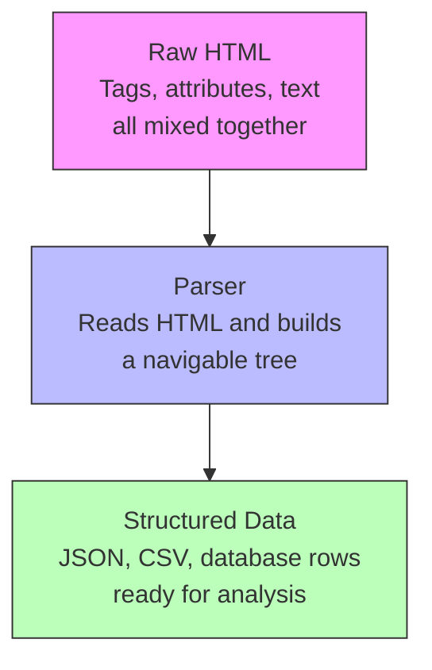
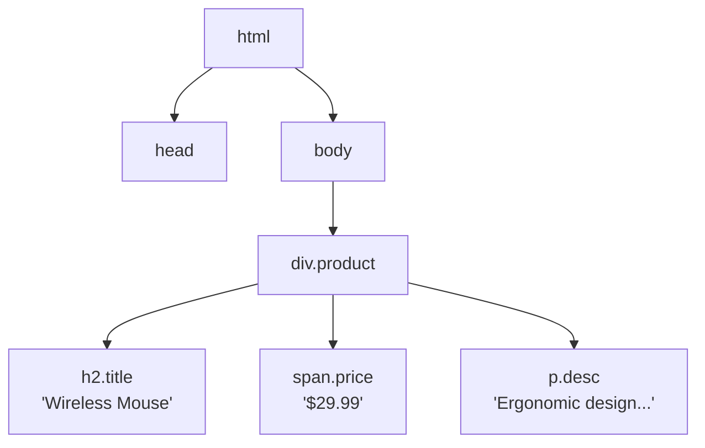
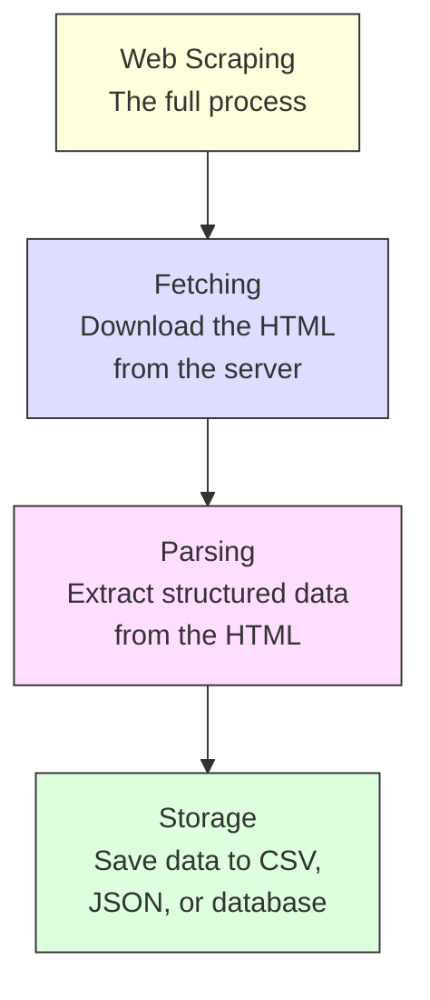

Web parsing is the process of taking raw HTML and extracting meaningful, structured data from it. Every time you visit a website, your browser receives a wall of HTML markup -- tags, attributes, nested elements, inline styles, and scripts all tangled together. That markup is designed for browsers to render into something visual. It is not designed for you to analyze in a spreadsheet, feed into a database, or run calculations on. Parsing bridges that gap. It reads the raw markup, understands its structure, and pulls out the specific pieces of information you actually care about -- product names, prices, dates, links, whatever the page contains. If you have ever copied data from a website and pasted it into a spreadsheet by hand, you have done parsing manually. The goal of web parsing is to automate that process with code.

This post covers what parsing is, how it works under the hood, and how to do it in Python with real code examples.

## The Parsing Pipeline

At the highest level, parsing fits into a simple three-step flow:



You start with raw HTML that looks like this:

```html
<div class="product">
  <h2 class="title">Wireless Mouse</h2>
  <span class="price">$29.99</span>
  <p class="desc">Ergonomic design with 2.4GHz connectivity</p>
</div>
```

And you end with structured data like this:

```json
{
  "name": "Wireless Mouse",
  "price": 29.99,
  "description": "Ergonomic design with 2.4GHz connectivity"
}
```

The parser is the piece in the middle that makes this transformation possible.

## Why You Need Parsing

HTML is a document format, not a data format. It tells browsers how to display content -- what is a heading, what is a paragraph, where images go, how elements are styled. That is great for rendering a web page, but terrible for data analysis.

Consider this real-world scenario. An online store has 500 products. Each product page contains the product name, price, availability, rating, and description buried inside nested `div` tags, wrapped in classes named things like `product-card__price-wrapper`. You cannot do anything useful with that markup directly. You need to:

1. Identify which HTML elements contain the data you want
2. Extract the text or attribute values from those elements
3. Clean and format the extracted values
4. Store them in a usable structure

That is what parsing does. Without it, you are staring at thousands of lines of angle brackets and class names.

## How Parsing Works: The DOM Tree

When a parser reads HTML, it does not treat the markup as flat text. It builds a tree structure called the Document Object Model (DOM). Every HTML tag becomes a node in this tree, with parent-child relationships that mirror the nesting of the original markup.



This tree structure is what makes parsing powerful. Instead of searching through raw text with string matching (which is fragile and error-prone), you can navigate the tree:

- Go to the `div` with class `product`
- Find its child `h2` with class `title`
- Extract the text content

The tree knows about parent-child relationships, sibling elements, and attributes. This makes it possible to write precise queries using [CSS selectors](/posts/css-selectors-python-libraries-usage-patterns/) that find exactly the data you need, even in complex and deeply nested HTML documents.

## A Concrete Example: Product Listing

Here is a more realistic chunk of HTML from a product listing page:

```html
<div class="product-list">
  <div class="product-card" data-id="101">
    <h2 class="product-card__title">Wireless Mouse</h2>
    <div class="product-card__pricing">
      <span class="price-current">$29.99</span>
      <span class="price-original">$49.99</span>
    </div>
    <p class="product-card__desc">Ergonomic design with 2.4GHz connectivity</p>
    <span class="product-card__rating" data-score="4.5">4.5 / 5</span>
  </div>

  <div class="product-card" data-id="102">
    <h2 class="product-card__title">Mechanical Keyboard</h2>
    <div class="product-card__pricing">
      <span class="price-current">$89.00</span>
      <span class="price-original">$120.00</span>
    </div>
    <p class="product-card__desc">Cherry MX Blue switches, full RGB backlighting</p>
    <span class="product-card__rating" data-score="4.8">4.8 / 5</span>
  </div>
</div>
```

After parsing, you want this:

```json
[
  {
    "id": 101,
    "name": "Wireless Mouse",
    "price": 29.99,
    "original_price": 49.99,
    "description": "Ergonomic design with 2.4GHz connectivity",
    "rating": 4.5
  },
  {
    "id": 102,
    "name": "Mechanical Keyboard",
    "price": 89.00,
    "original_price": 120.00,
    "description": "Cherry MX Blue switches, full RGB backlighting",
    "rating": 4.8
  }
]
```

Let us write the code that does this transformation.

## Python Parsing Tools

Python has three main HTML parsing options. Each has different strengths.

### BeautifulSoup: Easiest and Most Popular

BeautifulSoup (BS4) is the go-to library for beginners. It wraps other parsers in a clean, forgiving API. It handles broken HTML gracefully and has a gentle learning curve.

Install it:

```bash
pip install beautifulsoup4
```

### lxml: Fastest with XPath Support

lxml is a high-performance parser built on the C libraries libxml2 and libxslt. It is significantly faster than BeautifulSoup for large documents and supports XPath -- a powerful query language for navigating XML and HTML trees.

Install it:

```bash
pip install lxml
```

### html.parser: Built-in, No Dependencies

Python ships with `html.parser` in the standard library. It has no external dependencies, which makes it useful in environments where you cannot install packages. It is slower than lxml and less forgiving with malformed HTML, but it works for simple tasks.

No installation needed -- it is part of Python.


<figure>
  
  <figcaption>Parsing HTML doesn't always require a full browser. <span class="img-credit">Photo by Stanislav Kondratiev / <a href="https://www.pexels.com" target="_blank" rel="noopener noreferrer">Pexels</a></span></figcaption>
</figure>

## Parsing a Product Listing with BeautifulSoup

Here is a complete working example that parses the product listing HTML from above:

```python
from bs4 import BeautifulSoup

html = """
<div class="product-list">
  <div class="product-card" data-id="101">
    <h2 class="product-card__title">Wireless Mouse</h2>
    <div class="product-card__pricing">
      <span class="price-current">$29.99</span>
      <span class="price-original">$49.99</span>
    </div>
    <p class="product-card__desc">Ergonomic design with 2.4GHz connectivity</p>
    <span class="product-card__rating" data-score="4.5">4.5 / 5</span>
  </div>
  <div class="product-card" data-id="102">
    <h2 class="product-card__title">Mechanical Keyboard</h2>
    <div class="product-card__pricing">
      <span class="price-current">$89.00</span>
      <span class="price-original">$120.00</span>
    </div>
    <p class="product-card__desc">Cherry MX Blue switches, full RGB backlighting</p>
    <span class="product-card__rating" data-score="4.8">4.8 / 5</span>
  </div>
</div>
"""

soup = BeautifulSoup(html, "html.parser")

products = []

for card in soup.select("div.product-card"):
    product = {
        "id": int(card["data-id"]),
        "name": card.select_one("h2.product-card__title").get_text(strip=True),
        "price": float(card.select_one("span.price-current").get_text(strip=True).replace("$", "")),
        "original_price": float(card.select_one("span.price-original").get_text(strip=True).replace("$", "")),
        "description": card.select_one("p.product-card__desc").get_text(strip=True),
        "rating": float(card.select_one("span.product-card__rating")["data-score"]),
    }
    products.append(product)

for p in products:
    print(p)
```

Output:

```
{'id': 101, 'name': 'Wireless Mouse', 'price': 29.99, 'original_price': 49.99, 'description': 'Ergonomic design with 2.4GHz connectivity', 'rating': 4.5}
{'id': 102, 'name': 'Mechanical Keyboard', 'price': 89.0, 'original_price': 120.0, 'description': 'Cherry MX Blue switches, full RGB backlighting', 'rating': 4.8}
```

Let us break down the key techniques used here.

## Finding Elements: By Tag, Class, ID, and Attribute

BeautifulSoup gives you multiple ways to locate elements in the parse tree.

### By CSS Selector

The `select()` method uses CSS selector syntax -- the same syntax you would use in a browser's developer tools or a stylesheet:

```python
# All divs with class "product-card"
cards = soup.select("div.product-card")

# Elements with a specific ID
header = soup.select_one("#main-header")

# Nested selectors -- span inside a div with class "pricing"
prices = soup.select("div.pricing > span.price")

# Elements with a specific attribute
rated = soup.select("span[data-score]")
```

### By Tag and Attributes with find()

The `find()` and `find_all()` methods use keyword arguments:

```python
# Find first <a> tag
first_link = soup.find("a")

# Find all <span> tags with class "price"
prices = soup.find_all("span", class_="price")

# Find by arbitrary attribute
card = soup.find("div", attrs={"data-id": "101"})

# Find all <a> tags with href containing "product"
links = soup.find_all("a", href=lambda x: x and "product" in x)
```

### Navigating the Tree

You can move around the DOM tree using parent, child, and sibling relationships:

```python
card = soup.select_one("div.product-card")

# Direct children
for child in card.children:
    print(child.name)

# Parent element
parent = card.parent

# Next sibling element
next_card = card.find_next_sibling("div")

# All descendants (not just direct children)
all_spans = card.find_all("span")
```

## Extracting Data: Text, Attributes, and Links

Once you have found an element, you need to pull data out of it.

### Getting Text Content

```python
title = soup.select_one("h2.product-card__title")

# Get text with whitespace stripped
name = title.get_text(strip=True)
# "Wireless Mouse"

# Get text with a separator for nested elements
full_text = card.get_text(separator=" | ", strip=True)
# "Wireless Mouse | $29.99 | $49.99 | Ergonomic design..."
```

### Getting Attribute Values

```python
card = soup.select_one("div.product-card")

# Access attributes like a dictionary
product_id = card["data-id"]
# "101"

# Use .get() to avoid KeyError on missing attributes
link = card.get("href", None)
# None (no href on this div)

# Get the rating score from a data attribute
rating_element = card.select_one("span.product-card__rating")
score = rating_element["data-score"]
# "4.5"
```

### Extracting Links

Links are one of the most common things to extract. Every `<a>` tag has an `href` attribute:

```python
# Get all links on a page
for link in soup.select("a[href]"):
    url = link["href"]
    text = link.get_text(strip=True)
    print(f"{text}: {url}")

# Get links that match a pattern
product_links = [
    a["href"] for a in soup.select("a[href]")
    if "/product/" in a.get("href", "")
]
```

## Parsing the Same HTML with lxml

Here is the same product parsing task using lxml with XPath:

```python
from lxml import html

markup = """
<div class="product-list">
  <div class="product-card" data-id="101">
    <h2 class="product-card__title">Wireless Mouse</h2>
    <div class="product-card__pricing">
      <span class="price-current">$29.99</span>
      <span class="price-original">$49.99</span>
    </div>
    <p class="product-card__desc">Ergonomic design with 2.4GHz connectivity</p>
    <span class="product-card__rating" data-score="4.5">4.5 / 5</span>
  </div>
</div>
"""

tree = html.fromstring(markup)

cards = tree.xpath('//div[contains(@class, "product-card")]')

for card in cards:
    product = {
        "id": int(card.get("data-id")),
        "name": card.xpath('.//h2[contains(@class, "product-card__title")]/text()')[0].strip(),
        "price": float(card.xpath('.//span[contains(@class, "price-current")]/text()')[0].strip().replace("$", "")),
        "description": card.xpath('.//p[contains(@class, "product-card__desc")]/text()')[0].strip(),
        "rating": float(card.xpath('.//span[contains(@class, "product-card__rating")]/@data-score')[0]),
    }
    print(product)
```

The XPath syntax is more verbose but also more powerful. It supports conditions, functions, and axes that CSS selectors cannot express. For cases where writing selectors is impractical, [regex-based extraction](/posts/regex-for-web-scraping-extracting-data-without-parser/) offers an alternative approach. For example, `//span[contains(@class, "price") and number(translate(text(), "$,", "")) > 50]` finds all price spans where the price is over 50.


<figure>
  
  <figcaption>Static parsing is fast, lightweight, and perfect for well-structured pages. <span class="img-credit">Photo by Tahir Xəlfəquliyev / <a href="https://www.pexels.com" target="_blank" rel="noopener noreferrer">Pexels</a></span></figcaption>
</figure>

## JSON Parsing: When Data Is Already Structured

Not everything you parse is HTML. Many websites expose data through APIs that return JSON -- which is already structured:

```python
import json
import requests

response = requests.get("https://api.example.com/products")
data = response.json()

# JSON is already structured -- no HTML parsing needed
for product in data["products"]:
    print(product["name"], product["price"])
```

JSON parsing is trivial compared to HTML parsing because the data is already organized into keys and values. If you can find a JSON API behind a website (check the Network tab in your browser's developer tools), prefer it over parsing HTML.

Sometimes JSON is embedded inside HTML. Many modern sites include JSON-LD or initial state data in `<script>` tags:

```python
import json
from bs4 import BeautifulSoup

soup = BeautifulSoup(html, "html.parser")

# Find JSON-LD structured data
script = soup.select_one('script[type="application/ld+json"]')
if script:
    data = json.loads(script.string)
    print(data["name"], data["price"])

# Find JavaScript state (common in React/Vue apps)
for script in soup.select("script"):
    if script.string and "window.__INITIAL_STATE__" in script.string:
        # Extract the JSON from the JavaScript assignment
        json_str = script.string.split("window.__INITIAL_STATE__ = ")[1].rstrip(";")
        state = json.loads(json_str)
        print(state)
```

## XML Parsing: Feeds and Sitemaps

XML is another structured format you will encounter. RSS feeds, Atom feeds, and sitemaps all use XML. Python's `xml.etree.ElementTree` handles it:

```python
import xml.etree.ElementTree as ET

xml_content = """<?xml version="1.0" encoding="UTF-8"?>
<urlset xmlns="http://www.sitemaps.org/schemas/sitemap/0.9">
  <url>
    <loc>https://example.com/product/101</loc>
    <lastmod>2026-01-15</lastmod>
    <priority>0.8</priority>
  </url>
  <url>
    <loc>https://example.com/product/102</loc>
    <lastmod>2026-01-20</lastmod>
    <priority>0.7</priority>
  </url>
</urlset>
"""

root = ET.fromstring(xml_content)

# XML namespaces require the namespace prefix
ns = {"sm": "http://www.sitemaps.org/schemas/sitemap/0.9"}

for url in root.findall("sm:url", ns):
    loc = url.find("sm:loc", ns).text
    lastmod = url.find("sm:lastmod", ns).text
    print(f"{loc} (updated: {lastmod})")
```

Output:

```
https://example.com/product/101 (updated: 2026-01-15)
https://example.com/product/102 (updated: 2026-01-20)
```

BeautifulSoup can also parse XML by using the `lxml-xml` parser:

```python
soup = BeautifulSoup(xml_content, "lxml-xml")
urls = soup.find_all("url")
for url in urls:
    print(url.find("loc").text)
```

## Parsing vs Scraping

These two terms get used interchangeably, but they are different steps in the same process.



**Scraping** is the entire workflow: deciding what data you want, fetching the web pages, parsing the content, cleaning the data, and storing the results.

**Parsing** is one step within that workflow -- specifically the step where you take raw HTML (or JSON or XML) and extract the data points you need.

You can parse without scraping. If someone hands you an HTML file, you can parse it without ever making an HTTP request. And you can scrape without writing your own parser -- some tools like Scrapy handle both fetching and parsing together.

But when people say "web parsing," they almost always mean the extraction step: turning markup into data.

## Common Parsing Pitfalls

A few things trip up beginners consistently.

### Broken or Malformed HTML

Real-world HTML is messy. Tags are missing closing elements, attributes are unquoted, and nesting is inconsistent. BeautifulSoup handles this well because it is designed to be forgiving. lxml is also tolerant. Python's built-in `html.parser` is stricter and may choke on badly formed markup.

```python
# BeautifulSoup handles this without complaint
bad_html = "<div><p>Unclosed paragraph<p>Another one<div>Bad nesting</p>"
soup = BeautifulSoup(bad_html, "html.parser")
print(soup.prettify())
```

### Dynamic Content

If the data you want is loaded by JavaScript after the initial page load, parsing the raw HTML will not find it. The HTML you receive from a simple HTTP request only contains what the server sends initially. JavaScript-rendered content requires a browser automation tool like Playwright or Selenium to load the page first, then you parse the fully rendered HTML.

### Encoding Issues

Web pages use different character encodings. Most modern sites use UTF-8, but you will occasionally encounter ISO-8859-1, Windows-1252, or others. BeautifulSoup detects encoding automatically in most cases:

```python
# Let BeautifulSoup figure out the encoding
soup = BeautifulSoup(response.content, "html.parser")

# Or specify it explicitly
soup = BeautifulSoup(response.content, "html.parser", from_encoding="utf-8")
```

## Choosing the Right Parser

Here is a quick decision guide:

| Scenario | Recommended Parser |
|---|---|
| Learning / quick scripts | BeautifulSoup + html.parser |
| Large documents / speed critical | lxml |
| XPath queries needed | lxml |
| No external dependencies allowed | html.parser |
| XML / RSS feeds | lxml or xml.etree.ElementTree |
| Badly formed HTML | BeautifulSoup (with html.parser or lxml) |

For most beginners, start with BeautifulSoup using the built-in `html.parser`. When you need more speed or XPath, switch to lxml. They are not mutually exclusive -- BeautifulSoup can use lxml as its underlying parser:

```python
# BeautifulSoup using lxml for speed, BS4 API for convenience
soup = BeautifulSoup(html, "lxml")
```

This gives you the best of both worlds: the fast lxml parser with the friendly BeautifulSoup API.

## Wrapping Up

Web parsing turns the unstructured mess of HTML into clean, usable data. The core idea is simple: a parser reads markup, builds a tree, and gives you tools to query that tree for the specific elements you need. Python makes this straightforward with BeautifulSoup for ease of use, lxml for speed and XPath, and the built-in html.parser when you want zero dependencies.

The next step after understanding parsing is combining it with fetching (using `requests` or a browser automation tool) to build a complete scraping pipeline. For even more advanced use cases, [LLM-based structured data extraction](/posts/best-llm-structured-data-extraction-html-2026/) can automate much of the selector-writing process. But parsing is the foundation -- without it, you are just downloading HTML files you cannot use.
