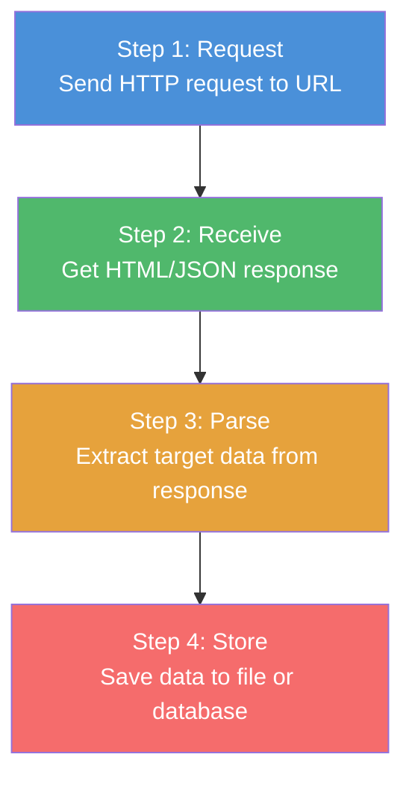
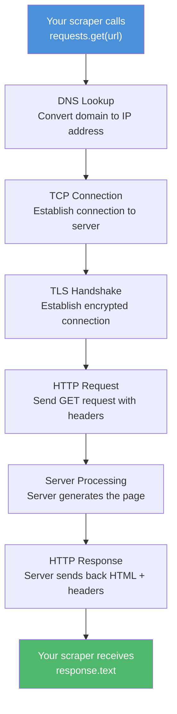

A web scraper is just a program that does what your browser does -- but automatically and at scale. When you visit a website, your browser sends a request, receives HTML, renders it visually, and displays the result. A scraper does the same thing, except instead of rendering a page for you to look at, it extracts the specific data you care about and saves it somewhere useful. That is the entire concept. Everything else is just implementation details.

If you have ever copied a price from a product page and pasted it into a spreadsheet, you have done manual web scraping. The only difference is that a scraper does this hundreds or thousands of times without getting tired, making typos, or needing coffee breaks.

## The 4-Step Scraper Architecture

Every web scraper, no matter how simple or complex, follows the same fundamental architecture. There are four steps: request, receive, parse, and store.



This is the mental model you should keep in your head. Every scraping library, framework, and tool maps onto one or more of these four steps. Some tools handle just one step. Others handle all four. But the flow is always the same.

## Step 1: Making HTTP Requests

The first thing a scraper does is send an HTTP request to a web server. This is exactly what happens when you type a URL into your browser's address bar and press Enter. Your browser sends a GET request to the server, asking for the page at that URL.

In Python, the `requests` library makes this straightforward:

```python
import requests

url = "https://books.toscrape.com/"
response = requests.get(url)

print(response.status_code)  # 200 means success
```

That is it. One line to fetch an entire web page. The `requests.get()` call sends an HTTP GET request to the server and waits for a response. The server processes the request and sends back the page content.

You can also send additional information with your request. Browsers send headers that identify themselves, and scrapers often do the same:

```python
headers = {
    "User-Agent": "Mozilla/5.0 (Windows NT 10.0; Win64; x64) AppleWebKit/537.36"
}

response = requests.get(url, headers=headers)
```

The `User-Agent` header tells the server what kind of client is making the request. Some servers check this header and may refuse requests that do not look like they come from a real browser.

## Step 2: Receiving the Response

When the server processes your request, it sends back a response. This response contains several things: a status code, response headers, and the actual content (the response body).

The status code tells you whether the request was successful:

```python
response = requests.get("https://books.toscrape.com/")

# Check the status code
print(response.status_code)
# 200 = Success
# 301 = Page moved permanently
# 403 = Forbidden (you are blocked)
# 404 = Page not found
# 429 = Too many requests (rate limited)
# 500 = Server error
```

The response body is where the actual data lives. For most web pages, this is HTML:

```python
# Get the HTML content
html_content = response.text
print(html_content[:500])  # Print the first 500 characters
```

This will print something like:

```html
<!DOCTYPE html>
<html lang="en-us">
<head>
    <title>All products | Books to Scrape</title>
    <meta charset="utf-8">
    ...
</head>
<body>
    <div class="container-fluid page">
        <div class="page_inner">
            ...
        </div>
    </div>
</body>
</html>
```

Not all responses are HTML. APIs often return JSON, which is already structured data:

```python
# Fetching from a JSON API
api_response = requests.get("https://api.example.com/products")
data = api_response.json()  # Parse JSON directly

for product in data["products"]:
    print(product["name"], product["price"])
```

When you get JSON back, you can often skip the parsing step entirely because the data is already structured. This is why scraping APIs is usually easier than scraping HTML pages.

## Step 3: Parsing the Response

Parsing is where you extract the specific data you need from the raw response. HTML is a mix of content, formatting, navigation, ads, and scripts. Parsing means cutting through all of that to find the pieces you actually care about.

The most popular Python library for parsing HTML is BeautifulSoup. It takes raw HTML and turns it into a navigable tree structure that you can search through:

```python
from bs4 import BeautifulSoup

html = response.text
soup = BeautifulSoup(html, "html.parser")

# Find all book titles on the page
titles = soup.select("article.product_pod h3 a")
for title in titles:
    print(title["title"])
```

The `soup.select()` method uses CSS selectors -- the same selectors that web designers use to style pages. If you have ever used CSS or inspected an element in your browser's developer tools, you already know the basics.

Here are some common selector patterns:

```python
# Select by tag name
paragraphs = soup.select("p")

# Select by class name
prices = soup.select(".price_color")

# Select by ID
header = soup.select_one("#default")

# Select nested elements
links_in_nav = soup.select("nav ul li a")

# Select by attribute
images = soup.select("img[alt]")
```

You can also extract different parts of an element:

```python
for book in soup.select("article.product_pod"):
    # Get text content
    title = book.select_one("h3 a")["title"]

    # Get an attribute value
    link = book.select_one("h3 a")["href"]

    # Get text inside a tag
    price = book.select_one(".price_color").get_text()

    print(f"{title} - {price}")
```


<figure>
  
  <figcaption>Web scraping is the bridge between the visible web and usable data. <span class="img-credit">Photo by Google DeepMind / <a href="https://www.pexels.com" target="_blank" rel="noopener noreferrer">Pexels</a></span></figcaption>
</figure>

## Step 4: Storing the Data

Once you have extracted the data, you need to put it somewhere useful. The most common formats are CSV files, JSON files, and databases.

Saving to CSV is the simplest approach and works well with spreadsheet software:

```python
import csv

books = []
for book in soup.select("article.product_pod"):
    title = book.select_one("h3 a")["title"]
    price = book.select_one(".price_color").get_text()
    books.append({"title": title, "price": price})

with open("books.csv", "w", newline="", encoding="utf-8") as f:
    writer = csv.DictWriter(f, fieldnames=["title", "price"])
    writer.writeheader()
    writer.writerows(books)
```

JSON is better when your data has nested structures:

```python
import json

with open("books.json", "w", encoding="utf-8") as f:
    json.dump(books, f, indent=2, ensure_ascii=False)
```

For larger projects, a database gives you the ability to query and update your data:

```python
import sqlite3

conn = sqlite3.connect("books.db")
cursor = conn.cursor()

cursor.execute("""
    CREATE TABLE IF NOT EXISTS books (
        title TEXT,
        price TEXT
    )
""")

for book in books:
    cursor.execute(
        "INSERT INTO books (title, price) VALUES (?, ?)",
        (book["title"], book["price"])
    )

conn.commit()
conn.close()
```

## Putting It All Together: A Complete Scraper

Here is a complete, working scraper that combines all four steps. It scrapes book titles and prices from a practice site designed for learning web scraping:

```python
import requests
from bs4 import BeautifulSoup
import csv

# Step 1: Request
url = "https://books.toscrape.com/"
headers = {
    "User-Agent": "Mozilla/5.0 (Windows NT 10.0; Win64; x64) AppleWebKit/537.36"
}
response = requests.get(url, headers=headers)

# Check if request was successful
if response.status_code != 200:
    print(f"Failed to fetch page: {response.status_code}")
    exit()

# Step 2: Receive (response.text contains the HTML)
html = response.text

# Step 3: Parse
soup = BeautifulSoup(html, "html.parser")
books = []

for article in soup.select("article.product_pod"):
    title = article.select_one("h3 a")["title"]
    price = article.select_one(".price_color").get_text()
    availability = article.select_one(".availability").get_text(strip=True)

    books.append({
        "title": title,
        "price": price,
        "availability": availability,
    })

# Step 4: Store
with open("books.csv", "w", newline="", encoding="utf-8") as f:
    writer = csv.DictWriter(f, fieldnames=["title", "price", "availability"])
    writer.writeheader()
    writer.writerows(books)

print(f"Scraped {len(books)} books and saved to books.csv")
```

Run this script and you will get a CSV file with 20 book titles, prices, and availability status. That is a working scraper in about 30 lines of code.

## What Happens Under the Hood

When your scraper calls `requests.get(url)`, a lot happens behind the scenes before you get your HTML back. Understanding these lower-level steps helps you debug problems when things go wrong.



Here is what each step does:

**DNS Lookup** -- Your scraper has a URL like `https://books.toscrape.com/`. The first thing that happens is a DNS lookup to convert the domain name (`books.toscrape.com`) into an IP address (like `93.184.216.34`). This is like looking up a phone number in a directory.

**TCP Connection** -- Once the scraper knows the IP address, it opens a TCP connection to the server. This is a reliable, two-way communication channel. Think of it as dialing the phone number and waiting for someone to pick up.

**TLS Handshake** -- If the URL starts with `https://` (and most do these days), the scraper and server perform a TLS handshake to establish an encrypted connection. This is the "S" in HTTPS -- it means the data sent back and forth is encrypted so nobody in between can read it.

**HTTP Request** -- With the connection established, the scraper sends the actual HTTP request. This includes the method (GET), the path (`/`), and any headers (User-Agent, cookies, etc.).

**Server Processing** -- The server receives the request and generates a response. For static sites, this means reading an HTML file from disk. For dynamic sites, the server might query a database, run template code, and assemble the page on the fly.

**HTTP Response** -- The server sends back the response, which includes a status code, response headers (content type, cookies, caching info), and the response body (usually HTML).

All of this happens in milliseconds for a typical request. The `requests` library handles all of these steps automatically. You do not need to think about DNS or TCP unless something goes wrong.


<figure>
  
  <figcaption>The web is vast, but the right tools make it navigable. <span class="img-credit">Photo by Matheus Bertelli / <a href="https://www.pexels.com" target="_blank" rel="noopener noreferrer">Pexels</a></span></figcaption>
</figure>

## When a Simple Scraper Is Not Enough

The `requests` + BeautifulSoup approach works great for static websites -- pages where all the content is in the HTML that the server sends back. But modern websites increasingly rely on JavaScript to load content after the initial page load.

Here are the situations where a simple HTTP scraper falls short:

**JavaScript-rendered content** -- Many modern sites use frameworks like React, Vue, or Angular. The server sends a mostly empty HTML page, and JavaScript fills in the content after the page loads. Since `requests` does not execute JavaScript, your scraper gets an empty page.

**Authentication and sessions** -- Some sites require you to log in before you can see the data. This means managing cookies, session tokens, and sometimes complex authentication flows.

**Anti-bot protection** -- Many sites use services like Cloudflare, Akamai, or custom detection systems to block automated access. These systems check browser fingerprints, JavaScript execution, and behavior patterns that simple HTTP clients cannot replicate.

**Infinite scroll and pagination** -- Some sites load more content as you scroll down or click "load more" buttons. This requires simulating user interactions that HTTP requests alone cannot handle.

When you hit these walls, you need to upgrade from a simple HTTP client to a browser automation tool.

## The Scraper Toolkit

Different tools handle different parts of the scraping process. Here is how the most common tools map to the four steps:

| Tool | Request | Receive | Parse | Store |
|------|---------|---------|-------|-------|
| requests | Yes | Yes | No | No |
| BeautifulSoup | No | No | Yes | No |
| lxml | No | No | Yes | No |
| Scrapy | Yes | Yes | Yes | Yes |
| Selenium | Yes | Yes | Partial | No |
| Playwright | Yes | Yes | Partial | No |
| Puppeteer | Yes | Yes | Partial | No |
| pandas | No | No | Partial | Yes |

Most real scrapers combine tools. The `requests` + BeautifulSoup combination is the classic pairing for simple scrapers. Scrapy is a full framework that handles everything. Browser automation tools like Playwright and Selenium handle the request/receive cycle but rely on JavaScript or external libraries for parsing and storage. For a detailed breakdown of how these tools compare, see our [mega comparison of Playwright, Puppeteer, Selenium, and Scrapy](/posts/playwright-vs-puppeteer-vs-selenium-vs-scrapy-2026-mega-comparison/).

## Simple Scraper vs Browser-Based Scraper

The architecture changes significantly when you switch from a simple HTTP scraper to a browser-based scraper. Here is how they compare:

```mermaid
graph TD
    subgraph SIMPLE["Simple HTTP Scraper"]
        A1["Python Script"] --> A2["HTTP Request<br>via requests library"]
        A2 --> A3["Raw HTML Response"]
        A3 --> A4["Parse with<br>BeautifulSoup"]
        A4 --> A5["Extracted Data"]
    end

    subgraph BROWSER["Browser-Based Scraper"]
        B1["Python Script"] --> B2["Launch Browser<br>via Playwright/Selenium"]
        B2 --> B3["Browser loads page<br>executes JavaScript"]
        B3 --> B4["Rendered DOM<br>with all content"]
        B4 --> B5["Query DOM<br>via selectors"]
        B5 --> B6["Extracted Data"]
    end

    style SIMPLE fill:#e8f4e8
    style BROWSER fill:#e8e8f4
```



The simple scraper is fast and lightweight. It sends a single HTTP request, gets the raw HTML, and parses it. It uses minimal memory and can make hundreds of requests per second. The [speed difference between requests and Selenium](/posts/python-requests-vs-selenium-speed-performance-comparison/) can be dramatic.

The browser-based scraper is slower but more capable. It launches an actual browser (Chrome, Firefox, or WebKit), navigates to the page, waits for JavaScript to execute, and then extracts data from the fully rendered page. It uses significantly more memory and CPU, but it can handle any website that a human can see in a browser.

**When to use a simple scraper:**
- The data you need is in the initial HTML response
- You need to scrape thousands of pages quickly
- Server resources are limited
- The site does not require JavaScript

**When to use a browser-based scraper:**
- Content loads dynamically via JavaScript
- You need to interact with the page (click buttons, fill forms)
- The site has anti-bot protection that checks for a real browser
- You need to render the page exactly as a user would see it

## Common Terms Explained

If you are new to web scraping, here are the terms you will encounter most often:

**Crawling vs Scraping** -- Crawling is the process of discovering and following links across a website to find pages. Scraping is extracting data from those pages. A crawler finds URLs. A scraper extracts data. Many tools do both, which is why the terms are often used interchangeably, but they are distinct activities.

**Parsing** -- Taking raw, unstructured data (like an HTML string) and converting it into a structured format you can work with. When BeautifulSoup processes HTML, it parses the string into a tree of elements you can search and navigate. In some cases, you can even use [regex to extract data without a full parser](/posts/regex-for-web-scraping-extracting-data-without-parser/).

**Selectors** -- Patterns used to target specific elements in an HTML document. CSS selectors (`div.price`, `#main-content`, `a[href]`) and XPath expressions (`//div[@class="price"]`) are the two main types. CSS selectors are generally easier to read and write.

**Pagination** -- Most websites split their content across multiple pages. Pagination is the process of navigating through all those pages to collect complete data. This usually means finding the "next page" link and following it until there are no more pages.

**Rate limiting** -- Making too many requests too quickly can overload a server or get your scraper blocked. Rate limiting means adding delays between requests. A common practice is to wait one to two seconds between requests. Some sites explicitly state their rate limits in their `robots.txt` file.

**Robots.txt** -- A file at the root of a website (e.g., `https://example.com/robots.txt`) that tells automated programs which parts of the site they are allowed to access. It is a guideline, not a technical barrier -- your scraper can still access those pages, but respecting `robots.txt` is considered good practice.

**User-Agent** -- A string sent with every HTTP request that identifies the client making the request. Browsers send their own user-agent strings, and scrapers often set a custom one to identify themselves or to mimic a browser.

**Headers** -- Key-value pairs sent with HTTP requests and responses. Request headers include things like User-Agent, cookies, and accepted content types. Response headers include content type, caching directives, and set-cookie instructions.

## Where to Go from Here

You now understand the complete architecture of a web scraper: request, receive, parse, store. Every scraping project follows this flow, whether it is a 30-line script or a distributed system processing millions of pages.

The best way to learn is to build. Start with the complete example in this post. Modify it to scrape different data from the same site. Then try a different site. You will quickly run into new challenges -- pagination, dynamic content, authentication -- and each one will teach you something new about how the web works.

Install the tools you need and write your first scraper:

```bash
pip install requests beautifulsoup4
```

Then run the complete example from this post. You will have scraped data in a CSV file in under a minute. From there, the entire web is your dataset.
