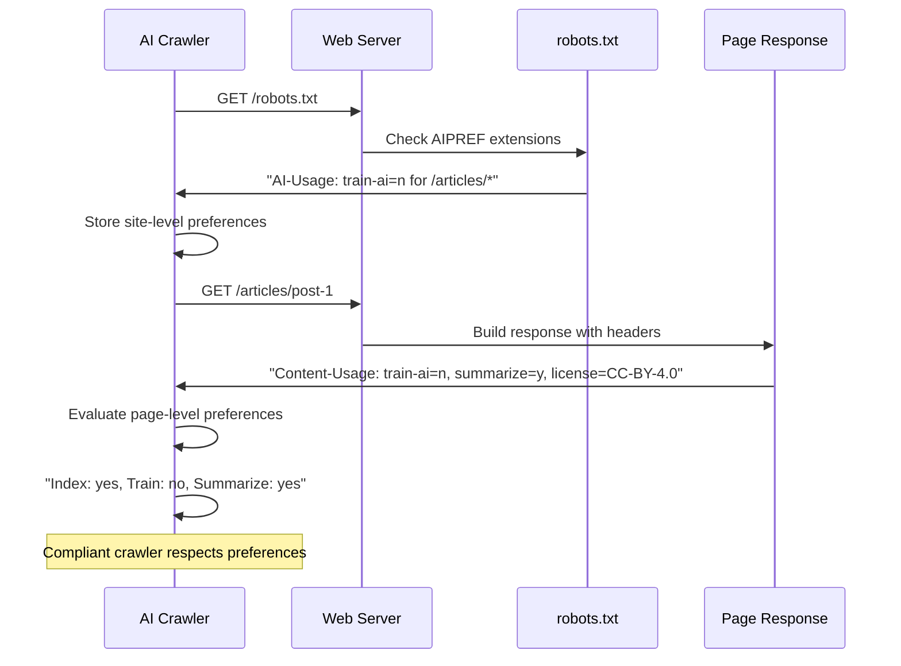

The robots.txt protocol has been the de facto standard for communicating with web crawlers since 1994. For over thirty years, this simple text file has served as the handshake between websites and bots -- a gentleman's agreement about what should and should not be crawled. But the rise of large language models and AI training pipelines has exposed a gap: robots.txt was designed for search engine indexing, not for controlling how content gets consumed by machine learning systems. In January 2026, the IETF chartered the AI Preferences (AIPREF) working group to address exactly this problem.

This matters for anyone working in web scraping. Whether you are building a crawler, managing a website, or thinking about the ethics of data collection, AIPREF is poised to reshape the rules of engagement between content creators and automated systems.

## Why robots.txt Is No Longer Enough

The original robots.txt specification was elegant in its simplicity. A website publishes a text file at its root that tells crawlers which paths they can and cannot access, and crawlers voluntarily comply. For decades, this system worked because the incentives were aligned -- search engines wanted to index your content, and you wanted to be found.

The AI era broke that alignment. When a training pipeline crawls your site, it is not indexing your content so users can find it. It is absorbing your content to build a model that may never send a single visitor back your way. The robots.txt protocol has no vocabulary to express this distinction. You can block a user-agent entirely, but you cannot say "index my content for search, but do not use it for AI training."

```mermaid
graph LR
    A["1994: robots.txt created"] --> B["2000s: Search engine era"]
    B --> C["User-Agent based blocking"]
    C --> D["2022-2023: AI crawlers emerge"]
    D --> E["GPTBot, ClaudeBot, etc."]
    E --> F["Sites add AI bot blocks to robots.txt"]
    F --> G["Problem: No granular control"]
    G --> H["Jan 2026: IETF charters AIPREF WG"]
    H --> I["New vocabulary for AI preferences"]
```



The current workaround is crude. Many sites have added long lists of AI-specific user agents to their robots.txt Disallow rules:

```
User-agent: GPTBot
Disallow: /

User-agent: ClaudeBot
Disallow: /

User-agent: CCBot
Disallow: /

User-agent: Google-Extended
Disallow: /
```

This approach has several problems. First, it is a game of whac-a-mole. New AI crawlers appear regularly, each with its own user-agent string, and site operators must constantly update their block lists. Second, it is all-or-nothing -- you cannot allow a crawler to index your content for search results while prohibiting it from training data. Third, robots.txt is entirely voluntary. Any crawler can simply ignore it, and there is no technical enforcement mechanism.

## What AIPREF Proposes

The IETF AIPREF working group is developing a common vocabulary for expressing AI content usage preferences. The approach extends both robots.txt and HTTP headers, giving site operators fine-grained control over how their content is used by AI systems.

The core proposal introduces a `Content-Usage` directive that can appear in both robots.txt files and as HTTP response headers. This allows preferences to be set at the site level, the directory level, or even the individual page level.

### The Content-Usage Header

The biggest addition is the `Content-Usage` HTTP header. Instead of binary allow/block, it lets you specify exactly what types of AI usage you permit:

```
Content-Usage: train-ai=n
```

This simple directive tells AI crawlers: you may access this content, but you may not use it for training AI models. The key parameters being discussed in the Internet-Draft include:

- `train-ai` -- Whether content can be used for AI/ML training
- `summarize` -- Whether content can be summarized by AI systems
- `index` -- Whether content can be indexed for search and retrieval
- `license` -- A reference to licensing terms for content usage
- `freshness` -- How current the content is, helping crawlers prioritize

### How AIPREF Headers Flow

The protocol works through standard HTTP mechanisms, making it compatible with existing web infrastructure.



The page-level headers override site-level defaults, giving operators precise control. An academic journal might allow summarization of abstracts but prohibit training on full papers. A news site might permit indexing but require licensing for any AI training use.

## Parsing AIPREF Headers in Practice

For scraper developers, compliance with AIPREF means checking these headers before processing content. The following examples show how to implement this in your crawlers.

### Python Implementation

```python
import requests
from dataclasses import dataclass, field
from typing import Optional
from urllib.robotparser import RobotFileParser

@dataclass
class AIPreferences:
    """Parsed AI usage preferences for a resource."""
    train_ai: Optional[bool] = None
    summarize: Optional[bool] = None
    index: Optional[bool] = None
    license: Optional[str] = None
    freshness: Optional[str] = None
    raw_header: str = ""

    def allows_training(self):
        return self.train_ai is not False

    def allows_summarization(self):
        return self.summarize is not False

    def allows_indexing(self):
        return self.index is not False


def parse_content_usage(header_value):
    """Parse a Content-Usage header into structured preferences."""
    prefs = AIPreferences(raw_header=header_value)

    if not header_value:
        return prefs

    for directive in header_value.split(','):
        directive = directive.strip()
        if '=' not in directive:
            continue

        key, value = directive.split('=', 1)
        key = key.strip().lower()
        value = value.strip().lower()

        if key == 'train-ai':
            prefs.train_ai = value in ('y', 'yes', 'true', '1')
        elif key == 'summarize':
            prefs.summarize = value in ('y', 'yes', 'true', '1')
        elif key == 'index':
            prefs.index = value in ('y', 'yes', 'true', '1')
        elif key == 'license':
            prefs.license = value
        elif key == 'freshness':
            prefs.freshness = value

    return prefs


def check_ai_preferences(url, session=None):
    """Fetch a URL and check its AI usage preferences."""
    if session is None:
        session = requests.Session()

    response = session.head(url, timeout=10, allow_redirects=True)

    content_usage = response.headers.get('Content-Usage', '')
    prefs = parse_content_usage(content_usage)

    return prefs


# Usage
prefs = check_ai_preferences("https://example.com/articles/latest")
if not prefs.allows_training():
    print("This content may not be used for AI training")
    print(f"License: {prefs.license}")
else:
    print("Content is available for AI training")
```

### JavaScript Implementation

```javascript
class AIPreferences {
  constructor(headerValue = "") {
    this.rawHeader = headerValue;
    this.trainAi = null;
    this.summarize = null;
    this.index = null;
    this.license = null;
    this.freshness = null;

    this.parse(headerValue);
  }

  parse(headerValue) {
    if (!headerValue) return;

    for (const directive of headerValue.split(",")) {
      const [key, value] = directive.split("=").map((s) => s.trim().toLowerCase());
      if (!key || !value) continue;

      const isPositive = ["y", "yes", "true", "1"].includes(value);

      switch (key) {
        case "train-ai":
          this.trainAi = isPositive;
          break;
        case "summarize":
          this.summarize = isPositive;
          break;
        case "index":
          this.index = isPositive;
          break;
        case "license":
          this.license = value;
          break;
        case "freshness":
          this.freshness = value;
          break;
      }
    }
  }

  allowsTraining() {
    return this.trainAi !== false;
  }

  allowsSummarization() {
    return this.summarize !== false;
  }

  allowsIndexing() {
    return this.index !== false;
  }
}

// Usage with fetch
async function checkAIPreferences(url) {
  const response = await fetch(url, { method: "HEAD" });
  const contentUsage = response.headers.get("Content-Usage") || "";
  return new AIPreferences(contentUsage);
}

// Example
const prefs = await checkAIPreferences("https://example.com/articles/latest");
if (!prefs.allowsTraining()) {
  console.log("Content is restricted from AI training");
  console.log(`License: ${prefs.license}`);
}
```

## Building an AIPREF-Compliant Scraper

Checking individual headers is useful, but a production scraper needs to integrate AIPREF compliance throughout its pipeline. A more complete approach looks like this:

```python
import requests
from urllib.parse import urlparse

class AIPrefCompliantScraper:
    """A scraper that respects AIPREF AI usage preferences."""

    def __init__(self, purpose="indexing"):
        self.purpose = purpose  # "indexing", "training", "summarization"
        self.session = requests.Session()
        self.preferences_cache = {}  # url -> AIPreferences
        self.blocked_urls = []
        self.compliant_urls = []

    def can_use_for_purpose(self, prefs):
        """Check if content can be used for the scraper's stated purpose."""
        if self.purpose == "training":
            return prefs.allows_training()
        elif self.purpose == "summarization":
            return prefs.allows_summarization()
        elif self.purpose == "indexing":
            return prefs.allows_indexing()
        return True

    def scrape(self, url):
        """Scrape a URL while respecting AI preferences."""
        # Step 1: Check preferences via HEAD request
        prefs = self._get_preferences(url)

        # Step 2: Determine if usage is permitted
        if not self.can_use_for_purpose(prefs):
            self.blocked_urls.append({
                "url": url,
                "reason": f"Content-Usage prohibits {self.purpose}",
                "license": prefs.license,
            })
            print(f"Skipping {url}: {self.purpose} not permitted")
            return None

        # Step 3: Proceed with the actual request
        response = self.session.get(url, timeout=10)

        # Step 4: Re-check the GET response headers (may differ from HEAD)
        get_prefs = parse_content_usage(
            response.headers.get('Content-Usage', '')
        )
        if not self.can_use_for_purpose(get_prefs):
            self.blocked_urls.append({
                "url": url,
                "reason": "GET response restricted usage",
            })
            return None

        self.compliant_urls.append(url)
        return response.text

    def _get_preferences(self, url):
        """Fetch and cache AI preferences for a URL."""
        if url not in self.preferences_cache:
            self.preferences_cache[url] = check_ai_preferences(
                url, self.session
            )
        return self.preferences_cache[url]

    def report(self):
        """Generate a compliance report."""
        total = len(self.compliant_urls) + len(self.blocked_urls)
        print(f"\nAIPREF Compliance Report")
        print(f"Total URLs checked: {total}")
        print(f"Permitted: {len(self.compliant_urls)}")
        print(f"Blocked: {len(self.blocked_urls)}")
        for entry in self.blocked_urls:
            print(f"  - {entry['url']}: {entry['reason']}")


# Usage
scraper = AIPrefCompliantScraper(purpose="training")
content = scraper.scrape("https://example.com/articles/latest")
scraper.report()
```

## Implementing AIPREF on Your Own Site

If you run a website and want to set AI preferences for your content, the following configurations show how to set it up on common web servers.

### Nginx Configuration

```nginx
# Set AIPREF headers globally
server {
    listen 443 ssl;
    server_name example.com;

    # Default: allow indexing, block AI training
    add_header Content-Usage "train-ai=n, summarize=y, index=y" always;

    # For blog content: allow summarization with license requirement
    location /blog/ {
        add_header Content-Usage "train-ai=n, summarize=y, index=y, license=CC-BY-4.0" always;
    }

    # For public data: allow everything
    location /open-data/ {
        add_header Content-Usage "train-ai=y, summarize=y, index=y, license=CC0-1.0" always;
    }

    # For premium content: restrict all AI usage
    location /premium/ {
        add_header Content-Usage "train-ai=n, summarize=n, index=y" always;
    }
}
```

### Apache Configuration

```apache
# Global AIPREF header
<VirtualHost *:443>
    ServerName example.com

    # Default AI preferences
    Header always set Content-Usage "train-ai=n, summarize=y, index=y"

    # Blog section - allow summarization
    <Location /blog>
        Header always set Content-Usage "train-ai=n, summarize=y, index=y, license=CC-BY-4.0"
    </Location>

    # Open data - allow all AI usage
    <Location /open-data>
        Header always set Content-Usage "train-ai=y, summarize=y, index=y, license=CC0-1.0"
    </Location>

    # Premium content - restrict AI usage
    <Location /premium>
        Header always set Content-Usage "train-ai=n, summarize=n, index=y"
    </Location>
</VirtualHost>
```

### Updated robots.txt with AIPREF Extensions

The AIPREF proposal also extends the robots.txt format to include AI-specific directives alongside traditional rules:

```
# Traditional robots.txt rules
User-agent: *
Allow: /
Crawl-delay: 2

# AIPREF extensions
User-agent: GPTBot
AI-Usage: train-ai=n

User-agent: ClaudeBot
AI-Usage: train-ai=n, summarize=y

# Blanket AI preference for all crawlers
User-agent: *
AI-Usage: train-ai=n, index=y
```

## Comparing robots.txt and AIPREF

To understand what AIPREF adds, it helps to see the limitations of the current system side by side with the new capabilities.

robots.txt today gives you one lever: allow or disallow a path for a user-agent. If you disallow GPTBot from `/`, you have blocked it from everything -- search indexing, summarization, and training alike. There is no way to express partial consent.

AIPREF gives you multiple levers per resource. You can allow access for indexing while blocking training. You can permit summarization of abstracts while protecting full articles. You can attach licensing metadata so crawlers know the commercial terms. And because it works through HTTP headers, it operates at the individual page level, not just at the path level.

The critical caveat remains the same one that has always applied to robots.txt: compliance is voluntary. AIPREF does not add technical enforcement. A rogue crawler can ignore `Content-Usage` headers just as easily as it can ignore `Disallow` directives. But having a clear, standardized vocabulary for expressing preferences matters. It establishes norms, it provides evidence of intent in legal disputes, and it gives well-meaning crawlers a way to do the right thing.

## What This Means for the Scraping Community

The AIPREF initiative reflects a broader shift in how the web thinks about automated access. For years, web scraping existed in a gray area where norms were informal and enforcement was inconsistent. The emergence of AI training pipelines has forced the issue into the open, and the response is moving toward structured, machine-readable consent mechanisms.

For scraper developers, the practical implications are straightforward.

Start checking for these headers now. Even though the Internet-Draft is still in progress and expires in July 2026, early adoption signals good faith. Building AIPREF awareness into your scraping pipeline is low effort and high value.

Distinguish your scraper's purpose. If you are building a search index, say so. If you are collecting data for research, say so. The AIPREF framework rewards transparency by giving compliant crawlers clear signals about what is permitted.

Watch the Cloudflare ecosystem. Cloudflare's AI Crawl Control already uses 402 Payment Required responses to signal that content access requires a commercial arrangement. As AIPREF matures, expect tighter integration between standards-based preferences and CDN-level enforcement.

Think about licensing. The `license` parameter in AIPREF headers points toward a future where data access is increasingly governed by explicit licensing agreements rather than informal conventions. Sites that publish open licenses alongside their AIPREF headers are creating a pathway for legitimate, authorized data collection.

The robots.txt protocol served the web remarkably well for three decades. AIPREF is not replacing it -- it is extending it for an era where the question is no longer just "can you crawl this?" but "what can you do with what you find?"
