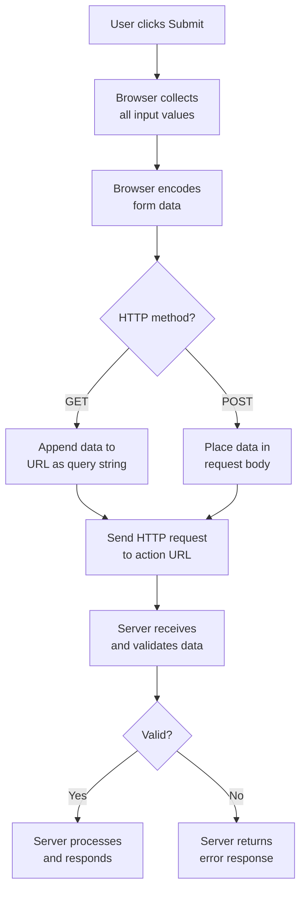
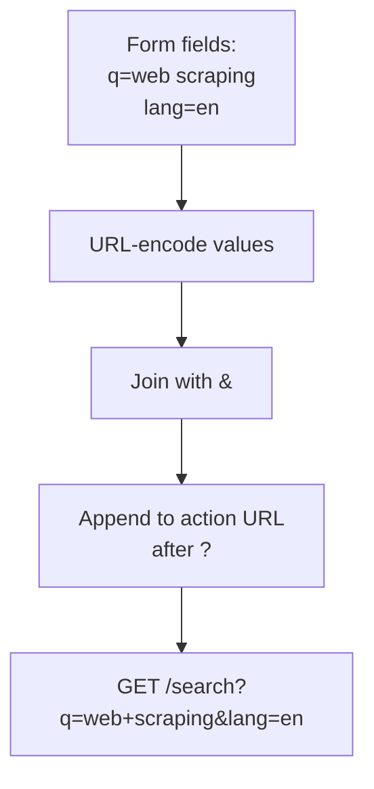
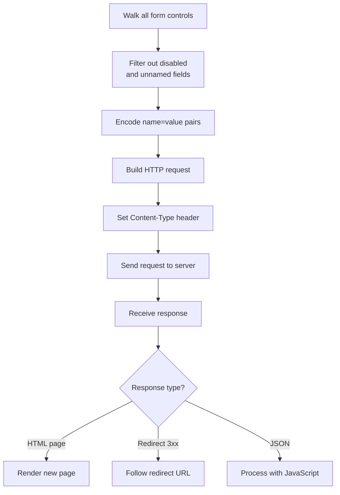
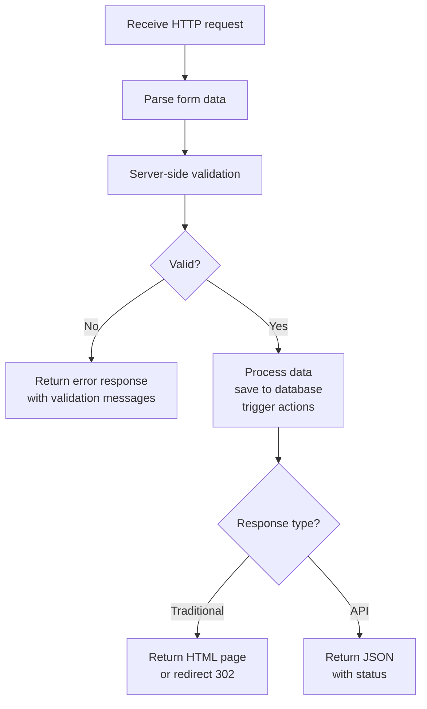

Understanding how form submission works under the hood is essential for anyone who wants to automate it. When you click a submit button on a web page, a chain of events fires off -- the browser collects every input value, encodes the data in a specific format, builds an HTTP request, and sends it to a server that validates, processes, and responds. If you are building a scraper, writing automated tests, or simply trying to understand why a form behaves the way it does, knowing each step in this chain gives you the vocabulary and mental model to debug problems and replicate the process in code.

## The Form Submission Lifecycle

Here is the high-level flow that every traditional form submission follows.



## The HTML Form Element

A form starts with the `<form>` tag. Three attributes on this tag control everything about how submission works.

```html
<form action="/search" method="GET">
    <input type="text" name="q" placeholder="Search...">
    <button type="submit">Search</button>
</form>
```

- **action** -- the URL the form data is sent to. If omitted, the browser submits to the current page URL.
- **method** -- either `GET` or `POST`. Determines how the data travels.
- **enctype** -- the encoding format for the data. Only relevant for POST requests. Defaults to `application/x-www-form-urlencoded`.

The `name` attribute on each input field is critical. It becomes the key in the submitted data. An input without a `name` attribute is ignored entirely during submission. This is one of the most common gotchas when automating forms -- if a field has no `name`, it never reaches the server.

```html
<form action="/register" method="POST">
    <input type="text" name="username" required>
    <input type="email" name="email" required>
    <input type="password" name="password" required>
    <select name="country">
        <option value="us">United States</option>
        <option value="uk">United Kingdom</option>
        <option value="ca">Canada</option>
    </select>
    <input type="hidden" name="csrf_token" value="a1b2c3d4e5f6">
    <button type="submit">Register</button>
</form>
```

Notice the hidden input at the bottom. It carries a CSRF token that the user never sees but the server absolutely requires. We will come back to this later.

## GET Submissions: Data in the URL

When a form uses `method="GET"`, the browser appends all field values to the URL as query parameters. You see this every time you use a search engine.

```html
<form action="/search" method="GET">
    <input type="text" name="q" value="web scraping">
    <input type="hidden" name="lang" value="en">
    <button type="submit">Search</button>
</form>
```

Clicking submit on this form sends the browser to:

```
/search?q=web+scraping&lang=en
```

The browser takes each `name=value` pair, URL-encodes special characters (spaces become `+` or `%20`), joins them with `&`, and tacks the result onto the action URL after a `?`.

GET submissions are used when the request is idempotent -- meaning it does not change anything on the server. Common examples include search forms, filter controls, and pagination. The data is visible in the URL, bookmarkable, and cacheable.



## POST Submissions: Data in the Body

When a form uses `method="POST"`, the browser packages the field values into the HTTP request body instead of the URL. The URL stays clean.

```html
<form action="/login" method="POST">
    <input type="text" name="username">
    <input type="password" name="password">
    <button type="submit">Log In</button>
</form>
```

Submitting this form sends a POST request to `/login`. The request body contains:

```
username=admin&password=hunter2
```

POST is used when the submission creates, updates, or deletes something -- login, registration, checkout, data entry. The data is not visible in the URL and not cached by the browser.

## What the Browser Actually Does

When you click submit, the browser executes a specific sequence of operations. Understanding this sequence is what lets you replicate it in code.

1. **Collect** -- the browser walks every form control (input, select, textarea) inside the `<form>` tag and grabs the `name` and current value of each one.
2. **Filter** -- disabled fields are excluded. Fields without a `name` attribute are excluded. Unchecked checkboxes and radio buttons are excluded.
3. **Encode** -- special characters are percent-encoded. Spaces become `+` in the default encoding.
4. **Build the request** -- for GET, the encoded string is appended to the URL. For POST, it goes into the request body.
5. **Set headers** -- for POST, the browser sets the `Content-Type` header to match the `enctype` attribute.
6. **Send** -- the HTTP request is dispatched to the server.
7. **Handle response** -- the browser renders the server's response, which could be a new HTML page, a redirect to another URL, or (in the case of AJAX) a JSON payload.




<figure>
  
  <figcaption>HTTP is the language every scraper must speak fluently. <span class="img-credit">Photo by Google DeepMind / <a href="https://www.pexels.com" target="_blank" rel="noopener noreferrer">Pexels</a></span></figcaption>
</figure>

## Content-Type in POST Requests

POST requests use the `Content-Type` header to tell the server how the body data is formatted. There are two main formats you will encounter.

### application/x-www-form-urlencoded

This is the default. Field values are encoded in key-value pairs separated by `&`, just like a URL query string, but placed in the request body.

```
Content-Type: application/x-www-form-urlencoded

username=admin&password=hunter2&remember=on
```

This format works for text data. It is what the browser uses for the vast majority of forms.

### multipart/form-data

This format is required when a form includes file uploads. It uses a boundary string to separate each field's data, allowing binary content to be transmitted alongside text fields.

```html
<form action="/upload" method="POST" enctype="multipart/form-data">
    <input type="text" name="title">
    <input type="file" name="document">
    <button type="submit">Upload</button>
</form>
```

The raw request body looks something like this:

```
Content-Type: multipart/form-data; boundary=----WebKitFormBoundary7MA4

------WebKitFormBoundary7MA4
Content-Disposition: form-data; name="title"

Annual Report
------WebKitFormBoundary7MA4
Content-Disposition: form-data; name="document"; filename="report.pdf"
Content-Type: application/pdf

(binary file data)
------WebKitFormBoundary7MA4--
```

When automating form submissions, the encoding format matters. Using the wrong one will cause the server to reject or misinterpret your data.

## Server Processing and Response

Once the server receives the form data, it typically follows a standard pipeline.



The server validates the data, processes it, and responds. Traditional forms typically respond with a redirect (HTTP 302) to a success page -- this is the Post/Redirect/Get pattern that prevents duplicate submissions when users refresh the page. API-style endpoints respond with JSON.

## CSRF Protection: Hidden Tokens

Cross-Site Request Forgery (CSRF) is an attack where a malicious website tricks a user's browser into submitting a form to a legitimate site. To prevent this, most web applications include a hidden CSRF token in their forms.

```html
<form action="/transfer" method="POST">
    <input type="hidden" name="csrf_token"
           value="x9Kj2mP7vR4qL8nT1wF6">
    <input type="text" name="amount">
    <input type="text" name="recipient">
    <button type="submit">Transfer</button>
</form>
```

The server generates a unique token for each session (or each form render) and embeds it in the HTML. When the form is submitted, the server checks that the token in the request matches the one it issued. If the token is missing or wrong, the server rejects the submission.

For automated form submission, this means you need to:

1. First request the page containing the form (a GET request).
2. Parse the HTML to extract the CSRF token.
3. Include the token in your POST request.

This two-step process is one of the most common patterns in web scraping.

## Client-Side vs Server-Side Validation

Forms typically implement validation at two levels.

**Client-side validation** happens in the browser before the request is sent. HTML5 attributes like `required`, `minlength`, `maxlength`, `pattern`, and `type="email"` trigger browser-native validation. JavaScript can add custom validation logic on top.

```html
<input type="email" name="email" required
       pattern="[a-z]+@example\.com"
       title="Must be an @example.com address">
```

**Server-side validation** happens after the data reaches the server. It is the real security boundary. Client-side validation is purely for user experience -- it can be bypassed entirely by sending requests directly, which is exactly what you do when automating with `requests`.

When automating form submission at the HTTP level, client-side validation is irrelevant. You are crafting the request yourself, so you skip the browser entirely. But you still need to satisfy server-side validation, which means sending properly formatted data that meets whatever rules the server enforces.


<figure>
  
  <figcaption>Requests and responses are the conversation between your scraper and the server. <span class="img-credit">Photo by RDNE Stock project / <a href="https://www.pexels.com" target="_blank" rel="noopener noreferrer">Pexels</a></span></figcaption>
</figure>

## AJAX Form Submission

Modern web applications often handle form submission with JavaScript instead of the traditional full-page navigation. The form data is sent via `fetch()` or `XMLHttpRequest`, and the response is processed without reloading the page.

```javascript
// What the browser's JavaScript does behind the scenes
const form = document.querySelector('#login-form');
form.addEventListener('submit', async (e) => {
    e.preventDefault();
    const formData = new FormData(form);
    const response = await fetch('/api/login', {
        method: 'POST',
        body: formData
    });
    const result = await response.json();
    // Update the page without reload
});
```

AJAX submissions often use JSON instead of URL-encoded form data:

```
POST /api/login HTTP/1.1
Content-Type: application/json

{"username": "admin", "password": "hunter2"}
```

When automating these forms, you need to check the Network tab in DevTools to see what the JavaScript is actually sending. The HTML form structure may not tell the full story because the JavaScript can transform the data before sending it.

## Replicating Form Submission with Python

Now for the practical part. Here is how to replicate both GET and POST form submissions using Python's `requests` library.

### GET Form Submission

Suppose you want to automate a search form that uses GET.

```python
import requests

# The form action URL
url = "https://example.com/search"

# The form fields as a dictionary
# Each key matches the 'name' attribute of an input field
params = {
    "q": "web scraping tutorial",
    "lang": "en",
    "page": "1"
}

response = requests.get(url, params=params)

# requests builds the URL for you:
# https://example.com/search?q=web+scraping+tutorial&lang=en&page=1
print(response.url)
print(response.status_code)
print(response.text[:500])
```

The `params` argument tells `requests` to URL-encode the dictionary and append it to the URL. This is exactly what the browser does with a GET form.

### POST Form Submission

For a login form that uses POST:

```python
import requests

url = "https://example.com/login"

# The form fields
data = {
    "username": "myuser",
    "password": "mypassword",
    "remember": "on"
}

# Use a session to persist cookies across requests
session = requests.Session()
response = session.post(url, data=data)

print(response.status_code)
print(response.url)  # Often a redirect to a dashboard
```

The `data` argument sends the payload as `application/x-www-form-urlencoded`, which matches the browser's default behavior. Using a `Session` object is important because login forms set cookies that subsequent requests need.

### Sending JSON (AJAX Forms)

If the form submits JSON via JavaScript:

```python
import requests

url = "https://example.com/api/login"

payload = {
    "username": "myuser",
    "password": "mypassword"
}

response = requests.post(url, json=payload)

# The json argument sets Content-Type to application/json
# and serializes the dict to a JSON string
print(response.json())
```

### File Uploads (multipart/form-data)

```python
import requests

url = "https://example.com/upload"

files = {
    "document": ("report.pdf", open("report.pdf", "rb"), "application/pdf")
}

data = {
    "title": "Annual Report"
}

response = requests.post(url, data=data, files=files)
print(response.status_code)
```

When you pass the `files` argument, `requests` automatically sets the `Content-Type` to `multipart/form-data` with the correct boundary.

## Handling CSRF Tokens

Here is a complete example that handles CSRF protection -- the two-step process of fetching the token and including it in the submission.

```python
import requests
from bs4 import BeautifulSoup

session = requests.Session()

# Step 1: GET the page that contains the form
page = session.get("https://example.com/register")
soup = BeautifulSoup(page.text, "html.parser")

# Step 2: Extract the CSRF token from the hidden input
csrf_token = soup.find("input", {"name": "csrf_token"})["value"]
print(f"Found CSRF token: {csrf_token}")

# Step 3: Submit the form with the token included
data = {
    "username": "newuser",
    "email": "newuser@example.com",
    "password": "securepassword123",
    "csrf_token": csrf_token  # Include the extracted token
}

response = session.post("https://example.com/register", data=data)

if response.status_code == 200:
    print("Registration submitted successfully")
else:
    print(f"Submission failed with status {response.status_code}")
```

A few important details in this pattern:

- **Use a Session** -- the CSRF token is usually tied to a session cookie. The `Session` object ensures that the cookie set during the GET request is automatically included in the POST request.
- **Parse carefully** -- CSRF tokens can appear in different places. Sometimes they are in a hidden input, sometimes in a meta tag (`<meta name="csrf-token" content="...">`), and sometimes they are set as a cookie or embedded in JavaScript.
- **Tokens expire** -- if you wait too long between the GET and POST, the token may expire. In automated workflows, keep the two requests close together.

### Finding CSRF Tokens in Meta Tags

Some frameworks (Rails, Laravel) put the CSRF token in a meta tag rather than a hidden input:

```python
# For Rails-style CSRF tokens in meta tags
meta_tag = soup.find("meta", {"name": "csrf-token"})
csrf_token = meta_tag["content"]

# The header name varies by framework
headers = {
    "X-CSRF-Token": csrf_token
}

response = session.post(url, data=data, headers=headers)
```

## Putting It All Together

Here is a complete script that demonstrates the full workflow -- loading a form page, extracting hidden fields, and submitting.

```python
import requests
from bs4 import BeautifulSoup
from urllib.parse import urljoin

BASE_URL = "https://example.com"
session = requests.Session()
session.headers.update({
    "User-Agent": "Mozilla/5.0 (Windows NT 10.0; Win64; x64) "
                  "AppleWebKit/537.36 (KHTML, like Gecko) "
                  "Chrome/120.0.0.0 Safari/537.36"
})

# Step 1: Load the form page
page = session.get(urljoin(BASE_URL, "/contact"))
page.raise_for_status()
soup = BeautifulSoup(page.text, "html.parser")
form = soup.find("form")

# Step 2: Extract action URL and method
submit_url = urljoin(BASE_URL, form.get("action", ""))
method = form.get("method", "GET").upper()

# Step 3: Collect all hidden fields (CSRF tokens, etc.)
hidden_fields = {}
for hidden in form.find_all("input", type="hidden"):
    name = hidden.get("name")
    if name:
        hidden_fields[name] = hidden.get("value", "")

# Step 4: Build submission data
data = {
    **hidden_fields,
    "name": "Test User",
    "email": "test@example.com",
    "message": "Hello, this is a test submission."
}

# Step 5: Submit
if method == "POST":
    response = session.post(submit_url, data=data)
else:
    response = session.get(submit_url, params=data)

print(f"Status: {response.status_code}")
print(f"Final URL: {response.url}")
```

The pattern -- load the page, parse the form, extract hidden fields, build the payload, submit -- is the foundation of all HTTP-level form automation. For a practical walkthrough of applying this pattern across different form types, see our guide on [how to automate web form filling](/posts/how-to-automate-web-form-filling-complete-guide/).

## Quick Reference

| Concept | GET | POST |
|---|---|---|
| Data location | URL query string | Request body |
| Visible in URL | Yes | No |
| Cached by browser | Yes | No |
| Use case | Search, filters | Login, registration |
| Default Content-Type | N/A | application/x-www-form-urlencoded |
| Python requests arg | `params={}` | `data={}` |

| Content-Type | When Used | Python requests |
|---|---|---|
| application/x-www-form-urlencoded | Default for POST forms | `data={}` |
| multipart/form-data | File uploads | `files={}` |
| application/json | AJAX/API submissions | `json={}` |

The next time you encounter a form you need to automate, open your browser's DevTools, go to the Network tab, submit the form manually, and inspect the request that goes out. You will see the URL, method, headers, and body -- everything you need to replicate the submission in code. Once you have mastered submission, the next step is [extracting the data that comes back from those forms](/posts/extracting-data-behind-forms-submitting-scraping-results/).
