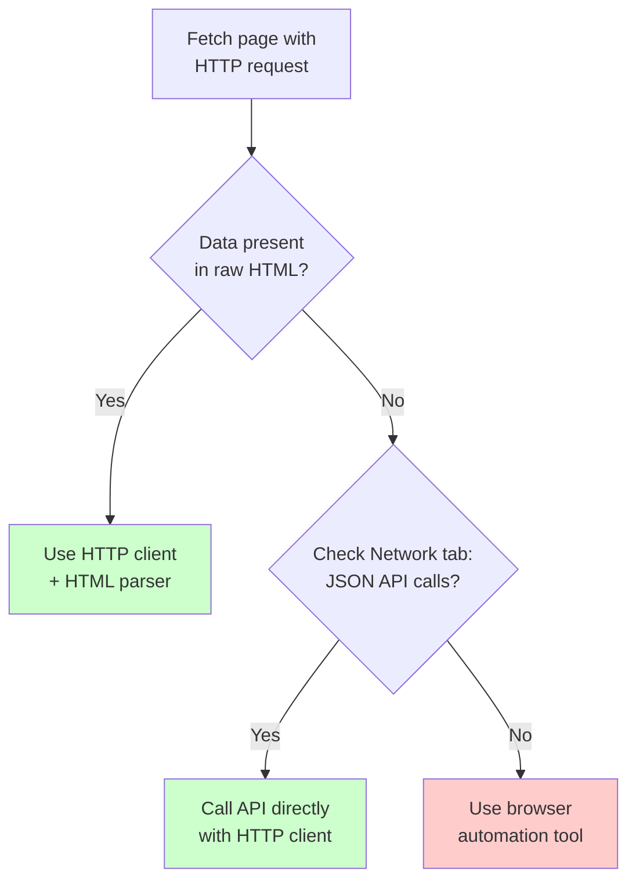
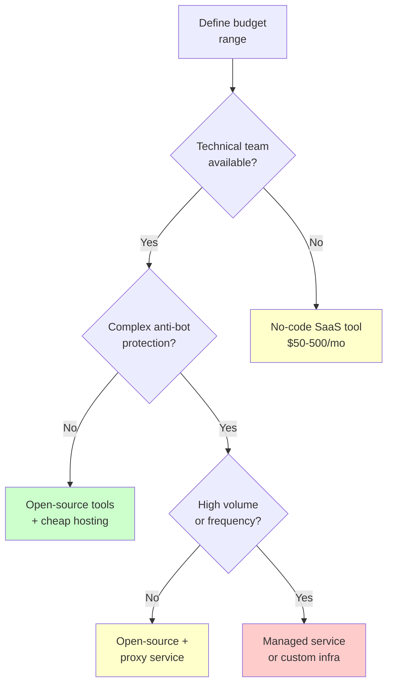
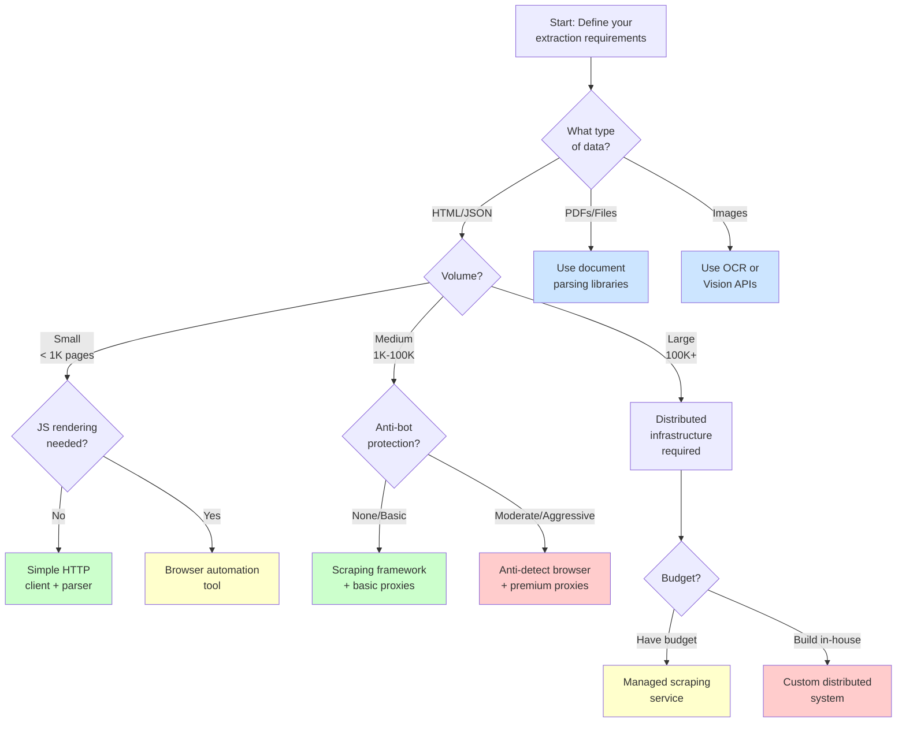

Before you pick a scraping tool, sign up for a data extraction service, or assign your team to build something custom, stop and ask yourself a set of questions. The answers will narrow the field from hundreds of options to a handful that actually fit your situation. Skipping this step is how teams end up paying for enterprise SaaS when a Python script would have worked, or hacking together BeautifulSoup when they actually need a full browser automation pipeline. The wrong choice costs time, money, and sometimes legal headaches. This post walks through the ten questions you should answer before committing to any data extraction approach.

## Question 1: What Type of Data Are You Extracting?

The nature of the data itself is the first filter. Different data types require fundamentally different extraction methods.

**Structured HTML** -- product listings, directory pages, search results. These are the most common targets and the most approachable. Standard HTTP requests plus a parser like BeautifulSoup, Cheerio, or Scrapy handle them well. The data lives in predictable HTML elements with CSS classes or IDs you can target.

**API/JSON responses** -- many modern sites load data through internal APIs that return structured JSON. If you can find and replicate these API calls, you skip the HTML parsing entirely. The data arrives clean and structured. Tools like `requests`, `httpx`, or even `curl` are often sufficient.

**Files and documents** -- PDFs, spreadsheets, Word documents hosted on websites. These require specialized parsers. Libraries like `pdfplumber`, `tabula-py`, or `Apache Tika` handle document extraction. The challenge is not accessing the files but extracting structured data from unstructured formats.

**Images and media** -- product photos, charts, screenshots containing text. You need OCR tools like Tesseract or cloud vision APIs. If you are extracting data from chart images, you may need computer vision models or [LLM-based extraction](/posts/best-llm-structured-data-extraction-html-2026/).

```
Data Type          | Primary Tools                    | Complexity
-------------------+----------------------------------+-----------
Structured HTML    | BeautifulSoup, Scrapy, Cheerio   | Low
API/JSON           | requests, httpx, curl            | Low-Medium
Files/PDFs         | pdfplumber, Tika, tabula         | Medium
Images/OCR         | Tesseract, Cloud Vision APIs     | High
```

Why this matters for your choice: a tool that excels at HTML scraping may have zero support for PDF extraction. If your project involves multiple data types, you need a solution that either handles all of them or lets you plug in different parsers.

## Question 2: How Much Data Do You Need?

Volume changes everything. The difference between extracting 100 pages and 100 million pages is not just a matter of waiting longer. It changes the architecture, the tooling, and the cost.

**Small scale (under 1,000 pages)** -- a single-threaded script on your laptop is fine. You do not need proxies, distributed systems, or queue management. A simple Python script with `requests` and BeautifulSoup can finish in minutes. The development time is measured in hours.

**Medium scale (1,000 to 100,000 pages)** -- you need to think about rate limiting, retries, and basic error handling. A framework like Scrapy gives you these features out of the box. You may need a few rotating proxies if the target site has basic rate limiting. Expect development time in days.

**Large scale (100,000 to millions of pages)** -- this is where infrastructure matters. You need distributed crawling, proxy pools, job queues, monitoring, and failure recovery. Tools like Scrapy with a distributed backend, custom systems built on cloud functions, or managed scraping services become necessary. Development time is measured in weeks to months.

**Continuous scale (ongoing collection at high volume)** -- the most demanding category. You need everything from the large-scale tier plus scheduling, change detection, deduplication, and data pipeline management. This is where managed services or dedicated infrastructure teams earn their cost.

```
Volume             | Infrastructure            | Dev Time   | Cost Range
-------------------+---------------------------+------------+-----------
< 1K pages         | Local machine             | Hours      | Free
1K - 100K pages    | Single server + proxies   | Days       | $50-500/mo
100K - 1M pages    | Distributed + proxy pool  | Weeks      | $500-5K/mo
1M+ ongoing        | Cloud infra + monitoring  | Months     | $5K+/mo
```

The mistake teams make is overbuilding for small projects or underbuilding for large ones. If you need 500 product pages once a quarter, do not buy an enterprise scraping subscription. If you need real-time pricing data from 50,000 SKUs across 20 retailers, do not try to run it from a cron job on your laptop.

## Question 3: How Often Do You Need the Data?

Frequency determines whether you need a script or a system.

**One-time extraction** -- run a script, get the data, done. You can tolerate manual intervention, imperfect error handling, and ad-hoc fixes. The cheapest option is almost always the right one. Write a script, run it, clean up the output manually if needed.

**Periodic updates (daily, weekly, monthly)** -- you need scheduling, monitoring, and alerting. What happens when the script fails at 3 AM on a Sunday? You need retry logic, failure notifications, and a way to detect when the target site changes its structure. Cron jobs work for simple cases. Airflow, Prefect, or managed services handle more complex workflows.

**Near-real-time (minutes to hours)** -- price monitoring, news aggregation, social media tracking. You need a system that runs continuously, handles failures gracefully, and delivers data to downstream consumers quickly. Webhook-based architectures or streaming pipelines become relevant. Latency matters.

**True real-time (seconds)** -- stock prices, live event data, instant alerts. This is the most demanding tier. You likely need WebSocket connections, server-sent events, or very aggressive polling with change detection. Few scraping tools handle this well. You may be better served by official APIs or data feeds if they exist.

The frequency question also affects your relationship with the target site. A one-time crawl that takes 10 minutes is invisible. A scraper that hits the same site every 30 seconds, 24/7, will get noticed and blocked.

## Question 4: Does the Site Require JavaScript Rendering?

This is one of the most important technical questions and one that many teams answer incorrectly.

**Static sites (server-rendered HTML)** -- the HTML returned by the server contains all the data you need. An HTTP request with `requests` or `httpx` gives you the complete page. No browser needed. This is faster, cheaper, and simpler. Always check whether the data is in the raw HTML before reaching for a browser.

**Dynamic sites (client-rendered with JavaScript)** -- the server returns a shell page, and JavaScript builds the actual content in the browser. React, Vue, and Angular applications work this way. You need a real browser (Playwright, Puppeteer, Selenium) or a headless rendering service to get the data. This is slower and more resource-intensive.

**Hybrid sites** -- some data is server-rendered, some is loaded dynamically. Product titles might be in the HTML, but prices load via AJAX calls. Check both the raw HTML and the network requests to understand where each piece of data comes from.

**How to check**: use `curl` or `requests` to fetch the page and compare the response with what you see in a browser. If the data is missing from the raw HTML, check the browser's Network tab for XHR/Fetch requests. Often the dynamic data comes from a clean JSON API that you can call directly, avoiding the browser entirely.



Choosing a browser-based tool when you do not need one adds 10-50x overhead per page. The [performance gap between requests and Selenium](/posts/python-requests-vs-selenium-speed-performance-comparison/) illustrates this clearly. Choosing an HTTP-only tool when you need rendering means you get empty results. Get this question right early.


<figure>
  
  <figcaption>Web scraping is the bridge between the visible web and usable data. <span class="img-credit">Photo by Google DeepMind / <a href="https://www.pexels.com" target="_blank" rel="noopener noreferrer">Pexels</a></span></figcaption>
</figure>

## Question 5: Is the Data Behind Authentication?

Public data and authenticated data require very different approaches.

**Publicly accessible data** -- no login required. Anyone with a browser can see it. This is the simplest case for scraping. Standard tools work without special configuration. You still need to respect robots.txt and rate limits, but the technical barriers are low.

**Login-required data** -- the data is behind a sign-in wall. You need to handle authentication flows, session management, cookies, and potentially CSRF tokens. Browser automation tools handle this more naturally since they can fill in login forms and maintain session state. HTTP-based tools require you to reverse-engineer the authentication flow and manage cookies manually.

**OAuth/SSO authentication** -- enterprise sites that use single sign-on, multi-factor authentication, or OAuth flows. These are significantly harder to automate. You may need to maintain persistent browser sessions, handle token refresh, or use API keys if available.

**Subscription or paywall content** -- data that requires an active paid subscription. Beyond the technical challenges, you need to consider whether your terms of service allow automated access. Many subscriptions explicitly prohibit scraping.

Key considerations for authenticated scraping:

- Session cookies expire. Your scraper needs to re-authenticate periodically.
- Rate limiting is often stricter for authenticated users because the site can tie requests to your account.
- Getting your account banned means losing access entirely. Use conservative rate limits.
- Some sites detect automated logins and trigger CAPTCHAs or account locks.

## Question 6: What Anti-Bot Protections Does the Target Site Use?

The anti-bot landscape ranges from nothing to sophisticated systems that detect and block automated access in milliseconds.

**No protection** -- small sites, personal blogs, government data portals. Standard HTTP requests work. No special headers, no proxy rotation needed.

**Basic protection** -- rate limiting, user-agent checking, basic IP blocking. Solved with proper request headers, reasonable delays between requests, and a small set of rotating proxies.

**Moderate protection** -- services like basic Cloudflare, Akamai Bot Manager in passive mode, or custom WAF rules. You may need browser-level fingerprint management, residential proxies, or tools like `undetected-chromedriver` or `camoufox`.

**Aggressive protection** -- advanced Cloudflare Turnstile, Akamai Bot Manager, PerimeterX, DataDome, or custom ML-based detection. These systems analyze TLS fingerprints, browser fingerprints, mouse movements, and behavioral patterns. You need specialized anti-detection tools, premium residential proxies, and careful behavioral mimicry. Even with all of this, success is not guaranteed.

```
Protection Level   | Tools Needed                          | Success Rate
-------------------+---------------------------------------+------------
None               | requests, curl                        | ~100%
Basic              | requests + headers + proxies          | ~95%
Moderate           | Browser automation + proxy rotation   | ~70-90%
Aggressive         | Anti-detect browser + residential     | ~40-70%
                   | proxies + behavioral mimicry          |
```

Be honest about the protection level before choosing tools. A tool vendor telling you their solution works on "any site" is either lying or charging enough to make the economics questionable. Run a quick test: try fetching the page with a simple HTTP request. If it works, you know the protection level is low. If you get a CAPTCHA or a block page, investigate further.

## Question 7: What Is Your Team's Technical Skill Level?

The best tool is one your team can actually use and maintain.

**Non-technical users** -- no-code scraping tools like Octoparse, ParseHub, or Browse AI provide visual point-and-click interfaces. You select elements on the page, configure pagination, and export to CSV or a spreadsheet. These tools handle simple cases well but struggle with complex sites, authentication, or anti-bot protection.

**Junior developers** -- Python with BeautifulSoup or Node.js with Cheerio are approachable starting points. Scrapy has more of a learning curve but provides a complete framework. Playwright's codegen feature can generate automation scripts from manual browser interaction, lowering the barrier.

**Experienced developers** -- can work with any tool. The choice becomes about matching the tool to the problem rather than the team's capabilities. Custom solutions, framework extensions, and infrastructure management are all on the table.

**Data engineering teams** -- likely want tools that integrate with existing data pipelines, support scheduling, and provide monitoring. They care about reliability, data quality validation, and integration with tools like Airflow, dbt, or their data warehouse.

A common mistake is choosing a developer-oriented tool for a non-technical team and expecting them to maintain it. Another is choosing a no-code tool for a complex scraping project that will inevitably outgrow its capabilities. Match the tool to both the problem and the people who will use it.


<figure>
  
  <figcaption>The web is vast, but the right tools make it navigable. <span class="img-credit">Photo by Matheus Bertelli / <a href="https://www.pexels.com" target="_blank" rel="noopener noreferrer">Pexels</a></span></figcaption>
</figure>

## Question 8: What Is Your Budget?

Data extraction costs range from zero to tens of thousands of dollars per month. Understanding your budget narrows the field quickly.

**Free and open-source** -- Scrapy, BeautifulSoup, Playwright, Puppeteer, Selenium. You pay nothing for the tools. Your costs are developer time and infrastructure (servers, proxies, storage). Best for teams with technical skills and time.

**Low budget ($50-500/month)** -- basic proxy services, simple managed scraping tools, or cloud hosting for your own scrapers. Services like ScraperAPI, Bright Data's pay-as-you-go plans, or small-scale SaaS tools fit here. Suitable for medium-volume projects without extreme anti-bot challenges.

**Medium budget ($500-5,000/month)** -- premium proxy networks, managed scraping platforms, or dedicated cloud infrastructure. You get residential proxies, CAPTCHA-solving services, and managed browser pools. Suitable for large-scale or high-difficulty scraping projects.

**Enterprise budget ($5,000+/month)** -- full-service data providers, custom data feeds, or licensed data partnerships. At this level, consider whether buying the data directly from a provider is more cost-effective than scraping it yourself. Companies like Bright Data, Oxylabs, or specialized data vendors offer ready-made datasets.

The budget question interacts with every other question. High-volume, high-frequency scraping of heavily protected sites with authenticated access requires the largest budget. Low-volume, one-time scraping of public static sites costs nothing but developer time.



## Question 9: What Are the Legal and Ethical Considerations?

Legal questions are not optional. Ignoring them does not make them go away. It makes them more expensive when they eventually surface.

**Publicly available data** -- data that anyone can access without logging in, that is not marked as copyrighted, and that does not contain personal information. This is the safest category, though "safe" does not mean "unrestricted." Court rulings vary by jurisdiction.

**Terms of Service restrictions** -- many websites explicitly prohibit automated access in their ToS. Violating ToS is not always illegal, but it can lead to account bans, IP blocks, or civil lawsuits. Read the ToS before you scrape.

**Personal data** -- names, email addresses, phone numbers, user profiles. GDPR, CCPA, and similar regulations impose strict rules on collecting and processing personal data. "It was publicly visible" is not a defense under these laws. You need a lawful basis for processing, and you must handle the data according to the regulation.

**Copyrighted content** -- articles, images, creative works. Scraping copyrighted content for redistribution is infringement. Scraping it for analysis may fall under fair use in some jurisdictions, but this is a legal gray area.

**Competitor data** -- pricing, product catalogs, inventory levels. Generally permissible if the data is publicly available and you are not misrepresenting yourself or causing harm to the site. However, aggressive scraping that disrupts service can lead to legal action under computer fraud statutes.

Key practices to reduce legal risk:

- Check robots.txt and respect its directives.
- Identify your scraper with an honest user-agent string.
- Rate-limit your requests to avoid impacting site performance.
- Do not scrape personal data unless you have a clear legal basis.
- Consult a lawyer if the data involves personal information, copyrighted content, or competitor intelligence at scale.
- Keep records of what you scraped, when, and how.

## Question 10: How Should the Data Be Delivered?

The output format and delivery mechanism affect your tool choice more than most teams realize.

**CSV/Excel files** -- the simplest option. Almost every scraping tool can export to CSV. Good for one-time projects, small datasets, or feeding into spreadsheet-based workflows. Breaks down at scale or with complex nested data.

**Databases (SQL/NoSQL)** -- for ongoing projects that need queryable, structured storage. Scrapy has built-in database pipelines. Custom scripts can write directly to PostgreSQL, MySQL, MongoDB, or SQLite. You need to design a schema and handle deduplication.

**APIs** -- your scraping system exposes the collected data through its own API. Other internal systems consume the data on demand. This requires building and maintaining an API layer on top of your scraping infrastructure.

**Data warehouses** -- BigQuery, Snowflake, Redshift. For teams that want scraped data alongside other business data for analytics. The scraping pipeline feeds into the warehouse through ETL/ELT processes.

**Streaming/webhooks** -- real-time delivery of extracted data to downstream consumers. New data triggers a webhook or appears on a message queue (Kafka, RabbitMQ, SQS). Required for real-time monitoring use cases.

Think about the delivery format from the start, not as an afterthought. A tool that extracts data perfectly but cannot output it in the format your downstream systems need creates extra work.


<figure>
  
  <figcaption>Scraping at scale is a craft that balances speed, stealth, and reliability. <span class="img-credit">Photo by Quang Nguyen Vinh / <a href="https://www.pexels.com" target="_blank" rel="noopener noreferrer">Pexels</a></span></figcaption>
</figure>

## The Decision Flowchart

Answering these ten questions maps you to a general approach. The following diagram captures the most common decision paths.



## Tool Recommendations by Scenario

Rather than recommending a single tool, here are common scenarios mapped to appropriate solutions.

**Scenario A: Small-scale, static HTML, one-time, no protection.**
Use Python with `requests` and BeautifulSoup, or Node.js with `axios` and Cheerio. Total cost: free. Development time: a few hours.

**Scenario B: Medium-scale, dynamic content, periodic updates, basic protection.**
Use Scrapy with Playwright integration, or standalone Playwright scripts. Our [mega comparison of Playwright, Puppeteer, Selenium, and Scrapy](/posts/playwright-vs-puppeteer-vs-selenium-vs-scrapy-2026-mega-comparison/) covers these tools in detail. Add a basic proxy rotation service. Total cost: $50-200/month for proxies. Development time: a few days.

**Scenario C: Large-scale, aggressive anti-bot, frequent updates, authenticated.**
Use Camoufox or nodriver for stealth browser automation. Add residential proxy rotation through Bright Data or Oxylabs. Build scheduling and monitoring with Airflow or a similar orchestrator. Total cost: $1,000-5,000/month. Development time: weeks.

**Scenario D: Non-technical team, moderate volume, periodic updates.**
Use a managed SaaS tool like Apify, Browse AI, or Octoparse. Trade higher per-page costs for lower development effort. Total cost: $100-1,000/month depending on volume. Development time: hours.

**Scenario E: Enterprise-scale, mission-critical, multiple data types.**
Evaluate whether buying data directly from a provider is cheaper than building extraction infrastructure. If building, invest in a dedicated data engineering team. Total cost: $5,000+/month. Development time: months.

```
Scenario | Volume    | JS?  | Anti-Bot   | Skill  | Recommended Approach
---------+-----------+------+------------+--------+-------------------------
A        | Small     | No   | None       | Any    | HTTP client + parser
B        | Medium    | Yes  | Basic      | Dev    | Scrapy + Playwright
C        | Large     | Yes  | Aggressive | Senior | Anti-detect + proxies
D        | Medium    | Mixed| Basic      | None   | Managed SaaS
E        | Very Large| Mixed| Varies     | Team   | Custom infra or vendor
```

## Red Flags When Evaluating Scraping Services

If you decide to use a managed service or third-party tool, watch for these warning signs during evaluation.

**"Works on any website"** -- no tool works on every website. Sites with aggressive anti-bot protection will defeat generic solutions. If a vendor claims universal coverage, ask them to demonstrate on your specific target sites during a trial period.

**No trial or proof-of-concept period** -- any legitimate scraping service should offer a trial. If they want a long-term contract before you can test with your actual target sites, walk away. What works in a demo may fail on the sites you actually need.

**Opaque pricing** -- "contact sales for pricing" without even a ballpark range is a red flag. You should be able to estimate your monthly cost before talking to a salesperson. Ask for per-request or per-page pricing and calculate your expected volume.

**No data quality guarantees** -- the service extracts data, but what happens when it is wrong? Ask about accuracy rates, validation, and what happens when a target site changes its structure. A service that delivers garbage data on time is worse than no service at all.

**Ignoring legal questions** -- if a vendor does not ask about your use case, target sites, or data handling requirements, they are not thinking about compliance. A responsible provider will want to understand what you are scraping and why.

**Lock-in through proprietary formats** -- your extracted data should be exportable in standard formats. If the service stores your data in a proprietary system with no export option, you are locked in. Always verify that you can get your data out.

**No monitoring or alerting** -- for ongoing scraping projects, you need to know when extraction fails. If the service does not provide monitoring, failure notifications, or data freshness indicators, you will not know about problems until your downstream systems break.

## Putting It All Together

The ten questions in this post are not academic exercises. They are a practical framework for avoiding the two most common mistakes in data extraction projects: choosing a tool that is too simple for your needs, and choosing one that is too complex.

Start with the data type and volume questions -- they eliminate the most options fastest. Then layer in the technical questions about rendering, authentication, and anti-bot protection. Finally, apply the practical constraints of budget, team skills, and legal requirements.

If you answer all ten questions honestly, you will have a clear picture of what you need. The tool choice becomes obvious, or at least narrows to two or three options you can evaluate with a quick proof-of-concept. That is significantly better than picking the tool with the best marketing and hoping for the best.

Document your answers. When the project evolves -- more sites, higher volume, different data types -- revisit the questions. The right tool for today's requirements may not be the right tool six months from now, and that is fine. Better to switch tools deliberately than to discover you have outgrown yours during a production outage.
