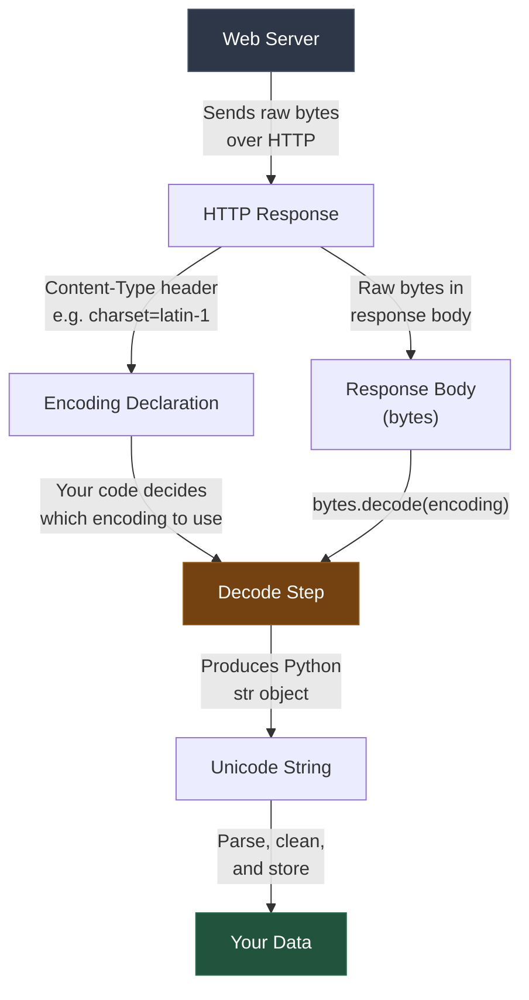
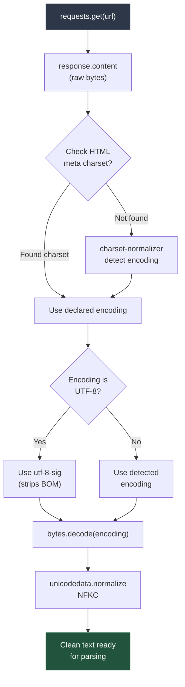
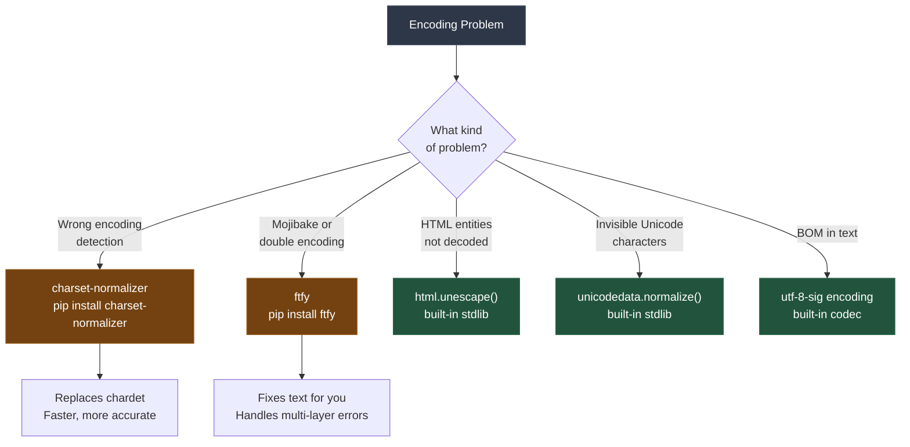

Encoding issues are the number one source of corrupted scraped data, producing everything from [replacement characters](/posts/some-characters-could-not-be-decoded-fixing-replacement-character-errors/) to [garbled text](/posts/how-to-decode-garbled-text-fixing-encoding-mismatches/). You fetch a page, parse the HTML, and everything looks fine -- until you open the CSV and find `Café` instead of `Cafe`, `â€"` instead of an em dash, or invisible characters that silently break your downstream processing. These problems are not random. They follow a small number of predictable patterns, and each one has a concrete fix. This guide walks through the six most common text encoding problems you will encounter when scraping the web with Python, shows exactly what goes wrong in each case, and provides copy-paste code to fix every one of them.

## How Text Flows From Server to Your Python Script

Before diving into specific problems, it helps to understand the pipeline that text travels through when you scrape a page. Every encoding bug happens at one of these stages.



The critical insight: the server sends **bytes**, not text. Those bytes only become readable text when you decode them with the correct [encoding](/posts/character-encodings-handling-text/). When you use `response.text` in the `requests` library, it picks an encoding for you -- and it often picks wrong.

```python
import requests

response = requests.get("https://example.com/page")

# What most people use (risky):
text = response.text  # requests guesses the encoding

# What you should use:
raw_bytes = response.content  # get the raw bytes
# Then decode explicitly with the correct encoding
```

The `requests` library follows RFC 2616, which says that if no charset is specified in the Content-Type header, the default for `text/html` is `ISO-8859-1` (latin-1). This is almost always wrong for modern websites, which overwhelmingly use UTF-8.

## Problem 1: Server Says Latin-1, Content Is UTF-8

This is the most common encoding problem in web scraping. The server either omits the charset declaration or sets it to `latin-1`, but the actual page content is encoded in UTF-8.

### What Goes Wrong

```python
import requests

response = requests.get("https://example.com/french-restaurant")
print(response.encoding)
# Output: 'ISO-8859-1'  <-- requests assumed this

print(response.text)
# Output: 'Le Café des Amiés'
# Should be: 'Le Cafe des Amies'
```

The garbled text `Café` appears because the UTF-8 byte sequence for `e` (two bytes: `0xC3 0xA9`) is being interpreted as two separate latin-1 characters: `A` (`0xC3`) and `(c)` (`0xA9`).

### The Fix: Detect Actual Encoding

```python
import requests
from charset_normalizer import from_bytes

def fetch_with_correct_encoding(url):
    """Fetch a page and decode with the actual encoding, not the declared one."""
    response = requests.get(url)
    raw_bytes = response.content

    # Strategy 1: Check the HTML meta tag
    # Many pages declare encoding in <meta charset="utf-8">
    # even when the HTTP header says something different
    if b'charset="utf-8"' in raw_bytes.lower() or b"charset=utf-8" in raw_bytes.lower():
        return raw_bytes.decode("utf-8", errors="replace")

    # Strategy 2: Use charset-normalizer to detect encoding
    result = from_bytes(raw_bytes).best()
    if result is not None:
        detected_encoding = result.encoding
        print(f"Detected encoding: {detected_encoding}")
        return raw_bytes.decode(detected_encoding, errors="replace")

    # Strategy 3: Fall back to UTF-8
    return raw_bytes.decode("utf-8", errors="replace")


# Usage
text = fetch_with_correct_encoding("https://example.com/french-restaurant")
print(text)
# Output: 'Le Cafe des Amies'
```

```python
# Quick fix if you know the page is UTF-8:
response = requests.get("https://example.com/page")
response.encoding = "utf-8"  # Override the detected encoding
text = response.text  # Now decodes correctly
```

Install `charset-normalizer` with:

```bash
pip install charset-normalizer
```

This library is a pure-Python replacement for `chardet` and is significantly faster. It examines byte patterns to determine the most likely encoding. For a detailed comparison of [charset detection libraries](/posts/charset-detection-python-chardet-cchardet-charset-normalizer/) including chardet, cchardet, and charset-normalizer, see our dedicated breakdown.

## Problem 2: Mixed Encodings on the Same Page

Some pages serve content that was assembled from multiple sources, each encoded differently. A page might have UTF-8 headers and navigation but latin-1 product descriptions pulled from a legacy database, or windows-1252 user comments.

### What Goes Wrong

```python
# The page header is UTF-8, but a product description
# was inserted from a legacy latin-1 database
page_bytes = (
    b'<html><head><meta charset="utf-8"></head>'
    b"<body>"
    b"<h1>Products</h1>"
    b"<p>Premium Caf\xe9 Blend</p>"  # latin-1 encoded 'e'
    b"<p>Cr\xc3\xa8me Br\xc3\xbbl\xc3\xa9e</p>"  # UTF-8 encoded
    b"</body></html>"
)

# Decoding as UTF-8 will corrupt the latin-1 section
text = page_bytes.decode("utf-8", errors="replace")
print(text)
# The latin-1 'Cafe' becomes 'Caf\ufffd' (replacement character)
```

### The Fix: Use ftfy or Process Sections Separately

```python
import ftfy

# ftfy (fixes text for you) can repair many mixed-encoding issues
mangled_text = page_bytes.decode("utf-8", errors="replace")
fixed_text = ftfy.fix_text(mangled_text)
print(fixed_text)
```

For more control, process different sections with different encodings:

```python
from bs4 import BeautifulSoup

def decode_mixed_page(raw_bytes):
    """Handle pages with mixed encodings by trying multiple decoders."""
    # First pass: decode as UTF-8, replacing errors
    text = raw_bytes.decode("utf-8", errors="replace")
    soup = BeautifulSoup(text, "html.parser")

    for element in soup.find_all(string=True):
        if "\ufffd" in element:
            # This section had decoding errors -- try latin-1
            # Find the byte range and re-decode
            original = element.encode("utf-8")
            # Replace the replacement characters by trying latin-1
            try:
                fixed = original.replace(
                    b"\xef\xbf\xbd",  # UTF-8 encoding of U+FFFD
                    b"?"
                )
                element.replace_with(fixed.decode("utf-8"))
            except (UnicodeDecodeError, UnicodeEncodeError):
                pass

    return str(soup)


# A more practical approach: re-decode the raw bytes with ftfy
import ftfy

def fix_mixed_encoding(raw_bytes):
    """Try UTF-8 first, then fix any mojibake with ftfy."""
    text = raw_bytes.decode("utf-8", errors="replace")
    return ftfy.fix_text(text)
```

Install ftfy with:

```bash
pip install ftfy
```

The `ftfy` library is specifically designed to fix "mojibake" -- text that has been decoded with the wrong encoding. It recognizes common patterns of encoding errors and reverses them.

## Problem 3: HTML Entities Not Decoded

HTML entities are sequences like `&amp;`, `&lt;`, `&#233;`, and `&#x00E9;` that represent special characters. When you extract raw HTML text, these entities may remain as literal strings rather than being converted to their actual characters.

### What Goes Wrong

```python
import requests
from bs4 import BeautifulSoup

# Simulating raw HTML with entities
html = '<p>Tom &amp; Jerry &mdash; a classic. Price: &pound;5.99</p>'
html += '<p>R&eacute;sum&eacute; for caf&#233; position</p>'

# If you extract text with regex instead of a parser:
import re
raw_text = re.sub(r"<[^>]+>", "", html)
print(raw_text)
# Output: 'Tom &amp; Jerry &mdash; a classic. Price: &pound;5.99'
# Output: 'Resume for caf&#233; position'
# Entities are still escaped
```

### The Fix: Use html.unescape() or BeautifulSoup

```python
import html

# Fix 1: html.unescape() from the standard library
raw_text = "Tom &amp; Jerry &mdash; a classic. Price: &pound;5.99"
clean_text = html.unescape(raw_text)
print(clean_text)
# Output: 'Tom & Jerry -- a classic. Price: PS5.99'

# Fix numeric entities too
raw_text_2 = "R&eacute;sum&eacute; for caf&#233; position"
clean_text_2 = html.unescape(raw_text_2)
print(clean_text_2)
# Output: 'Resume for cafe position'
```

```python
from bs4 import BeautifulSoup

# Fix 2: BeautifulSoup auto-decodes entities when extracting text
html_content = """
<p>Tom &amp; Jerry &mdash; a classic. Price: &pound;5.99</p>
<p>R&eacute;sum&eacute; for caf&#233; position</p>
"""

soup = BeautifulSoup(html_content, "html.parser")
for p in soup.find_all("p"):
    print(p.get_text())
# Output: 'Tom & Jerry -- a classic. Price: PS5.99'
# Output: 'Resume for cafe position'
```

The rule is simple: if you are using [regex to strip HTML tags](/posts/regex-for-web-scraping-extracting-data-without-parser/), you must also call `html.unescape()` on the result. If you are using BeautifulSoup or lxml, the `.get_text()` method handles entity decoding automatically.

```python
import re
import html


def strip_html_safely(raw_html):
    """Remove HTML tags AND decode entities."""
    # Remove tags
    text = re.sub(r"<[^>]+>", "", raw_html)
    # Decode entities
    text = html.unescape(text)
    return text


print(strip_html_safely("<p>Price: &pound;5.99 &mdash; 50% off!</p>"))
# Output: 'Price: PS5.99 -- 50% off!'
```


<figure>
  
  <figcaption>Web scraping is the bridge between the visible web and usable data. <span class="img-credit">Photo by Google DeepMind / <a href="https://www.pexels.com" target="_blank" rel="noopener noreferrer">Pexels</a></span></figcaption>
</figure>

## Problem 4: Double-Encoded UTF-8

Double encoding happens when UTF-8 text is mistakenly decoded as latin-1 and then re-encoded as UTF-8. The result is a sequence of bytes that looks like UTF-8 on the surface but contains garbled multi-byte sequences.

### What Goes Wrong

```python
# How double encoding happens on the server side:
original = "Cafe"
utf8_bytes = original.encode("utf-8")         # b'Caf\xc3\xa9'
# Server mistakenly treats these bytes as latin-1 and re-encodes to UTF-8:
wrong_string = utf8_bytes.decode("latin-1")    # 'Café' (each byte as latin-1 char)
double_encoded = wrong_string.encode("utf-8")  # b'Caf\xc3\x83\xc2\xa9'

# What you see when you scrape it:
print(double_encoded.decode("utf-8"))
# Output: 'Café'
# The e became two characters: A-tilde and copyright sign
```

### The Fix: Reverse the Double Encoding

```python
def fix_double_encoded_utf8(text):
    """Fix text that was encoded to UTF-8 twice.

    The pattern: original UTF-8 bytes were read as latin-1,
    then encoded back to UTF-8. Reverse the process.
    """
    try:
        # Encode back to bytes using latin-1 (reverses the wrong decode)
        as_bytes = text.encode("latin-1")
        # Now decode those bytes as UTF-8 (the original encoding)
        return as_bytes.decode("utf-8")
    except (UnicodeDecodeError, UnicodeEncodeError):
        return text  # Return original if the fix doesn't apply


# Test it
garbled = "Café"
fixed = fix_double_encoded_utf8(garbled)
print(f"Before: {garbled}")
print(f"After:  {fixed}")
# Before: Café
# After:  Cafe
```

```python
# More examples of double-encoded text and their fixes:
test_cases = [
    ("Crème Brûlée", "Creme Brulee"),
    ("naïve", "naive"),
    ("Español", "Espanol"),
    ("über", "uber"),
]

for garbled, expected in test_cases:
    fixed = fix_double_encoded_utf8(garbled)
    status = "PASS" if fixed == expected else "FAIL"
    print(f"[{status}] '{garbled}' -> '{fixed}' (expected '{expected}')")
```

You can also use `ftfy` for this, which handles double encoding automatically:

```python
import ftfy

print(ftfy.fix_text("Café"))
# Output: 'Cafe'

print(ftfy.fix_text("Crème Brûlée"))
# Output: 'Creme Brulee'
```

The `ftfy` library detects many layers of encoding errors and can even fix triple-encoded text.

## Problem 5: BOM (Byte Order Mark) Appearing in Text

The Byte Order Mark (BOM) is an invisible character (`U+FEFF`) placed at the beginning of a file to indicate its encoding and byte order. UTF-8 files sometimes include a BOM (`EF BB BF` in hex), and when you decode them with plain `utf-8`, the BOM appears as a visible character or invisible zero-width space at the start of the text.

### What Goes Wrong

```python
# Simulating a UTF-8 file with BOM
bom_bytes = b"\xef\xbb\xbfProduct Name,Price\nWidget,9.99"

# Decoding with standard utf-8 keeps the BOM
text = bom_bytes.decode("utf-8")
print(repr(text[:20]))
# Output: '\ufeffProduct Name'
# The \ufeff BOM is invisible but present

# This causes problems:
lines = text.strip().split("\n")
headers = lines[0].split(",")
print(repr(headers[0]))
# Output: '\ufeffProduct Name'  <-- BOM is stuck to the first field

# Your dictionary keys will silently mismatch:
data = dict(zip(headers, lines[1].split(",")))
print("Product Name" in data)
# Output: False  <-- because the key is actually '\ufeffProduct Name'
```

### The Fix: Use utf-8-sig Encoding

```python
# Fix: use 'utf-8-sig' which strips the BOM automatically
bom_bytes = b"\xef\xbb\xbfProduct Name,Price\nWidget,9.99"

text = bom_bytes.decode("utf-8-sig")
print(repr(text[:20]))
# Output: 'Product Name,Price\n'
# BOM is gone

# For requests:
import requests

response = requests.get("https://example.com/data.csv")
text = response.content.decode("utf-8-sig")
```

```python
# If you already have a string with a BOM:
def strip_bom(text):
    """Remove BOM from the start of a string if present."""
    if text.startswith("\ufeff"):
        return text[1:]
    return text

text_with_bom = "\ufeffProduct Name,Price"
clean_text = strip_bom(text_with_bom)
print(repr(clean_text))
# Output: 'Product Name,Price'
```

```python
# When reading files from disk that might have BOMs:
with open("downloaded_data.csv", encoding="utf-8-sig") as f:
    content = f.read()
# The BOM is automatically stripped

# For CSV files specifically:
import csv

with open("downloaded_data.csv", encoding="utf-8-sig", newline="") as f:
    reader = csv.DictReader(f)
    for row in reader:
        print(row["Product Name"])  # Works correctly, no BOM prefix
```

## Problem 6: Non-Breaking Spaces and Invisible Unicode

Web pages are full of invisible Unicode characters that look like regular spaces or empty strings but are not. The most common offender is the non-breaking space (`\u00a0`, which HTML represents as `&nbsp;`), but there are dozens of others: zero-width spaces, soft hyphens, right-to-left marks, and more.

### What Goes Wrong

```python
from bs4 import BeautifulSoup

html = '<span>Price:&nbsp;$29.99</span>'
soup = BeautifulSoup(html, "html.parser")
price_text = soup.find("span").get_text()

# Looks fine when printed:
print(price_text)
# Output: 'Price: $29.99'

# But string operations fail:
print(price_text.split(" "))
# Output: ['Price:\xa0$29.99']  <-- didn't split on the nbsp

# Pattern matching breaks:
import re
match = re.search(r"Price: \$(\d+\.\d+)", price_text)
print(match)
# Output: None  <-- the space isn't a regular space
```

### The Fix: Normalize with unicodedata

```python
import unicodedata


def normalize_unicode(text):
    """Replace non-breaking spaces, zero-width chars, and normalize Unicode forms."""
    # NFKD normalization converts compatibility characters
    # to their canonical equivalents:
    # - non-breaking space -> regular space
    # - fullwidth digits -> regular digits
    # - ligatures -> separate characters
    text = unicodedata.normalize("NFKC", text)

    # Remove zero-width characters that normalization doesn't handle
    zero_width_chars = [
        "\u200b",  # zero-width space
        "\u200c",  # zero-width non-joiner
        "\u200d",  # zero-width joiner
        "\u200e",  # left-to-right mark
        "\u200f",  # right-to-left mark
        "\u2060",  # word joiner
        "\ufeff",  # zero-width no-break space (BOM)
    ]
    for char in zero_width_chars:
        text = text.replace(char, "")

    return text


# Test it
price_text = "Price:\xa0$29.99"
clean = normalize_unicode(price_text)
print(clean.split(" "))
# Output: ['Price:', '$29.99']  <-- splits correctly now

import re
match = re.search(r"Price: \$(\d+\.\d+)", clean)
print(match.group(1))
# Output: '29.99'
```

```python
# Common invisible characters you will encounter in scraped data:
invisible_examples = {
    "\u00a0": "non-breaking space (nbsp)",
    "\u200b": "zero-width space",
    "\u200c": "zero-width non-joiner",
    "\u200d": "zero-width joiner",
    "\u00ad": "soft hyphen",
    "\u2060": "word joiner",
    "\u2002": "en space",
    "\u2003": "em space",
    "\u2009": "thin space",
    "\ufeff": "zero-width no-break space (BOM)",
}

sample = "Hello\u200b \u00a0World\u200d\u00ad!"
print(f"Original repr: {repr(sample)}")
print(f"Looks like:    {sample}")
print(f"Normalized:    {normalize_unicode(sample)}")
print(f"Norm repr:     {repr(normalize_unicode(sample))}")
```


<figure>
  
  <figcaption>The web is vast, but the right tools make it navigable. <span class="img-credit">Photo by Matheus Bertelli / <a href="https://www.pexels.com" target="_blank" rel="noopener noreferrer">Pexels</a></span></figcaption>
</figure>

## The Safe Scraping Pattern

Based on all the problems above, here is a robust pattern for fetching and decoding web pages. Use this as your default approach instead of relying on `response.text`.

```python
import requests
import html
import unicodedata
from charset_normalizer import from_bytes


def safe_fetch(url, fallback_encoding="utf-8"):
    """Fetch a URL and return correctly decoded, cleaned text.

    This function:
    1. Gets raw bytes (never trusts response.text)
    2. Detects the actual encoding
    3. Decodes explicitly
    4. Strips BOM if present
    5. Normalizes Unicode
    """
    response = requests.get(url, timeout=30)
    raw_bytes = response.content

    # Step 1: Detect encoding from HTML meta tags
    encoding = fallback_encoding
    if b'charset="utf-8"' in raw_bytes[:1024].lower():
        encoding = "utf-8"
    elif b"charset=utf-8" in raw_bytes[:1024].lower():
        encoding = "utf-8"
    else:
        # Step 2: Use charset-normalizer for detection
        result = from_bytes(raw_bytes).best()
        if result is not None and result.encoding:
            encoding = result.encoding

    # Step 3: Decode with BOM handling
    if encoding.lower().replace("-", "") == "utf8":
        encoding = "utf-8-sig"  # Handles BOM automatically

    text = raw_bytes.decode(encoding, errors="replace")

    # Step 4: Normalize Unicode (non-breaking spaces, etc.)
    text = unicodedata.normalize("NFKC", text)

    return text


# Usage
page_text = safe_fetch("https://example.com/products")
```



## Testing: How to Verify Your Text Is Correctly Decoded

After decoding, you should verify the output. Here are practical checks you can run on your scraped text.

```python
def audit_text_encoding(text, label=""):
    """Check scraped text for common encoding problems."""
    issues = []

    # Check 1: Replacement characters indicate failed decoding
    if "\ufffd" in text:
        count = text.count("\ufffd")
        issues.append(f"Contains {count} replacement character(s) U+FFFD")

    # Check 2: Common mojibake patterns (double-encoded UTF-8)
    mojibake_patterns = [
        ("é", "e"),   # UTF-8 e decoded as latin-1
        ("è", "e"),   # UTF-8 e decoded as latin-1
        ("ü", "u"),   # UTF-8 u decoded as latin-1
        ("ñ", "n"),   # UTF-8 n decoded as latin-1
        ("ö", "o"),   # UTF-8 o decoded as latin-1
        ("Ã ", "a"),   # UTF-8 a decoded as latin-1
        ("â€"", "--"),  # UTF-8 em dash decoded as windows-1252
        ("’", "'"),   # UTF-8 right single quote as windows-1252
        ("“", '"'),   # UTF-8 left double quote as windows-1252
    ]
    for garbled, correct in mojibake_patterns:
        if garbled in text:
            issues.append(f"Mojibake detected: '{garbled}' should be '{correct}'")

    # Check 3: BOM at start of text
    if text.startswith("\ufeff"):
        issues.append("BOM (Byte Order Mark) present at start of text")

    # Check 4: Non-breaking spaces
    nbsp_count = text.count("\u00a0")
    if nbsp_count > 0:
        issues.append(f"Contains {nbsp_count} non-breaking space(s)")

    # Check 5: Zero-width characters
    zw_chars = {
        "\u200b": "zero-width space",
        "\u200c": "zero-width non-joiner",
        "\u200d": "zero-width joiner",
    }
    for char, name in zw_chars.items():
        if char in text:
            issues.append(f"Contains {name} (U+{ord(char):04X})")

    # Report
    prefix = f"[{label}] " if label else ""
    if issues:
        print(f"{prefix}ENCODING ISSUES FOUND:")
        for issue in issues:
            print(f"  - {issue}")
    else:
        print(f"{prefix}Text encoding looks clean")

    return len(issues) == 0


# Usage
sample_texts = {
    "Good UTF-8": "Cafe creme brulee",
    "Double encoded": "Café crème brûlée",
    "Has BOM": "\ufeffProduct list",
    "Has nbsp": "Price:\xa0$29.99",
    "Has replacement chars": "Product \ufffd unknown",
}

for label, text in sample_texts.items():
    audit_text_encoding(text, label)
    print()
```

```
[Good UTF-8] Text encoding looks clean

[Double encoded] ENCODING ISSUES FOUND:
  - Mojibake detected: 'é' should be 'e'
  - Mojibake detected: 'è' should be 'e'
  - Mojibake detected: 'û' should be 'u'

[Has BOM] ENCODING ISSUES FOUND:
  - BOM (Byte Order Mark) present at start of text

[Has nbsp] ENCODING ISSUES FOUND:
  - Contains 1 non-breaking space(s)

[Has replacement chars] ENCODING ISSUES FOUND:
  - Contains 1 replacement character(s) U+FFFD
```

## Library Recommendations

Here is a summary of the libraries mentioned in this guide and when to use each one.



| Library | Install | Use Case |
|---------|---------|----------|
| `charset-normalizer` | `pip install charset-normalizer` | Detecting the actual encoding of raw bytes. Drop-in replacement for `chardet` with better performance. |
| `ftfy` | `pip install ftfy` | Fixing mojibake, double encoding, and other text corruption. Feed it garbled text, get clean text back. |
| `html` | Built-in (stdlib) | Decoding HTML entities like `&amp;` and `&#233;` into their actual characters. |
| `unicodedata` | Built-in (stdlib) | Normalizing Unicode forms and handling compatibility characters like non-breaking spaces. |
| `BeautifulSoup` | `pip install beautifulsoup4` | HTML parsing with automatic entity decoding via `.get_text()`. |

### A Minimal requirements.txt for Encoding-Safe Scraping

```text
requests>=2.31.0
beautifulsoup4>=4.12.0
charset-normalizer>=3.3.0
ftfy>=6.1.0
```

## Putting It All Together

Here is a complete example that applies every fix discussed in this guide. This is the pattern you should start with for any scraping project where text quality matters.

```python
import html
import re
import unicodedata

import ftfy
import requests
from bs4 import BeautifulSoup
from charset_normalizer import from_bytes


def scrape_clean_text(url):
    """Scrape a URL and return clean, correctly encoded text.

    Handles:
    - Wrong encoding declarations
    - BOM characters
    - HTML entities
    - Double-encoded UTF-8
    - Non-breaking spaces and invisible Unicode
    """
    # Step 1: Fetch raw bytes
    response = requests.get(url, timeout=30)
    raw_bytes = response.content

    # Step 2: Detect encoding
    encoding = "utf-8"
    meta_match = re.search(
        rb'<meta[^>]+charset=["\']?([a-zA-Z0-9_-]+)', raw_bytes[:2048]
    )
    if meta_match:
        encoding = meta_match.group(1).decode("ascii")
    else:
        detected = from_bytes(raw_bytes).best()
        if detected is not None:
            encoding = detected.encoding

    # Step 3: Decode with BOM handling
    if encoding.lower().replace("-", "").replace("_", "") == "utf8":
        encoding = "utf-8-sig"

    text = raw_bytes.decode(encoding, errors="replace")

    # Step 4: Fix any mojibake from double encoding
    text = ftfy.fix_text(text)

    # Step 5: Parse HTML and extract text
    soup = BeautifulSoup(text, "html.parser")

    # Remove script and style elements
    for element in soup(["script", "style"]):
        element.decompose()

    # Get text (BeautifulSoup handles HTML entities)
    clean_text = soup.get_text(separator="\n", strip=True)

    # Step 6: Normalize Unicode
    clean_text = unicodedata.normalize("NFKC", clean_text)

    # Step 7: Remove zero-width characters
    clean_text = re.sub(r"[\u200b\u200c\u200d\u200e\u200f\u2060\ufeff]", "", clean_text)

    # Step 8: Collapse multiple whitespace
    clean_text = re.sub(r"\n{3,}", "\n\n", clean_text)
    clean_text = re.sub(r" {2,}", " ", clean_text)

    return clean_text.strip()


# Usage
text = scrape_clean_text("https://example.com/article")
print(text)
```

Text encoding is one of those problems that feels mysterious until you understand the small number of ways it breaks. Every garbled character you see in scraped data falls into one of the six categories covered here. Use `response.content` instead of `response.text`, detect the encoding yourself, and normalize the output -- and you will never have to manually fix corrupted text again.
