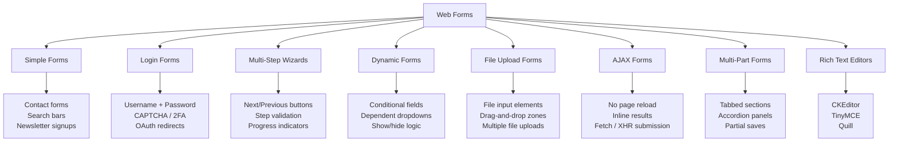
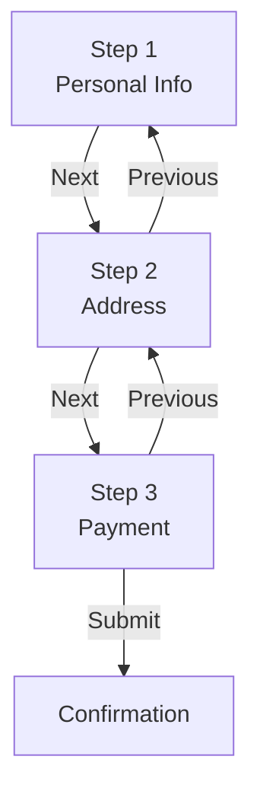
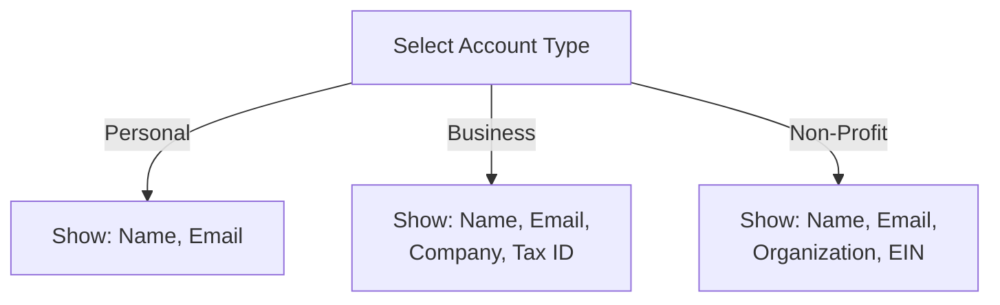
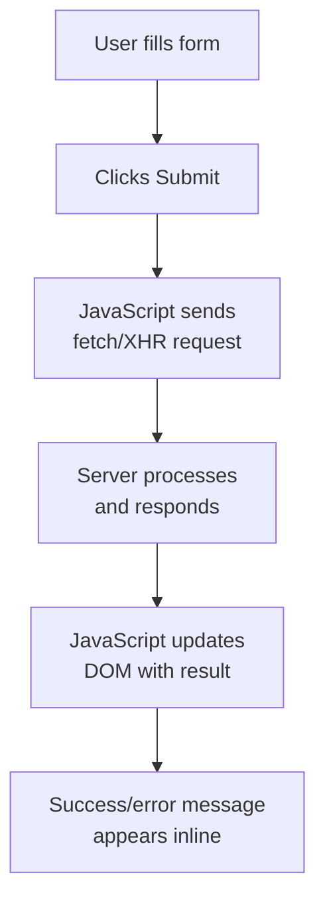
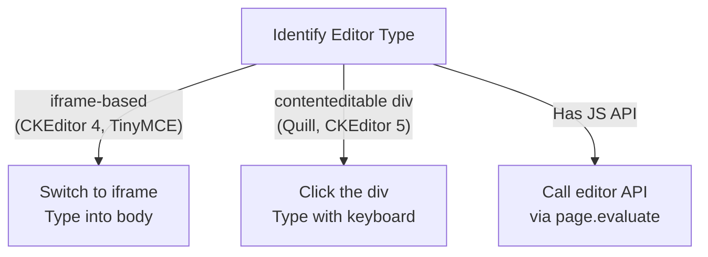

Web forms come in many shapes, and each type requires a different automation strategy. For a broader overview of form automation techniques, see our [complete guide to automating web form filling](/posts/how-to-automate-web-form-filling-complete-guide/). A simple search box and a multi-step checkout wizard may both be `<form>` elements under the hood, but automating them calls for completely different approaches. If you write one generic "fill and submit" script and expect it to work everywhere, you will spend more time debugging than scraping. This post walks through the major types of web forms you will encounter, explains what makes each one tricky, and shows how to handle them with Playwright in Python.

## A Taxonomy of Web Form Types

Before diving into code, it helps to see the landscape. Web forms fall into several distinct categories based on their structure, behavior, and submission mechanism.



Each category has its own quirks. Let us go through them one at a time.

## Simple Contact and Search Forms

These are the most straightforward forms on the web. A few text inputs, maybe a textarea, and a submit button. Contact forms, search bars, and newsletter signup boxes all fall into this category.

What makes them easy: there is no conditional logic, no multi-step flow, and the page typically reloads or redirects on submission.

```python
from playwright.sync_api import sync_playwright

with sync_playwright() as p:
    browser = p.chromium.launch()
    page = browser.new_page()
    page.goto("https://example.com/contact")

    # Fill in the text fields
    page.fill("#name", "Jane Doe")
    page.fill("#email", "jane@example.com")
    page.fill("#message", "Hello, I have a question about your services.")

    # Submit the form
    page.click("button[type='submit']")

    # Wait for confirmation
    page.wait_for_selector(".success-message")
    print(page.text_content(".success-message"))

    browser.close()
```

The pattern is always the same: locate the input, fill it, click submit, and verify the result. For search forms, you sometimes need to press Enter instead of clicking a button.

```python
# Search form variant -- press Enter instead of clicking
page.fill("input[name='q']", "web scraping tutorial")
page.press("input[name='q']", "Enter")
page.wait_for_load_state("networkidle")
```

## Login Forms

Login forms look simple on the surface -- just a username field and a password field -- but they introduce complications that simple forms do not have. CAPTCHA challenges, two-factor authentication prompts, and rate limiting all make automated login harder.

```python
from playwright.sync_api import sync_playwright

with sync_playwright() as p:
    browser = p.chromium.launch(headless=False)
    page = browser.new_page()
    page.goto("https://example.com/login")

    # Fill credentials
    page.fill("#username", "my_user")
    page.fill("#password", "my_password")

    # Click the login button
    page.click("button#login-btn")

    # Wait for navigation to the dashboard
    page.wait_for_url("**/dashboard**")

    # Save session state for reuse
    context = page.context
    context.storage_state(path="auth_state.json")
    print("Login successful, session saved.")

    browser.close()
```

The key trick with login forms is to save the session state after a successful login. This lets you skip the login step in future runs by loading the saved state.

```python
# Reuse saved session in a later run
context = browser.new_context(storage_state="auth_state.json")
page = context.new_page()
page.goto("https://example.com/dashboard")
# Already logged in -- no login form needed
```

If the site uses a CAPTCHA, you have a few options: solve it manually in headed mode, use a CAPTCHA-solving service, or look for an API endpoint that bypasses the form entirely.

## Multi-Step Wizard Forms

Wizard forms split a long form across multiple pages or steps. Checkout flows, account registration, and survey forms commonly use this pattern. Each step validates its own inputs before letting you proceed.



The challenge here is that clicking "Next" often triggers validation, and the next step's fields do not exist in the DOM until the current step passes. You must wait for each step to render before filling it.

```python
from playwright.sync_api import sync_playwright

with sync_playwright() as p:
    browser = p.chromium.launch()
    page = browser.new_page()
    page.goto("https://example.com/checkout")

    # Step 1: Personal info
    page.fill("#first-name", "Jane")
    page.fill("#last-name", "Doe")
    page.fill("#email", "jane@example.com")
    page.click("button.next-step")

    # Wait for step 2 to appear
    page.wait_for_selector("#address-street", state="visible")

    # Step 2: Address
    page.fill("#address-street", "123 Main St")
    page.fill("#address-city", "Portland")
    page.select_option("#address-state", value="OR")
    page.fill("#address-zip", "97201")
    page.click("button.next-step")

    # Wait for step 3 to appear
    page.wait_for_selector("#card-number", state="visible")

    # Step 3: Payment
    page.fill("#card-number", "4111111111111111")
    page.fill("#card-expiry", "12/28")
    page.fill("#card-cvv", "123")
    page.click("button#place-order")

    # Wait for confirmation
    page.wait_for_selector(".order-confirmation")
    order_id = page.text_content(".order-id")
    print(f"Order placed: {order_id}")

    browser.close()
```

The critical pattern is the `wait_for_selector` call between each step. Without it, your script will try to fill fields that do not exist yet and fail with a timeout error.

## Dynamic Forms with Conditional Logic

Dynamic forms show or hide fields based on what you select in other fields. Picking "Business" from an account type dropdown might reveal a "Company Name" field. Selecting "Other" from a list might show a free-text input. These forms use JavaScript to manipulate the DOM in real time.



The automation challenge is that you must trigger the condition before you can interact with the dependent field. And you need to wait for the field to actually appear in the DOM.

```python
from playwright.sync_api import sync_playwright

with sync_playwright() as p:
    browser = p.chromium.launch()
    page = browser.new_page()
    page.goto("https://example.com/register")

    # Select account type -- this triggers conditional fields
    page.select_option("#account-type", value="business")

    # Wait for the conditional fields to appear
    page.wait_for_selector("#company-name", state="visible")

    # Now fill the conditional fields
    page.fill("#company-name", "Acme Corp")
    page.fill("#tax-id", "12-3456789")

    # Fill the standard fields
    page.fill("#full-name", "Jane Doe")
    page.fill("#email", "jane@acme.com")

    page.click("button[type='submit']")
    browser.close()
```

A common mistake is filling the conditional field immediately after selecting the option. JavaScript event handlers need time to run and update the DOM. The `wait_for_selector` with `state="visible"` ensures the field is both present and visible before you try to fill it.

For dependent dropdowns -- where the options in the second dropdown depend on the first -- the pattern is the same. Select the first value, wait for the second dropdown to populate, then select from it.

```python
# Dependent dropdown example
page.select_option("#country", value="US")
page.wait_for_selector("#state option:not([value=''])")  # wait for options to load
page.select_option("#state", value="CA")
```

## File Upload Forms

File upload forms use `<input type="file">` elements, and some use custom drag-and-drop zones built with JavaScript. Playwright handles both, but the approach differs.

For standard file inputs, use `set_input_files`:

```python
from playwright.sync_api import sync_playwright

with sync_playwright() as p:
    browser = p.chromium.launch()
    page = browser.new_page()
    page.goto("https://example.com/upload")

    # Single file upload
    page.set_input_files("input[type='file']", "/path/to/document.pdf")

    # Multiple file upload
    page.set_input_files("input#multi-upload", [
        "/path/to/photo1.jpg",
        "/path/to/photo2.jpg",
        "/path/to/photo3.jpg",
    ])

    page.click("button#upload-btn")
    page.wait_for_selector(".upload-success")

    browser.close()
```

For drag-and-drop upload zones that hide the actual file input, you sometimes need to find the hidden input element. Most drag-and-drop libraries still create a file input behind the scenes.

```python
# Drag-and-drop zone with hidden file input
# The input might be hidden but still in the DOM
file_input = page.locator("input[type='file']")

# Even if it's hidden, set_input_files works
file_input.set_input_files("/path/to/document.pdf")

# Wait for the upload preview or progress bar
page.wait_for_selector(".file-preview", state="visible")
```

If the drag-and-drop zone does not use a file input at all, you can dispatch drag events manually, but this is rare and usually means the site is using a complex custom implementation.


<figure>
  
  <figcaption>Forms are the web's input mechanism — and automating them requires precision. <span class="img-credit">Photo by Tima Miroshnichenko / <a href="https://www.pexels.com" target="_blank" rel="noopener noreferrer">Pexels</a></span></figcaption>
</figure>

## AJAX Forms

AJAX forms submit data without reloading the page. The form sends a request in the background using `fetch` or `XMLHttpRequest`, and the result appears inline. This is the default behavior in most modern single-page applications.



The main challenge is knowing when the submission is complete. You cannot rely on page navigation because there is no navigation. Instead, watch for DOM changes or intercept network requests.

```python
from playwright.sync_api import sync_playwright

with sync_playwright() as p:
    browser = p.chromium.launch()
    page = browser.new_page()
    page.goto("https://example.com/feedback")

    page.fill("#feedback-name", "Jane Doe")
    page.fill("#feedback-text", "Great product, very useful.")
    page.select_option("#feedback-rating", value="5")

    # Option 1: Wait for the success message to appear in the DOM
    page.click("button#submit-feedback")
    page.wait_for_selector(".feedback-success", state="visible")
    print(page.text_content(".feedback-success"))

    browser.close()
```

For more control, you can intercept the network request itself using `expect_response`:

```python
# Option 2: Intercept the AJAX response
with page.expect_response("**/api/feedback") as response_info:
    page.click("button#submit-feedback")

response = response_info.value
data = response.json()
print(f"Server responded with status {response.status}: {data}")
```

This is especially useful when the form does not show a visible confirmation message, or when you need to capture the server's response data.

## Multi-Part Forms with Tabs or Sections

Some forms organize their fields into tabs, accordion panels, or collapsible sections. All the fields may exist in the DOM at once, but only the visible section is interactive. You need to click each tab or section header to reveal its fields before filling them.

```python
from playwright.sync_api import sync_playwright

with sync_playwright() as p:
    browser = p.chromium.launch()
    page = browser.new_page()
    page.goto("https://example.com/profile/edit")

    # Tab 1: Basic Info (usually visible by default)
    page.fill("#display-name", "Jane Doe")
    page.fill("#bio", "Web developer and automation enthusiast.")

    # Click the second tab to reveal its fields
    page.click("a[data-tab='contact']")
    page.wait_for_selector("#phone", state="visible")
    page.fill("#phone", "555-0123")
    page.fill("#website", "https://janedoe.dev")

    # Click the third tab
    page.click("a[data-tab='preferences']")
    page.wait_for_selector("#timezone", state="visible")
    page.select_option("#timezone", value="America/Los_Angeles")
    page.click("#newsletter-opt-in")

    # Submit the entire form
    page.click("button#save-profile")
    page.wait_for_selector(".save-confirmation")

    browser.close()
```

The trap here is assuming all fields are interactable just because they exist in the DOM. Many frameworks disable or ignore input to hidden tab panels. Always click the tab first, wait for the fields to become visible, then fill them.

## Rich Text Editor Forms

Rich text editors like CKEditor, TinyMCE, and Quill replace a standard textarea with a complex JavaScript widget. The actual editable area is usually an iframe or a `contenteditable` div, not an input element. You cannot use `page.fill()` on them.



Each editor type needs a different approach.

For iframe-based editors like classic TinyMCE:

```python
from playwright.sync_api import sync_playwright

with sync_playwright() as p:
    browser = p.chromium.launch()
    page = browser.new_page()
    page.goto("https://example.com/editor")

    # TinyMCE uses an iframe
    editor_frame = page.frame_locator("#content_ifr")
    editor_body = editor_frame.locator("body")

    # Click to focus, then type
    editor_body.click()
    editor_body.fill("This is my rich text content.")

    page.click("button#publish")
    browser.close()
```

For `contenteditable` div editors like Quill:

```python
# Quill uses a contenteditable div
editor_div = page.locator(".ql-editor")
editor_div.click()
page.keyboard.type("This is my rich text content.")
```

The most reliable method, when available, is to use the editor's JavaScript API directly:

```python
# Use the editor's JS API for maximum reliability
page.evaluate("""
    // TinyMCE
    tinymce.get('content').setContent('<p>Hello from automation</p>');
""")

# Or for CKEditor 5
page.evaluate("""
    const editor = document.querySelector('.ck-editor__editable').ckeditorInstance;
    editor.setData('<p>Hello from automation</p>');
""")
```

Using the JS API bypasses all the visual interaction complexity and sets the content directly in the editor's internal model. Tools like [MCPFill](/posts/mcpfill-auto-filling-forms-model-context-protocol/) are exploring AI-driven approaches to handle these complex form interactions automatically.

## Common Challenges Across All Form Types

No matter what type of form you are automating, certain problems come up repeatedly.

### Validation Errors

Forms validate input on the client side before submission. If your data does not match the expected format, the form will not submit and your script will hang waiting for a confirmation that never comes.

```python
# Always check for validation errors after attempting to submit
page.click("button[type='submit']")

# Check if validation errors appeared instead of success
error = page.locator(".form-error, .validation-error, .field-error")
if error.count() > 0:
    print(f"Validation failed: {error.first.text_content()}")
else:
    page.wait_for_selector(".success-message", timeout=10000)
    print("Form submitted successfully")
```

### Timing Issues

The most common cause of form automation failures is timing. Fields that load asynchronously, buttons that become enabled after a delay, and submit handlers that take time to attach can all cause your script to fail.

```python
# Wait for the submit button to be enabled
page.wait_for_selector("button[type='submit']:not([disabled])")

# Wait for a field to become editable
page.wait_for_selector("#dynamic-field", state="visible")
page.wait_for_function("""
    () => !document.querySelector('#dynamic-field').disabled
""")
```

### Dynamic Field IDs

Some frameworks generate random or session-specific IDs for form fields. Instead of relying on IDs, use more stable selectors.

```python
# Fragile: generated IDs change every page load
# page.fill("#field_a1b2c3d4", "value")

# Better: use label text, name attributes, or placeholder text
page.fill("input[name='email']", "jane@example.com")
page.locator("label:has-text('Email')").locator(".. >> input").fill("jane@example.com")
page.fill("input[placeholder='Enter your email']", "jane@example.com")
```

## Tips for Reliable Form Automation

A few practices will save you hours of debugging across every form type.

**Always wait for the form to be ready.** Do not start filling fields the moment the page loads. Wait for the form container or the first field to be visible and enabled.

```python
# Wait for the form to be fully loaded
page.wait_for_selector("form#checkout", state="visible")
page.wait_for_load_state("networkidle")
```

**Handle errors gracefully.** Wrap your form interaction in a try/except block and capture screenshots on failure. This makes debugging much faster.

```python
try:
    page.fill("#email", "jane@example.com")
    page.click("button[type='submit']")
    page.wait_for_selector(".success", timeout=10000)
except Exception as e:
    page.screenshot(path="form_error.png")
    print(f"Form automation failed: {e}")
    raise
```

**Verify submission.** Do not assume the form submitted successfully just because no error was thrown. Check for a confirmation message, a URL change, or a network response.

```python
# Verify by checking multiple signals
page.click("button[type='submit']")

# Check URL changed
page.wait_for_url("**/thank-you**", timeout=15000)

# Or check for confirmation text
confirmation = page.text_content(".confirmation-message")
assert "thank you" in confirmation.lower(), "Submission not confirmed"
```

**Use `page.pause()` during development.** When building your automation script, run in headed mode with `page.pause()` to inspect the form manually before writing selectors.

```python
# During development only
browser = p.chromium.launch(headless=False)
page = browser.new_page()
page.goto("https://example.com/complex-form")
page.pause()  # Opens Playwright Inspector -- explore the form here
```

## Putting It All Together

Every web form is a variation on the same theme: locate inputs, fill them with data, trigger submission, and verify the result. Once you have submitted, the next step is often [extracting the data that comes back](/posts/extracting-data-behind-forms-submitting-scraping-results/). The differences lie in timing, structure, and the submission mechanism. Simple forms need no special handling. Login forms require session management. Wizard forms demand step-by-step waits. Dynamic forms need you to trigger conditions before filling dependent fields. File uploads use a dedicated API. AJAX forms require you to watch for DOM changes instead of page navigation. And rich text editors need you to bypass the visual layer and interact with the underlying editor API.

The common thread across all these types is patience. Wait for elements to be ready. Wait for fields to appear. Wait for submissions to complete. The scripts that fail are almost always the ones that rush ahead of the browser's rendering cycle.
