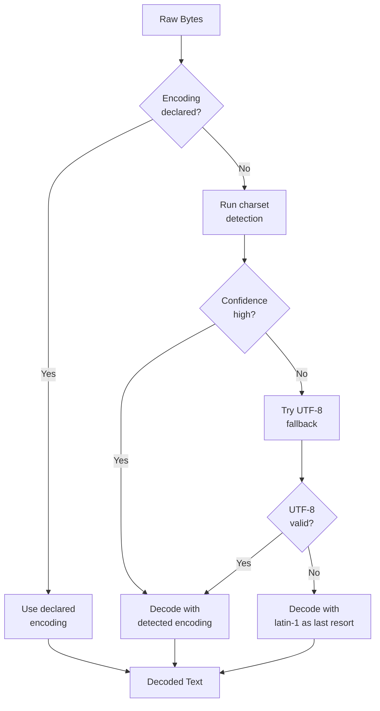
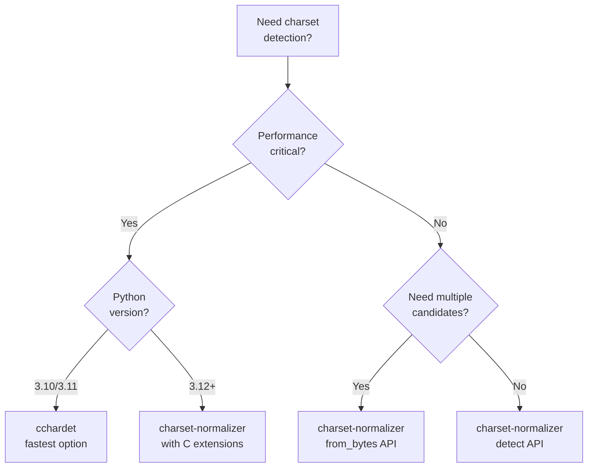

When you download a web page or read a file from disk, the bytes you receive do not always come with a label telling you what encoding they use. HTTP headers might say `charset=utf-8`, but the actual content could be Windows-1252. The `<meta>` tag might be missing entirely. Databases dump CSV exports in whatever encoding the original system used. If you guess wrong, you get garbled text, broken characters, or silent data corruption that shows up three pipeline stages later. Python has three libraries for detecting character encoding from raw bytes: `chardet`, `cchardet`, and `charset-normalizer`. Each makes different trade-offs in speed, accuracy, and maintenance status, and picking the right one matters more than most developers realize.

## Why Charset Detection Matters

[Character encoding](/posts/character-encodings-handling-text/) defines how bytes map to characters. UTF-8 uses one to four bytes per character. ISO-8859-1 uses exactly one byte per character but only covers Western European languages. Shift_JIS handles Japanese. Windows-1252 is what most legacy Windows applications produced. When you decode bytes with the wrong encoding, you do not always get an error. Sometimes you just get [wrong characters](/posts/how-to-decode-garbled-text-fixing-encoding-mismatches/).

```python
# The same bytes decoded two different ways
raw = b'\xc3\xa9'

print(raw.decode('utf-8'))      # Output: é (correct)
print(raw.decode('latin-1'))    # Output: é (mojibake)
```

In scraping and data extraction, this problem appears constantly. A site might serve content in EUC-KR for Korean pages, Big5 for Traditional Chinese, and UTF-8 for everything else. Your pipeline needs to handle all of them without manual intervention.



## chardet: The Original

`chardet` is the oldest and most widely known charset detection library in Python. It is a pure Python port of Mozilla's universal charset detector, originally written in C++ for Firefox. The library has been around since 2008 and was the default detection engine used by the `requests` library for over a decade.

```bash
pip install chardet
```

The basic API is a single function call.

```python
import chardet

# Detect encoding of raw bytes
with open('mystery_file.txt', 'rb') as f:
    raw_data = f.read()

result = chardet.detect(raw_data)
print(result)
# {'encoding': 'utf-8', 'confidence': 0.99, 'language': ''}
```

The return value is a dictionary with three keys: `encoding` is the detected charset name, `confidence` is a float between 0 and 1, and `language` is sometimes populated for encodings tied to specific languages.

For large files, `chardet` supports incremental detection through a `UniversalDetector` class. This is useful when you want to detect the encoding from the first few kilobytes without reading the entire file.

```python
from chardet.universaldetector import UniversalDetector

detector = UniversalDetector()

with open('large_file.txt', 'rb') as f:
    for line in f:
        detector.feed(line)
        if detector.done:
            break

detector.close()
print(detector.result)
# {'encoding': 'EUC-JP', 'confidence': 0.99, 'language': 'Japanese'}
```

`chardet` also ships with a command-line tool for quick detection.

```bash
chardetect mystery_file.txt
# mystery_file.txt: utf-8 with confidence 0.99
```

The main drawback of `chardet` is speed. Because it is pure Python and runs multiple statistical models over the input bytes, it can be slow on large files. Detecting encoding on a 10 MB file can take several seconds. For bulk processing or real-time scraping pipelines, this becomes a bottleneck.

```python
import chardet
import time

# Generate a large UTF-8 payload
large_data = ('This is a test sentence. ' * 50000).encode('utf-8')

start = time.perf_counter()
result = chardet.detect(large_data)
elapsed = time.perf_counter() - start

print(f"chardet: {result['encoding']} "
      f"(confidence: {result['confidence']:.2f}) "
      f"in {elapsed:.3f}s")
# chardet: utf-8 (confidence: 0.99) in 2.841s (typical for ~1.2 MB)
```

## cchardet: The C Extension

`cchardet` wraps Mozilla's `uchardet` C library, giving you the same detection algorithm as `chardet` but compiled to native code. The speed difference is dramatic: 10x to 100x faster depending on the input size.

```bash
pip install cchardet
```

The API is intentionally identical to `chardet`.

```python
import cchardet

with open('mystery_file.txt', 'rb') as f:
    raw_data = f.read()

result = cchardet.detect(raw_data)
print(result)
# {'encoding': 'UTF-8', 'confidence': 0.99}
```

The speed advantage shows up clearly on larger inputs.

```python
import cchardet
import time

large_data = ('This is a test sentence. ' * 50000).encode('utf-8')

start = time.perf_counter()
result = cchardet.detect(large_data)
elapsed = time.perf_counter() - start

print(f"cchardet: {result['encoding']} "
      f"(confidence: {result['confidence']:.2f}) "
      f"in {elapsed:.3f}s")
# cchardet: UTF-8 (confidence: 0.99) in 0.028s
```

However, `cchardet` has significant maintenance issues. The package requires compiling C extensions, which can fail on newer Python versions or certain platforms. As of early 2025, it does not officially support Python 3.12+. The GitHub repository has seen minimal activity, and several open issues report installation failures on Apple Silicon Macs and Windows with newer MSVC toolchains.

```bash
# This may fail on Python 3.12+
pip install cchardet
# ERROR: Failed building wheel for cchardet
```

If you are locked to Python 3.10 or 3.11 and need raw speed for batch encoding detection, `cchardet` still works. For new projects, the maintenance risk makes it hard to recommend.

## charset-normalizer: The Modern Replacement

`charset-normalizer` is the library that replaced `chardet` in the `requests` library starting with version 2.26.0 (released in August 2021), with `chardet` fully removed as a dependency by version 2.28.0. It was written from scratch with a different detection approach: instead of porting Mozilla's algorithm, it uses a coherence-based method that analyzes character frequency distributions and Unicode properties.

```bash
pip install charset-normalizer
```

The library provides a `chardet`-compatible `detect` function for drop-in replacement.

```python
from charset_normalizer import detect

with open('mystery_file.txt', 'rb') as f:
    raw_data = f.read()

result = detect(raw_data)
print(result)
# {'encoding': 'utf-8', 'confidence': 1.0, 'language': 'English'}
```

But the real power is in the `from_bytes` function, which returns all candidate encodings ranked by confidence. This is useful when you want to see alternatives or when the top result has low confidence.

```python
from charset_normalizer import from_bytes

with open('ambiguous_file.txt', 'rb') as f:
    raw_data = f.read()

results = from_bytes(raw_data)

print(f"Best guess: {results.best().encoding}")
print(f"Number of candidates: {len(results)}")

for match in results:
    print(f"  {match.encoding:<20} "
          f"confidence: {match.encoding_confidence:.2f}  "
          f"coherence: {match.coherence:.2f}")
```

Output might look like this for a file with ambiguous encoding:

```
Best guess: windows-1252
Number of candidates: 3
  windows-1252         confidence: 0.78  coherence: 0.85
  iso-8859-1           confidence: 0.72  coherence: 0.82
  iso-8859-15          confidence: 0.68  coherence: 0.79
```

The `from_path` function reads files directly.

```python
from charset_normalizer import from_path

results = from_path('mystery_file.txt')
best = results.best()

if best is not None:
    print(f"Encoding: {best.encoding}")
    print(f"Decoded content: {str(best)[:200]}")
```

`charset-normalizer` also ships with a CLI tool.

```bash
normalizer mystery_file.txt
# mystery_file.txt -> utf-8 (confidence: 99%)
```

The speed falls between `chardet` and `cchardet`. It is significantly faster than `chardet` (often 3-5x) while remaining pure Python with optional C extensions for acceleration.

```python
from charset_normalizer import detect
import time

large_data = ('This is a test sentence. ' * 50000).encode('utf-8')

start = time.perf_counter()
result = detect(large_data)
elapsed = time.perf_counter() - start

print(f"charset-normalizer: {result['encoding']} "
      f"(confidence: {result['confidence']:.2f}) "
      f"in {elapsed:.3f}s")
# charset-normalizer: utf-8 (confidence: 1.00) in 0.312s
```


<figure>
  
  <figcaption>Every character has a number, and getting that number wrong breaks everything. <span class="img-credit">Photo by Nataliya Vaitkevich / <a href="https://www.pexels.com" target="_blank" rel="noopener noreferrer">Pexels</a></span></figcaption>
</figure>

## Side-by-Side Comparison

Here is the same detection task run against all three libraries with different encodings.

```python
import chardet
import cchardet
from charset_normalizer import detect as cn_detect

test_cases = {
    'utf-8': 'The quick brown fox jumps over the lazy dog'.encode('utf-8'),
    'shift_jis': '日本語のテスト文字列です'.encode('shift_jis'),
    'windows-1252': 'Caf\xe9 cr\xe8me br\xfbl\xe9e'.encode('latin-1'),
    'euc-kr': '한국어 테스트 문자열입니다'.encode('euc-kr'),
    'gb2312': '中文测试字符串'.encode('gb2312'),
}

for name, data in test_cases.items():
    cd = chardet.detect(data)
    cc = cchardet.detect(data)
    cn = cn_detect(data)

    print(f"\n--- {name} ({len(data)} bytes) ---")
    print(f"  chardet:            {cd['encoding']:<18} "
          f"conf: {cd['confidence']:.2f}")
    print(f"  cchardet:           {cc['encoding']:<18} "
          f"conf: {cc['confidence']:.2f}")
    print(f"  charset-normalizer: {cn['encoding']:<18} "
          f"conf: {cn['confidence']:.2f}")
```

Typical output shows that all three handle common cases well, but they diverge on short or ambiguous inputs.

```
--- utf-8 (43 bytes) ---
  chardet:            ascii              conf: 1.00
  cchardet:           ASCII              conf: 1.00
  charset-normalizer: ascii              conf: 1.00

--- shift_jis (30 bytes) ---
  chardet:            SHIFT_JIS          conf: 0.99
  cchardet:           SHIFT_JIS          conf: 0.99
  charset-normalizer: shift_jis          conf: 0.98

--- windows-1252 (22 bytes) ---
  chardet:            ISO-8859-1         conf: 0.73
  cchardet:           WINDOWS-1252       conf: 0.50
  charset-normalizer: windows-1252       conf: 0.71

--- euc-kr (33 bytes) ---
  chardet:            EUC-KR             conf: 0.99
  cchardet:           EUC-KR             conf: 0.99
  charset-normalizer: euc-kr             conf: 0.99

--- gb2312 (14 bytes) ---
  chardet:            GB2312             conf: 0.99
  cchardet:           GB18030            conf: 0.99
  charset-normalizer: gb2312             conf: 0.99
```

Notice that `chardet` returns `ISO-8859-1` for the Windows-1252 sample. These encodings are nearly identical (they share the 0x00-0x7F and 0xA0-0xFF ranges) but differ in the 0x80-0x9F range. This kind of ambiguity is inherent to single-byte encodings and no detector handles it perfectly.

## Speed Benchmarks

Testing with increasingly large payloads shows the performance characteristics clearly.

```python
import chardet
import cchardet
from charset_normalizer import detect as cn_detect
import time

sizes = [1_000, 10_000, 100_000, 1_000_000]
base_text = 'Lorem ipsum dolor sit amet, consectetur adipiscing elit. '

for size in sizes:
    data = (base_text * (size // len(base_text) + 1))[:size].encode('utf-8')

    timings = {}
    for name, func in [('chardet', chardet.detect),
                        ('cchardet', cchardet.detect),
                        ('charset-normalizer', cn_detect)]:
        start = time.perf_counter()
        for _ in range(10):
            func(data)
        elapsed = (time.perf_counter() - start) / 10
        timings[name] = elapsed

    print(f"\n{size:>10,} bytes:")
    for name, t in timings.items():
        print(f"  {name:<22} {t*1000:8.1f} ms")
```

Representative results on a modern machine:

```
     1,000 bytes:
  chardet                  3.2 ms
  cchardet                 0.1 ms
  charset-normalizer       1.8 ms

    10,000 bytes:
  chardet                 28.4 ms
  cchardet                 0.2 ms
  charset-normalizer       5.1 ms

   100,000 bytes:
  chardet                285.0 ms
  cchardet                 0.8 ms
  charset-normalizer      18.3 ms

 1,000,000 bytes:
  chardet               2841.0 ms
  cchardet                 5.2 ms
  charset-normalizer      95.6 ms
```

`cchardet` is in a league of its own for raw speed. `charset-normalizer` is the best option among maintained libraries. `chardet` scales poorly past 100 KB.



## Integration with requests

Since `requests` 2.28.0, `charset-normalizer` is the default charset detection backend. When you access `response.apparent_encoding`, it uses `charset-normalizer` under the hood.

```python
import requests

response = requests.get('https://example.com')

# response.encoding uses the Content-Type header charset
print(f"Declared encoding: {response.encoding}")

# response.apparent_encoding runs charset-normalizer on the content
print(f"Detected encoding: {response.apparent_encoding}")

# Use detected encoding if the declared one produces garbage
if response.encoding is None or response.encoding == 'ISO-8859-1':
    response.encoding = response.apparent_encoding

text = response.text
```

The `ISO-8859-1` check matters because RFC 2616 specifies that HTTP responses with `text/*` content types default to ISO-8859-1 when no charset is declared. Many servers omit the charset, and `requests` falls back to this default even when the actual content is UTF-8.

```python
import requests

def get_with_encoding_fix(url: str) -> str:
    """Fetch a URL and fix encoding if needed."""
    response = requests.get(url)
    response.raise_for_status()

    # If no charset was declared or it was the HTTP default,
    # use detection instead
    content_type = response.headers.get('Content-Type', '')
    if 'charset=' not in content_type.lower():
        response.encoding = response.apparent_encoding

    return response.text
```

## Practical Scraping Pattern

In a real scraping pipeline, you want to detect encoding before passing content to an HTML parser. Here is a robust pattern that handles the common cases.

```python
import requests
from charset_normalizer import from_bytes
from bs4 import BeautifulSoup

def scrape_with_encoding(url: str) -> BeautifulSoup:
    """Fetch and parse a page with proper encoding detection."""
    response = requests.get(url)
    response.raise_for_status()

    raw = response.content
    encoding = None

    # Step 1: Check HTTP Content-Type header
    content_type = response.headers.get('Content-Type', '')
    if 'charset=' in content_type.lower():
        encoding = response.encoding

    # Step 2: Check HTML meta tags
    if encoding is None:
        # Quick scan of first 1024 bytes for meta charset
        head = raw[:1024]
        if b'charset=' in head.lower():
            # Let BeautifulSoup extract it
            soup_peek = BeautifulSoup(head, 'html.parser')
            meta = soup_peek.find('meta', attrs={'charset': True})
            if meta:
                encoding = meta.get('charset')
            else:
                meta = soup_peek.find(
                    'meta',
                    attrs={'http-equiv': lambda v: v and v.lower() == 'content-type'}
                )
                if meta and 'charset=' in (meta.get('content', '')).lower():
                    ct = meta['content']
                    encoding = ct.split('charset=')[-1].strip()

    # Step 3: Run charset detection
    if encoding is None:
        results = from_bytes(raw)
        best = results.best()
        if best is not None and best.encoding_confidence > 0.7:
            encoding = best.encoding
        else:
            encoding = 'utf-8'  # Fallback

    # Decode and parse
    text = raw.decode(encoding, errors='replace')
    return BeautifulSoup(text, 'html.parser')
```

This three-step approach (header, meta tag, detection) mirrors what browsers do and catches the vast majority of encoding issues. For a broader view of how this fits into an [automated detection workflow](/posts/character-encoding-detection-automated-tools-techniques/), see our end-to-end guide.

## Handling Ambiguous Results

When detection confidence is low, you need a fallback strategy. The worst thing you can do is silently decode with the wrong encoding, because the resulting text will look almost right but contain subtle errors.

```python
from charset_normalizer import from_bytes

def safe_decode(raw: bytes, min_confidence: float = 0.7) -> tuple[str, str]:
    """Decode bytes with confidence-based fallback.

    Returns (decoded_text, encoding_used).
    """
    results = from_bytes(raw)
    best = results.best()

    if best is not None and best.encoding_confidence >= min_confidence:
        return str(best), best.encoding

    # Low confidence: try UTF-8 first (most common on the modern web)
    try:
        return raw.decode('utf-8'), 'utf-8'
    except UnicodeDecodeError:
        pass

    # UTF-8 failed: try the best guess anyway
    if best is not None:
        return str(best), best.encoding

    # Last resort: latin-1 never fails (it maps every byte to a character)
    return raw.decode('latin-1'), 'latin-1'
```

For batch processing where you might encounter hundreds of files with varying encodings, logging the detection results helps you spot patterns.

```python
from charset_normalizer import from_bytes
from pathlib import Path
import csv

def batch_detect(directory: str, output_csv: str):
    """Detect encoding for all files in a directory."""
    files = list(Path(directory).rglob('*.txt'))

    with open(output_csv, 'w', newline='') as f:
        writer = csv.writer(f)
        writer.writerow(['file', 'encoding', 'confidence',
                         'coherence', 'alternatives'])

        for filepath in files:
            raw = filepath.read_bytes()
            results = from_bytes(raw)
            best = results.best()

            if best is None:
                writer.writerow([str(filepath), 'unknown', 0, 0, ''])
                continue

            alternatives = [m.encoding for m in results
                            if m.encoding != best.encoding]

            writer.writerow([
                str(filepath),
                best.encoding,
                f"{best.encoding_confidence:.2f}",
                f"{best.coherence:.2f}",
                '; '.join(alternatives[:3])
            ])
```

## When Detection Gets It Wrong

All three libraries can produce incorrect results, especially with short inputs or single-byte encodings that share large portions of their character maps. Here are the most common failure modes.

**Short text (under 100 bytes):** Statistical models need enough data to distinguish encodings. With very short inputs, you may end up with [replacement character errors](/posts/2026-02-06-some-characters-could-not-be-decoded-fixing-replacement-character-errors/) if the wrong encoding is chosen. A five-word sentence in French could be valid UTF-8, ISO-8859-1, Windows-1252, or ISO-8859-15.

```python
from charset_normalizer import detect

short = 'Caf\u00e9'.encode('utf-8')  # 5 bytes
print(detect(short))
# Works fine: {'encoding': 'utf-8', 'confidence': 1.0, ...}

# But latin-1 encoded short text is ambiguous
short_latin = b'Caf\xe9'  # 4 bytes
print(detect(short_latin))
# May return iso-8859-1, windows-1252, or iso-8859-15
```

**Mixed encodings:** Files that contain text in multiple encodings (common with concatenated log files or poorly migrated databases) will confuse every detector.

**ASCII-compatible encodings:** If the content is pure ASCII (bytes 0x00-0x7F), all three libraries correctly report ASCII, but this tells you nothing about what the intended encoding was.

## Recommendation

For new projects in 2026, use `charset-normalizer`. It is actively maintained, works on all current Python versions, provides the richest API with multiple candidate results, and serves as the default backend for `requests`. The `from_bytes` API with its ranked candidates gives you more control than a single best-guess result.

```python
# The recommended approach for new projects
from charset_normalizer import from_bytes, detect

# Quick detection (chardet-compatible)
result = detect(raw_data)

# Detailed detection with alternatives
results = from_bytes(raw_data)
for match in results:
    print(f"{match.encoding}: {match.encoding_confidence:.2f}")
```

If you are maintaining an older codebase that uses `chardet`, switching to `charset-normalizer` is straightforward because the `detect()` function returns the same dictionary format. Change the import and you are done.

```python
# Before
import chardet
result = chardet.detect(data)

# After (drop-in replacement)
from charset_normalizer import detect
result = detect(data)
```

If you are on Python 3.10 or 3.11 and processing millions of files where every millisecond counts, `cchardet` is still the fastest option. But plan your migration path, because it will not support newer Python versions indefinitely.

| Feature | chardet | cchardet | charset-normalizer |
|---|---|---|---|
| Implementation | Pure Python | C extension | Pure Python + optional C |
| Speed | Slow | Very fast | Medium |
| Python 3.12+ | Yes | No | Yes |
| Maintained | Yes (slow) | Minimal | Active |
| Multiple candidates | No | No | Yes |
| Used by requests | Pre-2.28 | No | 2.28+ |
| CLI tool | chardetect | cchardetect | normalizer |
| Install issues | None | Common | None |

The encoding problem is not going away. Even as UTF-8 dominates the modern web (over 98% of websites as of 2026), legacy data, email attachments, government datasets, and files from older systems will continue to arrive in every encoding imaginable. Having a reliable detection library in your toolkit saves you from the kind of subtle data corruption that only shows up after it has already contaminated your downstream analysis.
